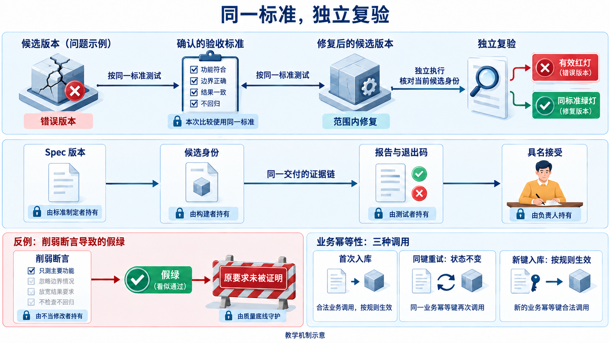

# L05｜先设计失败，再编写 Eval

阅读下面的案例与检查示范前，先按[手册开头](实践操作手册.md#开始前先留下自己的判断)保留自己的判断；本资料中的解释用于之后的对照和修订。

L04 交给本讲的是已接受的工作台 V0，以及通过它完成的库存导出。现在继续开发 FlowERP 收货：只到了一批货，操作员因页面没有响应又点了一次，账应怎样变化？先设计能识别重复入账的检查，再让工作台组织 Codex 修复，最后用原检查复验。

L01 已学过按同一标准比较红绿结果，L04 已接通最小检查。本讲进一步问：**这条检查见到已知错误，会不会仍给绿灯？**工作台新增业务结果和工程约束两份 Eval；统一执行与分级交给 L06。

仓库人员与开发者确认收货身份；你决定观察什么、允许改什么；Codex 协助实现，工作台组织调用并保存候选与证据，实际复验者据此交回判断。

## 1｜先把“同一笔收货”说清楚

仓库期初有 20 件，今天到货 8 件。第一次请求已经在服务器记账，响应却没有到达页面，操作员只能重试。此时客户端不知道第一次是否成功，这种不确定性正是重复入账容易发生的地方。简单地规定“报错后再加一次”不可靠，因为没有收到响应与没有完成记账并不是一回事。

给这笔收货一个稳定编号 A：首次用 A，重试仍用 A。后来真正又到了一批 8 件，才用新编号 B。这个用于识别业务请求的编号叫**幂等键**；同一请求重复执行只产生一次业务效果，叫**幂等**。编号不能在每次点击时重新生成，否则服务器看见的都是新业务；也不能只由商品和数量决定，否则两批数量相同的真实收货会被误认为重复。


**图 5-1　同一笔收货重试与另一笔新收货**

沿图推演一次完整输入：建立期初 20 → A 入库 8 → A 重试 → B 入库 8。库存应为 20 → 28 → 28 → 36。**流水**是每次入账留下的业务记录；期初也用一次入库建立，所以流水数应为 1 → 2 → 2 → 3。A 重试时，不仅库存不能增加，原流水的内容也不能改变。

这个推演同时给出两个相反要求：重复请求要被识别，新请求要继续生效。因此，“发现商品已经收过货就忽略以后所有请求”不是修复；它虽然挡住重复，却吞掉了 B。设计检查时必须把首次、重试和独立新业务放在一起，才能排除这种看似安全的错误实现。

本讲选择顺序调用、正整数数量和明确的业务编号，目的是先把判断依据建立起来。并发重试、进程崩溃、同一编号携带不同数量，需要进一步确认规则和故障条件；这一次顺序实验不能替它们作证。

## 2｜把要求写成一项能重复运行的检查

**Eval** 在本课程中指依据确认的要求评价交付结果的可执行检查。它可以用普通测试函数实现，并不需要另外一套神秘工具。示例测试通常演示“调用函数后得到了某个返回值”；用于交付的 Eval 还要回答：如果程序违反要求，我选择的输入和观察能否把它辨认出来？区别在于检查目的和辨识力，而不是文件叫 test 还是 eval。

先独立算预期，再调用被检查的程序。20＋8＝28 来自业务输入，不能先读服务返回的数字，再把那个数字当成正确答案。接着从临时数据库读取库存与流水，因为返回值只是程序对结果的陈述。假如服务返回 28，库存也为 28，却多写了一条 A 的流水，只看数字的示例就会漏过错误，后续对账却会重复计算这笔收货。


**图 5-2　返回值与实际流水不一致**

图中两条 A 都记录 8 件。沿用 [L01 的持久化概念](../L01/辅导资料.md#v01-design)：本次要查保存下来的业务账，不能停在服务返回的数字。

可以将检查写成下面的思路。它是教学推演，不是学生执行记录；具体实现见实践手册使用的 `tests/test_l05_receiving.py`。

```text
建立干净数据库，商品期初为 20
执行 A 收货 8：库存应为 28，流水应准确包含期初与 A
保存这时的完整库存与流水
重试 A：重新读库，必须与保存的状态完全相同
执行 B 收货 8：库存应为 36，流水应增加且只增加 B
分别提交数量 0、-1：应拒绝，操作前后状态必须相同
```

首次和 B 的流水要核对业务编号、商品、数量、类型及引用，不只数行数。删掉一条旧流水再写一条错误流水，也能保持“共两条”，但不符合账的含义。生成时间无法事先预测时，首次检查比较业务字段；重试时则比较前后完整行，确认旧记录连时间也没有被重写。这解释了为什么不同步骤可以采用不同的观察范围。

数量 0 或负数的检查也有两部分：调用应明确拒绝，拒绝后数据库应保持原样。仅看到异常还不够，因为程序可能先写了一半再报错。正确拒绝是业务请求没有完成，但它恰好使这条 Eval 通过；不要把“请求被拒绝”和“检查失败”混为一谈。

还要追问：为什么要先检查首次收货，再保存状态比较重试？假设一个错误实现忽略所有请求，A 首次和 A 重试前后都会是库存 20、只有期初流水。若断言只有“重试前后相同”，它也能通过。**状态不变只证明没有新增变化，不能证明原状态正确。**所以先用独立预期确认首次已形成库存 28、期初与 A 两条正确流水，再把这个已经验证的状态作为重试的比较对象。

下面用同一组输入推演几种可能的错误实现。它们是辨识力分析，不是本讲参考源码的运行结果；每一行都在回答“少了哪项观察，哪种错误就可能混过去”。

| 假设实现怎样处理 | 只看较少信息为何可能通过 | 原检查中辨认它的条件 |
|---|---|---|
| 所有收货都忽略 | A 重试前后确实一样 | 首次 A 后必须是库存 28，并有正确的 A 流水 |
| 库存只加一次，A 重试仍多记流水 | 返回值与库存都为 28 | A 重试后的完整流水必须与重试前相同 |
| A 重试改写旧流水，仍保留两条 | 库存与流水条数都不变 | 比较完整旧行，发现业务内容或时间被改写 |
| 按商品挡住所有后续收货 | A 重试确实没有变化 | 独立 B 后必须是库存 36，且只新增 B 流水 |


**图 5-2a　先验证首次状态，再判断重试与新业务（教学机制示意）**

[可编辑源图](assets/reading-depth-20261003/mechanism.drawio)。

从左到右读图：先由 20＋8 算出首次预期，核对数据库，保存这个正确状态，再分别挑战“同一身份不再生效”和“新身份仍应生效”。图下的反例说明，跳过首次正确性就无法排除“全部忽略”；最后的判断要求三个条件同时成立。数量 0、-1 的拒绝后不变检查仍保留，它们观察的是另一条失败路径。

这组检查的深度来自相互补足：首次检查防止根本不工作，重试检查防止重复生效，新请求检查防止保护过头。课堂连续两次红灯能证明它稳定识别指定缺陷，却不能证明它能识别所有未来错误。换成期初 11、收货 3 时，仍先验证 14，再比较 A 重试，最后验证 B 后 17；迁移的是这条判断链，而不是把“前后相等”孤立复制到另一项业务。

## 3｜故意让检查遇到一次它必须抓住的错误

在正确程序上运行得到绿色，说明这次没有发现问题，却不能说明检查能够识别已知错误。我们因此准备一个可重复运行的**缺陷基线**：它故意保留“重试多写流水，仍返回正确库存”的实现，用来检验裁判本身。

旧检查只看返回值，可能通过；新检查读取流水，应定位到 `AC-REPLAY`，指出重试前后哪条记录发生变化。例如教学预期是“重试前两条流水，重试后三条”，而不只是笼统的“测试失败”。`AC` 是验收条件的标识，用它把失败回指到具体要求，之后 Codex 和复验者才能沿同一依据调查。

保持缺陷版本、检查版本、输入和命令一致，每次从新建的干净数据库开始，连续运行两次。两次均因重复入账失败，才支持“这条检查能稳定识别此缺陷”。若复用上一轮被污染的数据库，第二次失败可能来自残留数据；若报模块不存在，业务操作根本没有执行。这些结果应保留，但不能冒充目标缺陷的两次红灯。

本案例可以展开大纲要求的四类失败。**逻辑错误**是计算或处理关系本身错了，如重试再次增加库存或流水；要用 A 与 B 的对照定位。**边界缺失**是正常值可用，0 或负数却未经检查就写入；要观察拒绝及拒绝后的状态。**规范违规**是没有遵守已经确认的约定，如把重试改用新编号、流水写错业务类型；单个库存数字仍可能正确，所以检查必须覆盖身份和记录字段。**危险修改**是修复过程越过授权或破坏质量标准，如改无关页面、删除失败断言；它要求另一类工程检查。

这四类是寻找反例的方向，不必为了凑四条故障而破坏已正确的主仓库。实践手册区分教学缺陷副本、独立范围练习仓库和正式课程候选；某个目录的红灯只能说明那个目录的状态。个人候选若已能识别缺陷，就如实记录，不删弱检查来制造“旧绿、新红”。

### 从一个反例，走到可以迁移的性质

前面的四个错误实现都可以挑战检查：它们分别会被哪条断言抓住？在隔离副本故意改错实现，用原检查挑战它，是**变异测试**的一种思路。课堂先使用有来源的人工缺陷，两次红灯只说明识别了该缺陷。

再换一组输入，检验能否迁移。**性质**是对一类输入都应成立的关系，例如“正确首次入账后，同一身份重试保持原账”。独立计算的首次数量、重试不变、新请求生效要一起保留，才能排除忽略所有收货的实现。



**图 5-3　用错误版本挑战检查，再用固定检查判断修复（教学示意）**

沿图先确认坏版本因业务要求失败，再沿固定检查走向修复与独立复验。报告与候选的对应沿用 L04；今天重点审查断言的辨识力：删掉 `AC-NEW` 可能漏过吞掉 B 的实现，删掉完整流水比较可能漏过重写旧记录。只分析这些反例，不删正式断言。检查确有缺口时说明修订理由，保留旧版，用新版重新建立红灯。

[完整收货检查](examples/receiving_contract_eval.py) 的 `expected_business` 从输入独立算预期，`AC-FIRST`、`AC-REPLAY`、`AC-NEW` 再读数据库比较。它支持顺序请求；并发、同键不同内容与崩溃恢复需要另定规则和证据。

## 4｜再加一项检查，防止“为了通过而改标准”

测试中要求条件成立的判断叫**断言**。L01 已说明删断言会改变绿灯含义；本讲把“不得改裁判、不得越出允许文件”的约定也写成可运行检查。

**工程约束 Eval** 检查修改过程是否符合约定。先记录基线版本与允许修改的文件，修复后获取真实差异，检查新增、修改、删除和重命名。业务 Eval 回答账是否正确，工程 Eval 回答是否按约定完成修复。一次修复两者都需要，但它们观察的对象不同。

设授权只允许收货实现变化，实际差异却含 `web/styles.css`，范围检查应报告 `ENG-SCOPE` 和这个路径，即使收货检查已通过。新文件和重命名尤其容易被漏查：只查看已跟踪文件的修改，会漏掉尚未加入 Git 的文件；将旧路径删除再新增一个新路径，也应分别核对。本讲参考范围脚本使用相对基线的 Git 差异和未忽略的新文件，作用是检查最终差异；它不覆盖已经撤销的历史写入、仓库外写入或所有忽略文件，不能据此宣称完整安全隔离。


**图 5-4　固定检查后修复产品并复验**

按图先建设并运行检查，再保存它的版本或文件指纹，最后修产品。文件指纹是依据内容计算的标识，可以发现检查是否变化，却不能证明检查设计正确。检查本身确实有错时，应保留原报告，说明更正理由，再用新版本重新建立红绿对照；不能悄悄改预期后把结论归因于产品修复。

## 5｜现在修复，并证明没有只记住课堂答案

有了具体失败后，委托才变得可执行：把实际候选路径、`AC-REPLAY` 的前后状态、允许文件和复验命令交给 Codex，只修收货实现。工作台保存此次执行与差异，原检查保持不变，再由同一入口检查首次 A、重试 A、独立 B 与非法数量。

若修复后仍红，先看失败对象。库存重复变化，查幂等判断与写入顺序；库存正确但流水变了，查是否在重试分支仍追加记录；B 被忽略，查是否错误地用商品代替业务编号；范围红而业务绿，先撤回或说明未经授权的变化。这个顺序让返工针对原因，避免把每一种失败都交给 Codex“继续修到绿”。

再换一组独立输入：期初 11、A 收货 3、重试 A、B 再收货 3，库存应为 11 → 14 → 14 → 17。这排除写死 28 或忽略所有后续收货的实现。迁移到支付回调时还要重新确认身份：支付平台的交易编号、金额与资金流水才是新场景的判断对象，库存常量不能照搬。

按[实践操作手册](实践操作手册.md)执行时，两次缺陷红报告用于说明检查辨识力，正式候选的差异与原标准绿报告用于说明产品修复，实际复验意见用于支持验收。三者连起来，才能解释“现场风险怎样促成工作台能力，工作台又怎样帮助交付 FlowERP”。没有实际复验者就保留待复验，参考运行不能填成学生已经完成。

## 本讲留下什么，下一讲怎样接着用

本讲形成幂等入库的候选修复，以及固定的业务结果与工程约束检查。L06 把这些原检查带入库存口径维护，继续运行并统一分级、汇总，不另写一份更宽松的版本。更多源码和边界可查[参考说明](reference/参考说明.md)。

[课程学习路线](../../README.md#16-讲学习路线) · [实践操作手册](实践操作手册.md) · [上一讲](../L04/辅导资料.md) · [下一讲](../L06/辅导资料.md)

## 课程大纲中的本讲要求

- **核心内容**：示例测试与 Eval 的区别；逻辑错误、边界缺失、规范违规和危险修改四类失败模式。
- **演示结果**：一个故意带缺陷的基线稳定触发失败。
- **课内增量**：编写一个业务结果 Eval 和一个工程约束 Eval。
- **通过标准**：缺陷基线连续运行两次均失败；失败信息能够定位到具体要求。

配图为教学示意；来源与提示词：[查看原配图设计与提示词](assets/reading-figures-v2/设计与提示词.md)、[查看新增配图与完整生成提示词](assets/reading-story-20260926/生成说明.md)。
