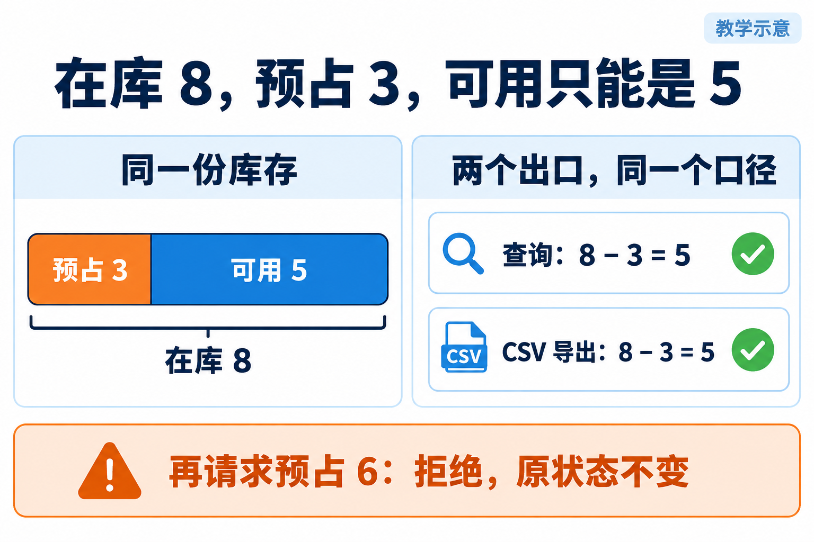
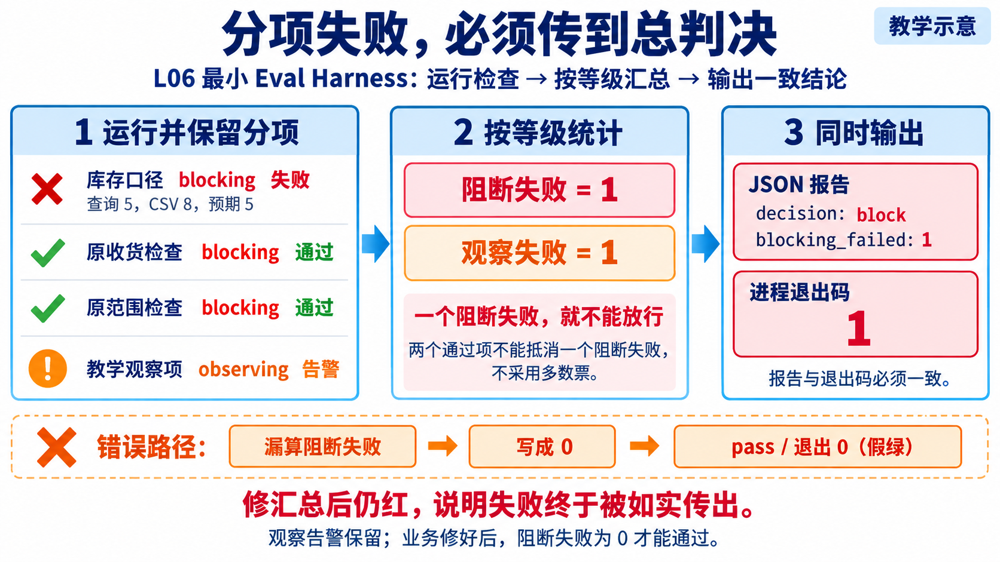

# 库存主线配图

2026-09-26，内置 ImageGen。教学示意，已目视核对文字和数字，不是个人验收证据。

## 01-stock-oracle.png



```text
生成横版3:2中文课程教学插图，白底深蓝标题蓝青橙配色，大字清晰，少文字，右上“教学示意”。标题“在库 8，预占 3，可用只能是 5”。左右两个等宽面板：左标题“同一份库存”，横向完整条分成3/8橙色标“预占 3”和5/8蓝色标“可用 5”，全条下方“在库 8”；右标题“两个出口，同一个口径”，上卡“查询：8 − 3 = 5”，下卡“CSV 导出：8 − 3 = 5”，两卡绿色勾。底部独立橙色框“再请求预占 6：拒绝，原状态不变”。不能画出库、不能把预占当作货物离库，不加多余数字。
```

## 02-two-repairs.png


```text
生成横版3:2中文课程教学插图，白底深蓝标题蓝青橙配色，大字清晰，右上“教学示意”。标题“先修汇总，再修库存导出”。三列从左至右：第一列“假绿”，卡片“查询 5，导出 8”橙色叉，卡片“分项失败，总判决却通过”橙色警示；第二列“可信红”，卡片“查询 5，导出仍是 8”橙色叉，卡片“block · 退出 1”红色；第三列“可信绿”，卡片“查询 5，导出 5”绿色勾，卡片“pass · 退出 0”绿色。两条箭头依次标“只修汇总器”“再修导出字段”。底部“原检查不变，结论变化才有依据”。不要添加导入商品案例。
```


## 03-eval-harness-results.png

2026-10-05，内置 ImageGen 新生成。用于替换 L06 与 L04 共用的完整 Harness 总览图，专门说明 L06 的分项执行、等级汇总、JSON 与退出码一致性；L04 继续保留完整交付总览。已目视核对四项结果、两个失败计数和判决，均为教学示意，不是运行截图或学生验收证据。



- 原始输出：`C:\Users\Administrator\.codex\generated_images\01a10c4a-a949-7e42-bdd2-f97a192e8c7a\exec-48527968-db87-4e33-ae80-bf927800579c.png`
- 仓库副本：`03-eval-harness-results.png`，保留原始输出。

实际生成提示词：

```text
生成一张横版 16:9、高清中文课程教学机制图，用于 CodexFDE L06 辅导资料。白底、深蓝文字、青蓝箭头、红色表示阻断、橙色表示观察告警，清晰大字，整齐留白，专业教学排版。右上角标“教学示意”，不要画完整 Agent 循环，不要画人物或工作台界面，也不要用三列“假绿/可信红/可信绿”修复顺序图。

主标题：“分项失败，必须传到总判决”
副标题：“L06 最小 Eval Harness：运行检查 → 按等级汇总 → 输出一致结论”

主体是由左到右的三个区域，箭头连接：
左区标题“1 运行并保留分项”，四行简洁检查结果：
“库存口径  blocking  失败” —— 红色叉，下方小字“查询 5，CSV 8，预期 5”
“原收货检查  blocking  通过” —— 绿色勾
“原范围检查  blocking  通过” —— 绿色勾
“教学观察项  observing  告警” —— 橙色感叹号
这四行要明确前三项是 blocking，最后一项是 observing。

中区标题“2 按等级统计”，卡片内：
“阻断失败 = 1” 红色
“观察失败 = 1” 橙色
下方简明说明：“一个阻断失败，就不能放行”
特别表现两个通过项不能抵消一个阻断失败，不采用多数票。

右区标题“3 同时输出”，上下两个同等级输出卡：
“JSON 报告” 下方“decision: block”和“blocking_failed: 1”
“进程退出码” 下方大字“1”
两张卡用一致的红色边框，区内小字“报告与退出码必须一致”。

图的底部放一条与主体明确分开的橙色错误路径：
“漏算阻断失败 → 写成 0 → pass / 退出 0（假绿）”
用一个明显的叉或断裂标记表达这是错误，不要把它画成正确流程的一部分。
最下方一句结论：
“修汇总后仍红，说明失败终于被如实传出。”
最下方较小但清晰注释：
“观察告警保留；业务修好后，阻断失败为 0 才能通过。”

图中四项结果、统计 1 和 1、block 和退出码 1 必须一致。不要编造执行截图、时间戳、验收人或已完成证据。
```
