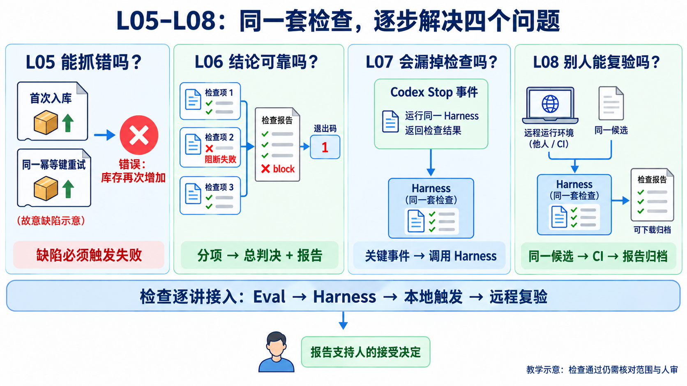
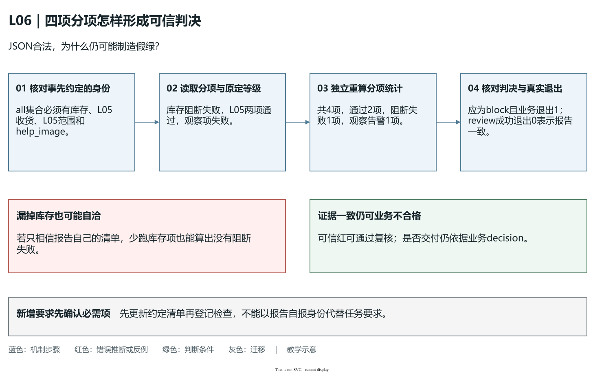

# L06｜用 Harness 汇总证据和等级

L05 解决“检查能不能抓错”；L06 解决“几项检查怎样组成一个可信结论”。沿用收货和修改范围检查，再加入库存口径：在库 8、预占 3，查询与 CSV 都应显示可用 5。现在一项失败、两项通过、另有一项告警，工作台究竟该放行还是返工？

本讲候选故意保留两个缺陷：CSV 把可用量写成在库数 8，运行器又把阻断失败算成 0。我们沿一条线查到底：独立算出 5 → 检查发现 8 → 汇总器应报红 → 只修汇总 → 再修导出。L04 已接受的版本不用改坏，实验在另建的副本进行。你决定口径和等级，Codex 分两次做限定修改，工作台保存两次复验的差异。



**先认清这四讲的分工。** L05 证明检查能抓错，L06 将检查登记、执行并可信汇总；L07 解决本地何时调用，L08 解决远程怎样复验，后两讲沿用已经确认的检查。

## 1｜先确定哪个数字才对

**在库**是实际存放的数量，**预占**是留给订单、尚未出库的数量，**可用**是还能供其他订单使用的数量。本例不引入其他冻结或分仓因素，规则是可用＝在库－预占，因此 8−3＝5。预占改变分配，不表示仓库已经少了三件实物。


**图 6-1　同一份库存的查询与导出口径**

图中查询与导出都是同一状态的出口，正确结果均为 `[在库8，预占3，可用5]`。隔离副本的查询给出 5，CSV 却写 8。销售人员若按导出表承诺六件，就会把已经留给另一订单的货再卖一次。所以本次修复有明确的业务后果，不能只把一个字段“改到测试喜欢的数字”。

检查的正确答案要由输入和业务规则独立计算。仅比较“查询等于 CSV”不足以验收：两处一起写成 8，也能相等；直接用查询返回值当导出的答案，同样可能共享错误。应分别让两个出口与 8、3、5 对照。

实践用预置服务建立“已经预占三件”的测试条件。这个条件是本讲支架，不表示学生已交付 L07 的订单草稿或 L08 的整单预占。本讲只新增库存口径的一项检查，L04 的多仓明细、CSV 特殊字符与文件保护仍须保留原检查。

## 2｜一项检查要观察什么

库存检查首先在临时数据库中建立商品、入库 8 件，再为已有订单预占 3 件。它读取查询字段，解析 CSV 对应商品的一行，将两组观察分别与独立预期 `[8,3,5]` 比较。CSV 行数也要检查，避免“第一行正确，另有重复行”被忽略。

然后创建一个请求六件的新订单，在调用预占前保存库存、流水、订单头和明细。因为可用量只有五件，预占应被拒绝，并且这四类状态保持不变。这样正常路径验证出口口径，失败路径验证超额请求不会污染数据。正确拒绝会让 Eval 通过；接受超额请求或拒绝后仍有写入才是检查失败。

要汇总这些结果，先让运行器知道要运行什么。这一步叫**用例发现**。本讲用一张显式登记清单，每项只有三个入口信息：唯一名称、等级、执行函数。命令用名称选择检查，报告用名称回指要求，函数负责实际操作与断言。检查文件放在目录里，并不表示已经登记或运行。

候选登记四项：`l06_stock_consistency`、原 L05 收货、原 L05 范围，以及 `help_image` 教学观察项。前三项必须通过，标为 blocking；最后一项只保留提醒，标为 observing。这是用于辨别等级的教学告警，不表示本讲真的缺图。登记后核对本次选中了哪几项；名称写错、清单为空、名称重复或等级不匹配，都应报配置错误。“没有运行任何项”没有依据报告通过。

显式登记需要在新增检查时补一行，换来的是容易核对：本次要求四项，实际也运行四项。按文件名自动发现是另一种实现，但同样要核对数量、身份和选择规则。

## 3｜检查已经失败，总结果为什么仍然通过

**Eval Harness** 就是统一运行清单、保存每项结果、计算总判决的程序。本讲只建设其中的质量汇总部分；执行与接受流程沿用 [L04 的交付总览](../L04/辅导资料.md)。

### 把分项结果变成可信的质量结论

先观察左侧每项结果，再沿箭头检查它怎样进入右侧总判决。库存错误不需要多数表决；它只要是事先约定的必需项，失败就必须传给报告和调用者。


**图 6-2　分项失败怎样传到总判决（教学机制示意）**

从左到右读图：库存项发现“查询 5、CSV 8”，原收货与范围两项通过，教学观察项告警；运行器按等级统计出一个阻断失败和一个观察失败，再同时输出 `decision=block` 的 JSON 与退出码 1。两项通过不能抵消一项阻断失败。图下方的错误路径说明假绿的来源：分项没有变好，只是阻断失败被漏算成了 0。

这张图回答运行器怎样产生结论，第 4 节再说明读报告的人怎样复核。两次修复的预期不同：只修汇总后库存仍红；修导出后必需项才绿，观察告警仍保留。有范围的自动返工任务和多轮控制分别留到 L09、L10。

源码按这个顺序执行：验证清单与选择 → 调用检查函数 → 记录成功或异常 → 保存名称、等级、原因和耗时 → 汇总 → 写报告 → 返回退出码。捕获异常后继续收集其他分项，是为了把问题留全。断言失败说明结果违反要求，依赖不可用说明结果还没查明；报告分别保留原因，二者都不能计为通过。

等级表达失败对交付的影响，`passed` 表达这次实际结果。**阻断级**用于事先约定必须满足的要求，如可用量正确、既有收货不回退、修改不越界；任一失败就不能放行。**观察级**用于保存暂不作为放行条件的信息；它可以失败，但必须留下告警。不能因为阻断项暂时修不好，就把它临时降级。

坏运行器的具体错误就在 `blocking_failed = 0`。分项发现“查询5、CSV8”，它却据这个固定的 0 输出 pass 和退出 0。把固定值改成下面的分项计算规则，才能让库存错误显露出来：

```text
阻断失败数＝所有 level 为 blocking 且 passed 为 false 的项数
观察失败数＝所有 level 为 observing 且 passed 为 false 的项数
阻断失败数大于 0：decision 为 block，业务运行器退出非零
阻断失败数为 0：decision 为 pass，业务运行器退出 0，保留观察告警
```

**退出码**是命令结束交给调用者的状态数字，后续 Hook 与 CI 根据它处理成功或失败。屏幕打印“BLOCK”而返回 0，或报告写 pass 而返回非零，都会使上层误判。统一的是同一业务运行器的约定，并非强迫所有工具拥有同一种退出含义；报告复核工具成功确认一份红报告是真实的，完全可以退出 0。

## 4｜第一次只修汇总，保留业务红灯

先按[实践操作手册](实践操作手册.md)观察 `02-false-green.json`：四项是否齐全，库存项是否确实失败，摘要与进程退出是否一致。再让 Codex 只修候选的 `eval/l06_runner.py`。产品、检查函数及等级保持不变，这次期望得到可信的红色业务结论。


**图 6-3　先修汇总，再修库存导出**

中间阶段仍是查询 5、CSV 8。区别是运行器现在统计出一个阻断失败、一个观察告警，decision 为 block，业务退出 1。这恰好证明第一次修复奏效。九项运行器合同测试通过与业务仍红并不矛盾：前者检查裁判是否如实工作，后者检查产品是否符合库存规则。

报告采用 **JSON**，即用固定字段表达对象、列表、数字与布尔值的数据格式，供程序读取，而非让下游猜一句中文的含义。下面是教学失败项的结构示例，耗时为示意值，不是执行记录，也不是可提交的完整报告：

```json
{
  "name": "l06_stock_consistency",
  "level": "blocking",
  "passed": false,
  "duration_ms": 12,
  "evidence": "AC-AVAILABLE: expected=[8,3,5], query=[8,3,5], csv=[8,3,8]",
  "error": {"type": "AssertionError", "message": "AC-AVAILABLE: CSV 可用量不符合独立预期"}
}
```

程序可以依据 `name` 关联要求，依据 `level` 和 `passed` 统计阻断失败，再将 `error` 交给修复调查；不必猜测“似乎有一点问题”意味着什么。整份报告还保留生成时间、所选套件、请求的检查及摘要。耗时帮助发现某项异常变慢，时间帮助区分运行，二者都不能单独证明报告属于当前源码。

读取机器报告也要进行检查。消费者应重算分项统计，核对必需项是否齐全，再比较摘要与真实退出码。否则一份格式合法、内容矛盾的 JSON 仍可能制造假绿。本讲的 `review` 还核对候选来源和指纹；它接受可信红报告，表示证据一致，业务是否返工仍看 decision。

审核时使用事先确认的四项清单，而不是只读报告摘要。以下是汇总修好、业务尚未修时应有的分项；数值属于教学推演：

| 分项身份 | 事先确认的等级 | 本次应有的 `passed` | 对总判决的影响 |
|---|---|---|---|
| `l06_stock_consistency` | blocking | false | 增加一个阻断失败 |
| `l05_personal_receiving` | blocking | true | 保留原收货回归通过 |
| `l05_personal_scope` | blocking | true | 保留原工程范围通过 |
| `help_image` | observing | false | 增加一个观察告警 |

从四行重算：`total=4`、`passed=2`、`blocking_failed=1`、`observing_failed=1`，所以 `decision=block`，业务进程退出 1。再与 summary 和真实退出码对照；若 summary 写阻断失败 0，就拒绝这份矛盾报告。这个复核不依赖运行器声称自己正确。



**图 6-4　先核对必需项，再重算判决与退出码（教学机制示意）**

[可编辑源图](assets/reading-depth-20261003/mechanism.drawio)。

沿图依次检查身份、分项、汇总和进程，不能只从第三步开始。身份检查的依据来自这次任务事先约定的清单。如果库存项根本没有运行，余下两项通过、一个观察告警，分项统计可以完全自洽，甚至没有阻断失败；但它只能证明那三项，不能证明库存口径。本讲 `eval/report_contract.py` 因而将调用者要求的身份与报告对照，个人 `review` 还核对等级没有被改动。

`review` 检查的是报告是否自洽，因此可信红也能让它退出 0。此时业务运行器仍退出 1。修导出后，三个阻断项通过、观察项仍告警，`passed=3`，业务才退出 0。这两个工具分别回答“证据可信么”和“产品通过么”。

迁移到新增库存要求时，先更新经确认的必需项清单，再增加对应检查。直接沿用“报告自己列出的全部项”作审核依据，会让漏注册的新要求永远无法被发现。这正是质量入口需要明确登记与独立复核的原因。

若出现依赖异常，先修环境，不能改库存公式消除环境红灯。若报告写入失败，本次证据没有完整生成，应保留命令错误，换新输出位置后重跑；目录里上一轮的文件不能代替本次报告。手册使用新文件名并拒绝覆盖，目的是让每次运行和失败都可追查。

## 5｜第二次修导出，再换一组库存数据

确认可信红以后，只让 Codex 修同一候选的 `flowerp/service.py` 导出字段。正确查询、超额预占保护、原检查和已修运行器保持不变。再运行应得到三个阻断项通过、一个观察告警、decision 为 pass、业务退出 0。这样的绿色可以解释为“产品在原标准下修好”，而不是改松了裁判。

再换输入为在库 13、预占 4，两个出口都应给出可用 9，请求 10 应被拒绝且状态不变。这排除把 available 写死为 5 的实现。它也说明迁移不是换一个数字就结束：新增冻结、分仓或可用量算法时，要重新确认哪些库存算可售，再建立独立预期。

旧红报告应保留为历史，但源码已改变后，它不能证明当前候选。手册此时让 review 拒绝旧来源，是正常的证据边界；不要删除旧失败来让目录看起来全绿。复验者用新文件名独立运行 run、review 和合同测试，再依据真实材料给出验收意见。

## 6｜怎样把这些检查带到 L07

L06 的小运行器是 `eval/l06_runner.py`，L07 的统一命令入口是 `eval.harness`。复用不是把文件改名，也不是复制绿色报告；应把个人 L05、L06 检查函数与运行器合同登记到下一讲的入口，再确认它们实际执行。

[检查接入手册](../L07/实践操作手册.md#l07-connect)先核对 L06 当前绿报告、来源与修改范围，再把检查复制到独立 L07 候选并注册。它不替学生复制并验收 FlowERP 产品修复。当前控制仓库的 `eval.harness` 默认检查工作台，业务用例需按候选登记或显式选择，不能用控制仓库默认绿灯推断客户产品通过。

当学生确认库存口径与等级，Codex 完成两个限定文件的修复，工作台关联候选和报告，复验者核查原标准与真实状态，本讲才形成“业务需求促成可信汇总，可信汇总支持产品交付”的因果链。商品整批导入留作[选读案例](reference/商品导入选读.md)，不并入本讲主线。

## 本讲留下什么，下一讲怎样接着用

本讲留下统一库存口径的候选，以及能如实发现、分级、记录、传播失败的最小 Harness。L07 接着解决什么时候自动调用这个入口；先接入原检查，再选择触发事件。源码细节可按需查[参考说明](reference/参考说明.md)。本地实验和参考检查通过不自动产生工作台人审记录。

[课程学习路线](../../README.md#16-讲学习路线) · [实践操作手册](实践操作手册.md) · [上一讲](../L05/辅导资料.md) · [下一讲](../L07/辅导资料.md)

## 课程大纲中的本讲要求

- **核心内容**：用例发现、统一退出码、阻断级与观察级指标、机器可读报告。
- **演示结果**：Harness 输出分项结果、阻断结论和 JSON 报告。
- **课内增量**：实现最小 Harness，将第 5 讲用例纳入统一执行。
- **通过标准**：阻断用例失败时返回非零退出码；观察项失败只记录告警；报告保留运行时间和失败原因。

配图为教学示意；来源与提示词：[查看生成提示词](assets/stock-mainline-20260926/生成说明.md)。
