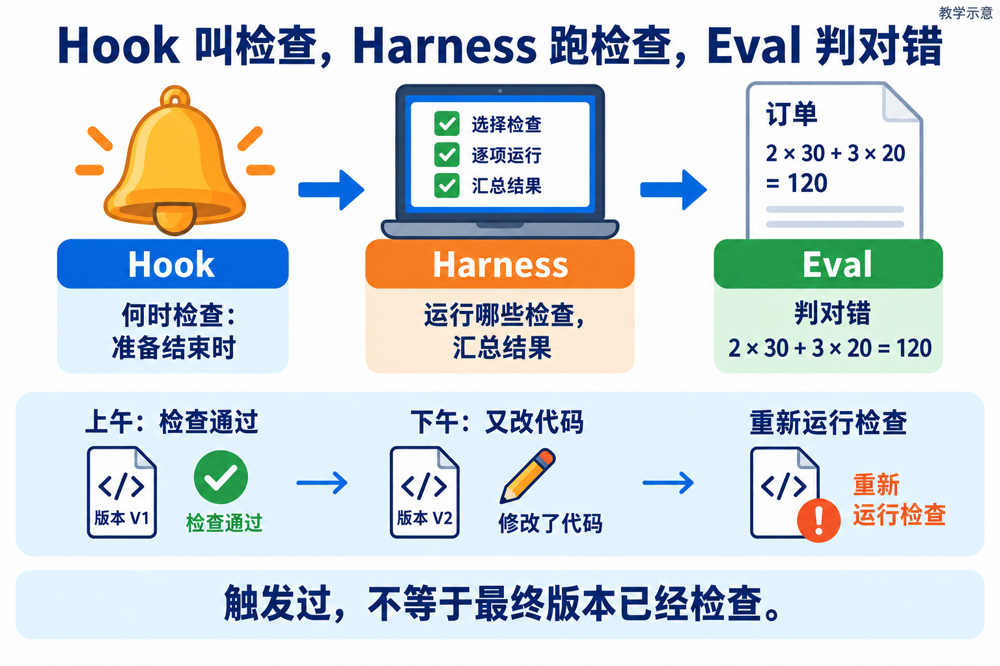
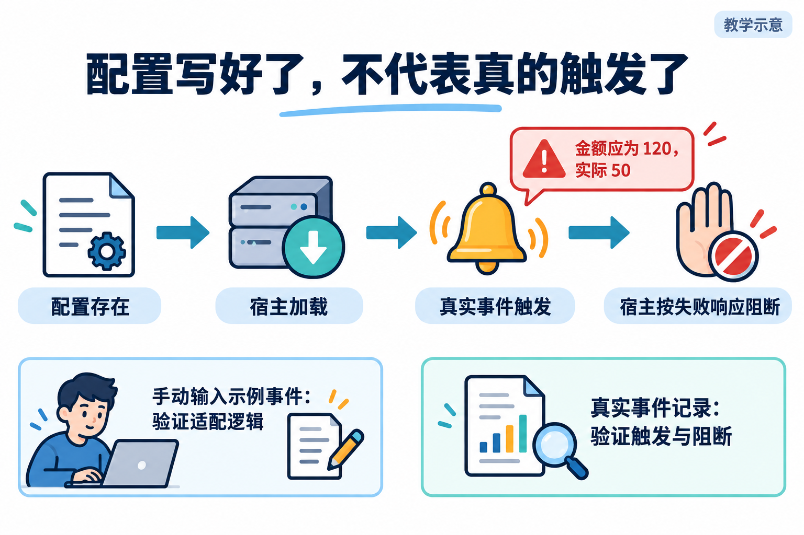
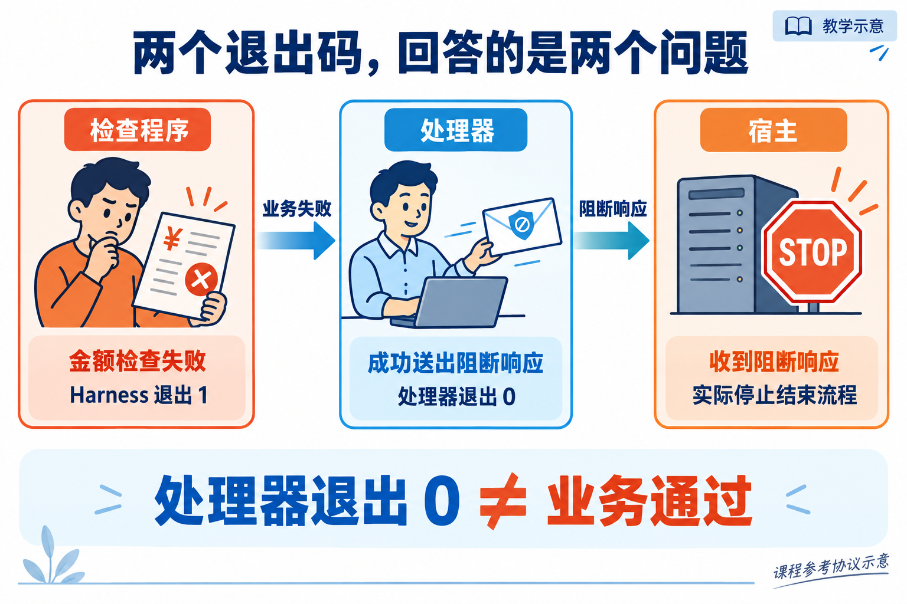
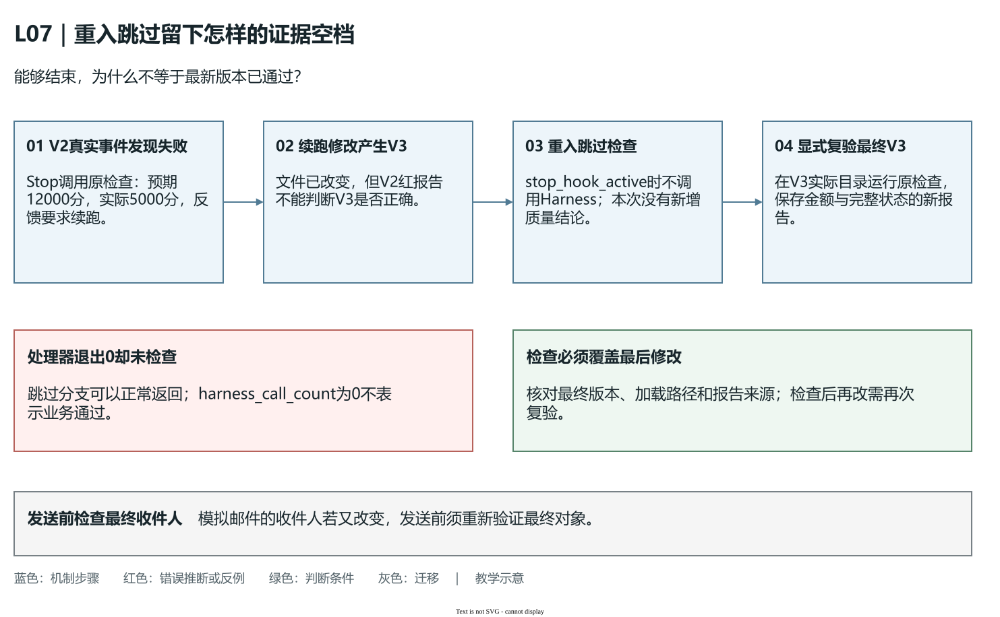

# L07｜用 Codex Hooks 建立本地护栏

L06 已经能如实给出质量结论。本讲遇到的问题是：检查标准没错，下午修改后却忘了运行，仍拿上午的绿报告交付。我们继续开发 FlowERP 草稿订单，用金额错误验证一个新连接：**准备结束的事件 → 调用原 Harness → 把结果送回 Codex**。

你先分清是检查没抓错，还是根本没调用；确认是后者，才设计触发事件和反馈策略。Codex 在原任务范围内协助实现订单与处理器，工作台记录实际触发和最终结果。草稿订单要算对金额、拒绝非法输入而不留残缺数据、创建时不提前预占。

## 1｜把上午和下午分成两个版本

订单两行分别是两件每件 30 元、三件每件 20 元，金额为 2×30＋3×20＝120 元。程序以“分”保存金额，对应 12000 分，避免把单位混淆成数值错误。上午 V1 正确并通过检查；下午 V2 漏乘数量，只得到 30＋20＝50 元，却引用上午报告宣布完成。

先在 V2 的实际目录手动运行原检查，再决定改哪里：

| 这次看到什么 | 当前应查哪里 |
|---|---|
| 明确报告“预期12000，实际5000” | 检查能抓错；接着查为何结束时没调用 |
| 金额已错，检查仍绿 | 查输入是否只有一行、断言是否观察真实金额 |
| 报告加载 V1 源码 | 校正候选目录与解释器 |
| 模块打不开、命令未完成 | 先恢复环境，业务结果尚未验证 |

这四种结果需要不同修改。Hook 只解决第一行的触发缺口，不能替其余三行补出一个可信判断。

订单草稿记录购买意向，尚未替订单留货。正常创建要有正确订单头、两行明细和金额，库存保持不变；数量 0、负数或商品不存在时，要拒绝且不留下部分订单。先独立算这些预期，才能判断触发了的检查究竟有没有查到本讲目标。

## 2｜让关键事件调用已有的检查

**Hook** 是在指定事件发生时被调用的处理程序。**生命周期事件**指工具工作过程中的时点，例如开始、工具调用前后或准备结束。选择事件就是选择检查发生在什么动作之前或之后；不是给任意脚本换个文件名。



**图 7-1　Hook 触发、Harness 执行、Eval 判断**

本讲选准备结束时的 `Stop`：事件送入处理器，处理器在当前候选启动统一 Harness，Harness 运行金额与状态检查，处理器把结果翻译成宿主理解的响应。**宿主**就是加载 Hook、产生事件和接收响应的 Codex 运行环境。Hook 决定何时调用，Harness 决定如何执行和汇总，Eval 决定某项要求是否满足。

为什么不在 Hook 内再写一遍金额公式？因为 L06 或本讲补了“草稿不预占”的断言，复制在处理器里的简化公式可能仍只看金额。两份标准会逐渐分叉，手动绿、自动绿也不再是同一个命题。先按[检查接入手册](实践操作手册.md#l07-connect)将个人 L05、L06 检查和本讲订单检查登记到 `eval.harness`，核对指定项与完整集合，再接 Hook。

`Stop` 适合在准备交付说明时提醒还有质量问题，代价是检查发生在文件修改之后。它不能撤销已经写过的文件，更不能阻止已经发送的邮件。迁移到有不可逆副作用的操作，应选动作之前的检查点；检查时机应由业务损失决定，而不是所有任务都套 Stop。

**Git Hook** 的触发源是 Git 操作，如提交前；Codex 生命周期 Hook 的触发源是 Codex 工作事件。结束一轮工作可能尚未提交，提交前又可能新增修改，所以两种触发可以互补，但不能互相作证。二者都应调用同一质量入口，并说明检查的是哪份实际文件状态。

## 3｜接入前，先读它到底会执行什么

接入前，从项目配置沿命令读到处理器，再到内部 Harness。核对这条实际调用链的来源、解释器、工作目录以及读写动作。信任一个 Hook 定义，就是允许这段程序在事件发生时执行；文件名叫 `quality_gate` 不能说明它做了什么。

当前官方 Hooks 文档说明，非托管 Hook 要审查并信任当前定义；定义变化后会重新待审查并跳过。在支持的 Codex CLI 中，`/hooks` 用于查看来源和信任状态。项目提供配置、配置已被信任、宿主实际调用，是三个不同事实。[官方 Hooks 说明](https://learn.chatgpt.com/docs/hooks)（核验：2026-10-01）。

课程执行器将待审查产物放在 `hook_staging/`，由人检查后安装到候选的 `.codex/hooks.json` 与 `.codex/hooks/quality_gate.py`。这样审查的是具体内容，活动配置不会在编码过程中悄悄生效。已有 Hook 要保留并审查合并，不覆盖其他规则；新的来源与内容版本也要重新核对。

沿调用链重点找 `cwd`，即事件发生的会话目录。处理器先确认它属于当前候选，再在该候选中用项目解释器运行 Harness。否则入口名称相同，也可能跑的是控制仓库或旧版源码。课程控制仓库默认检查工作台，本讲订单要求需在对应候选登记并实际执行。



**图 7-2　配置到真实阻断的证据链**

图中配置存在、配置加载、真实事件调用、宿主处理响应依次成立。手工向脚本输入 Stop JSON 只验证后两层之间的适配逻辑，不能证明宿主自动加载和触发。个人实践要保存真实事件记录，与手工协议实验分开。

### 最小权限：让可执行动作与本次责任相符

订单 Hook 所需动作很具体：读取当前候选、启动项目解释器、在临时数据库准备数据、写报告。这就是本例的**最小权限**，只给当前检查需要的能力。安装 Hook 不会自动授权它读凭据、改真实订单或向外发送消息；原执行范围仍按 [L04](../L04/辅导资料.md)落实。

在[参考处理器](../../../.codex/hooks/quality_gate.py)里，`cwd` 校验防止测错项目，解释器选择防止加载错环境，`stop_hook_active` 分支避免重入。这些代码没有限制所有子进程动作；允许文件和实际 Diff 仍由[执行器](../../../workbench/execution.py)检查。按实际功能读每一层，才能知道缺口在哪里。

选择时点时再问动作后果：候选代码写入后还能复验和返工，Stop 可提供及时提醒；发送动作结束后才检查，误发可能已经发生。第 6 节用模拟邮件迁移这一判断。订单金额如何覆盖最新版本，则在第 5 节按 V2→V3 的时序检查。

## 4｜为什么检查失败，处理器却可能退出 0

这里有两个进程，退出码表达不同职责。内部 Harness 的退出 1 表示阻断级检查未通过；处理器成功读到这个结果，输出宿主要求的合法响应，自己可以退出 0。处理器的成功表示“反馈交付完成”，不是“订单金额正确”。

例如 V2 的内部检查仍为 `expected=12000, actual=5000`，处理器给出这样的教学协议示例：

```json
{"decision":"block","reason":"金额检查失败；保持原断言，在授权范围内修复并复验。"}
```

官方 `Stop` 协议中，处理器退出 0 时输出 JSON；`decision: block` 会要求 Codex继续工作，并产生续跑提示，不是拒绝整个回合，也不自动撤销修改。[官方 Stop 协议](https://learn.chatgpt.com/docs/hooks#stop)（核验：2026-10-01）。因此应检查宿主实际续跑，而不能只凭 block 字段宣称交付已被平台强制禁止。



**图 7-3　业务退出码与处理器退出码**

图中内部红、外层退出 0 可以同时正确；最右侧的宿主行为仍需取证。如果处理器将非零误译为普通继续，或 stdout 混入日志使 JSON 失效，失败就没有正确传递。诊断信息应送 stderr，stdout 留给协议；不要从混杂输出中截出一段 JSON 当作响应完整。

失败策略还要区分“已检查且不合格”和“检查没完成”。金额错误可以指向业务修复，解释器不存在、输入损坏或超时应指向配置与运行故障，并保留未验证原因。本讲选择对这些情况给出明确的未验证反馈，再人工定位或显式复验。不能假设任何 Hook 异常都会被宿主自动当作业务阻断，官方支持路径和实际错误行为需按安装版本验证。

## 5｜用同一个错误做阻断，再用修复做恢复

保持 V2 的金额错误与断言不变，先比较显式调用和真实事件调用：二者应指向同一候选的同一失败。再核对处理器响应和宿主续跑。若内部已红而宿主正常结束，先修事件、加载或协议连接；不要先改业务抹掉红灯，那样会失去验证护栏的机会。

**超时**是允许等待的最长时间。外层时限约束宿主等待处理器，内层时限约束处理器等待 Harness，二者不是同一个设置。内部应更短，留出捕获异常和输出响应的时间。核对当前参考代码，可见内层 `subprocess.run(timeout=100)`，配置外层 120 秒；这是当前工作台示例的取值，不是所有项目的固定标准，也不证明能终止所有派生进程。

实践手册保留的旧记录曾表现为输入错误和超时没有合法响应、内部未配置时限；当前参考源码已补上输入、目录与异常处理。阅读六类协议实验时，以实际输出的处理器路径、`response`、`exception` 和超时字段为准，旧失败作为历史保留。替身抛出 TimeoutExpired 能检验适配分支，真实等待程序才能进一步验证实际超时与进程结束，二者不能互换。

还有**重入**：Stop 要求续跑后，新的结束尝试可能再次触发 Stop。参考处理器依据 `stop_hook_active` 跳过重复调用，避免反复续跑；这次跳过没有检查新代码。如果 Codex 续跑又修改文件，最后仍须显式复验当前候选。避免无限重入与保证最终复验是两件事，应在策略中同时安排。

按参考代码推演 V2→V3：V2 的真实 Stop 得到“预期12000、实际5000”，宿主续跑；Codex 修改后得到 V3。新的结束尝试若带 `stop_hook_active`，处理器返回“重入跳过；本次未复验”，没有运行 Harness。替身实验对应 `harness_call_count=0`，验证了适配分支；真实触发仍需宿主记录。此时最新的是 V3，最后报告却只检查 V2。

| 时点与版本 | 此时真正执行了什么 | 已有证据允许怎样判断 |
|---|---|---|
| V2 第一次准备结束 | 原 Harness 发现 12000 与 5000 不符 | V2 失败，失败已传给宿主 |
| 续跑产生 V3 | Codex 修改候选文件 | 已有新版本，是否正确仍待验证 |
| V3 重入结束 | 处理器跳过，Harness 未运行 | 无新增质量结论 |
| V3 最终显式复验 | 当前目录运行原 Harness | 按本次结果判断 V3，保留新报告 |



**图 7-4　重入跳过之后，补上最新版本的检查（教学机制示意）**

[可编辑源图](assets/reading-depth-20261003/mechanism.drawio)。

图中第二步形成新文件，第四步才检查新文件。最后从 V3 的实际目录调用原入口，覆盖金额、订单完整性与库存不变；只有“金额12000”的截图仍漏掉状态要求。若加载到 V2 源码，先改正路径再运行。

个人材料保留这条完整时序：“真实 V2 阻断 → 续跑修改 → 重入未复验 → V3 显式结果”，再取得手册要求的新一轮正常 Stop 通过记录。两轮间只修授权的订单实现，检查、事件和处理器保持不变；这样才能解释恢复来自哪项修改。检查之后若又改订单实现，就重新检查那个新版本。

## 6｜从“金额正确”走到“订单草稿可验收”

V3 不只要算出 12000 分，还要正确建立两行草稿、正常创建不改变库存，非法数量与商品不存在时不残留订单头或明细。失败请求应比较完整前后状态，不能仅检查报错文字。换输入为三件每件 25 元、两件每件 18 元，独立预期 111 元，即 11100 分，用来排除写死课堂答案。

按[实践操作手册](实践操作手册.md)开展个人实验时，配置审查、手工协议、真实事件和最终业务复验各支持不同结论。材料应能回答：最后一次修改是什么版本，哪个真实事件运行了原检查，失败怎样传给宿主，重入后谁复验了最终候选。没有真实事件就记录“协议测试完成，宿主触发待验证”；没有同伴就保留自查与待复验，不生成他人审核署名。

迁移练习使用本地模拟邮件发送器：若目标是避免误发，先确认收件人，在发送动作之前检查；发送以后 Stop 再报告失败已经无法预防副作用。本练习不发送真实邮件。它检验的是学生能否根据后果重新选时点，而不是会复制一份 Stop 配置。

## 本讲留下什么，下一讲怎样接着用

本讲形成草稿订单候选、同入口 Hook 连接与真实失败恢复记录。它让质量反馈更及时，但仍依赖当前版本与实际触发证据。下一讲继续整单预占，把同一入口接到可追溯的远程复验。本地 Hook 不能代替真实 CI。具体适配边界按需查[参考说明](reference/参考说明.md)。

[课程学习路线](../../README.md#16-讲学习路线) · [实践操作手册](实践操作手册.md) · [上一讲](../L06/辅导资料.md) · [下一讲](../L08/辅导资料.md)

## 课程大纲中的本讲要求

- **核心内容**：生命周期 Hook、信任边界、超时、失败策略，以及 Hook 与 Git Hook 的区别。
- **演示结果**：Codex 在关键生命周期节点运行质量检查并反馈失败。
- **课内增量**：配置一个项目级质量 Hook，调用统一 Harness，而不是复制另一套质量逻辑。
- **通过标准**：Hook 来源可检查；故意引入违规时流程被阻断；恢复后重新通过。

配图为教学示意；来源与提示词：[查看原配图设计与提示词](assets/reading-figures-v2/设计与提示词.md)、[查看新增配图与完整生成提示词](assets/reading-story-20260926/生成说明.md)。
