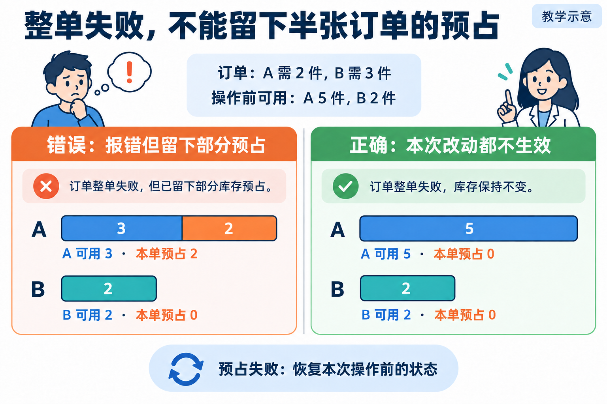

# L08｜把同一套 Eval 接入 CI

L07 解决“本地结束前是否调用检查”。L08 继续解决“审核者拿到的那版代码，是否也运行了原检查”。我们把同一 Harness 接到 CI，保存原始报告，并让别人从远程运行入口回查。

客户产品从草稿订单走到整单预占：所有商品都够才一起留货，一行失败就不留部分预占。这里同时有两个故障可查：产品留下半单预占，CI 又把失败显示成绿。你固定同一组业务要求，Codex 分别修失败传递与业务事务，形成 A 假绿→B 可信红→C 可信绿，审核者据此判断每次修改的效果。

## 1｜页面说失败，为什么库存仍可能被占住

订单需商品 A 两件、商品 B 三件，操作前可用量分别为五件、两件，本订单尚无预占。**预占**是把货留给该订单，还没有实际出库。本次业务选择整单处理：每行都能满足才预占，任何一行不足，本次相关写入不生效。

错误实现依次处理每行，先为 A 预占两件，再发现 B 不足并报错。页面虽然显示失败，A 可用量却由五件降到三件，留下本订单的预占记录，别的订单就少了两件可用货。仅看报错或订单状态，不能发现这份残留。

**图 8-1　整单预占失败后的状态对照**

完整推演应读四类状态：库存余额、预占记录、订单明细、订单头。失败前为 A可用5、B可用2、预占0和0，订单已确认；正确拒绝后四类状态完全不变。预占请求被拒绝，Eval 通过，因为正确的业务行为正是拒绝且不留残留。

本讲参考实验调用正式 `SalesService`，先创建、确认，再预占；L07 使用教学草稿入口。两个入口的状态合同不同，所以失败后应保持 `confirmed`，不能误要求退回草稿。阅读真实候选时先核对服务入口与导入路径，不将参考脚本对独立客户源码的结果当成个人候选结果。

## 2｜把本地的同一条检查交给远程运行

**CI** 是持续集成的检查流程：代码变更触发工作流，由执行环境取源码、准备依赖、运行命令并保存结果。本地检查便于快速定位，远程检查让别人可以回查运行来源，并暴露未提交文件、环境残留或依赖差异。远程机器并不天然可信，流程少跑用例、取错版本或吞掉失败，同样能产生假绿。

“同一入口”沿用 [L06 的登记与报告规则](../L06/辅导资料.md#2一项检查要观察什么)：本地与远程调用同一个 Harness，执行同一份确认的检查与等级。本讲再登记多行预占和中途写入失败用例。系统不同可以有不同安装命令，业务要求和实际选中的用例要一致。

远程准备先回答两个路径问题：取的是哪版工作台，取的是哪版 FlowERP？二者是独立项目，各有源码与解释器。课程组合候选记录两仓来源与哈希，实际 CI 明确固定客户版本，再核对业务检查加载位置。只取工作台并运行默认 blocking，检查到的是工作台要求。

变更先进入**候选分支**，即等待验证与审核的代码版本。提交标识 SHA 标识一份 Git 提交，分支名只是可以继续移动的指针；报告应绑定实际测试版本，不能只写“main”或“我的分支”。若平台测试候选与主分支的合并结果，实际 checkout 与候选分支头可以不同，但二者关系要可追查。

## 3｜为什么第一次修改以后，应当看到红灯

教学对照有两个缺陷：业务留下部分预占，外层工作流又吞掉 Harness 的非零退出码。检查已失败，工作流却绿。如果两处同时修，最终绿色不能说明失败传递是否真正修好。因此安排三个阶段，每次只改变一个原因。

**图 8-2　先修失败传递，再修整单预占**

“阶段 A/B/C”表示运行阶段，“商品 A/B”表示商品，请连同前缀辨认。三阶段保留同一缺货输入和业务裁判。

| 阶段 | 保持与改变 | 内部检查与外层结果 |
|---|---|---|
| 阶段 A，假绿 | 保留业务缺陷与错误传播 | Harness 非零、报告 block，Job 却绿 |
| 阶段 B，可信红 | 业务、检查、输入不变，只修传播与归档 | Harness 非零、报告 block，Job 失败 |
| 阶段 C，可信绿 | 保持 B 的流程与检查，只修业务事务 | 四表符合原合同，Harness 0、报告 pass，Job 绿 |

B 的红灯是第一次修改的正确目标：相同的产品错误现在能够让流程失败。若 A → B 同时改了业务，无法把红色归因于传播修复；若 B → C 删了反例或降级，无法把绿色归因于产品修复。应保存相应提交与差异，使“保持不变”成为可检查的事实。

**Job** 是 CI 中一组步骤的执行单元。命令非零应传播为失败，上传报告是随后独立的动作。典型错误是捕获失败后强行返回 0，或采用允许继续失败的配置而不恢复最后结论；即使日志含 BLOCK，外层仍可能绿。正确做法是在失败后尝试保存本次报告，同时保留原失败状态。报告不存在时也应明确失败，不能借用旧文件补位。

阶段 A 的故意假绿只用于隔离演示候选，不能合入真实交付。CI 如实失败意味着按交付规则不能接受；托管平台是否从操作上禁止合并，还取决于仓库是否将该检查设为必需条件，不能从颜色推定平台配置。

## 4｜再修整单预占，不能只多加一次库存判断

目标是本次相关写入一起成功或一起不生效，这叫**原子性**。数据库**事务**将一组写入作为整体提交或撤销，是实现本例原子性的关键机制。若循环里每一行都单独提交，第二行失败时第一行已生效，后面再抛异常无法自动撤回它。

“先检查所有库存”只能处理写入前已知的缺货。即使两行都够，写第二条预占时也可能遇到数据库错误。检查阶段判断能否形成计划，事务边界决定写到一半时怎样恢复；我们要分别验证这两个时点。

中途故障实验从 A、B 各可用五件开始：先为 A 写入两件预占，在同一连接内暂时看见 A 可用三件、第一行预占两件；整单尚未提交。临时数据库触发器再让 B 的第二条预占插入失败。此时应撤销已写的 A，重新读四表时恢复原状态。该实验检查写入中途回滚，不是并发压力或全部宕机场景的证明。

固定以下三条路径，缺一条都会漏掉一种错误：

| 检查情形 | 失败或成功发生在哪里 | 调用结束后必须读取的结果 |
|---|---|---|
| 正常：A、B 各可用五件 | 所有计划和写入都完成 | 可用三件、两件，两条预占，订单 `reserved` |
| 缺货：A 可用五件，B 两件 | B 三件需求无法形成完整计划 | 可用五件、两件，四表不变，订单 `confirmed` |
| 中途错误：A、B 各可用五件 | 已写 A，第二条预占插入失败 | 可用五件、五件，四表不变，订单 `confirmed` |

**图 8-2a　整单事务把暂时写入与最终提交分开（教学机制示意）**

[可编辑源图](assets/reading-depth-20261003/mechanism.drawio)。

读图必须走到提交或回滚后的重新读取。第二步的 A 可用三件只是事务内部暂态；缺货在计划阶段退出，中途错误在写入阶段回滚。正常路径还必须成功，否则拒绝所有订单也能满足“不留残留”。

阅读独立 FlowERP 参考实现时，从 `SalesService.reserve` 找到 `ERPStore.connect()`：计划、余额、预占、明细和订单状态在同一连接中处理；正常退出 commit，异常退出 rollback 并继续抛出。重点追两处：循环里另开连接并提交，会提前保存 A；事务内吞掉异常后正常返回，会进入提交分支。相关写入共享提交边界、失败真正到达回滚分支，才是这条路径的实现依据。

迁移到整批导入时，先决定一行失败是否允许其他行成功。若合同要求整批不生效，就把全批相关写入纳入同一边界，并保留写入前失败、写入中失败和正常成功三类检查；若业务确认允许部分成功，则应设计每行结果与重试规则。事务范围来自业务约定，不能仅因本讲整单回滚就替新业务作出决定。

委托 Codex 时给出表中的状态，要求沿事务开始、提交、回滚定位问题，只改原子预占。B 阶段的工作流、原服务入口、数据准备与断言保留不变，才能从 B→C 判断业务修复的效果。若新任务还涉及事务外的发送等动作，需另确定它们的撤销边界。

## 5｜远程变绿以后，先查它在证明哪份代码

远程证据要把“代码—环境—命令—检查—报告”连到同一次运行。首先从平台入口找到本次 Run，核对候选分支头和实际 checkout；再读环境准备与实际命令，确认两个项目版本和解释器；随后检查必需用例、等级、摘要、真实 Harness 退出和 Job 状态，最后下载本次报告。

**报告归档**是把运行产物保存为可下载文件，通常称 artifact。它的作用是让另一人检查原始分项，而不只看屏幕摘要。Run ID 标识一次运行，attempt 区分重跑；使用对应的新输出目录，避免前次成功文件在本次检查未执行时仍被上传。环境建立失败或进程在写报告前退出，应留下本次日志与缺失说明，不能伪造业务报告。

**图 8-3　CI 报告来源和人工合并决定**

图中勾选仅是教学示意。**证据信封**是给原始报告附上运行身份和内容指纹的记录。本仓库 `workbench/ci_evidence.py` 记录提交 SHA、Run ID、工作流、系统、Python、套件、报告 SHA-256 与报告判决。SHA-256 是依据文件内容计算的指纹，可用于检查下载后是否仍是同一份文件，不能单独证明命令实际执行。

当前信封辅助程序没有替审核者检查全部必需用例、真实进程退出、实际 checkout 与候选头关系，也没有自动记录所有重跑信息。因此须结合平台日志与下载产物补足核对，不能把“信封能生成”当成可信绿。下载后重算的是原始报告文件哈希，不是 artifact 压缩包哈希。

### 独立复验要让不同证据各自回答一个问题

[L05](../L05/辅导资料.md) 已证明检查能抓错，[L06](../L06/辅导资料.md#4第一次只修汇总保留业务红灯) 已解释从分项复核总判决。CI 多出的核对是来源：报告是否来自交出的版本，下载文件有没有变。同时保留原清单核对，排除“版本正确，却少跑关键场景”。

**图 8-4　来源可信，仍要排除漏跑关键检查（教学示意）**

先看图左侧：版本相符、Run 可回查、下载前后哈希一致，只支持来源与文件完整性。再看右侧：正常预占和库存不足拒绝已运行，但第二条写入失败场景缺失，就没有材料证明写入中途报错时四表不变。表格列出的是本讲关键场景示意，不代替完整必需清单；审核应把事先约定的要求逐项与报告对照，不能以左侧三个勾替右侧补出一次执行。

这个风险在当前辅助程序里有具体位置。[信封构建器](../../../workbench/ci_evidence.py)的 `build_envelope` 包装报告来源与哈希，没有调用完整的报告合同校验。本地[信封边界实验](examples/envelope_boundary_lab.py)使用明确的模拟身份，将 `{}` 作为报告时仍可能生成一个缺少有效业务结论的信封。这说明包装成功与验收通过是两件事；实验没有访问真实平台，也不能代替远程运行。

可调用[报告合同校验](../../../eval/report_contract.py)，用事先清单核对实际项、重算摘要并比较进程退出；再从 CI 日志确认这些命令在本次版本执行。缺用例查注册和选择，文件哈希不符查来源，环境失败则保留业务未验证。信封负责关联文件，原检查负责判断业务，两者各有具体作用。

将 A→B、B→C 的差异分别关联到运行，复验者才能判断第一次只修传播、第二次才修事务。独立复跑使用新输出目录，能进一步发现作者机器上的残留文件或漏提交依赖；随后按原交付流程审查范围与风险。

本地与远程结论不同时，先查版本与未提交文件，再查实际加载源码、环境和数据准备，再查用例注册、选择与失败传播，最后分析业务实现。报告缺失先查前序跳过、命令是否运行及写入位置；哈希不符先保留两份原始文件并核对来源，不编辑信封去匹配。这样的失败路径避免把所有远程红都草率归因于“CI 环境问题”。

## 6｜交给另一个人，才看得出材料是否够用

按[实践操作手册](实践操作手册.md)完成本地机制实验，再在有权限的远程候选中执行真实 A/B/C。`ci_signal_lab.py` 是本地传播实验，使用明确的 SIMULATED 身份；真实产品子进程记录也仍是本地运行。它们帮助理解原因，不能替代真实 CI Run。远程权限或环境缺失时，就把远程项保留为待验证。

请复验者从 B 的远程入口找到“业务仍错、流程已能正确报错”的证据，再对 C 核查原正常与失败路径。只给最终绿图，对方无法辨认删了断言、跳过检查还是修好了事务。技术检查通过后，负责者仍需查看差异、范围、未覆盖风险，再具名接受、打回或合并；自动修复继续产生候选，不能直接合入主分支。

迁移输入时，保持本例订单数量，给商品 B 补足至三件，正常预占后 A、B 可用量应为三件、零件，同时保留原缺货和中途故障用例。手册还要求换数量并独立手算，复验本地与远程是否执行同一输入。迁移到整批导入时，要先确认业务允许部分成功还是要求整批回滚，再选择状态观察；整单事务要求不能无理由推广到所有业务。

工作台的新增能力不是“点亮 CI”，而是将确定的候选、独立检查与原始报告交给另一个人复验。FlowERP 的原子预占提供实际场景，流程失败和产品失败都回流到同一事项，才能支持明确返工与验收决定。

## 本讲留下什么，下一讲怎样接着用

本讲留下原子预占候选、同入口工作流及可追查的远程复验材料。L09 将报告中的具体失败转成有范围、复现命令与目标状态的修复任务。更多配置与边界见[参考说明](reference/参考说明.md)。参考材料不是学生的远程运行或人审结果。

[课程学习路线](../../README.md#16-讲学习路线) · [实践操作手册](实践操作手册.md) · [上一讲](../L07/辅导资料.md) · [下一讲](../L09/辅导资料.md)

## 课程大纲中的本讲要求

- **核心内容**：本地快速反馈与远程可信复验；候选分支、报告归档和人工合并。
- **演示结果**：不合格变更在 CI 中失败，修复后生成通过报告。
- **课内增量**：配置 CI 工作流并上传 Harness 报告。
- **通过标准**：本地与 CI 使用同一入口；非零退出码阻断候选变更；自动修复不直接合并主分支。

配图为教学示意；来源与提示词：[查看原配图设计与提示词](assets/reading-figures-v2/设计与提示词.md)、[查看新增配图与完整生成提示词](assets/reading-story-20260926/生成说明.md)。
