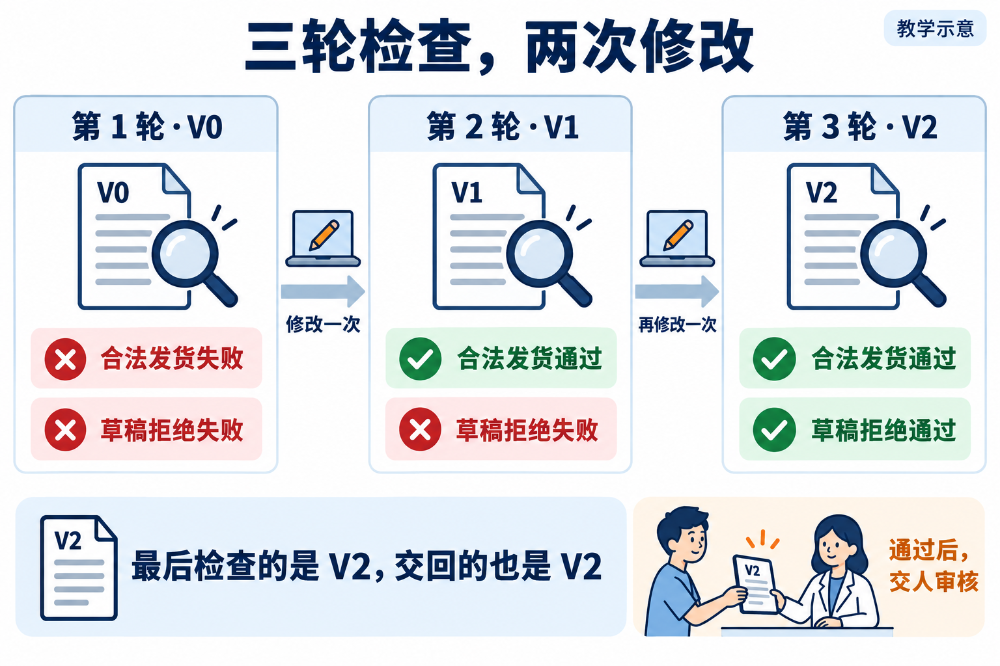
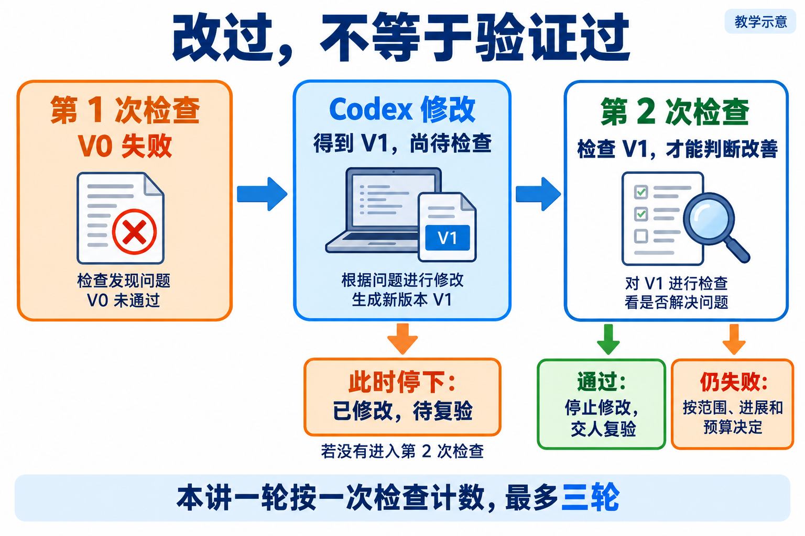
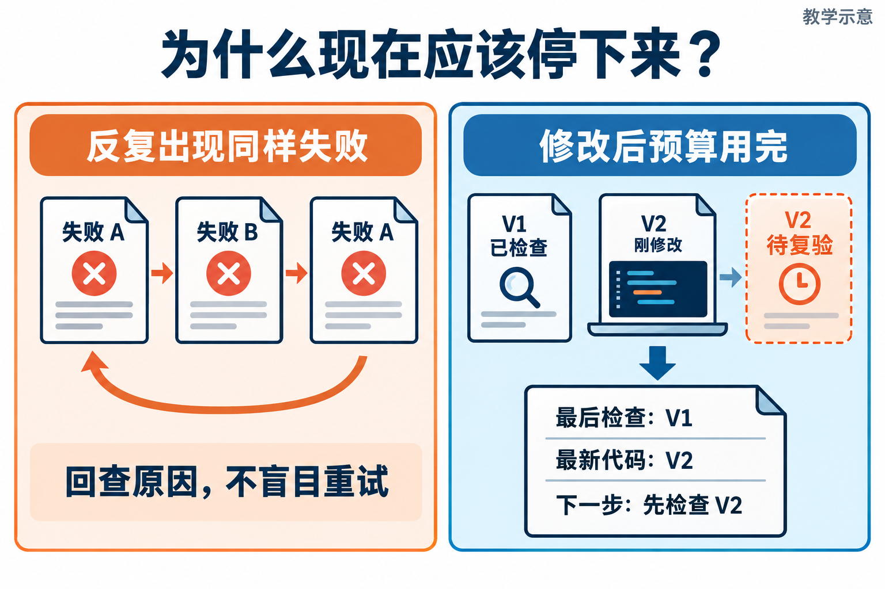
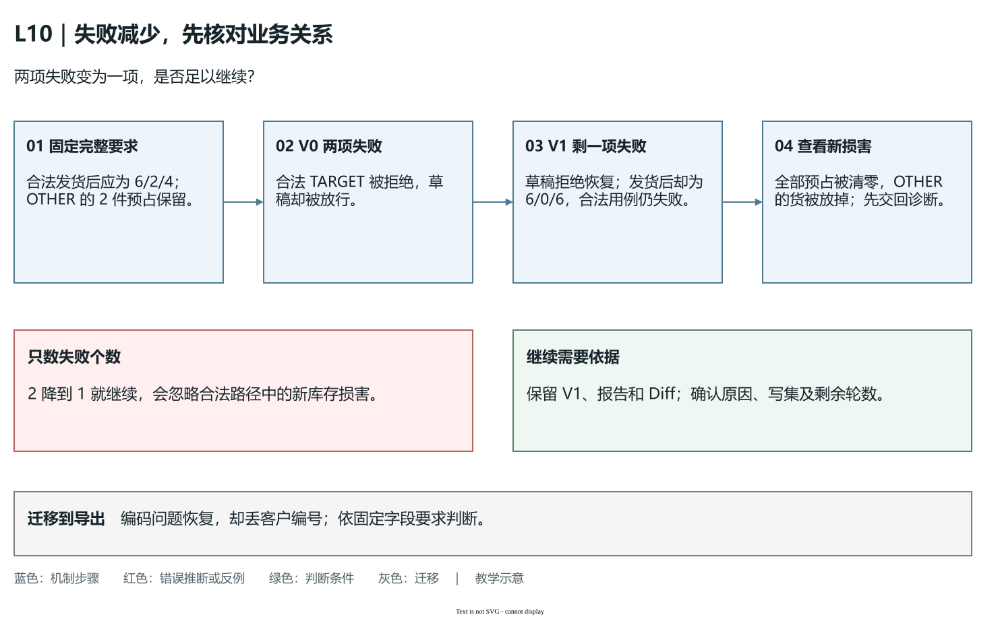

# L10｜建立有停止条件的修复 Loop

L09 留下一份可以执行的修复任务。L10 从它后面接起：Codex 改完第一版，检查仍失败，工作台能否决定继续一轮，或者带着清楚的状态停下？客户场景是发货：已预占订单应成功，草稿、已取消和重复发货应拒绝，OTHER 的货必须保留。

本讲新增 **Loop，修复循环**：检查当前版本→复用 L09 形成任务→执行修改→检查新版本，再决定继续或停止。检查标准沿用原要求；改变的是工作台多次委托的控制方式。先由人确认范围、轮数和预算，控制器每次凭真实报告判断，Codex 负责范围内的修改。

## 1｜先看这次发货到底哪里错了

沿用实践手册的数据。商品 A 在库 10 件，OTHER 已预占 2 件，TARGET 已预占 4 件。发货前总预占为 6，可用为 4。TARGET 发出后，在库减少 4 变为 6，预占减少 4 变为 2，可用仍为 4；OTHER 保留，TARGET 成为 shipped（已发货），它的发货流水记录在库和预占各减少 4。

发货不是取消：取消释放占用而不改变在库，发货既消耗在库又撤销本订单的占用。只改状态标签无法证明这两笔变化正确。草稿、已取消和已经发货的 TARGET 再请求发货时，当前业务合同要求拒绝，请求前后库存、订单、明细和流水四表应相同。

设错误候选 V0 有两项失败：合法发货被拒绝，草稿发货被放行。把所有发货都拒绝，可以让后一项变绿，却使客户仍无法发货；把全部状态放行，也会伤到非法路径。因此循环每轮沿用完整要求，既检查该成功的，又检查该拒绝的。重新检查原先已通过的功能，叫**回归检查**。



**图 10-1　三份报告检查三版代码，中间发生两次修改。** 图中的成功路线是教学推演，不能预设自己的第三轮一定通过。

先在图中数三次检查，再数两次修改。V0、V1、V2 是代码版本，不是聊天轮次；各报告保留实际对象、用例版本、命令和退出码。中途若改了检查标准，失败数就不能直接比较。

## 2｜第一轮之后，为什么允许再改一次

先把计数写清楚。本讲的主线按一次“检查与下一步决定”算一轮，最多三轮检查。第 1 轮检查 V0，发现两项失败，工作台复用 L09 映射器形成任务；在允许写集和资源预算内，Codex 修改为 V1。修改完成只说明有新代码，不能马上把本轮标成通过。

第 2 轮检查 V1。假设合法发货已通过，草稿拒绝仍失败，没有新增失败。失败减少有业务依据，而且还留有第 3 轮检查机会，才允许第二次修改。任务聚焦草稿拒绝，但验收仍包括合法发货与 OTHER 保护；Codex 得到 V2 后，第 3 轮检查 V2。全部阻断要求通过，就停止修改并送人审核。这种在限额内达到目标的结果叫**收敛**。



**图 10-2　新版本先是待复验，检查以后才有结论。** “已经改完”与“已经检查通过”之间不能省去箭头。

这个计数设计最多允许两次修改，因为每次修改都为后置检查留了位置。也可以设计“最多三次修改，之后另有最终检查”的控制器，但必须先约定检查轮次和修改次数，把后置检查算进资源预算，不能将两种约定混在同一份 History 中。

若第 3 轮仍失败，主线设计交回已检查的 V2。如果允许最后再改出 V3，最新代码就是 V3，最后报告却属于 V2，结论应写“V3 待复验”。设计时可以在最后一次检查失败后直接停止，或者预先保留一个有预算的最终检查；不能事后把新检查偷偷算到原来三轮里。

## 3｜假如第二轮没有变好，还要继续吗

“无进展”必须有可以执行的判定，不能只写一句“看起来没有变好”。一个最小判定是：按用例名对阻断失败排序，形成**失败签名**；相邻两份有效报告的失败签名相同，就停止重复尝试，交回调查。

它的好处是简单、稳定、便于复现；代价是比较粗。合法发货用例先因找不到订单失败，修复后因库存计算失败，名称没有变，这个判定仍会停下。反过来，失败在 A、B、A 之间交替，相邻名称都不同，仅比较相邻签名就不能提前识别振荡。错误文字变化、Diff 变大，都不自动说明业务更接近目标。



**图 10-3　振荡与预算停止都要留下接手依据。** 左边的 A/B/A 表示修复反复破坏另一条规则；右边区分最后已检查版本与最新代码。

保存全部签名，能进一步发现 A/B/A 这种回到旧失败的振荡。是否继续仍要看同一套要求、对应候选和具体业务后果。下面用一次“失败少了一项，风险却变了”的修改说明。

### 失败从两项降到一项，为什么仍可能要停

把上面的担忧展开成一轮具体推演。保持商品 A 的初始数据 10/6/4，保持同一套完整要求，每条路径使用自己的初始数据库。V0 拒绝已预占 TARGET 发货，又放行草稿；两个阻断失败分别是“合法发货”和“草稿拒绝”。Codex 修改为 V1，草稿现在会拒绝，TARGET 也能改成 shipped，但实现把商品 A 的**全部预占**清零，而不是只撤销 TARGET 的 4 件。

| 对照内容 | V0 报告对应的事实 | V1 报告对应的事实 | 能否据此继续 |
|---|---|---|---|
| 合法发货 | TARGET 被错误拒绝 | 状态已发货，但总预占被清零 | 原用例仍失败，原因已经变化 |
| 草稿拒绝 | 被错误放行 | 拒绝，且拒绝后四表不变 | 这一项得到恢复 |
| 合法路径库存 | 合法请求未完成 | 在库 6、预占 0、可用 6 | 应为 6/2/4，OTHER 的货被放掉 |

失败名称从 `{合法发货, 草稿拒绝}` 缩为 `{合法发货}`，但合法路径应有 6/2/4，V1 却得到 6/0/6。OTHER 的货被放掉了；“能发货”恢复并不代表“合法发货”全部通过。失败变少只证明部分要求恢复，还要调查新损害。



**图 10-4　报告数量的改善与业务关系的改善，要分开判断。** 上方 V0 到 V1 的失败数从 2 降到 1；第一步核对合法路径应得到的 6/2/4，第三步发现 V1 的 6/0/6。沿绿色判断先保留新缺陷并交回诊断，再决定下一份授权任务。图中数字是同一案例的机制推演。[可编辑源图](assets/reading-depth-20261003/mechanism.drawio)。

先保存 V1、报告和 Diff，停止当前自动路线，沿清零语句调查归属为何丢失，再确认下一份任务。三轮约定下，第 2 轮已用掉，重新确认范围不能重置轮数。`agent/loop.py` 只比相邻失败名称，会认为签名变化；它不会独自识别 OTHER 被伤害，个人控制器需明确这一风险判断。

迁移到导出修复时，同样让自己回答：编码失败消失，但客户编号少了一位，能不能继续报“正在收敛”？先用固定字段要求检查新损害，再写下下一次动作的依据。你要解释的是哪条业务关系恢复、哪条新关系被破坏，而不只是失败总数变了多少。

继续一轮要同时满足三件事：未完成目标明确，上一轮提供了新的原因依据，授权与预算还够修改和复验。若仍加载旧版、代码没变或假设没有证据，就先恢复诊断。

**达标即停、轮数到限、无进展、时间到限、Token 到限**构成五类核心停止条件。执行器异常、报告无效或必须扩大授权，则进入安全停止路径，先交回相应问题。判断顺序也有意义：先检查报告有效性，才能判定通过或失败；有效且达标就不再修；仍失败时，再核对进展和预算，决定是否启动下一次动作。

### Codex 的工具循环，与交付者的修复循环分别决定什么

一次委托内部，Codex 会读服务、运行命令、依据结果再修改，这叫 **Agent 内循环**。本讲工作台管理的是**修复外循环**：决定是否再次委托，并管理候选版本、预算和交接。一次委托读五次文件、跑两次命令，仍不是七轮候选检查。

在 `agent/loop.py` 中，`suite_runner` 负责检查，`executor` 负责执行；执行返回“完成”后，外循环仍需检查新版本。固定完整要求能反驳执行者的修复假设，例如仅放行状态而误清 OTHER 预占。独立复验的具体来源核对沿用 [L08](../L08/辅导资料.md#5远程变绿以后先查它在证明哪份代码)，本讲关注的是是否还有下一次调用依据。


**图 10-5　内圈解决当前任务，外圈控制这次交付。** 先指出一次 Codex 委托在内圈走过哪些动作，再沿外圈数实际候选检查。找到“继续或停止”与“人审”，说明各自需要什么依据。图为机制示意，不代表参考脚本已补齐全部控制条件，也不代表三轮后必然成功。

读图时给每个圈写一句完成条件：内圈交回一次委托的修改与输出，外圈用新报告决定继续、停止或送人审核。迁移到报表也一样：生成图是一次动作，字段、单位、口径与版本通过后才有交付结论。尚有额度也不构成达标后继续修改的理由。

## 4｜停下时，怎样让下一位接得上

轮数、时间与 Token 约束不同资源。**Token** 是模型输入输出的用量单位：一轮输入包含任务和上下文，输出包含分析及响应，只有实际运行记录才能支持实际用量。时间预算控制等待与执行历时，轮数预算限制反复尝试的次数，三者不能互相代替。

假设总时间预算为 90 秒，检查与任务形成已用 35 秒，下一次执行只能使用剩余 55 秒以内的超时设置；如果还要求修改后复验，就还要为复验保留时间。总预算应覆盖检查、准备、执行与复验。还要区分“到限后不启动新动作”和“正在运行的动作也能被中止”，并核对中止后是否还有子进程或文件修改。

Token 预算同样有软边界。预算 100，执行器返回本次用了 150，控制器可以累计 150、把剩余额度记为 0 并停止下一次调用，却无法让已经发生的消耗退回 100。缺少可核验用量时应停止自动核算，把未知标为未知；“没有用量数据”不是免费运行。若要求单次调用也不超额度，还需要实际执行器支持，不能仅靠外层计数。

安全停止要保存一条可重建的**修复历史（Loop History）**。它记录检查对象、原失败、生成的任务、实际执行、资源与停止理由，摘要再关联完整报告、Diff 和执行输出。下面是教学记录格式，不是程序直接输入：

```text
第 1 轮：检查 V0 → 两项失败 → 任务 T1 → 修改得到 V1
第 2 轮：检查 V1 → 草稿拒绝失败 → 任务 T2 → 修改得到 V2
停止：本次执行后预算到限
最新候选：V2，未复验
最后有效报告：V1 的 R1
接手第一步：检查 V2，再决定是否需要新修复
```

把“当前候选”和“最后已验证候选”分开保存，才能避免拿 R1 解释 V2。remaining_failures（剩余失败）若来自旧报告，也要标明它们只代表最后一次已知失败，不能断言最新代码仍有同样问题。

执行器超时或报错时，可能已经留下部分代码修改。控制器应停止后续自动动作，保留任务、输出、Diff 和最后报告，确认真实进程已结束，再决定恢复或复验。安全停止的完成标志是接手者知道当前代码、最后可信结果和下一步动作；它与发货业务通过要分别报告。

## 5｜用三个小实验检验自己的理解

在 CodexFDE 控制仓库的既有环境中，按系统选择命令，先观察控制程序：

**Windows（PowerShell）：**

```powershell
.\.venv\Scripts\python.exe -X utf8 docs/courses/L10/examples/loop_control_lab.py converge
.\.venv\Scripts\python.exe -X utf8 docs/courses/L10/examples/loop_control_lab.py repeated
.\.venv\Scripts\python.exe -X utf8 docs/courses/L10/examples/loop_control_lab.py last-repair
```

**macOS（zsh）：**

```zsh
.venv/bin/python -X utf8 docs/courses/L10/examples/loop_control_lab.py converge
.venv/bin/python -X utf8 docs/courses/L10/examples/loop_control_lab.py repeated
.venv/bin/python -X utf8 docs/courses/L10/examples/loop_control_lab.py last-repair
```

第一条两次检查、一次替身执行后收敛；第二条两次相同失败后停止；第三条一次检查、一次替身修改后到限，最新状态尚未在循环中复验。查看 result.status、checks 与 executor_calls，包装命令退出 0 只表示观察符合实验预期，不表示 stopped 的业务已经通过。这些报告与用量是标明来源的合成输入，没有调用真实 Codex。

[实践操作手册](实践操作手册.md)分两阶段完成。先固定发货业务红起点，只建设 Loop 与四项检查，验证个人入口能读取已确认的运行上下文、选择实际业务检查，并通过控制工作台委托限定范围的任务；这些接线需本人建设，不能假设参考 CLI 已具备。业务缺陷仍被原检查发现，才把该新版候选复制成两个相同起点。随后分别确认业务 Spec 与范围，用新 Loop 做真实修复和安全停止。实际运行前核对源码位置、执行器范围和证据目录，不能把提示词中的禁止事项当成文件权限机制。

自己的[提交模板](SUBMISSION.md)应有同版 Loop、检查和业务红起点的来源指纹，随后保留两条实际轨迹：真实目标失败后的模型修复与复验；以及 `--max-rounds 1` 时真实检查一次、编码零次的安全停止。后者证明控制器停止有效，业务仍未完成。收敛须由实际结果证明；没有可用执行器或认证时，明确真实修复待完成，不能用替身或预设补丁补成成功。

让同伴给你“V1 的失败报告 + V2 的新代码”，不提供 V2 报告。你应指出 V2 尚未验证，接手第一步是检查，不是立即修改。再迁移到导出功能：同一条导出用例名称未变，但失败从编码变为字段顺序，是否应继续？先核对固定标准与原因证据，说明最小失败签名规则会停在哪里、自己选择怎样诊断。能够说出继续依据及停止后的动作，才理解了控制器的职责。

课程参考边界集中看这一段：`agent/loop.py` 只比较相邻失败名称，末轮仍可能修改；Token 在执行后核算，缺用量会停止；Eval 未受整体硬超时保护，执行器异常可能直接抛出。控制实验展示这些实际行为，个人实现需对照自己的设计补齐。阅读脚本时分别数 checks 与 executor_calls，始终确认最后一份报告在最新修改之前还是之后。

接口与更多实验见[实现细节与扩展阅读](reference/参考说明.md)、[参考详解](reference/参考说明.md)。本讲的停止条件不需要靠读完这些扩展资料才能判断。

## 本讲留下什么，下一讲怎样接着用

FlowERP 的合法发货与非法拒绝给出了循环的实际目标；工作台新增的是能依据结果继续、并能带着可靠状态停止的控制能力。L11 仍保留这种有界执行，转而判断测试补全和风险审查能否同时做，并怎样汇合为同一版本的交付。

[课程学习路线](../../README.md#16-讲学习路线) · [实践操作手册](实践操作手册.md) · [上一讲](../L09/辅导资料.md) · [下一讲](../L11/辅导资料.md)

## 课程大纲中的本讲要求

- **核心内容**：最大轮数、达标即停、无进展检测、时间与 Token 预算、安全退出。
- **演示结果**：修复循环成功收敛一次，并展示一次未收敛退出。
- **课内增量**：串联“执行 → Eval → 生成修复任务 → 再执行”。
- **通过标准**：最多三轮；达标即停止；无进展或预算耗尽时输出剩余失败，不宣称成功。

配图为教学示意；来源与提示词：[新增案例图](assets/reading-story-20260926/生成说明.md)。
