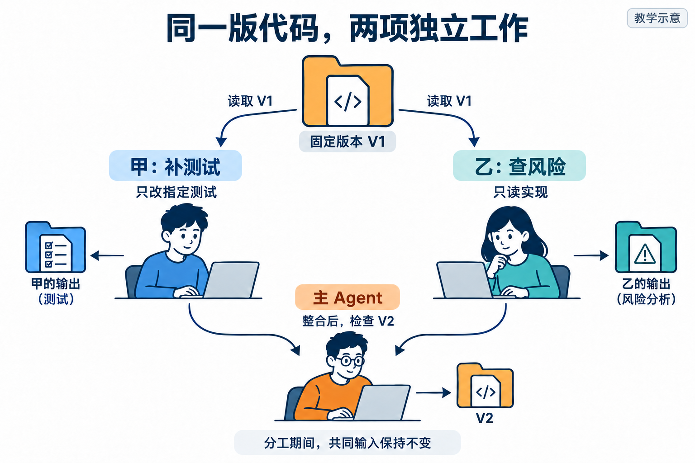

# L11｜用 Codex 原生 Subagents 并行处理独立任务

采购员提出补货 7 件。你已经能让 Codex 串行开发和复验，现在要把“补测试”和“查风险”交给两个子任务同时做，再由主 Agent 整合。**本讲学会判断什么能并行、怎样收回原始结果；FlowERP 的新增结果是一张不提前改变库存的采购申请。**

从上方固定 V1 沿左右两支读：甲只补指定测试，乙只读实现查风险；到下方汇合以后，主 Agent 才修改共同实现并检查 V2。图为教学示意。

先在 [L10](../L10/README.md) 学会控制一轮轮返工，再在本讲控制两条同时进行的支路；[L12](../L12/README.md) 继续解决汇合后怎样等人、打回和恢复。

## 按这条路线学习

1. [辅导资料](辅导资料.md)：从“申请保存了，库存却增加了”理解独立性、读写依赖和报告分歧。
2. [实践操作手册](实践操作手册.md#lesson-goals)：先做冲突与采购实验，再固定自己的候选，实际委托两个子任务并串行整合。
3. [提交模板](SUBMISSION.md)：保留分工前判断、子任务原始结果、分歧处理和最终同版复验。

**本讲动作线：**固定采购规则和实现 → 甲补测试、乙查风险 → 收回两份原始结果 → 主 Agent 串行修订 → 核对申请保存、库存不变和拒绝后无残留。

## 需要时再打开

- [当前课堂 PPT](L11-用Codex原生Subagents并行处理独立任务-主线自学版-29页-定稿.pptx)：本讲唯一当前课件。
- [按问题查阅的参考说明](reference/参考说明.md)：深入机制、实现边界及历史证据索引。
- [实验与辅助工具](examples/)：仅在手册对应步骤调用，保留原脚本和数据目录。
- [审查与复用 Skill](examples/skills/)：辅助反证与迁移，不能替代真实复验者的决定。
- [历史归档](reference/archive/)：旧行动卡、提示词、完整参考与旧课件，首次学习无需逐份阅读。

[课程总入口](../../README.md) · [上一讲](../L10/README.md) · [下一讲](../L12/README.md)
