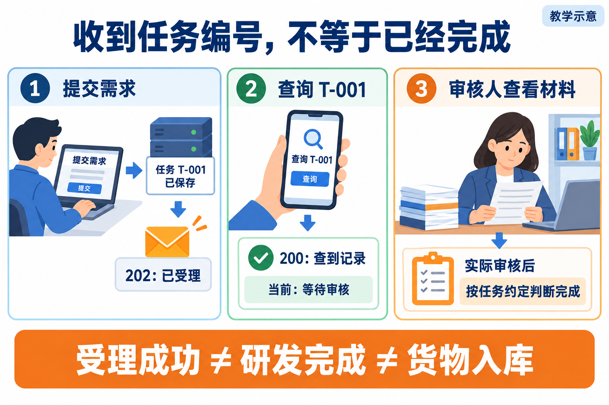

# L13｜把执行链路封装成任务 API

L12 已经规定了等待、打回和恢复。林舟离开终端后，仍想知道那次补货交付的 Spec、进度、失败原因和接受版本。**本讲新增两个最小入口：提交后拿到稳定 Task ID，凭原 ID 查询；服务真实重启后，完成记录仍能找回。**

沿三格依次看“保存并受理、查询原任务、审核当前材料”。202 是已受理，200 是查到记录；图中的 T-001 是示例，实践使用实际返回的 Task ID。图为教学示意。

本讲复用 [L12 的合法转移与人审规则](../L12/辅导资料.md)，把它们作为服务约束；[L14](../L14/README.md) 再把查询到的事实组织成页面上的下一步行动。

## 按这条路线学习

1. [辅导资料](辅导资料.md)：沿一次提交，读懂可靠编号、同键重试、失败查询和进程重启。
2. [实践操作手册](实践操作手册.md#lesson-goals)：先观察提交与查询，再真实重启；随后实现自己的两接口并核对补货结果。
3. [提交模板](SUBMISSION.md)：围绕原 Task ID 记录请求、事件、失败、重启后查询和实际人的决定。

**本讲动作线：**保存请求与受理事件 → 返回 Task ID → 查询原任务 → 同键重试或明确冲突 → 停旧服务、起新进程 → 凭原 ID 找回结果并核对采购事实。

## 需要时再打开

- [当前课堂 PPT](L13-把执行链路封装成任务API-图文案例版-30页.pptx)：本讲唯一当前课件，须向课程提供方单独领取，不随 Git 发布；领取并按此文件名存放后才能打开。
- [按问题查阅的参考说明](reference/参考说明.md)：深入机制、实现边界及历史证据索引。
- [实验与辅助工具](examples/)：仅在手册对应步骤调用，保留原脚本和数据目录。
- [审查与复用 Skill](examples/skills/)：辅助反证与迁移，不能替代真实复验者的决定。
- [历史归档](reference/archive/)：旧行动卡、提示词、完整参考与旧课件，首次学习无需逐份阅读。

[课程总入口](../../README.md) · [上一讲](../L12/README.md) · [下一讲](../L14/README.md)
