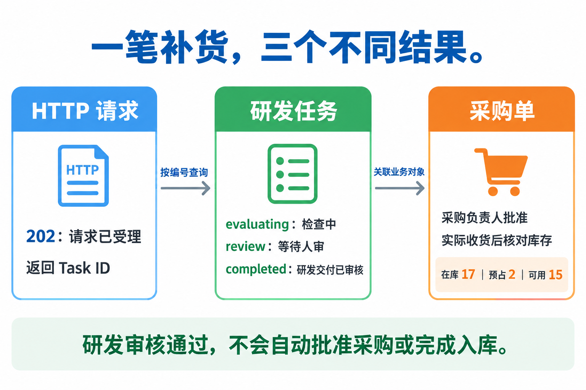
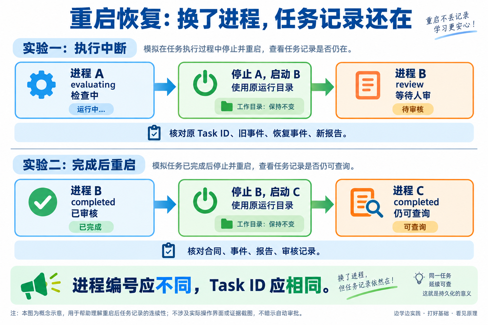

# L13｜把执行链路封装成任务 API

> **终端选择：**本手册同时提供 Windows PowerShell 与 macOS 默认终端 zsh 的操作。每一步只运行自己系统对应的代码块；标为“通用”的 Python、Git 命令两端相同。开始或重开终端时，先按[macOS 环境与路径约定](../../reference/实操手册执行与排错.md#macos-zsh)恢复本讲使用的虚拟环境，再核对当前源码位置。

本讲要做成一件事：**提交一项补货交付任务，拿到任务编号，以后用这个编号查进度、查失败、查结果；服务重启后仍能查到。**

你负责确定需求、判断结果和确认交付；Codex 帮你调查、实现、检查。工作台本讲增加任务提交与查询能力，FlowERP 则用真实补货结果检验这套能力是否有用。

按顺序操作：**准备记录 → 观察提交与查询 → 观察重启恢复 → 实现自己的接口 → 核对补货结果 → 交给同伴复验。** 前三个步骤使用参考程序，后三个步骤完成自己的作品。

<a id="lesson-goals"></a>

## 本讲目标与完成判断

`course-submit --execute-code` 从固定起始标签创建 Git Worktree；`course-prepare --source working-tree` 的当前源快照才组合独立 FlowERP 并写 `.course/product-source.json`。以本次 Task ID、返回候选路径、基线和实际模块路径核对；标签没有来源元数据时将客户来源与哈希标为待核对，不把目录名或元数据缺失单独当作候选无效。

由学生定义提交、重试、查询和完成语义，Codex 在受控候选实现两个接口，通过工作台组织补货交付。

| 建设对象 | 本讲目标与因果关系 |
|---|---|
| 工作台 | 提交后保留稳定 Task ID，异步执行、持久状态和失败查询可追溯，完成后真实服务重启仍能读取。 |
| FlowERP | 真实采购、批准、入库与流水支持补货结论；研发任务完成与业务收货分别核对。 |
| 学生证据 | 先保留个人判断；在真实失败、修订、复验与迁移中说明工作台改进怎样影响客户结果。 |

**交付前核对：**

- 区分 HTTP 请求、Task 与采购单，受理返回身份，长检查和人审分别留下证据。
- 验证同键重放、内容冲突、失败查询和非法状态拒绝，完成任务经真实重启 HTTP 查询仍保留。
- 真实候选、报告、具名交付审核与业务对账对应；verify 实验不冒充真实 Codex 新增功能。

**课程四项合同：**

- **核心内容**：任务模型、异步执行边界、状态机、持久化和最小权限。
- **演示结果**：提交任务后获得 ID，并查询 Spec、执行阶段和最终结果。
- **课内增量**：实现任务提交与状态查询两个最小接口。
- **通过标准**：状态只按合法路径变化；失败原因可查询；已完成任务在服务重启后仍可读取。


## 开始前：确定操作位置和记录位置

打开终端，进入你的 CodexFDE 控制仓库。下面是作者的路径；安装在别处时，替换这一行：

**Windows（PowerShell）：**

```powershell
cd D:\work\CodexFDE
```

**macOS（zsh）：**

```zsh
# L00 的默认位置；安装在别处时替换为自己的控制仓库绝对路径
cd "$HOME/work/CodexFDE"
```

本手册的命令使用项目自带的 Python，不需要先激活环境。先检查它能否读到本讲合同：

**Windows（PowerShell）：**

```powershell
.\.venv\Scripts\python.exe -X utf8 -m workbench.cli course-contract --lesson 13
```

**macOS（zsh）：**

```zsh
./.venv/bin/python -X utf8 -m workbench.cli course-contract --lesson 13
```

应该看到“把执行链路封装成任务 API”及其通过标准。如果找不到 Python 或模块，先按[执行与排错说明](../../reference/实操手册执行与排错.md)修复环境，再继续。macOS 同学直接运行每一步的 zsh 代码块，无需自行翻译。

打开[个人提交模板](SUBMISSION.md)，另存为自己的记录文件。下文写“填写”时，都填到这份个人文件；报告仍保留在程序返回的位置，记录里填写报告路径即可。

先认识四个词：

| 词 | 本次操作中是什么意思 |
|---|---|
| API | 程序之间提交请求、读取结果的入口 |
| Task ID | 工作台给一项研发任务分配的稳定编号 |
| Spec | 这项任务允许改什么、怎样才算完成的约定 |
| Eval | 自动检查程序是否符合要求 |

## 第 1 步：写下你认为会发生什么

<!-- step-guide-1 -->

**在哪里：**个人记录的“我的需求与首次判断”。现在先不运行实验。

用自己的话填下面四项，每项一两句即可：

1. 谁提出补货需求？遇到了重复提交、查不到进度，还是重启后无法接续？说明是实际观察、同伴试用或教学设置。
2. 提交后收到 `202`，你认为说明什么？检查通过进入 `review` 后，还需要谁决定？
3. 相同请求重复提交，要产生新任务吗？沿用同一个提交键却改了内容，应该怎样处理？
4. 程序执行到一半断了，重启后可以直接再执行一次吗？已经完成的任务又应该保留哪些记录？

“提交键”是调用方给一次提交设置的标记，用来识别通信重试。它与服务器返回的 Task ID 是两件事。



**读图方法：**从左往右看。左边的 `202` 只说明受理；中间的 `review` 表示等待研发审核，`completed` 表示研发交付已审核；右边还要核对采购审批和实际收货。Task ID 与采购单号通过业务引用关联，不是同一个编号。

**本步完成：**你保留了首次判断。暂时答错没有关系，后面用真实结果修订，不覆盖原答案。

## 第 2 步：运行一次“提交后再查询”实验

<!-- step-guide-2 -->

**在哪里：**刚才的控制仓库终端窗口。

### 2.1 运行参考程序

**Windows（PowerShell）：**

```powershell
.\.venv\Scripts\python.exe -X utf8 docs/courses/L13/examples/task_api_lab.py
```

**macOS（zsh）：**

```zsh
./.venv/bin/python -X utf8 docs/courses/L13/examples/task_api_lab.py
```

程序自己启动临时 HTTP 服务，提交请求、查询任务、运行真实课程 Eval，结束后关闭服务。等这个命令结束，再运行下一条实验命令。

正常结束时，终端显示 `verified: true` 和 `report` 路径。打开该路径对应的 `report.json`；默认在 `.tmp/l13-task-api-随机编号/` 下，每次运行都会新建目录。

这里的 `verified: true` 表示本次参考实验符合脚本断言。脚本没有执行 Codex，也没有创建真实采购单。

报告阅读方式见[辅导资料的请求—查询示例](辅导资料.md#把请求编号和查询放在一起读)。用自己响应里的真实 `task_id` 与 `status_url` 串起观察；示例编号不能填进个人证据，也不能把查询返回 200 当作任务已经完成。

### 2.2 报告很长，先只找这四项

在编辑器中搜索下表第一列。它们都位于 `observations` 内。

| 搜索字段 | 应该看到什么 | 说明什么 |
|---|---|---|
| `accepted_before_eval_finished` | `http` 为 `202`，`response` 内有 `task_id` | 长检查还没结束，调用方已拿到编号 |
| `running` | 同一任务的 `status` 为 `evaluating` | 可以用编号查看执行进度 |
| `same_key_same_body` | `task_id` 与第一次相同 | 同键、同内容重试没有新建任务 |
| `real_eval_waiting_review` | `status` 为 `review`；`result` 有非空检查结果；`reviewed_by` 未填写 | 自动检查通过，仍需人审核 |

把实际 Task ID、报告路径，以及一个与你首次判断不同的结果，填入个人记录的“接口、失败与恢复”。这里注明“参考实验”，自己的 Task ID 在第 4 步填写。

### 2.3 再看两个失败请求

- 搜索 `key_conflicts`：沿用同一键，分别修改需求 `request`、发起者 `actor`、业务引用 `business_refs`，应得到 `409`，表示提交内容冲突。
- 搜索 `missing_task`：查询不存在的任务，应得到 `404`，而不是一份空的成功结果。

**如果实验失败：**保留报错和本次目录。查看 `report.json` 中的 `error`，再读报错指向的日志或检查报告。未看到受理记录，先查服务启动与请求；已经有任务但检查失败，先查 Eval。不要修改报告里的 `verified`。默认目录难找时，在 `.tmp` 中按修改时间找本次 `l13-task-api-…` 目录。

**本步完成：**你能从自己的报告指出“先拿编号、再查进度、通过后等人审”三个时点，并解释重试与冲突的区别。

## 第 3 步：确认服务重启后还能读到原任务

<!-- step-guide-3 -->

**在哪里：**仍在控制仓库终端。下面两个命令依次运行。



图上面检查“中途断了能否接续”，下面检查“已经完成的记录会不会丢”。两次都要使用原运行目录：目录中保存着任务数据库和证据。换了新目录就不能证明原记录保留。

### 3.1 先观察执行中断

**Windows（PowerShell）：**

```powershell
.\.venv\Scripts\python.exe -X utf8 -m scripts.audit_task_recovery
```

**macOS（zsh）：**

```zsh
./.venv/bin/python -X utf8 -m scripts.audit_task_recovery
```

程序会暂停一次正在执行的检查，停止自己创建的子服务，再启动新进程恢复检查。它只处理本次实验的子进程。

打开终端返回的 `audit.json`，按顺序找：

| 字段 | 核对内容 |
|---|---|
| `accepted` | 原任务编号 |
| `before` | 中断前为 `evaluating` |
| `terminated_pid` | 被停止的服务进程；同时查看退出记录 |
| `after` | 同一任务、旧事件仍在、有恢复事件和新 Eval，最终为 `review`，未填写审核人 |

这说明参考程序的检查任务能够恢复到等待审核。`verify` 模式只做检查；修改代码、入库等有副作用的动作，必须先核对执行身份和实际结果，再决定是否重放。

### 3.2 再观察已经完成的任务

**Windows（PowerShell）：**

```powershell
.\.venv\Scripts\python.exe -X utf8 docs/courses/L13/examples/completed_restart_lab.py
```

**macOS（zsh）：**

```zsh
./.venv/bin/python -X utf8 docs/courses/L13/examples/completed_restart_lab.py
```

这个扩展实验包含三个服务进程：第一次中断，第二次恢复并完成教学审核，第三次在完成后重新启动。

打开这次返回的 `audit.json`，比较两组内容：

- `completed_before_restart` 与 `completed_after_restart`：完整任务响应应相同，包含原编号、合同、事件、报告和审核记录。
- `completed_service_exit` 与 `restarted_service`：服务进程编号应不同，旧进程已有退出记录。

**填写：**在个人记录的“接口、失败与恢复”中，写下两次报告路径、重启前后进程编号，以及你比较了哪些记录。实验中的审核姓名是教学字段，个人交付还要由实际审核者作决定。

**如果结果不符：**

| 现象 | 下一步 |
|---|---|
| 没有拿到 `202` | 查本次服务日志与提交请求 |
| 等待 `first-ready.json` 超时 | 子服务尚未就绪；保留报错中给出的运行目录与日志，先排查启动问题，再重试 |
| 恢复后为 `rework` | 打开实际失败报告，按失败原因处理 |
| 没有恢复事件或找不到原任务 | 核对是否使用原数据库、是否执行恢复入口 |
| 一直为 `evaluating` | 查旧进程是否退出，以及新进程后台错误 |

保留失败记录，不手工把状态改成 `completed`。

若清理子进程时又报超时，`audit.json` 可能还未写出。此时保留终端原始报错和已有日志；它们只能证明启动或清理失败，不能作为恢复成功的证据。

**本步完成：**你能分别解释两个实验验证了什么，并能指出“不同进程、同一 Task ID、原记录保留”的证据。

## 第 4 步：在自己的候选中实现两个接口

<!-- step-guide-4 -->

前三步帮助你认识链路。现在开始个人交付：让工作台组织 Codex 实现接口，并留下你的判断、修改和验证记录。

### 4.1 从工作台登记自己的需求

回到工作台首页 `http://127.0.0.1:8001/` 的“事项与决策”，登记第 1 步写下的补货交付需求。工作台未启动时，在控制仓库另开一个终端窗口运行：

**Windows（PowerShell）：**

```powershell
.\.venv\Scripts\python.exe -X utf8 -m workbench.cli serve-workbench
```

**macOS（zsh）：**

```zsh
./.venv/bin/python -X utf8 -m workbench.cli serve-workbench
```

保留该服务窗口。已有服务时直接使用原入口。记录本事项的真实任务编号、运行目录和工作台返回的隔离候选路径。

“隔离候选”是本次允许修改并等待验收的一份独立代码。后续实现应在该目录内进行。参考实验的 `.tmp/l13-task-api-…/` 只是报告目录，不能作为实现目录。

若事项尚未生成候选，先完成该事项的方案确认与执行准备；不要自行猜测候选路径。若当前接入只有 `verify`，它只能复验已有程序：记录这个限制，先让 Codex 根据本事项的授权和范围接通真实候选执行，再继续个人实现。

如果需要通过命令准备课程候选，在控制仓库运行下面命令。先将两个占位值替换为本事项真实 Task ID 和工作台原运行目录：

**Windows（PowerShell）：**

```powershell
.\.venv\Scripts\python.exe -X utf8 -m workbench.cli course-prepare --lesson 13 --task-id "本事项实际TaskID" --runtime-dir "工作台原运行目录"
```

**macOS（zsh）：**

```zsh
./.venv/bin/python -X utf8 -m workbench.cli course-prepare --lesson 13 --task-id "本事项实际TaskID" --runtime-dir "工作台原运行目录"
```

保存返回的 `path`，它就是本次候选目录。若准备失败，先处理输出中的基线或客户仓库问题；没有候选时不进入修改。准备目录本身不等于任务已执行，后面的实现、报告和审核仍须关联原事项。

### 4.2 把接口约定写清楚

在控制仓库查看本讲 Spec：

**Windows（PowerShell）：**

```powershell
.\.venv\Scripts\python.exe -X utf8 -m workbench.cli course-spec --lesson 13
```

**macOS（zsh）：**

```zsh
./.venv/bin/python -X utf8 -m workbench.cli course-spec --lesson 13
```

打开命令返回的文件。结合[需求与接口提示词](实践操作手册.md#prompt-design)，让 Codex 调查现有实现，由你确认下列约定，并保存本次 Spec 版本与路径：

<a id="prompt-design"></a>

### 本步给 Codex 的完整提示词：定义接口合同

先填入本次真实路径、任务、对象和允许范围，沿用已确认的授权；输出完成后按本步预期复核。

```text
我正在通过个人工作台组织 FlowERP 补货交付。请先读取我提供的业务问题、PRD、方案和本讲合同，再调查实际运行入口。不要把其他服务的同名路径当作当前接口。

本次需求、业务对象和证据路径：〈填写〉。

我的初步判断与疑问：〈填写〉。

请区分 HTTP 请求、Task 和采购单，列出每个对象的身份、状态和完成依据。说明当前 execution_mode 是否实际调用 Codex、是否会改变 ERP。提出提交与查询两个最小接口的合同，包含持久受理时点、提交键作用域、内容指纹、错误语义、状态边、身份和审核对象绑定、进程恢复策略。对未知项标记待查，不补造实现事实。

用一个正常案例和两个反例解释取舍，再把待我决定的业务含义列清。输出可供审查的小范围 Spec 草案，不将草案视为已批准的业务决定。
```


| 要确定的内容 | 至少写清楚什么 |
|---|---|
| 提交什么 | 补货需求、发起者、真实业务引用；哪些字段必填 |
| 何时返回 | 任务已可靠保存后返回 Task ID；不等待长检查结束 |
| 如何重试 | 提交键的有效范围；什么算同内容；冲突怎样拒绝 |
| 查询什么 | Spec、阶段、事件、当前失败、报告、等待谁决定 |
| 谁能决定 | 允许的状态变化；审核者与具体候选怎样绑定；过期候选怎样拒绝 |
| 中断怎么办 | 写任务、写文件、执行和存结果之间出错，怎样恢复或停下核对 |

把本次允许修改的文件也写进 Spec。上面的 `course-prepare` 默认从起始标签准备候选，`workbench/`、`flowerp/`、`eval/` 和 `tests/` 的版本与来源按实际基线、模块路径和可取得的记录核对；显式使用 `--source working-tree` 的当前源快照才组合两个当前仓库并写 `.course/product-source.json`。实验的 `.course/experiment-source.json` 不保证出现在标签候选中。所有允许路径均相对于候选目录。

### 4.3 让 Codex 实现，再由你核对

仍在控制仓库时保存解释器绝对路径，进入 4.1 返回且已经保存的候选 `path`，先核对模块来源。候选不一定自带 `.venv`：

**Windows（PowerShell）：**

```powershell
$l13Python = (Resolve-Path '.venv/Scripts/python.exe').Path
$l13Candidate = (Read-Host '粘贴原候选 path').Trim().Trim('"')
Set-Location -LiteralPath $l13Candidate -ErrorAction Stop
& $l13Python -X utf8 -c "from pathlib import Path; import workbench,eval.harness; root=Path.cwd().resolve(); print(root); print(workbench.__file__); print(eval.harness.__file__); assert Path(workbench.__file__).resolve().is_relative_to(root); assert Path(eval.harness.__file__).resolve().is_relative_to(root)"
$LASTEXITCODE
```

**macOS（zsh）：**

```zsh
enter_l13_candidate() {
  l13Python="$PWD/.venv/bin/python"
  [ -x "$l13Python" ] || return 1
  printf '粘贴原候选 path（不加引号）：\n'
  read -r l13Candidate || return 1
  cd "$l13Candidate" || return 1
  "$l13Python" -X utf8 -c 'from pathlib import Path; import workbench,eval.harness; root=Path.cwd().resolve(); print(root); print(workbench.__file__); print(eval.harness.__file__); assert Path(workbench.__file__).resolve().is_relative_to(root); assert Path(eval.harness.__file__).resolve().is_relative_to(root)'
}
enter_l13_candidate
```

退出 0、当前目录等于原候选且源码来自它后，在此启动 `codex`。提供个人 Spec 全文、绝对路径与版本，要求先回读目标、范围和验收，保存响应；再将下方[实现与验证提示词](实践操作手册.md#prompt-implement)填完整交给 Codex，先留起点检查再实施。新终端先回控制仓库恢复解释器，再进入原候选，不重建需求。后续运行候选检查也使用这个已保存解释器，并核对实际业务模块来源。

<a id="prompt-implement"></a>

### 本步给 Codex 的完整提示词：实现与验证

先填入本次真实路径、任务、对象和允许范围，沿用已确认的授权；输出完成后按本步预期复核。

```text
请按已确认的 Spec 在当前项目隔离候选中实现 L13 的两个最小接口。

Spec 与候选：〈填写〉。允许写入文件：〈填写〉。验收命令与预期：〈填写〉。

先运行起点验收，保留实际结果。如果已满足，不伪造红灯，请指出本次尚需建设的明确缺口。核对受理早于长检查完成、持久 Task ID、相同提交重放、冲突、失败查询、非法状态、报告通过后等待人审和真实进程重启后读取。

区分数据库事务、Spec 文件写入、执行副作用和事件保存。不要只靠状态字符串证明动作完成。真实执行器的授权和范围必须来自本次 Spec；若仅运行 verify，准确记录已有能力复验。实现后保留 Diff、原始报告和残留风险，准备供我审核的候选，不代填人的批准。
```


起点已满足时，记录实际情况，选择仍未满足的明确缺口；不要制造假失败。修改后，按下面顺序核对自己的接口：

| 验证动作 | 完成标志 |
|---|---|
| 提交任务，再按返回编号查询 | 长检查结束前已有编号；能读到合同、状态与事件 |
| 重发同键同内容，再改内容重发 | 前者仍为原任务，后者明确冲突 |
| 查询不存在的编号，制造一次合法范围内的检查失败 | 能区分“找不到任务”和“任务执行失败”，失败原因可查询 |
| 尝试非法状态变化或越权路径 | 请求被拒绝，状态没有偷偷变化 |
| 检查通过后读取任务，再由实际审核者决定 | 先停在 `review`；决定绑定本次候选和真实审核身份 |
| 同一候选出现竞争决定、或对过期候选审核 | 有明确拒绝或冲突结果，不覆盖已生效决定 |
| 完成后停止自己的服务，用原运行目录重启，再通过 HTTP 查询 | 原 Task ID 的合同、事件、报告和审核仍在 |

最后一项要记录两次真实进程和完整响应，不能只重新打开数据库对象。零用例通过也不能当作完成检查。

**填写：**在“我实际建设了什么”中记录起点版本、个人 Task ID、Spec、候选、允许文件、修改差异（Diff）、起点输出和复验报告；在“接口、失败与恢复”表中写实际结果与返回码。

**本步完成：**个人候选中确有范围内修改或明确的能力建设证据，且另一人能按记录重做接口验证。仅运行前三步参考脚本，还没有完成本步。

## 第 5 步：用真实采购与库存核对补货结果

<!-- step-guide-5 -->

**在哪里：**同一候选对应的独立 FlowERP 测试环境与业务库。使用该候选实际提供的业务入口操作；先确认连接的是哪份业务库。

本次验收使用一个固定例子：A 商品在库 10、预占 2，因此可用 8；一张采购单计划收货 7。若已有测试数据不符合起点，先准备独立测试账套，不覆盖其他业务记录。

### 5.1 关联真实单据

创建或读取实际采购单，记录商品号、采购单号和来源，再把真实引用关联到本次 Task。

参考脚本中的 `PURCHASE:ILLUSTRATIVE-ONLY` 只是占位文本。字段能保存下来，不表示采购单真实存在；要通过业务入口读到对应对象。

### 5.2 先预测，再按顺序操作

先把下表中的预期写进个人记录，再运行操作，填写实际采购状态与原始证据：

| 操作 | 应有结果 | 核对的业务数据 |
|---|---|---|
| 读取起点 | 尚未收货 | 在库 10、预占 2、可用 8；记录原流水数 |
| 未经采购批准就尝试收货 | 拒绝；采购状态不应被误改为已收货 | 库存仍为 10／2／8，流水不增加 |
| 由有权限的人批准采购，再实际收货 7 | 采购单变为已收货 | 在库 17、预占 2、可用 15；新增一条 +7 入库流水 |
| 用同一个入库幂等键重放刚才的收货 | 不重复入库 | 仍为 17／2／15，流水不再增加 |

入库幂等键标识的是“这一次收货”，与任务提交键分别记录。如果实现要求制单人与审批人分离，还要验证制单人自批被拒绝，且数据不变。

### 5.3 分别记录两个人的决定

在“真实业务与人的决定”中填：

- 研发审核：谁在什么时间接受了哪份候选、哪份检查报告。
- 采购审批：谁基于什么权限批准了哪张采购单，随后实际收货结果是什么。

`completed` 不能替代采购单的 `received`。工作台 Eval 通过，也不能替代业务库存与流水对账。

**如果对不上：**沿 Task 的业务引用找到原采购单，比较操作前后状态和流水。库存多加一次，查入库幂等键；批准前就能收货，查审批守卫；只有任务 completed 而没有收货记录，继续检查业务动作是否执行。保留失败、修订与再次验证。

**本步完成：**原 Task 能追溯到真实采购对象；任务审核、采购审批和实际库存各有证据，并能说明本次新增或修复了哪项 ERP 能力。

## 第 6 步：让同伴拿原编号复验，再迁移一次

<!-- step-guide-6 -->

把个人记录和原始证据路径交给同伴，使用[复验与交接提示词](实践操作手册.md#prompt-review)和[审查 Skill](examples/skills/task-api-review/SKILL.md)核对：

<a id="prompt-review"></a>

### 本步给 Codex 的完整提示词：复验与交接

先填入本次真实路径、任务、对象和允许范围，沿用已确认的授权；输出完成后按本步预期复核。

```text
请审查我的 L13 候选与原始证据，使用本讲 task-api-review Skill。

Task ID、候选、Spec、报告、重启记录与业务对账入口：〈填写〉。

分别判断受理、执行、复验、人审、采购审批和实际收货是否有证据。核对同键重放与冲突、失败后状态、事件保留、过期审核和完成任务真实重启后的读取。把教学姓名与真实人的决定分开，把重新打开存储与进程重启分开，把参考通过与个人实现分开。

用一个能推翻我现有结论的反例复核关键边界。按已验证、与合同冲突、证据缺失列出结果，每项指向原始材料。最后提出一条可迁移到库存查询需求的流程经验，包含来源、适用条件、版本和重新验证要求；不要声称已经发生后续采用。
```


1. 同伴能否从原 Task ID 找到合同、失败、事件、报告和审核？
2. 同键重试、内容冲突和真实重启是否符合约定？
3. 关联采购单、库存和流水是否与第 5 步记录一致？

记录同伴提出的具体反例、你的原判断和修订后复验。如果没有发现反例，写实际检查范围和结果，不编造被推翻的结论。

接着迁移到一项范围受控的库存查询需求：重新确定业务对象、可重试动作和完成标准，建立新 Task；记录采用了哪份经验、哪个流程版本，为什么适用，以及新任务实际验证结果。复用失败时，修订或停用原流程并注明原因。

**本讲完成标志：**用[本讲目标与完成判断](实践操作手册.md#lesson-goals)检查，并确认个人提交包含以下四组材料：

- 首次判断，以及参考实验中改变了你判断的真实结果。
- 个人任务、Spec、候选、修改与接口复验记录。
- 已完成任务的真实重启证据，以及采购、库存、流水和人的决定。
- 同伴反馈、修订与下一事项的采用和验证。

这些材料对应 CLO-6：你能设计、实现并迁移可协作、可恢复的任务接口。未完成项如实写明，参考程序的绿灯不能替代个人达成。

## 需要时再查：参考实验中的细节与限制

第一次操作不必逐项研究本节。自己的设计与参考程序不同，或需要解释报告时再查。

| 报告位置 | 当前参考行为 | 设计时需要考虑什么 |
|---|---|---|
| `key_conflicts` | 同键修改 request、actor、business_refs 均返回 409；冲突后 Spec 文件数可能增加，任务数不增加 | 当前键全局唯一，actor 在内容指纹内；数据库回滚不覆盖先前文件写入 |
| `event_version` | 事件增加，version 未变 | version 目前不覆盖每一种记录变化 |
| `code_mode_rejected` | 代码执行模式返回 400 | 这个参考提交入口只支持 verify，不能证明已经执行 Codex |
| `concurrent_reviews` | 两个竞争审核分别得到 200、400 | 这是当前状态守卫的实际响应；个人合同应明确竞争与过期处理 |
| `completed_reopened_store` | 重新打开存储后记录相同 | 只证明存储重读；真实进程重启要看第 3、4 步 |

个人实现修正行为后，按新合同更新实验预期并保留旧观察；不要为了让旧断言通过而保留已经确认的缺陷。更多原理见[辅导资料](辅导资料.md)，本手册两张图的生成提示词见[配图说明](assets/practice-imagegen-20260921/README.md)。
