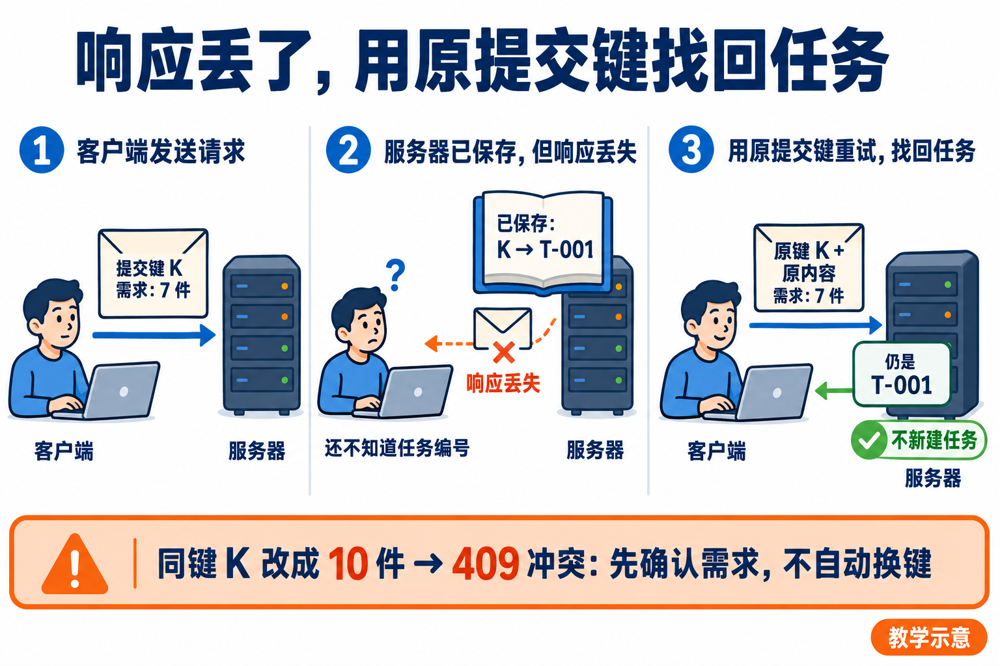
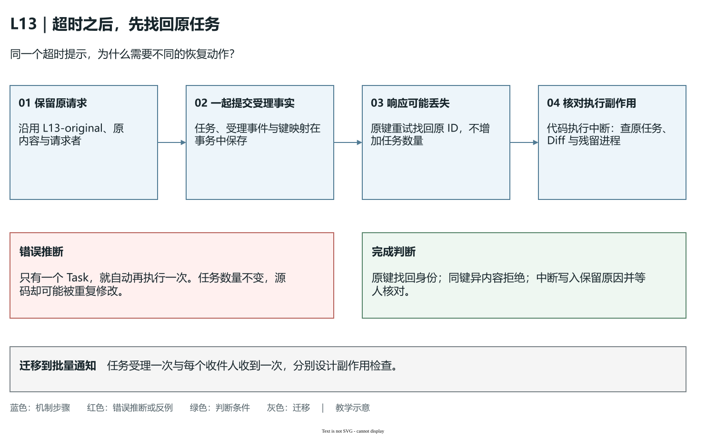

# L13｜把执行链路封装成任务 API

林舟在 L12 已经围绕采购补货组织过开发、复验和审核。现在她离开终端，过一会儿想继续查看那次交付：Spec（任务规格）是哪一份，Codex 做到哪里，检查为什么失败，后来接受的是哪个版本？如果答案只留在一段终端输出里，这项工作很难交给别人，也很难接到网页上。

本讲把这条执行链变成可以提交、查询和恢复的任务服务。API 是程序之间约定的入口：调用方按约定发送请求，服务按约定返回结果。我们只需要两个最小入口——提交任务、查询任务——但要让它们对“受理了什么、保存了什么、可以做什么”说真话。工作台因此能持续组织人与 Codex 协作；FlowERP 的采购与库存仍在独立客户项目中执行，不能因为任务服务返回成功，就认定客户业务已经成功。

下文沿用“复验采购审批与交付证据边界”的案例。`PR-TARGET`、任务编号和数量均为教学示例；实践时使用自己的真实采购单、原任务和运行目录。

## 1｜先问“哪件事成功了”，不要只看一个成功提示

设采购单 `PR-TARGET` 申请补货 7 件。交付前库存为 10 件，已预占 2 件，所以可用库存为 8 件。林舟要求系统保持原有规则：采购经过人工审批后才能收货，审批本身不能增加库存，同一次收货不能重复记账。

这项需求有三个不同的结果。工作台接收研发请求，说明它愿意组织一次交付；研发检查通过，说明指定候选在指定检查中满足规则；业务用户审批并实际收货，才产生 FlowERP 的业务结果。采购审批后仍是库存 10、预占 2、可用 8；合法收货一次后才是库存 17、预占 2、可用 15，账本应有一条对应的增加 7 件记录。

因此，“成功”必须带对象。HTTP 是浏览器与服务传递请求和响应的协议，它的 `202 Accepted` 状态码表示请求已受理，不能推断代码已经完成；查询返回 `200 OK` 表示记录查到了，记录可能还在执行或返工；任务的 `completed` 表示满足该任务的完成约定，仍应回查它所依据的候选、Eval 和具名决定。候选是本次准备检查与审核的具体代码版本；Eval 是可重复执行的检查，覆盖了哪些规则，要从报告读出来。


这样区分不是为了增加状态词，而是为了避免错误行动。林舟看到“受理成功”可以离开页面，不能据此通知采购人员收货；看到“检查通过、等待验收”，可以打开证据作判断，不能让页面替她署名。一个好接口应让下一步行动与已经获得的证据相匹配。

## 2｜一次任务，要有离开页面后仍能找回的身份

把任务理解为一张持续更新的交付记录，比把它理解为“一个后台线程”更准确。线程会结束，进程会退出；记录需要在这些事情发生后仍然回答问题。

这张记录至少要连起三种身份：需求或事项编号说明“为什么做”，任务编号说明“这次执行是哪一次”，业务引用说明“影响哪个客户对象”。例如某事项要求复验审批边界，它产生一个 Task，关联 `PURCHASE:PR-TARGET`。采购单编号不能替代任务编号：同一采购单可能经历首次执行、返工和另一项修复。任务编号也不能替代候选版本：同一任务返工后，新的代码与报告可能已经不同。

任务模型因而要保存原始请求、Spec、当前状态、执行模式、批准的写入范围，以及结果和失败原因。Spec 是事先写清目标、边界与通过条件的规格；它把“做好补货”收窄为可以检查的行为。事件记录则保存“谁在何时、凭什么让状态变化”。当前状态用于决定下一步，事件用于解释它怎样走到这里，两者都有用途。

字段不是越多越好。最小模型的判断方法是：删除某个字段后，接手者能否认错任务、认错版本、误判权限或丢失失败依据？若会，字段应保留；若只是重复一段日志，可先用报告引用表达。本讲的核心增量仍是两个入口，不需要先搭建完整调度平台。

## 3｜两个最小接口：先保存，再交回编号

### 为什么必须先保存任务

一次提交的可靠顺序是：校验请求与权限，分配或找回任务身份，把请求、初始状态和受理事件保存成功，然后返回编号，再由后台推进执行。这里的“保存成功”指持久化提交已经完成；持久化就是把事实写入进程退出后仍保留的介质，本项目使用 SQLite 数据库和关联文件证据。

如果先返回编号、随后才写数据库，恰好在两步之间停电，林舟手里会有一个查不到的任务。若先执行、结束后才保存，服务中断时又可能完全不知道 Codex 已经改了哪些文件。先保存使“服务接手了这件事”有一个明确的承诺点。

数据库事务把相关写入作为一组处理：都成功才提交，否则一起撤销。任务行与受理事件应处于同一个事务，避免出现“查得到任务却没有受理依据”或相反的情况。文件报告也需要明确路径与身份；数据库持久化不自动保证引用的文件完整。

### “异步”不是另外一种成功标准

异步执行指请求与耗时工作分开：HTTP 请求在受理后结束，后台继续生成 Spec、执行和检查。它解决的是等待与连接寿命问题，不降低完成标准。林舟不必保持浏览器一直打开，代价是服务必须提供可查询的状态、失败与结果。

本讲参考实验故意让真实课程 Eval 暂时等待：提交已返回 `202`，查询却仍显示 `evaluating`，即“正在检查”。这证明接口没有假装等到工作全部结束才返回。参考入口是复验模式；它不调用 Codex 修改客户代码，也不把受理操作变成采购审批。

### 把请求、编号和查询放在一起读

下面是与参考实验字段一致的示意，编号只是示例，真正观察应沿用响应中的原值。

```http
POST /api/v1/delivery/requests
Idempotency-Key: L13-original
Content-Type: application/json

{
  "lesson": 13,
  "request": "复验采购审批与交付证据边界",
  "actor": "student-example",
  "business_refs": ["PURCHASE:PR-TARGET"]
}
```

服务受理后返回 `202`，其中的 `task_id` 标识任务，`status_url` 指向它的查询入口。调用方随后请求 `GET /api/v1/tasks/{task_id}`。得到 `200` 和 `status: evaluating`，可推断“原任务存在、检查尚未结束”；得到 `status: review` 和通过的 Eval 报告，可推断“检查结果已经保存、等待人审”；得到 `404`，则需要核对编号与服务实例，不能改成查询一个无关的“最新任务”。

这是一个完整的输入到结果推演：原请求产生可靠身份，身份使下一次连接能找回同一记录，记录中的状态和证据决定人下一步应等待还是审核。返回一个随机编号很容易；保证它始终指向这件事，才是任务 API 的价值。

## 4｜提交超时后，先别换个编号再来一次

设服务已经保存任务，响应在途中丢失。浏览器提示超时，但后台仍然运行。林舟无法仅凭超时判断“提交没成功”。若每次重试都新建任务，两次任务可能同时执行，造成重复改动或重复检查。

幂等保护解决这个不确定性。幂等指对同一个意图重复发送请求，仍得到同一个受理结果。调用方在第一次提交前生成 `Idempotency-Key`，并把它与本次请求一起保留。服务把键与请求内容绑定：同键、同请求者、同内容、同业务引用，应找回原任务；同键但任一绑定内容改变，应返回冲突 `409`，让人说明这是重试还是新需求。



这个判断也必须在事务内完成。两个同时到达的相同请求，不能都“先查不到，再各建一个”；数据库唯一约束与事务需要共同守住只能受理一次的边界。前端禁用提交按钮只能减少误点，不能应对响应丢失、刷新或并发请求。

### 把中断放在不同位置，才能看清幂等保护的范围

继续使用 `L13-original` 和同一份请求。不要先问“超时要不要重试”，先在服务时间线上找中断点。下表是故障推演，不是已执行记录；它把调用方看到的同一个“超时”拆成不同的服务端事实。

| 中断位置 | 此时已经留下什么 | 恢复后应检查什么 |
|---|---|---|
| 事务提交前 | 本次任务、受理事件与键映射尚未一起提交 | 用原键与原内容重试，允许首次完成受理 |
| 提交后，响应到达前 | 原任务、事件与键映射已经保存 | 原键重试应返回原任务，任务总数不因重试增加 |
| Codex 写入后，执行结果保存前 | 受理记录存在，源码可能已经改变，执行结果不完整 | 查询原任务并核对残留进程、Diff 与证据；不能自动重新改代码 |

这里最容易误判的是第三行。提交键回答“这是不是同一研发请求”，没有回答“执行到哪一步、哪些写入已经生效”。即使数据库中只有一个 Task，同一 Task 也可能被错误地执行两次。要控制后者，还需要执行所有权、中断识别和恢复策略。本项目 [`TaskStore`](../../../workbench/task_store.py) 的 `create()` 在事务中绑定提交键与任务；`recover_automatic_tasks()` 则把中断的代码执行转为 `dead_letter`，记录需要人工核对的原因。这是两种不同职责。



**图 13-3　原键找回身份，恢复检查决定能否继续。**蓝色步骤沿原请求追到已保存任务和后续执行；红色反例指出“只有一个任务”仍可能重复写入；绿色判断要求查原记录并核对副作用。图为教学示意，[可编辑源图](assets/reading-depth-20261003/mechanism.drawio)保留相同文字。

检验时保持请求、提交键和请求者不变，分别观察任务数量、原 ID 和事件；再把请求内容改变而保留原键，预期是冲突拒绝，原任务不变。服务重启还要单独核对代码任务的停止原因，不能把“查回原 ID”算作安全接续通过。迁移到批量发送通知时也一样：任务受理一次、每个收件人收到一次，是两个不同的副作用边界，须分别设计检查。

### 任务只建一次，不代表收货只发生一次

研发提交幂等保护的是工作台任务。采购收货幂等保护的是 FlowERP 账本，两者处理不同副作用。即使研发任务只有一个，用户仍可能因收货响应丢失而再次点击收货。因此独立产品仍需自己的收货幂等约定：原键重试后，库存仍为 17，账本仍只有一条增加 7 件记录。

迁移这个设计时，先找出重复执行会影响什么，再决定键绑定什么内容、保存多久、冲突怎样解释。查询失败可以重试读取；修改订单、收货或改代码，必须先考虑此前的副作用是否已经发生。

## 5｜状态机把“可以继续做什么”变成受控规则

状态机是对合法状态及合法转换的约定。本项目任务的主要路径为：

```text
queued → spec_ready → executing → evaluating → review → completed
排队      规格就绪       执行中        检查中       待审核      已完成
```

检查失败可以进入 `rework`，即等待受控返工；返工后回到执行，再产生新的检查。无法继续的失败要保存原因。`dead_letter` 表示自动流程已经停止，需要人工核对，不能把它译成“稍后一定成功”。这些分支使失败成为能处理的记录，而不是一个永远转动的加载图标。

关键约束是不能跳过检查与审核。执行中不能直接写成 `completed`；旧报告通过也不能批准尚未检查的新候选。本项目 `TaskStore` 在事务中读取当前状态，检查转换是否合法，更新状态并写入转换事件。完成转换还检查通过的 Eval 结果和具名批准。两个审核请求并发到达时，后到的请求必须重新面对已变化的状态，不能把第二次签名覆盖成另一种历史。

状态合法与证据充分应一起设计。状态名只能表达阶段，报告、候选和决定说明为什么允许进入下一阶段。版本用来识别记录变化，也不能独自说明业务正确。教学脚本中的 `review-example-a` 是验证字段和并发约束的测试身份，不能填写为学生的真实审核者。

### 最小权限要落在动作上

最小权限指只给完成当前动作所需的能力。查询任务不需要修改源码；复验入口不应接受任意代码执行模式；允许 Codex 改批准的文件，不等于允许它修改阻断 Eval、采购数据或审核结论。业务审批与研发验收也要分开，因为一项决定授权的是收货，另一项决定接受的是代码候选。

客户端传来的名字是署名材料，不自动等于登录认证。服务端仍须检查运行模式、执行授权、项目和写集，写集就是批准修改的文件集合；不能因为请求写了一个“管理员”名字就放开所有动作。对本机教学服务，应如实说明已有控制的范围，不把它描述为完整的多租户权限系统。

### 保留历史失败，讲清当前处境

假设第一次 Eval 因“审批后库存被错误增加”失败，Codex 修复后新检查通过。查询应保留第一次报告及返工事件，同时指明当前候选已通过、仍待审核。否则接手者无法知道修复了什么；但若把旧失败显示为当前错误，又会误导人重复返工。历史记录和当前结论需要在查询结果中各有明确归属。

## 6｜重启后可读，与中断后可安全接续，有不同条件

完成任务在服务重启后仍可查询，是本讲必须达到的边界。验证要真正结束旧进程，再以新进程和同一个运行目录启动，凭原 ID 读取完成状态、结果与事件。刷新页面只是建立了新连接，不能证明进程内存之外已有持久化。

未完成任务的恢复更难。纯复验若没有业务写入，核对输入与报告身份后可按既定恢复策略重新检查；Codex 已部分修改源码却尚未保存完整结果时，自动再次执行可能重复改动。此时应停入需要人工核对的状态，先查工作区、Diff（源码改动差异）和事件，再决定续接、返工或建立新的授权。`rework` 也不是无限自动重试的许可，修复次数和预算仍要有上限。

具体失败路径可以这样读：任务在 `executing` 时进程中断；新服务发现它是可能写入源码的任务，保存中断原因并停止自动重放；林舟比较批准写集与现有 Diff；若决定返工，重新明确候选与范围后再执行。最后的查询要能解释“为何停住、已有何种改动、谁批准继续”。可靠恢复允许安全停下，而不是要求每次中断都自动成功。

参考的[HTTP 实验](examples/task_api_lab.py)、[完成后重启实验](examples/completed_restart_lab.py)与实践手册的进程恢复检查分别验证不同条件。它们可以证明机制，不替代学生自己的接口改动、客户业务结果或具名验收。

### 可靠身份只是起点：观测与控制必须分开

原 Task 能被查回以后，还需要一个设计原则：**观测与控制分离**。观测回答“已经发生什么、当前依据是什么”，控制决定“现在允许推进什么”。查询页可以持续读取原任务，但查询本身不应开始下一次编码、批准候选或触发采购收货。否则浏览器轮询、网络重试甚至别人打开链接，都可能成为一次没有明确授权的行动。

这条分离使接口可以安心重复读取。参考 [`TaskStore.get()`](../../../workbench/task_store.py)读取任务、结果与事件；状态变化由 `transition()`、具名决定由 `review()`承担。看到 `review` 可以提示打开报告，不能在查询处理时替人调用批准。API 可以给出下一步建议，真正推进仍要通过相应动作入口，由服务检查当前状态和权限。界面知道任务编号，只获得找到记录的办法，不会因此获得改变它的全部能力。

沿采购案例，林舟查到研发任务已经完成，采购人员却还没有批准 `PR-TARGET`。这两项事实并不冲突：研发完成说明采购功能的候选满足自己的完成约定，业务批准说明某张采购单现在允许进入后续业务阶段。工作台中的审核人和客户系统中的审批人，各自针对不同对象作决定。即使姓名相同，两份决定仍要分别保存对象、依据与动作，不能让一个“approve”字段同时承担两种授权。


**图 13-4　引用连起两条路径，状态仍各有归属。**这是教学示意。先沿上方追原 Task、候选与具名接受，再沿下方追采购单、批准、收货和业务账；业务引用帮助找到对应对象，不能把两条路径压成一个完成状态。

读图时尝试一条错误捷径：“上方完成，所以直接把下方改为已收货。”缺少的是采购批准和实际入库依据。再尝试另一条：“下方收货成功，所以这次研发改动可以接受。”客户账正确仍不能证明候选没有越界、失败路径正确或报告属于当前版本。两条路径可以互相提供核查线索，但不能互相替代各自的完成证据。

失败定位也因此更明确。原 ID 查不到，先核对服务实例、运行目录与持久化；任务存在但报告缺失，查研发执行记录；任务已接受而客户账未变化，先查采购是否批准与收货是否发生。不要为解决查询失败重新提交一个无关任务，也不要因客户业务尚未推进就把真实完成的研发历史改成失败。

完成判断要能从一次提交追到原任务，再从查询追到候选、检查和决定，并说明读取没有偷偷推进执行或业务。迁移到耗时导出，可以复用稳定身份与观测入口；“文件生成完成”和“文件已经发送给客户”仍是不同结果。先找出每个结果由哪个系统保存、哪个动作产生，才能决定哪些状态需要展示，哪些控制必须单独授权。

## 7｜把任务接口接回一项真实交付

掌握本讲后，林舟不再依赖记忆去回答“那次补货交付怎样了”。她从事项找到原 Task，从 Task 找到 Spec、候选和报告，从具名决定知道哪一版被接受，再到独立 FlowERP 核对采购单与账本。工作台保存研发事实，客户系统保存业务事实，业务引用把两者连起来。

本讲独立实践从自己的真实起点出发。如果参考版本已有正确的提交与查询能力，就调查另一个真实缺口，不删除正确代码制造失败。由你确定合同与边界，Codex 协助实现两个最小接口，工作台组织检查与返工，同伴凭原编号独立核对。完成判断不只看一个绿灯，还要尝试同键重试、非法迁移、错误编号和真实服务重启。

将同一方法迁移到耗时导出时，身份仍然有用：导出任务与订单不是同一对象，文件生成完成与任务受理不是同一结果，重复生成与重复发送文件可能又是不同副作用。能解释这些区别，再决定哪些字段与恢复策略可以沿用，哪些必须重新设计。L14 将在这些可靠事实之上组织页面。

## 本讲合同（与课程大纲一致）

本讲对应 CLO-6：服务化交付能力。具体动作见[实践操作手册](实践操作手册.md)，用[本讲目标与完成判断](实践操作手册.md#lesson-goals)核对，用[提交模板](SUBMISSION.md)保留首次判断、失败、修订和真实决定。历史实现观察见[参考详解](reference/参考说明.md)，不能充当本次运行结果。本文配图为教学示意，提示词保留于[受理不等于完成](assets/reading-figures-v2/01-accepted-not-done.prompt.md)与[同键找回任务](assets/reading-figures-v2/02-retry-same-key.prompt.md)。

- **核心内容**：任务模型、异步执行边界、状态机、持久化和最小权限。
- **演示结果**：提交任务后获得 ID，并查询 Spec、执行阶段和最终结果。
- **课内增量**：实现任务提交与状态查询两个最小接口。
- **通过标准**：状态只按合法路径变化；失败原因可查询；已完成任务在服务重启后仍可读取。
