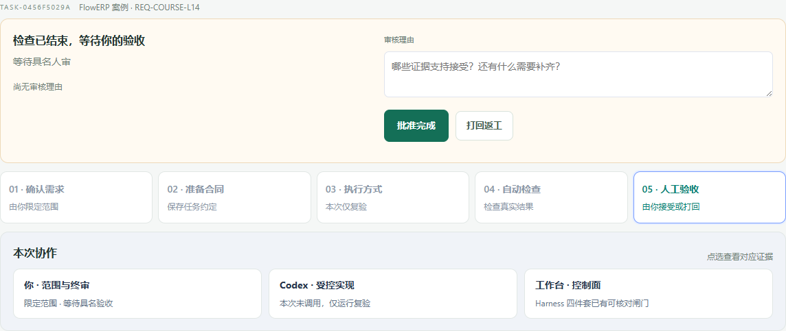
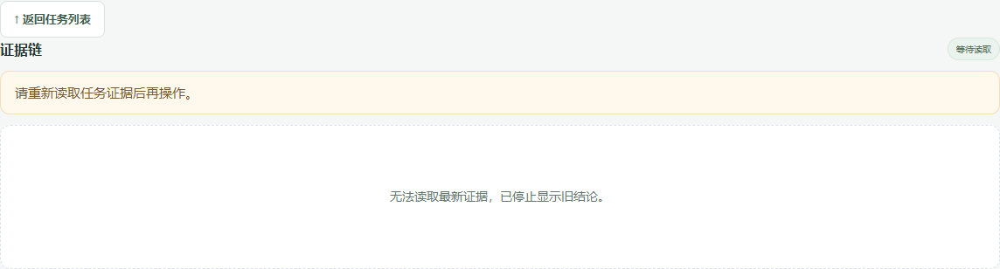
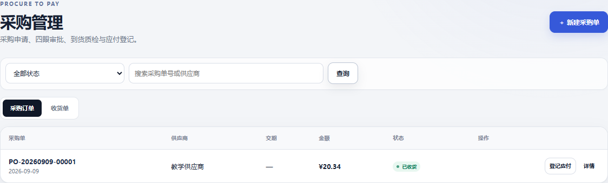
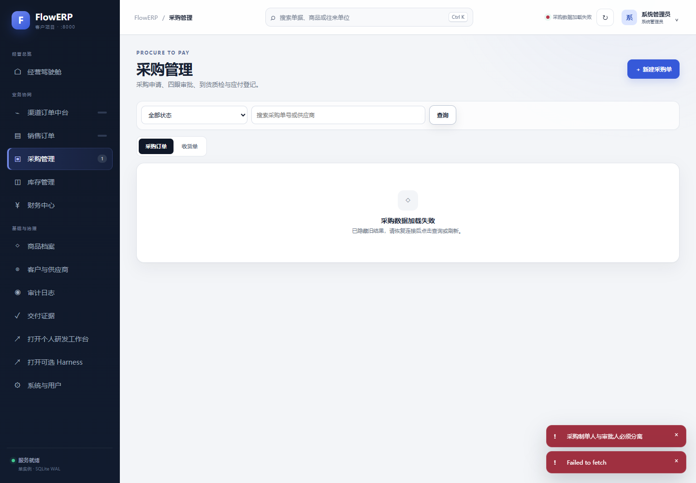

# L14｜参考实测与历史任务

首次操作按[实践手册](../实践操作手册.md)继续同一个原事项、本人 Task 和采购单。本页集中保留已有参考观察与原始证据链接，帮助按需辨认不同系统和产物。这里的编号、账套、数量与结果不作为学生本人的记录；本次整理没有重跑这些历史实验。

## 参考观察：课程复验任务

前面的首页实验观察事项列表；这一步观察“交付记录”中的 Task 详情。两者读取逻辑不同，结果分别记录。打开交付记录，在任务列表标题旁点击“＋”，选择 L14，确认本次为复验，填写“检查页面状态与后端一致，查看失败与结果依据。”提交后记录实际 Task ID，不照抄讲师编号。

等待复验结束，再打开该任务。先写下自己的判断：哪个环节已经结束、谁尚未决定、是否有实际代码改动。随后打开“核验证据”，展开实际检查项目，与第一次判断对照。

图 1：参考运行只有复验，Codex 未调用；三个检查通过后仍待审核。这里只用于练习解释页面，不替代第 4 步的个人实现。课程复验不会自动关联此前保存的事项，自己的研发交付应从原事项继续。

在浏览器开发者工具的 Network 面板选择 Offline，点击工作台刷新。记录旧报告和审核按钮是否还可见；恢复为 No throttling，再刷新原任务。保持原服务与运行目录，不重新提交任务。

图 2：参考实验中旧结论和审核入口隐藏，恢复后仍是同一 Task，任务总数未增加。对照自己的结果，分别写“观察到什么”和“这支持哪项判断”。实验完成后恢复浏览器联网，避免把后续网络错误误判为产品缺陷。

在 Network 面板核对该 Task 的查询响应。若只执行 verify，尝试对应补丁地址应得到明确的无产物响应；参考结果是 HTTP 400、“本任务尚未生成交付补丁”。这一步验证失败提示，不能用它代替第 6 步正常产物的下载检查。

## 参考观察：采购账套与历史页面修复

参考账套使用 `L14-DEMO`，初始库存 0，采购 3 件。制单账号在原生页面点击审批并确认后收到“采购制单人与审批人必须分离”；另一教学账号审批并完成收货过账后，库存才变为 3。不要把本例数值与讲义另一组手算预期相混。

记录自己的单据 ID、收货 ID、API 状态、SQLite 状态与目标流水数。参考运行重放同一入库身份后只有一条流水；两个测试账号由脚本驱动，不替代你的实际同伴复验。

再对采购列表做 Offline → 查询 → 恢复网络 → 查询。原参考版本离线时仍保留“数据已同步”、旧状态和审批按钮；后续修复已隐藏旧结果与审批入口，并明确显示加载失败。按自己的实际版本观察，不能把历史失败写成当前仍有的问题，也不能用参考修复代替本人实现。

操作对照｜先加载一张待审批单据，再断网查询；应看到“采购数据加载失败”，不再出现旧审批按钮。保留搜索条件，恢复网络并重新查询，核对仍是原采购单。另让一个旧请求晚于新请求返回，验证它不能覆盖当前结果。参考修复的两项新检查先失败后通过，浏览器也完成恢复、收货与导出；完整说明见[采购查询失败修复](../examples/采购查询失败修复.md)。本次为当前会话直接实现，没有独立人审，自己的事项仍需补齐授权、候选与复验记录。

## 参考观察：补丁与库存 CSV

参考观察：历史库存筛选任务TASK-402AD958DB经现有HTTP处理器返回200、18,992字节，下载摘要与事件一致，补丁只包含批准的四个文件。但任务仍待审核，审核人为空。该观察使用只读任务快照，没有经过原页面点击，不能替代自己的操作。完整条件见[补丁下载与任务回查](../examples/补丁下载与任务回查.md)。

在客户项目另行下载库存 CSV，按 SKU 核对在库、预占与可用量。讲师本机历史记录 `inventory.csv` 保留了 L14-DEMO 的 3 / 0 / 3，不随 Git 发布。学生沿[当前实践手册](../实践操作手册.md#lesson-goals)在本人隔离目录保存自己的库存导出与核对记录。库存 CSV 只能证明业务数据导出，不能替代原 Task 的候选补丁。
