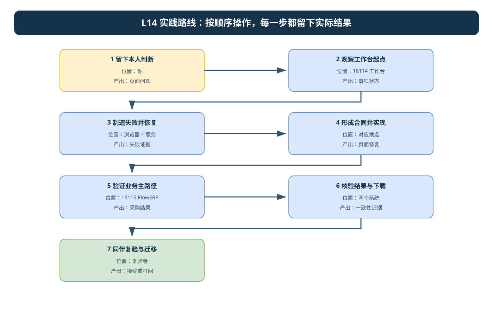
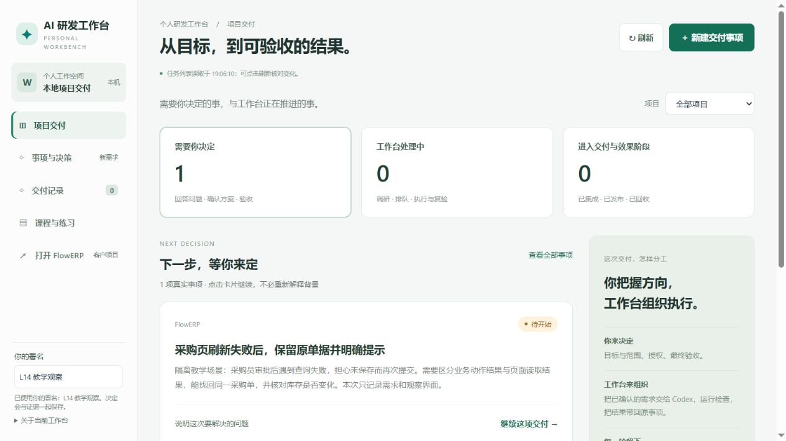
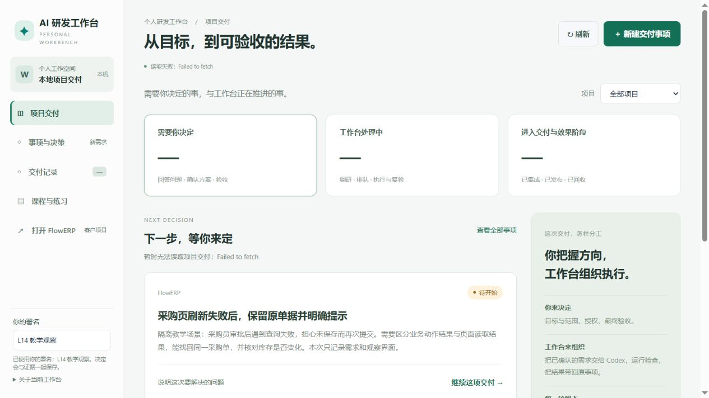
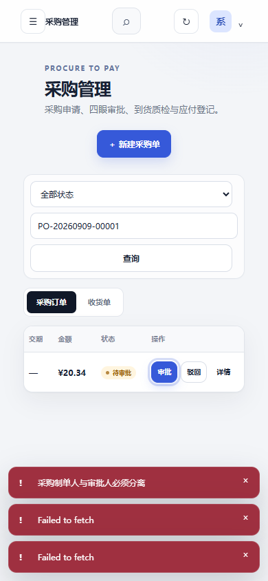

# L14｜让交付状态在 Web 面板可见

> **终端选择：**本手册同时提供 Windows PowerShell 与 macOS 默认终端 zsh 的操作。每一步只运行自己系统对应的代码块；标为“通用”的 Python、Git 命令两端相同。开始或重开终端时，先按[macOS 环境与路径约定](../../reference/实操手册执行与排错.md#macos-zsh)恢复本讲使用的虚拟环境，再核对当前源码位置。

本次实践以“采购页查询失败后的恢复”为主线。先观察参考工作台怎样展示真实事项，再由自己定义并实现一处页面缺口，最后通过实际采购操作和同伴复验检验改动。参考系统已有功能不等于自己的新增能力；起点已正确时，记录事实并选择另一个明确缺口。

先用 18114 控制工作台组织需求与审核，再从实际 Task 找到修复候选。客户候选用 18115 和全新业务目录预览；若修复工作台页面，再用 18116 和另一新目录预览工作台候选。后续“重新启动”表示先停止本人原服务再沿用该目录启动。首次业务初始化和角色准备完成后，才验证采购路径。

开始操作前，遇到解释器、路径或输出问题，按[执行与排错说明](../../reference/实操手册执行与排错.md)核对。

### 本讲目录与终端地图

```text
〈CodexFDE 控制仓库〉/               ← 终端 A：18114，保存原事项与人审
├─ .venv/                           ← 控制解释器
└─ .runtime/l14-workbench/           ← 原工作台数据与候选证据

〈Task 的客户候选〉/                ← 终端 B：18115，直接加载修复后的 flowerp 与 web
〈Task 的工作台候选〉/              ← 终端 C：18116，仅在工作台页面有改动时启动
〈项目登记的原源码库〉/             ← 集成前没有自动获得候选修复

每个预览使用自己的新数据目录；18114 仍承担原事项的授权、返工和审核。
```

页面改动属于哪个项目，就在对应源码候选中实施：工作台页面用工作台候选，客户采购页面用 FlowERP 候选。运行数据库只用于本轮观察，不复制进源码或提交材料。

<a id="lesson-goals"></a>

## 本讲目标与完成判断

学生确定状态含义和业务预期，Codex 调查并实施一条页面主路径，工作台保存授权、候选、复验和审核。

| 建设对象 | 本讲目标与因果关系 |
|---|---|
| 工作台 | 状态投影、失败恢复与证据下钻帮助使用者作出正确决定，数据来自真实后端并保持双系统边界。 |
| FlowERP | 交付真实 ERP 操作页或可复现修复，用同一采购对象核对动作、拒绝、恢复与业务结果。 |
| 学生证据 | 先保留个人判断；在真实失败、修订、复验与迁移中说明工作台改进怎样影响客户结果。 |

**交付前核对：**

- 同一事项、Task 和业务对象分别可查，DOM、API、SQLite 与 ERP 规则一致。
- 读取失败、提交结果未知和业务拒绝有明确处理；恢复不重复执行原业务操作。
- 产物绑定候选与 Task，桌面、键盘和窄屏由同伴实做复验，前端与仓库不含凭据。

**课程四项合同：**

- **核心内容**：面板信息层级、轮询或推送、失败重试、结果下载和密钥边界。
- **演示结果**：从 Web 提交需求并查看阶段状态、Eval 报告和产出文件。
- **课内增量**：完成只覆盖一个任务主路径的最小面板。
- **通过标准**：状态与后端一致；失败路径明确；结果可追踪；前端和仓库中没有密钥。


## 先看流程图，再开始操作



18114 是控制工作台，18115 是本轮 FlowERP 候选；工作台候选预览另用 18116。先判断问题属于哪个系统，再进入对应候选实现，最后按同一 Task 核对结果。可编辑源文件：[l14-practice-flow.drawio](assets/l14-practice-flow.drawio)。

## 第 1 步：先留下自己的判断

<!-- step-guide-1 -->
> **一句话说明：**先写下页面应该帮助谁完成什么操作，以及页面最容易显示哪些旧数据或假绿灯。

开始本讲 FDE 实践时，先在[提交模板](SUBMISSION.md)的首次判断与需求记录回答：采购页面在哪一步让使用者误判，影响什么操作，为什么优先修复这一处状态或恢复路径？注明来源是实际观察、同伴试用还是教学设置，写下本次选择和暂缓范围，再请 Codex 协助调查。

辅导资料 §1～5 后，独立回答：查询返回 200 是否表示任务完成；审批之后库存不变是否一定出错；断网时旧卡片还能支持哪些决定；提交超时后能否换一个键重发。先保存答案，再请 Codex 评议，保留前后差异。

本讲允许改动范围为 `web/`、`workbench/`、`workbench_web/`、`tests/`。提交前再根据需求缩小范围，避免为了修复一处错误提示而重构整个业务服务。ERP 增量是一条真实操作页主路径或其真实修复，工作台增量是同一需求的可信状态、证据下钻与恢复路径。

## 2. 在隔离工作台观察完整起点

<!-- step-guide-2 -->
> **一句话说明：**在隔离工作台中从事项入口走到任务、报告和审核，认清页面当前已经贯通的链路。

在仓库根目录打开终端（Windows PowerShell / macOS zsh）。按课程环境要求激活本项目虚拟环境。以下端口专用于练习，运行目录专用于本次观察；如果已经被使用，先核对服务归属，选择另一个空闲端口和新目录。

**Windows（PowerShell）：**

```powershell
.\.venv\Scripts\Activate.ps1
python -X utf8 -m workbench.cli serve-workbench --port 18114 --runtime-dir .runtime/l14-workbench --erp-url http://127.0.0.1:18115
```

**macOS（zsh）：**

```zsh
source .venv/bin/activate
python -X utf8 -m workbench.cli serve-workbench --port 18114 --runtime-dir .runtime/l14-workbench --erp-url http://127.0.0.1:18115
```

打开 `http://127.0.0.1:18114/`。本命令未开启代码执行，适合观察空态与保存事项。进入“事项与决策”，选择“记录新事项”，填写自己的署名、所属项目和现场问题，保存。观察标题、阶段、下一步和结果区。

首次使用新运行目录时，原 L04 的项目、事项不会自动搬来。若“所属项目”中没有目标项目，先回首页“＋ 添加项目”，以本地文件夹方式登记实际源码路径；采购页面问题选择独立 FlowERP，工作台页面问题选择自己的工作台项目。若保存时报“事项没有项目归属”，先选定已登记项目再保存，不把空项目当成后续任务已创建。

服务终端持续运行是正常状态；以下查询和检查另开操作终端，在同一控制仓库根目录重新激活 `.venv` 并核对 `sys.executable`。每个新终端独立选择解释器，不沿用另一个窗口的激活状态。

可采用以下教学输入，再改成自己的真实问题：采购员审批后遇到查询失败，无法判断是否保存；需要重新读取同一采购单，明确查询失败，不通过新建单据完成恢复。这个输入是待验证的问题，不预先宣布当前系统一定存在该故障。



参考图来自隔离运行：事项保存后，首页“需要你决定”变为 1，卡片可继续打开。它证明的是保存与展示，不是实现、测试或发布。

在浏览器开发者工具的网络记录中，找到保存事项及随后查询事项的响应，记录 `INIT-...`。不要用截图标题代替对象 ID。然后在另一个终端运行只读对照工具，将示例 ID 改为自己的实际 ID：

**Windows / macOS 通用：**

```text
python -X utf8 docs/courses/L14/examples/read_initiative.py --base-url http://127.0.0.1:18114 --runtime-dir .runtime/l14-workbench --initiative-id INIT-替换为实际编号
```

工具只读取本机接口和以只读方式打开的 SQLite，比较事项 ID、标题、状态、版本和关联 Task。若 `linked_task_id` 为空，说明此字段没有任务关联；不能写成 Task 已成功。该工具不自动核验屏幕、ERP、下载和人审。

如果提示没有数据库，优先核对运行目录。若接口成功而数据库找不到对象，可能读了另一套库。工具对本机请求明确不使用代理，避免把本机服务误判为代理网关故障。

## 3. 做一次真实失败与恢复观察

<!-- step-guide-3 -->
> **一句话说明：**制造一次真实服务失败，观察页面是否明确显示失败，并在服务恢复后重新取得当前结果。

保持页面打开，在自己启动服务的终端按 Ctrl+C 停止该隔离服务。点击页面刷新，等本次读取结束，记录错误文字、统计、卡片、证据和动作。不要停止不属于本练习的服务。



参考观察中，统计变为“—”，读取错误出现，但旧事项卡片仍保留。请分别写出“实际观察”和“自己的判断”：保留的卡片是否明确表示旧数据；哪些动作应等待恢复；页面是否让用户误以为当前在线。不能因为出现错误字样就宣布所有失败状态合格。

用第 2 步同一命令、同一运行目录恢复服务，再刷新页面。核对原事项 ID、版本与内容是否仍在，重新运行只读对照工具。若改用新目录，看到空页面不属于成功恢复原数据。

乱序与未知状态属于另两种实验。使用项目已有受控测试或在自己的隔离测试中人为控制响应顺序、枚举与字段类型；明确标注注入条件，不能修改真实业务库制造历史。记录先发后到、对象切换和错误后的动作状态。

继续使用第 2 步保存的原事项，在下一步形成自己的修复需求。需要辨认课程复验、旧报告或无产物响应时，再查[参考实测与历史任务](reference/L14-参考实测与历史任务.md#参考观察课程复验任务)。

## 4. 从观察形成自己的页面合同并实现

<a id="prompt-design"></a>

### 本步给 Codex 的完整提示词：观察与定义

先填入本次真实路径、任务、对象和允许范围，沿用已确认的授权；输出完成后按本步预期复核。

```text
请阅读我提供的采购查询失败记录和当前页面实现。区分 DOM 实际观察、接口事实、持久事实和我的推测。说明当前有哪些能力已满足、有哪些可复现缺口。先给出一条范围受控的状态与动作合同，覆盖对象身份、新鲜度、读取失败、提交结果未知、业务拒绝和恢复。不要把截图中的保存事项说成已经调用 Codex。
```


<!-- step-guide-4 -->
> **一句话说明：**把观察到的问题写成页面合同，在对应候选中实现，并保存 DOM、API 和数据来源证据。

选定一处已证实缺口，例如采购查询失败后旧内容没有标明新鲜度，或某动作仅靠页面禁用、后端未验证业务前提。提交自己的状态文案表，至少写出事实、文案、负责人、允许动作、失败后保留对象以及验收方式。

需求仍从原事项继续。补齐问题、证据、目标和验收标准，先让 Codex 调研当前代码，再确认产品需求与技术方案。真实执行阶段需要已完成课程执行器配置；使用原运行目录重新启动服务，并明确启用执行能力：

**Windows / macOS 通用：**

```text
python -X utf8 -m workbench.cli serve-workbench --port 18114 --runtime-dir .runtime/l14-workbench --erp-url http://127.0.0.1:18115 --enable-code-execution
```

这个选项只让服务提供执行能力，不能替代事项内的目标确认和执行授权。逐项核对页面提出的范围、检查计划和审核者，再在该事项内发起实际执行。记录产生的 Task ID、项目登记的原目录、实际调用、Diff 和报告；第 5 步再从交付事件取得真正的候选目录。仅保存需求、执行 verify 或展示参考截图，不构成新增页面交付。

跟跑构造合同与工作区的规则见课程入口；本讲不要用课程终态绿灯替换个人实现。已存在功能可通过新的真实缺口形成修复，但不能无意义删掉正确代码制造红灯。未完成真实执行条件时，保留观察结果，并如实将个人实现标为未完成。


<a id="prompt-implement"></a>

### 本步给 Codex 的完整提示词：实现与验证

先填入本次真实路径、任务、对象和允许范围，沿用已确认的授权；输出完成后按本步预期复核。

```text
练习输入可以选用讲义中的两处实际差异：课程 Task 详情断网后隐藏旧报告，而采购列表断网后仍显示“数据已同步”及旧审批入口。先在自己的运行中复现，记录原对象和失败条件，再决定修复范围。参考记录中的缺口不等于当前版本必然仍有同样问题。

依据当前事项已确认的 PRD、技术方案和允许写集，实现这条页面主路径。先核对真实起点，保留原失败。页面从实际 API 读取状态；区分请求序号与对象版本；失败后明确哪些旧信息还能参考，哪些动作必须关闭。复用现有业务规则，提供正常、拒绝、乱序或对象切换的验证证据。记录实际 Diff、Task、报告与产物；未实现项如实说明。
```

<a id="candidate-business-preview"></a>

## 5. 从修复候选验证业务路径

<!-- step-guide-5 -->
> **一句话说明：**先确认服务加载本次 Task 的候选，再实际完成采购操作，核对页面、API 与业务状态。

### 5.1 找到实际候选，分清三个位置

**位置与用途：**另开操作终端，回 CodexFDE 控制仓库、激活其 `.venv`。在原工作台运行目录查询本次 Task：

**Windows（PowerShell）：**

```powershell
$l14Task = Read-Host '本次实际 Task ID'
python -X utf8 -m workbench.cli task-show $l14Task --runtime-dir .runtime/l14-workbench
$LASTEXITCODE
```

**macOS（zsh）：**

```zsh
printf '本次实际 Task ID：\n'; read -r l14Task
python -X utf8 -m workbench.cli task-show "$l14Task" --runtime-dir .runtime/l14-workbench
printf '查询退出码：%s\n' "$?"
```

**预期与失败处理：**在 Task 的 `events` 中找到“日常研发交付包已保存”，取其 `evidence.workspace`，同时保存补丁路径与指纹；创建事件的 `evidence.path` 可辅助核对。首页原事项的候选位置应相同。没有交付包或任务仍失败时，先沿原任务返工，不能任选目录补成新候选。`task-show` 退出码也反映任务状态，须读正文判断。

| 位置 | 本步怎样使用 |
|---|---|
| 项目登记的原源码库 | 记录修复来源；集成前仍是原版本，不能证明新修复通过。 |
| 客户候选 | 含客户业务源码、由本次 Task 修改客户页面的实际隔离目录；用 18115 复验客户行为。 |
| 工作台候选 | 此 Task 修改 `workbench/` 或 `workbench_web/` 的实际隔离目录；用 18116 复验工作台页面。 |

一次项目任务只产生对应项目的候选。两边都有改动时，分别记录实际 Task 与候选，再做联合复验；不要声称另一份候选自动存在。若只修复工作台，未变的客户服务可作业务基线，但不能记为客户页面新增交付。

### 5.2 直接运行客户候选

**位置与用途：**终端 B 先回控制仓库根目录保存控制解释器，再进入第 5.1 节的客户候选。隔离副本不带原项目的 `.venv`，下面为它准备独立解释器和全新数据目录。当前独立 FlowERP 的入口是 `flowerp.__main__`；旧课程组合候选缺少此入口时应停止，先核对本题的候选版本与真实启动方式。

**Windows（PowerShell）：**

```powershell
$l14Control = (Get-Location).Path
$l14ControlPython = (Resolve-Path '.venv/Scripts/python.exe').Path
$l14Source = (Resolve-Path -LiteralPath (Read-Host '事项所属项目登记的原源码绝对路径')).Path
$l14Customer = (Resolve-Path -LiteralPath (Read-Host '交付事件中的客户候选 workspace 绝对路径')).Path
if ($l14Customer -eq $l14Source -or $l14Customer -eq $l14Control) { throw '输入的是原源库，先核对本次 Task 候选' }
Set-Location -LiteralPath $l14Customer -ErrorAction Stop
foreach ($file in @('flowerp/__main__.py','flowerp/server.py','web/index.html')) {
  if (-not (Test-Path -LiteralPath $file)) { throw "候选缺少 $file，不能改测原项目" }
}
if (-not (Test-Path '.venv/Scripts/python.exe')) {
  & $l14ControlPython -m venv .venv
  if ($LASTEXITCODE -ne 0) { throw '候选环境创建失败，保留错误' }
}
.\.venv\Scripts\Activate.ps1
python -m pip install -e .
if ($LASTEXITCODE -ne 0) { throw '候选依赖安装失败，不能进入业务复验' }
$l14ProductRuntime = Join-Path $l14Control ('.runtime/l14-product-preview-' + [guid]::NewGuid().ToString('N'))
Write-Output $l14ProductRuntime
```

**macOS（zsh）：**

```zsh
prepare_l14_customer() {
  l14Control="$PWD"; l14ControlPython="$PWD/.venv/bin/python"
  [ -x "$l14ControlPython" ] || return 1
  printf '事项所属项目登记的原源码绝对路径（不加引号）：\n'; read -r l14Source || return 1
  printf '交付事件中的客户候选 workspace 绝对路径（不加引号）：\n'; read -r l14Customer || return 1
  "$l14ControlPython" -c 'from pathlib import Path; import sys; c,s,r=map(lambda p: Path(p).resolve(),sys.argv[1:]); assert c!=s and c!=r, "输入的是原源库"' "$l14Customer" "$l14Source" "$l14Control" || return 1
  cd "$l14Customer" || return 1
  [ -f flowerp/__main__.py ] && [ -f flowerp/server.py ] && [ -f web/index.html ] || return 1
  [ -x .venv/bin/python ] || "$l14ControlPython" -m venv .venv || return 1
  source .venv/bin/activate || return 1
  python -m pip install -e . || return 1
  l14ProductRuntime="$l14Control/.runtime/l14-product-preview-$(python -c 'import uuid; print(uuid.uuid4().hex)')"
  printf '客户预览数据目录：%s\n' "$l14ProductRuntime"
}
prepare_l14_customer
```

**仍在客户候选，Windows / macOS 通用：**核对解释器、业务模块和页面目录，再记录源码身份与本次 Diff：

```text
python -X utf8 -c "from pathlib import Path; import sys,flowerp.server as s; r=Path.cwd().resolve(); print(sys.executable); print(r); print(s.__file__); print(s.WEB_ROOT); assert Path(s.__file__).resolve().is_relative_to(r) and s.WEB_ROOT.resolve()==r/'web'"
git rev-parse HEAD
git status --short
git diff --stat
python -X utf8 -m flowerp serve --help
```

**预期与失败处理：**解释器在客户候选的 `.venv`，模块和 `WEB_ROOT` 在该候选；HEAD 只是隔离起点，还须对照 Task 的补丁指纹和实际 Diff。来源断言失败、入口缺失或参数不符时停止并保留输出。不要通过控制侧默认 `workbench.cli serve` 补测：它按环境变量或项目登记转交原独立客户库，不会自动选择本次修复候选。

确认以上检查通过后，在同一终端启动；保存刚输出的绝对数据目录。服务恢复时沿用这一个目录：

**Windows（PowerShell）：**

```powershell
python -X utf8 -m flowerp serve --host 127.0.0.1 --port 18115 --runtime-dir $l14ProductRuntime
```

**macOS（zsh）：**

```zsh
python -X utf8 -m flowerp serve --host 127.0.0.1 --port 18115 --runtime-dir "$l14ProductRuntime"
```

**预期与失败处理：**18115 显示该候选的客户页面，新目录使用自己的 `flowerp.db`；18114 的“打开 FlowERP”应指向它。若仍为 8000，检查控制服务的 `--erp-url`；端口占用先查归属，不停止他人的服务。启动失败先查本候选输出，不换到原库继续声称修复通过。

### 5.3 工作台页面有改动时，另开候选预览

**位置与用途：**终端 C 先回控制仓库保存其解释器并激活 `.venv`，再输入该工作台 Task 的实际候选。借控制解释器运行候选源码，18114 原实例继续负责原事项的人审；18116 使用新工作台数据，原事项不会自动复制过去。复验需要的数据通过正常入口新建，并记录预览对象与原 Task 的对应关系。

**Windows（PowerShell）：**

```powershell
$l14Control = (Get-Location).Path
$l14Python = (Resolve-Path '.venv/Scripts/python.exe').Path
$l14Workbench = (Resolve-Path -LiteralPath (Read-Host '工作台 Task 交付事件中的候选 workspace')).Path
$l14PreviewRuntime = Join-Path $l14Control ('.runtime/l14-workbench-preview-' + [guid]::NewGuid().ToString('N'))
Set-Location -LiteralPath $l14Workbench -ErrorAction Stop
& $l14Python -X utf8 -c "from pathlib import Path; import workbench.workbench_server as s; r=Path.cwd().resolve(); print(r); print(s.__file__); print(s.WEB_ROOT); assert Path(s.__file__).resolve().is_relative_to(r) and s.WEB_ROOT.resolve()==r/'workbench_web'"
if ($LASTEXITCODE -ne 0) { throw '工作台候选来源不符，停止预览' }
& $l14Python -X utf8 -m workbench.cli serve-workbench --port 18116 --runtime-dir $l14PreviewRuntime --erp-url http://127.0.0.1:18115
```

**macOS（zsh）：**

```zsh
preview_l14_workbench() {
  l14Control="$PWD"; l14Python="$PWD/.venv/bin/python"
  [ -x "$l14Python" ] || return 1
  printf '工作台 Task 交付事件中的候选 workspace（不加引号）：\n'; read -r l14Workbench || return 1
  l14PreviewRuntime="$l14Control/.runtime/l14-workbench-preview-$("$l14Python" -c 'import uuid; print(uuid.uuid4().hex)')"
  cd "$l14Workbench" || return 1
  "$l14Python" -X utf8 -c 'from pathlib import Path; import workbench.workbench_server as s; r=Path.cwd().resolve(); print(r); print(s.__file__); print(s.WEB_ROOT); assert Path(s.__file__).resolve().is_relative_to(r) and s.WEB_ROOT.resolve()==r/"workbench_web"' || return 1
  "$l14Python" -X utf8 -m workbench.cli serve-workbench --port 18116 --runtime-dir "$l14PreviewRuntime" --erp-url http://127.0.0.1:18115
}
preview_l14_workbench
```

**预期与失败处理：**18116 加载工作台候选的页面和后端，使用自己的 `workbench.db`；18115 仍是客户候选的业务库。保存解释器、模块路径、两套目录与实际对象；缺源码、空态或来源不符时先排查，不把 18114 原页面当作修复预览。以下业务操作在 18115 完成，涉及工作台显示的修复在 18116 对照。

### 5.4 在同一客户候选完成采购复验

打开 `http://127.0.0.1:18115/`，按课程已完成的本地初始化与角色配置进入业务页。使用隔离教学账套，记录采购单、收货单、商品和库位等实际 ID；不要使用工作台数据库替代客户项目数据库。

本节使用新账套，其他运行目录的初始化不会自动沿用。出现首次初始化页时，先由本人设置组织和管理员密码，再登录并准备采购所需角色和主数据；密码不写进证据。已出现登录页则使用这个账套的原账号，不能再初始化。若端口占用，先核对服务归属；换端口后同步修改工作台的 `--erp-url`，不能只改浏览器地址。

复用已学采购场景，先写出初始库存和预期。未审批时尝试收货应被拒绝，业务记录不产生不应有的副作用；审批后库存仍不变化；真实收货才产生数量变化。重复请求按该路径的真实幂等协议核对。简单课程服务与完整采购模块可能使用不同字段和状态，先读本次 API，再确定 SQL 和业务对照。

记录同一时点的四方数据：页面单号和状态、Network 响应字段、对应 SQLite 记录、ERP 服务按领域规则计算的结果。不要为了让四列相等而从同一响应复制四遍。每一列写明实际读取方法，解释金额单位、库存口径和时间差。

再复现自己修复的页面错误，恢复后仍找回同一采购单，确认没有产生第二笔业务操作。把业务验证使用的对象关联到对应 Task 的证据中。采购审批由有权限的业务角色进行；研发候选的人审是另一份决定。

本步只对照自己的采购单、账套和修复版本。审批分离、收货数量及历史页面修复的实测，按需查[参考实测与历史任务](reference/L14-参考实测与历史任务.md#参考观察采购账套与历史页面修复)。

## 6. 核验结果与下载

<!-- step-guide-6 -->
> **一句话说明：**对照工作台、FlowERP、API 和 SQLite，确认下载内容与页面显示来自同一个业务对象。

从原事项的“结果与证据”核对本次改动、检查和执行事件。有真实交付包时再打开该任务的补丁或结果链接，保存并检查内容与 Task、候选版本相符。若本次没有产物，记录缺失原因，不制造“下载成功”证明。

测试未知产物、错误任务或权限不足时的响应。预览和独立复验通过后，才在 18114 原事项由实际审核者接受同一候选。接受保留审核决定；“集成”是随后把已接受源码应用到登记的原源库，需核对集成回执并重启该源库服务后再做回归。二者都不会自动发布；没有实际发布就保留“未发布”。本讲的正常路径应能查看阶段、报告和产出，不能停在一张需求保存截图。

按以下顺序核对代码补丁：先从本次Task找到交付事件及登记摘要，再实际下载该Task的文件，比较下载摘要，最后查看修改文件是否对应允许范围。没有交付事件时停止下载并记录原因；不要用另一任务的文件补空缺。

历史任务的补丁与库存 CSV 对照见[参考实测与历史任务](reference/L14-参考实测与历史任务.md#参考观察补丁与库存-csv)。

保存文件后，继续核对同一候选的需求、检查结果与实际业务表现。文件身份正确不等于交付合格，下载也不会自动完成接受、集成或发布。

在客户项目另行下载本人的库存 CSV，按 SKU 核对在库、预占与可用量，记录真实对象和读取时点；它与本次 Task 的候选补丁分别核对。

运行与个人改动相关的检查。工作台改动须在第 5.3 节的实际工作台候选中运行以下课程检查，使用已核对的控制解释器；客户改动按本次客户候选的项目检查计划运行，保留命令、工作目录和报告。不要在客户候选执行下面这些工作台名称，也不要用原工作台绿灯证明客户修复。

运行前，终端 C 停止本人 18116 预览服务，重新激活此前保存的控制实例 `.venv` 并回到同一工作台候选；用 `python -c "import sys,eval.harness; print(sys.executable); print(eval.harness.__file__)"` 确认 Harness 位于候选后才继续。

**Windows / macOS 通用：**

```text
python -X utf8 -m eval.harness --suite blocking --case web_api_and_persistence_projection_agree
python -X utf8 -m eval.harness --suite blocking --case delivery_evidence_and_review_controls
python -X utf8 -m eval.harness --suite blocking --case no_committed_secrets
```

以上分别覆盖其代码中声明的投影、交付控制与密钥检查；还需浏览器实测。现有前端状态测试使用受控环境，也不能替代浏览器完整走查。失败时记录原退出码、原因和修订，不把零用例或环境错误算作通过。

## 7. 同伴复验与迁移

<a id="prompt-review"></a>

### 本步给 Codex 的完整提示词：独立复验与迁移

先填入本次真实路径、任务、对象和允许范围，沿用已确认的授权；输出完成后按本步预期复核。

```text
提交时分开提供本人原 Task 的代码候选、检查报告和客户库存 CSV。逐一核对本次真实对象、响应和文件内容，解释候选补丁与业务导出的用途；使用自己的采购单、初始库存、收货数量和流水结果。

请审查我提交的同一事项、Task 和采购对象证据。逐项指出结论超出证据的地方，特别是 200 与完成、审批与入库、API/SQLite 一致与浏览器正确、文件下载与版本有效之间的差别。然后把状态合同迁移到耗时导出，说明可复用部分、必须重写的业务部分和至少一个新失败用例。
```


<!-- step-guide-7 -->
> **一句话说明：**同伴按真实操作路径独立复验页面，并根据四方对账结果决定接受或打回。

请未参与实现的同伴独立完成五问走查：现在要我决定什么、为何停止、证据在哪里、下一步谁负责、怎样恢复。增加一次键盘操作和窄屏检查。记录真实卡点，修订后让同伴换一个对象再次走查。

将方法迁移到“耗时导出”：重新定义排队、生成、失败、过期、下载条件，以及文件与任务的关联。提交中保留原判断、真实失败、前后版本、同伴反馈和迁移结果。使用[页面状态审查 Skill](examples/skills/web-state-review/SKILL.md)辅助查漏，但 AI 的评语不能替代实际操作证据。

键盘走查时先不使用鼠标，从页面起点按 Tab 前进，确认能够到达事项、证据、返回和主要动作，并且焦点位置始终可见。用 Enter 或空格触发适用控件，展开证据后再返回。记录需要点击鼠标才能继续的具体位置；不要仅记录“支持键盘”。

窄屏走查可将浏览器内容区调到约 390 像素宽。在同一事项上查看目标、停止原因和下一步，检查长标题、错误信息、表格和下载入口是否被遮挡。需要横向滚动的表格应保留列含义；关键动作不能只存在于看不到的侧栏。调整宽度后再次执行一条查询失败与恢复路径。

参考实测：390像素宽度下，Tab可以到达查询并触发断网与恢复；继续Tab到审批，表格自动横向滚动。Enter打开确认框、Escape退出后，单据仍待审批，但焦点没有回到原按钮。这是尚未修复的实际缺口，不能把“确认框关闭”记录成整条键盘路径通过。



原生截图｜右侧审批按钮随焦点进入视口。对自己的候选，分别记录到达按钮、打开确认框、退出位置与单据状态；若起点已修复，记录实际结果，不制造失败。五张操作截图及脚本定位失败的说明见[采购页键盘与窄屏走查](examples/采购页键盘与窄屏走查.md)。

迁移练习先填写下表，再实现所选导出路径。每一行都需要自己的真实对象与结果，预期只作裁判：

| 导出场景 | 先写预期 | 实际核对 |
|---|---|---|
| 已受理，尚未生成 | 可查原任务，暂无可下载文件 | Task、页面阶段、产物记录 |
| 生成失败 | 保留原因，重试不混入另一任务结果 | 错误、重试身份、旧产物 |
| 切换到另一任务 | 旧响应不改变当前下载入口 | 当前 ID 与链接对应关系 |
| 文件已过期 | 明确不可下载及恢复方式 | 接口响应与页面文案 |

同伴复验时先提供事项目标，不提前告诉他按钮在哪。记录是否独立找到入口、第一次错误判断以及为什么改变判断。修订后换一个对象重复，而不是只让他按你刚讲过的点击顺序再走一遍。

最后按[提交模板](SUBMISSION.md)整理；命令与文件可查阅[本讲目标与完成判断](实践操作手册.md#lesson-goals)，讨论可使用[分阶段提示词](实践操作手册.md#prompt-design)。

**交接时回到使用现场**：业务确认者核对动作含义，同伴在相同失败条件下重做操作并完成四方对账；保留首次卡点、修订与业务结果，区分课堂试用和真实客户反馈。迁移到耗时导出时重写排队、失败、过期及下载条件，补上采用方法的来源版本和实际复验。沿用本讲已有证据位置，不另交重复表格。
