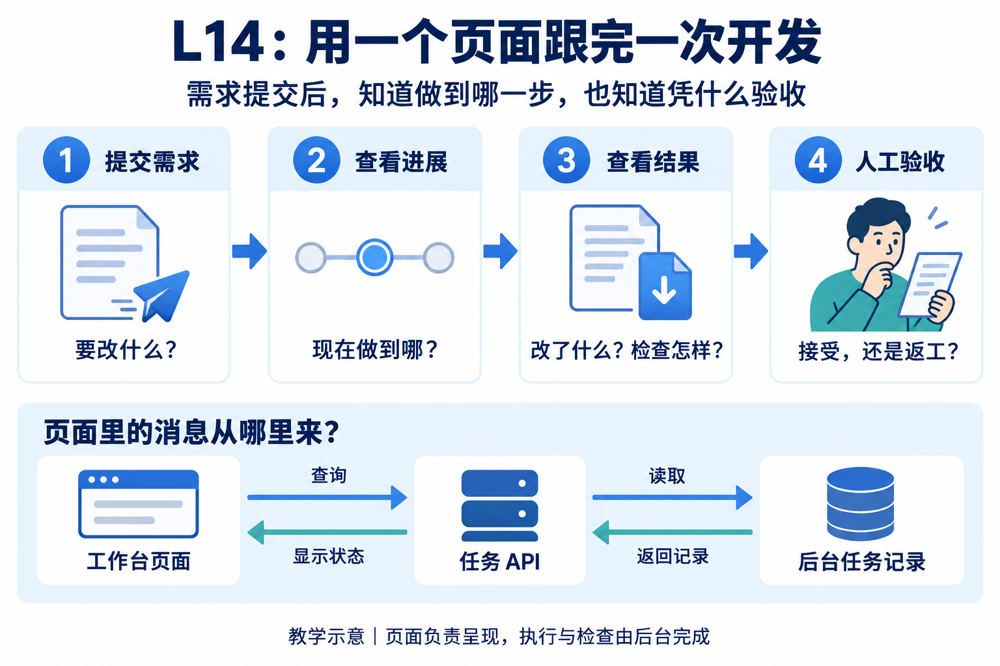
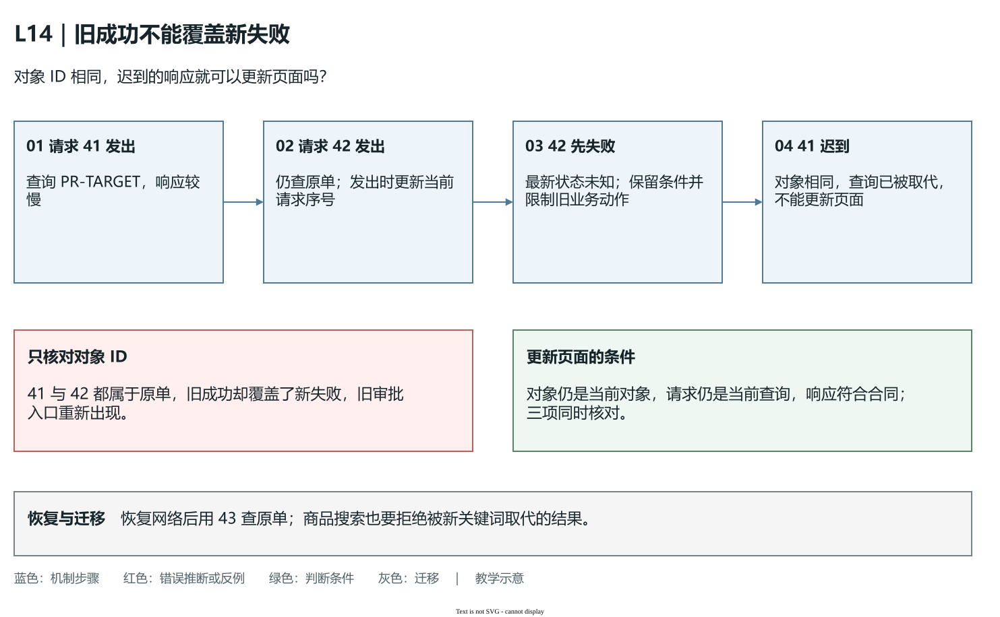
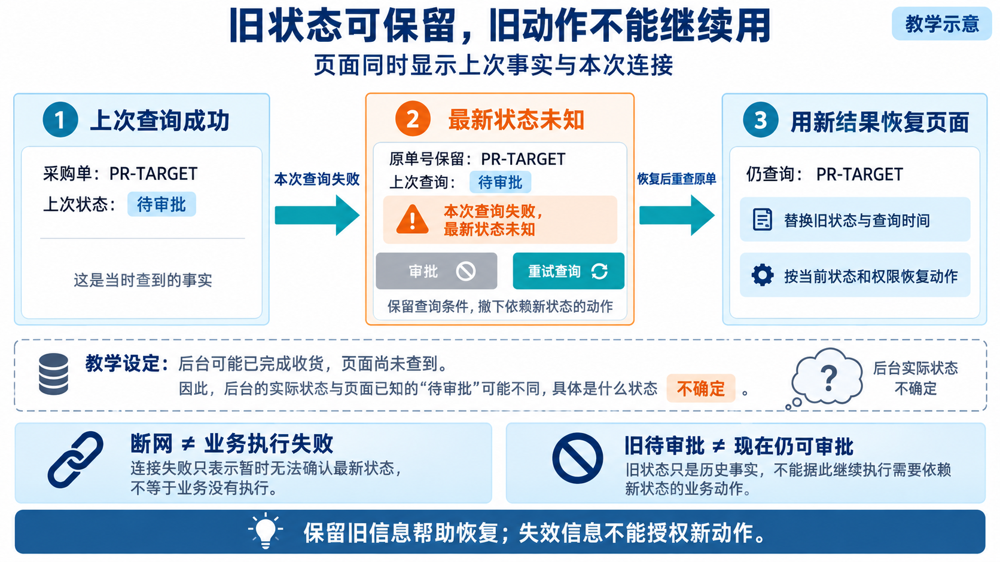

# L14｜让交付状态在 Web 面板可见

林舟打开 FlowERP 采购页，刚看过一张待审批采购单，随后网络断开。页面如果继续展示原卡片，她可能以为这是最新状态；页面如果把所有内容清空，她又不知道刚才查看的是哪张单。这个小问题同时涉及信息呈现、请求时序和业务安全，不能只靠加一个“刷新”按钮解决。

本讲沿用实践手册的“采购页查询失败后的恢复”案例。你先在工作台提出修复需求，由 Codex 在受控范围内修改独立 FlowERP 项目；再从工作台面板观察执行、检查、下载与验收，最后回到客户页面验证断网及恢复。工作台是研发入口，采购页是用户工作的地方，两者的状态必须各有来源。任务接口即 API，用约定的请求与响应供页面查询后台事实。下文的名字、编号、数量和请求时序是教学推演，实际证据使用自己的实例和任务。



L13 已解决“原任务怎样找回”；L14 要解决“人怎样据此行动”。本讲沿一条页面主路径读下去：**认出原任务 → 看当前阶段 → 打开报告与产物 → 作具名决定**。查询失败时，这条线暂时停在“最新状态未知”，保留原对象供恢复；恢复后重新查同一对象。合法状态与审核条件沿用 L12、L13，下面重点解释页面为何会误导人，以及怎样阻止误判。

## 1. 页面上究竟放什么

### 从人的下一步行动组织信息

林舟查看修复任务时，最先需要知道“是不是我刚才提交的事项，现在停在哪里”。所以第一层放任务身份、需求短句、当前阶段、最近获取时间和下一步动作。第二层放支持判断的候选、Eval 报告、产物及审核结论。第三层才是完整事件和技术日志，让需要追查的人继续展开。

这里的信息层级，是按阅读顺序安排重要程度，不是把后台字段分成三个颜色。若首页先堆满日志，林舟可能找不到“等待验收”；若只保留一个进度百分比，她又无法解释为什么失败。任务阶段未必与固定百分比对应：检查可能快，返工可能多，不能用未经测量的“90%”暗示马上结束。

以采购页修复为例，第一层可以显示“采购查询断网恢复｜检查已通过，等待验收”；第二层指出所依据的 Task（任务记录）、候选代码版本与 Eval（可重复检查）报告，并提供本任务的补丁；第三层保留第一次断网失败、修复事件和复验日志。真实状态是 `review` 时，页面不应把“下载可用”改译成“已完成”。下载、检查与人的接受分别说明不同事实。

### 为什么“检查通过”后还要显示“等待验收”

Eval 能检查预先写出的规则，却不能代替用户表达是否满足实际使用需要。断网提示的测试可能通过，但键盘焦点被弹窗困住，或者窄屏下“重试”按钮无法操作。人审要核对具体候选在真实条件下的结果，因此面板要明确显示待审核，允许审核者看依据并作具名决定。

按钮也应按动作条件出现。复验需要选定候选；验收需要最新、有效的报告；业务审批还需要合法账号、职责与采购状态。页面可以解释缺少哪个条件，服务端仍须最终检查。把按钮隐藏或置灰是交互帮助，不能替代后端权限和状态校验。

## 2. 页面怎么知道“现在做到哪了”

### 轮询是一系列有身份的查询

轮询是间隔一段时间主动查询；推送是服务有新信息时通知客户端。轮询容易在本机课程环境实现，也便于观察失败，代价是更新有延迟并产生重复请求。推送可减少延迟，但要处理断线重连、漏失消息和重新对账。本讲先用轮询形成可信主路径，不需要为演示效果增加一套复杂实时系统。

正确的轮询对象是当前选中的原 Task，数据来自任务 API。浏览器不能根据“已经等了很久”把执行中改成完成，也不能从一条没有任务归属的日志推断检查通过。页面要带出最近成功查询的时间；网络恢复后重新读取，才能恢复对当前状态的判断。

控制频率时也要考虑使用场景。页面隐藏后暂停查询，重新可见时补一次；上一次尚未结束时，可以避免重复发送；进入终态后减少不必要查询。首页摘要与打开任务的详情各有用途，不需要为每张首页卡片加载整份 workflow、所有日志和全部经验历史。

### 用一次乱序响应推演页面为什么会显示错

假设浏览器先查看任务 A，时间线如下：

```text
10:00:00 发送查询 A，请求较慢
10:00:01 林舟切换到任务 B，发送查询 B
10:00:02 B 返回，页面显示 B 正在检查
10:00:04 A 才返回，内容是 A 的旧失败
```

若每次响应都直接写入页面，最后会在 B 的标题下显示 A 的失败。这不是后台状态机错误，而是页面把旧响应贴到了新对象上。解决方法是在发送时保存当前任务 ID 和请求序号，返回时核对仍是当前对象且仍是允许生效的请求。切换事项、改筛选或重新查询时，旧响应失去更新界面的资格。

同一任务也有类似问题：较早的“执行中”可能晚于较新的“待审核”抵达。页面要用请求序号及可用的服务端版本信息防止倒退。发请求时保存身份，收到响应后再核对身份，是核心机制；仅仅把轮询间隔拉长无法消除乱序。

### 新查询失败，也不能让旧成功重新取得资格

只检查任务 ID 还不够。假设始终查询同一张 `PR-TARGET`：请求 41 较慢，请求 42 随后发出却断网失败；页面已经说明“本次查询失败，最新状态未知”，这时 41 返回一张待审批旧单。两份响应的对象编号相同，但 41 无权把页面重新写成“已同步”，因为它没有回答后来那次查询的问题。序号在请求**发出时**更新，而不是只有成功返回才更新，才能守住这个条件。

| 返回时要核对的条件 | 满足时说明什么 | 缺少时可能怎样误导人 |
|---|---|---|
| 原对象仍是当前对象 | 结果属于正在查看的任务或采购单 | 把 A 的结果写到 B 的标题下 |
| 原请求仍是当前查询 | 结果没有被更新的查询取代 | 较早的成功覆盖较新的失败提示 |
| 响应符合服务合同 | 得到的是可解释的数据或明确错误 | 把异常正文当成正常状态渲染 |

这三项需要同时成立。取消旧请求可以减少等待和无用工作，但旧响应可能已经抵达或正在处理，写入页面前仍需核对资格。服务端版本则回答后台记录的先后，不能独自判断用户已经切换了什么；请求序号回答当前页面的查询先后，也不能证明后台数据正确。两者各自控制一类错误。



**图 14-2　保持原对象，拒绝被取代的响应。**先按蓝色步骤读 41 发出、42 发出并失败、41 迟到的顺序，再看绿色判断：保留失败说明和原查询条件，等待一次新的有效查询。图为教学示意，[可编辑源图](assets/reading-depth-20261003/mechanism.drawio)可用于调整时序。

复验时有意让 41 延迟，使 42 先失败，然后才释放 41；应观察结果区、同步提示和业务动作，而不是只检查序号变量。旧审批入口不能因 41 的迟到而重新出现。网络恢复后发出 43，查询原单，按新的服务端状态恢复页面。这个设计可迁移到商品搜索：输入从“螺”变成“螺栓”后，迟到的“螺”结果也不能覆盖当前查询。

### 后台阶段与页面连接状态要同时存在

“最后查到任务正在执行”和“现在无法获取新状态”可以同时为真。前者是后台事实的旧快照，后者是当前连接事实。面板应表达为“上次查询：执行中；本次查询失败，最新状态未知”，保留原 Task 和最后获取时间。不能写成“执行失败”，因为断网并不能证明后台失败；也不能继续显示没有时间标记的绿色“正常”。

这一区别对 FlowERP 采购页同样关键。断网后的旧卡片可以帮助林舟记住采购单编号，却不应支持一次新的审批决定。最新状态未知时，应提示重新查询，并限制需要最新状态的业务动作；恢复后用服务端数据重新核对采购状态和权限。

### 可观测性还要保护人的判断

假设列表写“检查通过”，详情还是旧失败，接受按钮却已经亮起。三处都有数据，使用者仍无法作出可靠决定，因为它们没有说明同一个对象的同一份依据。页面要让人同时看清：**正在看哪件事、当前结论来自哪里、现在允许做什么**。能回查任务、事件、报告和失败原因，就是本讲需要的可观测性。

因此页面应是**权威状态的投影**：后台保存任务阶段、报告归属和审核决定，页面据此组织中文与入口。投影可以简化表达，却不能创造新事实。不能因为动画走完、下载出现或等待时间很长，就在浏览器里补出“已验收”。客户采购状态则从独立 FlowERP 读取，工作台研发状态不能替它回答采购是否批准、是否实际收货。

页面还需把一份响应作为相互关联的观察。渲染时核对对象身份，再把标题、阶段、证据与动作依据对应起来；不能只更新绿色徽标，留下另一任务的报告与接受按钮。参考 [`workbench_web/app.js`](../../../workbench_web/app.js) 的 `loadDetail()`比较本轮请求版本，并检查返回的 `task_id`；`clearEvidence()`在无法取得最新证据时隐藏旧详情及审核动作。这些是参考交互的控制位置，客户采购页的修复仍须在独立项目实际复验。



**图 14-3　保留旧信息帮助恢复，撤下失效的动作依据（教学示意）**

[L12](../L12/辅导资料.md) 说明业务状态怎样保存与恢复，[L13](../L13/辅导资料.md) 说明查询与动作怎样分开；本讲把这些边界变成页面行为。从左到右读图：上次查到待审批，本次查询失败，最新状态未知；保留 `PR-TARGET` 与旧快照供恢复，审批动作失去当前依据；恢复后仍查原单，用新结果与当前权限决定可用操作。图下方“后台可能已收货”是教学假设，页面在查询成功前不能把它当已知结果。

核对时区分三个标识：请求序号管“响应还能否更新当前页面”，后台版本管“任务记录是否改变”，报告内容标识管“证据属于哪版候选”。它们各查一种错配，不能取任意一个最大值就显示可信。上面的延迟实验查请求时序，原 Task 的记录与报告再查后台和候选身份。

完成判断应从用户动作看：他能认出当前对象，知道哪些事实刚查询到、哪些已经未知，并且无法凭失效信息完成一次新审批或验收。迁移到付款进度页，也要区分付款请求受理、实际扣款和页面同步；旧扣款截图可作历史材料，不能授权再次付款。由权威记录组织展示，由明确条件提供动作，才能让可观测页面支持可靠判断。

## 3. 页面突然连不上，该怎么办

先区分失败发生在什么位置，才能决定重试什么。查询连接失败，没有改变业务，恢复后通常可以再次读取原对象。提交响应丢失，服务可能已经受理，要先查询或用原幂等键及原内容找回原任务。Eval 失败，需要读报告并受控修复，重新轮询不会自动修好代码。审核打回，则需要理解人的理由，产生新候选和新检查，不能反复点击“接受”绕过结论。

一次具体的采购查询恢复应有这样的行为：林舟查询 `PR-TARGET`，成功得到待审批状态；断网后点击刷新，页面保留原编号，显示本次查询失败和明确的重试入口，结束加载提示；重新联网后点击重试，仍查询 `PR-TARGET`，成功后用新结果替换旧卡片、更新查询时间，再按当前状态恢复可用操作。若此时另一位审批者已经审批，页面应显示新状态，而不是继续按旧卡片让林舟再审批一次。

自动重试适合短暂的只读查询故障，但要有间隔与上限。连续失败时持续快速发送会增加负担，也让用户不知道发生了什么。重试期间应能看见重试状态，达到上限后保留失败和手动入口。身份错误、权限拒绝或内容冲突不应当作网络抖动无限重试，它们需要核对输入、登录或合同。

表单内容也要保护。提交失败时保留需求和理由；服务端确认成功后才清理该次已提交内容。等待响应期间若允许继续编辑，新文字不属于已经提交的请求，不能随旧请求成功而一起清空。草稿可以帮助恢复输入，执行授权、署名和审批决定仍由人重新确认。

提示语要回答“发生了什么、已有结果能否使用、接下来做什么”。只显示“错误 500”不够；只说“再试一次”又可能诱导重复提交。若系统不知道是否受理，就直接表达这个不确定性，并给出找回原提交的办法。

## 4. 检查完了，用户怎样拿到结果

### 下载是从任务证据到文件的受控读取

任务可能有多种产物：Spec 说明合同，Eval 报告说明检查，代码补丁说明相对起点的改动，库存 CSV 则是客户业务数据。它们不能互相替代。页面上的下载名称应告诉用户类别和任务归属，而不是统一叫“最终结果”。补丁也不是完整项目，接手者需要相应起点才能理解或应用它。

一个可靠的下载链是：打开原任务，找到它登记的产物引用，服务核对文件位于允许范围且属于该任务，再返回对应字节。文件清单和哈希帮助确认身份；哈希是一段由文件内容计算的摘要，内容变化通常会使摘要变化。下载后的摘要与登记值一致，可以证明拿到的是登记文件，不能证明代码业务正确。

例如某任务登记了一个采购页修复补丁。林舟下载后比较任务编号、文件类别、变更范围及摘要，才能把它与当前候选关联。若文件缺失、失效或摘要不符，页面应明确报告该产物不可用，保留任务和失败依据；不能偷偷给出另一任务的“最新补丁”。服务也不能接收浏览器任意指定的本机路径，否则一个下载入口会变成任意文件读取。

### 执行凭据与业务登录分别管理

调用 Codex 或其他执行器的密钥属于服务端运行环境，不应放在前端 JavaScript、页面配置、下载包或 Git 仓库中。浏览器代码会发送给使用者，隐藏输入框不能使其中的密钥保密。日志与报错也不能顺手输出完整环境变量。

FlowERP 用户的业务登录由独立产品管理；一次合法登录不授权任意源码执行，也不替代工作台的执行范围确认。下载受保护的业务文件时要使用该服务认可的会话与权限，不能为方便把执行器密钥放入下载 URL。URL 容易进入历史、日志和截图，尤其不适合携带长期凭据。

面板可以展示“缺少执行环境授权”及解决入口，不需要展示秘密本身。新环境接手时通过安全方式重新配置凭据，而不是把作者认证文件打包给同伴。

## 5. 最后到 FlowERP 检查：这次修复真的有用吗

### 把页面、接口、数据库和业务规则对在一起

DOM 是浏览器实际呈现的页面结构，它能证明用户看到了什么；API 响应说明服务返回了什么；数据库说明保存了什么；业务规则说明这些事实是否允许。这四层各有用处：截图显示“审批成功”不足以证明库存正确，数据库正确也不能说明断网时页面会给出安全提示。

继续用一张采购单推演。起始库存 10 件，申请补货 3 件：有权人员审批后，采购状态变为已审批，库存仍是 10；合法收货后库存变为 13，账本增加一笔 3 件。若查询此时断网，页面应说明最新状态未知；恢复查询后读取原单，显示已收货，并避免提供重复收货动作。审批人、收货记录和库存变化均从同一个真实对象回查。

修复验收要同时走正常路径与失败路径。正常联网时，原任务和采购单能查回、报告可读、对应文件可下载；断网时，不误报完成，不丢原编号，不用旧快照支持新审批；恢复时，不串到其他任务或其他采购单。再用键盘和窄屏操作同一主路径，检查焦点、提示和重试入口，避免鼠标演示掩盖操作障碍。

这条验证链解释了人与 Codex 的分工：你决定用户问题和通过条件，Codex 实现范围内修复，工作台组织任务、Eval、返工与审核，FlowERP 的真实使用反馈检验修复是否解决问题。自动检查支持人的判断，真实审核者仍需面对这一次候选作决定。

读完后，试着把同样设计迁移到耗时导出：首次受理与文件生成完成怎样区分？查询超时后保留什么？哪个旧响应必须丢弃？文件失效后重试生成是否会创建新任务？能够从副作用和身份解释答案，才说明你掌握了机制。

## 配套实践与参考

按[实践操作手册](实践操作手册.md)推进，用[本讲目标与完成判断](实践操作手册.md#lesson-goals)和[提交模板](SUBMISSION.md)保留自己的首次判断、失败、改动、复验与人的决定。参考版本已经正确时，选择真实缺口，不删除正确代码制造失败。本讲对应 CLO-6。

可对照[采购查询失败修复](examples/采购查询失败修复.md)、[补丁下载与任务回查](examples/补丁下载与任务回查.md)、[采购页键盘与窄屏走查](examples/采购页键盘与窄屏走查.md)理解不同证据的用途。原有截图、机制和核验日期见[扩展参考](reference/参考说明.md)；历史观察不替代本次操作或具名验收。总览图为教学示意。

## 课程合同

- **核心内容**：面板信息层级、轮询或推送、失败重试、结果下载和密钥边界。
- **演示结果**：从 Web 提交需求并查看阶段状态、Eval 报告和产出文件。
- **课内增量**：完成只覆盖一个任务主路径的最小面板。
- **通过标准**：状态与后端一致；失败路径明确；结果可追踪；前端和仓库中没有密钥。
