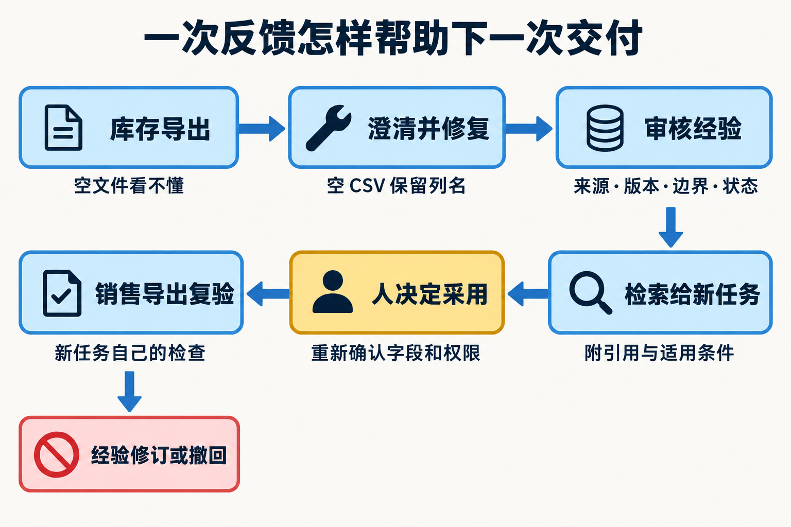

# L15｜生成交付摘要并采集真实反馈

L14 的真实使用者说“库存导出坏了”。调查确认：合法空查询生成了没有列名的文件。**本讲先根据真实反馈交付一个小修复，再把已审核经验用于另一项销售导出任务；摘要、反馈、Memory 与 RAG 都围绕这两件事展开。**

从左上方顺箭头读到右上方：确认库存问题、修复、审核经验；再沿第二行返回销售复验。橙色“人决定采用”是新事项的决定，原库存验收不自动传过去。图为教学示意。

[L14](../L14/README.md) 让使用者看到可信结果，本讲检查反馈是否改变下一次交付；[L16](../L16/README.md) 把已有方法带到新环境和未预演需求。

## 按这条路线学习

1. [辅导资料](辅导资料.md)：先看空 CSV 修复，再跟随这份经验做过滤、排序、引用判断和销售任务复验。
2. [实践操作手册](实践操作手册.md#lesson-goals)：第 1～6 步完成来源修复，第 7～10 步保存经验并在另一事项中检索、采用、回收效果。
3. [提交模板](SUBMISSION.md)：串起原反馈、已接受来源、记忆版本、新事项采用快照和独立结果。

**本讲动作线：**原任务摘要 → 真实反馈与问题确认 → 一项小修复 → 审核经验 → 新事项检索与引用 → 人决定采用范围 → 新候选独立复验 → 结果回流。

## 需要时再打开

- [当前课堂 PPT](L15-生成交付摘要并采集真实反馈-图解版-ImageGen增强-v3-23页.pptx)：本讲唯一当前课件，须向课程提供方单独领取，不随 Git 发布；领取并按此文件名存放后才能打开。
- [按问题查阅的参考说明](reference/参考说明.md)：深入机制、实现边界及历史证据索引。
- [实验与辅助工具](examples/)：仅在手册对应步骤调用，保留原脚本和数据目录。
- [审查与复用 Skill](examples/skills/)：辅助反证与迁移，不能替代真实复验者的决定。
- [历史归档](reference/archive/)：旧行动卡、提示词、完整参考与旧课件，首次学习无需逐份阅读。

[课程总入口](../../README.md) · [上一讲](../L14/README.md) · [下一讲](../L16/README.md)
