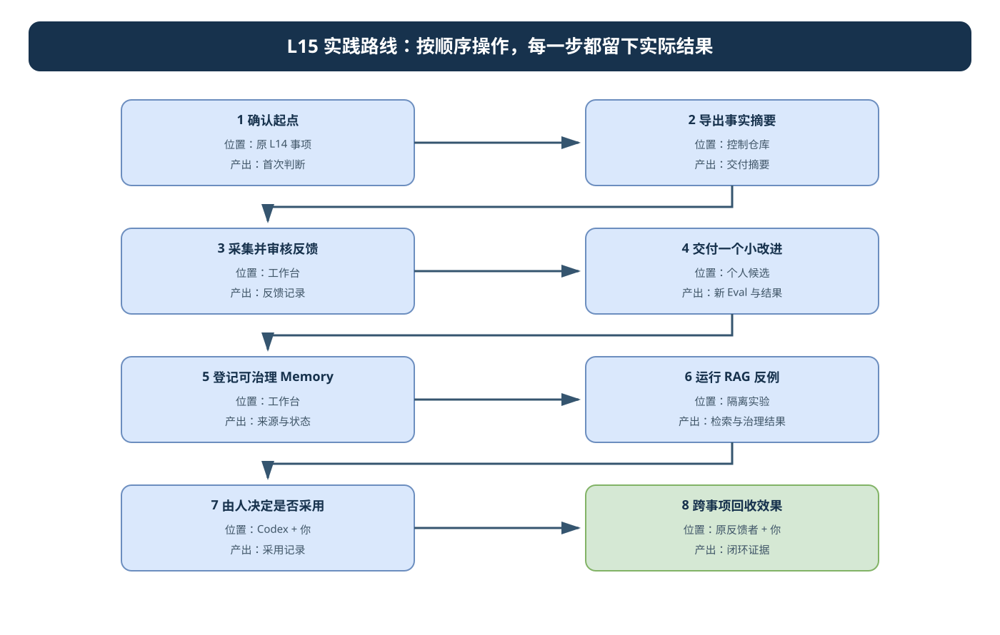

# L15｜按问题查阅的参考说明

首次学习按[实践手册](../实践操作手册.md)推进。本页保留独有机制边界和历史索引，基础案例不重复展开。

2026-10-03 本次整理核对现有材料与所列源码；没有重跑历史实验，也不替学生取得真实执行、人审或迁移证据。

## 1. 摘要、反馈与事实来源

摘要引用同一 Task、候选、Eval 与产物；weekly 窗口和统计单位须明确，重试不能计成多项完成。`workbench.feedback` 默认库与带运行目录的 CLI 汇总入口不同，写入前回查原数据库。

源反馈解释为什么改，新 Task 验证改后结果。反馈登记、审核、资产晋级和实际后续采用分别留证；原话不直接改写阻断 Eval。

## 2. 教学 Memory/RAG 的实际机制

[`memory_rag_lab.py`](../examples/memory_rag_lab.py)用 ASCII 词与中文二字片段计算重叠分数，按项目和 active 状态过滤，再排序 Top-k。它是标准库解释性实验，不证明生产中文检索质量或首页已贯通 Memory/RAG。

上下文包保留 `memory_id@version`、来源、适用边界和指纹。Precision/Recall 需有真实相关项集合，空结果不由模型补答案。高分、完整引用和人的采用是不同判断；采用不自动扩大 Spec、写集或 Eval。

## 3. 按需索引

| 材料 | 要核对什么 |
|---|---|
| [export_digest.py](../examples/export_digest.py) | 同一交付索引的事实摘要与缺项。 |
| [memory_rag_fixture.json](../examples/memory_rag_fixture.json) | 教学条目的项目、版本、状态及查询预期。 |
| [Memory/RAG 实验](../examples/memory_rag_lab.py) | 检索、撤回反例、指标、快照与拒绝覆盖。 |
| [L14 原生走查](../../L14/examples/采购页键盘与窄屏走查.md) | 工程观察与真实反馈者原话的区别。 |

## 4. 历史与缺口

查[归档扩展参考](archive/辅导资料-扩展参考.md#22-原问题修复后-新反馈怎样进入下一轮)及[旧导航](archive/README-旧导航.md)。旧全文核验日期为 2026-09-12；原目录中的维护案例附件缺失仍保留缺失，不生成补位证据。反馈、召回、明确版本采用、后续执行与失败治理连起来后才支持跨事项闭环，课堂实验和参考回归不能替代个人学习达成。

## 5. 教学记忆集与历史流程示意

下面的图是原八阶段教学概览；当前实践以[手册正文十步](../实践操作手册.md#按这一条顺序操作)为操作顺序。



可编辑源文件：[l15-practice-flow.drawio](../assets/l15-practice-flow.drawio)。

### 只检查脚本机制时

在控制仓库终端，用课程记忆集观察检索指标与治理反例：

```text
python -X utf8 docs/courses/L15/examples/memory_rag_lab.py --fixture docs/courses/L15/examples/memory_rag_fixture.json --evaluate --top-k 2
python -X utf8 docs/courses/L15/examples/memory_rag_lab.py --fixture docs/courses/L15/examples/memory_rag_fixture.json --query "空库存导出应该报错" --project FlowERP --top-k 2 --include-revoked
```

第一条预期退出 0，固定查询全部通过；第二条预期退出 1，因为反例开关允许撤回经验进入结果。去掉 `--include-revoked` 后重试，撤回条目应被排除。课程结果仅帮助理解程序机制，不能作为个人经验被后续事项召回的证据。个人记忆集的保存与实际查询见[格式说明](个人记忆集格式.md)和[手册第 7～8 步](../实践操作手册.md#7-把一次经验登记为可治理-memory)。
