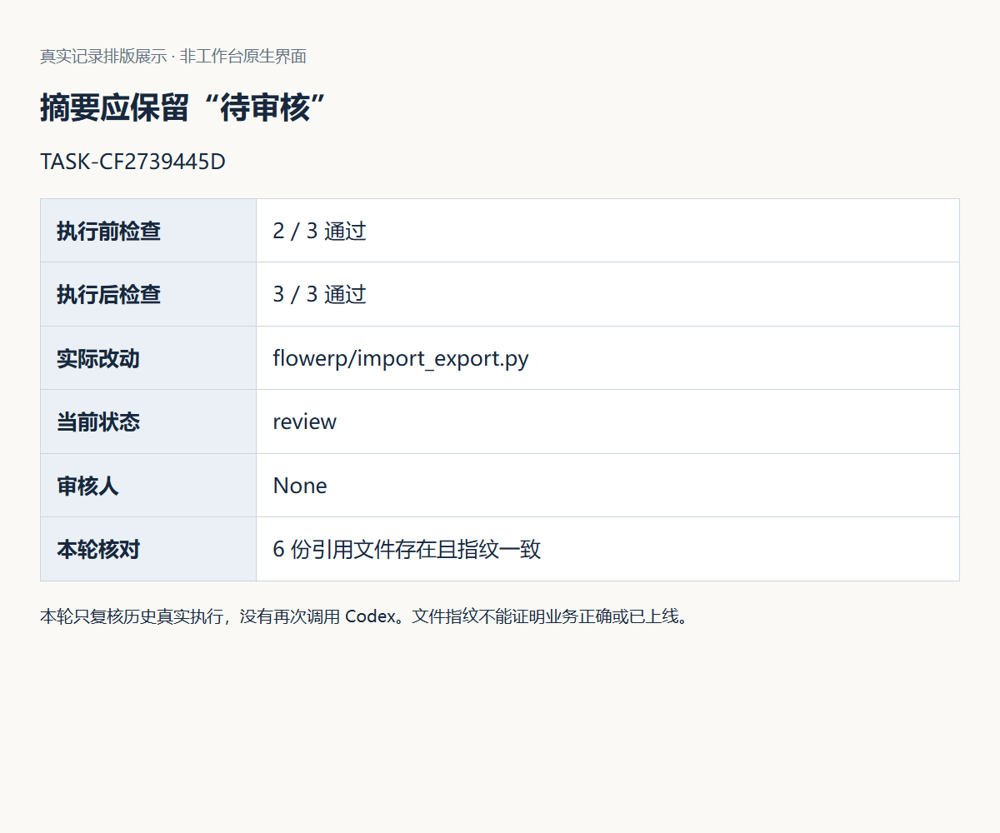
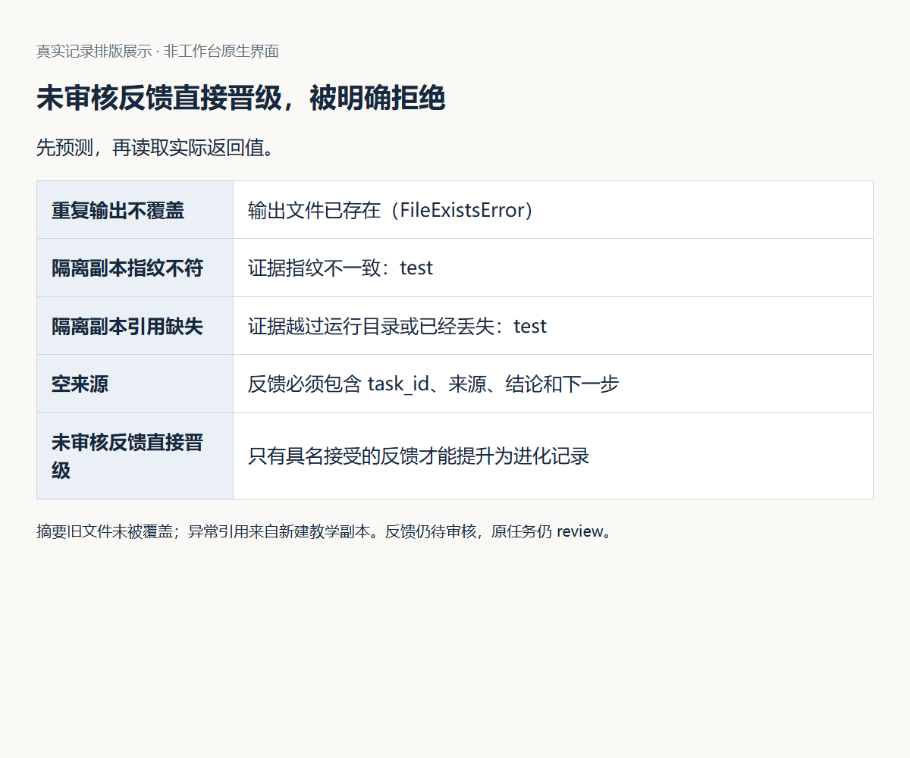
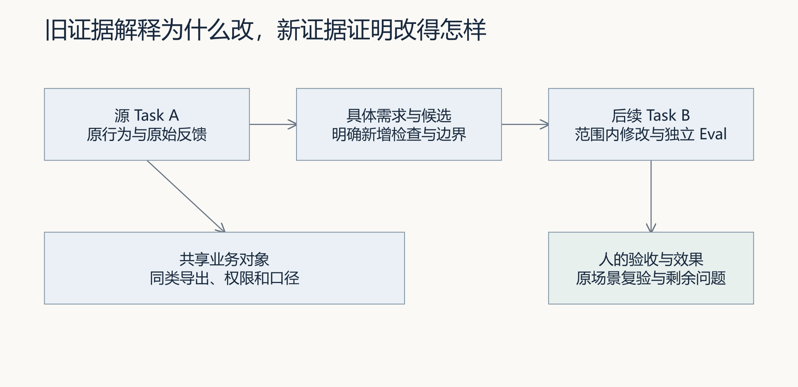

# L15｜生成交付摘要并采集真实反馈

> **终端选择：**本手册同时提供 Windows PowerShell 与 macOS 默认终端 zsh 的操作。每一步只运行自己系统对应的代码块；标为“通用”的 Python、Git 命令两端相同。开始或重开终端时，先按[macOS 环境与路径约定](../../reference/实操手册执行与排错.md#macos-zsh)恢复本讲使用的虚拟环境，再核对当前源码位置。

本次实践要完成三项相互关联的建设：让工作台导出可回链的交付摘要并记录经治理的反馈；把已审核经验登记为 Memory；在另一事项中通过 RAG 检索、引用、人工采用和 Harness 复验，交付一项 FlowERP 小改进。只运行示例、记录反馈或取得一次高分命中，不能代替个人实现。

先读取课程合同，再从真实反馈确定本次新增验收项。发布索引、摘要和反馈都要引用自己的原任务与同一运行目录；这些文件应由实际步骤生成，不从参考任务复制编号。`course-spec` 的动态验收要求在第 5 节说明，不能直接使用没有新增 Eval 的命令。

开始操作前，遇到解释器、路径或输出问题，按[执行与排错说明](../../reference/实操手册执行与排错.md)核对。

### 本讲目录地图

```text
〈CodexFDE 控制仓库〉/                ← 命令起点与工作台源码
├─ .venv/
├─ .runtime/l14-workbench/           ← 默认沿用的原事项数据库
├─ 〈本讲新运行目录〉/               ← 新任务、反馈、Memory/RAG 证据
└─ 〈摘要与上下文包输出目录〉         ← 新文件；不覆盖旧版本

〈独立 FlowERP 仓库〉/               ← 小改进的客户源码与业务数据
〈工作台返回的隔离候选〉/            ← 实际实现、Eval 与复验对象
```

后文要求输入路径时，一律粘贴实际绝对路径：`$l15Runtime` 必须包含原任务的 `workbench.db`，`$l15Index` 必须属于同一任务，摘要输出必须是尚不存在的新文件。不要把默认 `.runtime/workbench.db` 当成上一讲数据库。

<a id="lesson-goals"></a>

## 本讲目标与完成判断

学生核对摘要和原反馈，实际责任人确认采用范围，Codex 协助受控实现新改进并提炼带来源的经验。

| 建设对象 | 本讲目标与因果关系 |
|---|---|
| 工作台 | 建设可追溯摘要、反馈治理与最小 Memory/RAG 练习链，保留版本、过滤、引用、快照和人的采用决定。 |
| FlowERP | 交付一项实际采纳反馈驱动、此前未实现的进销存或财务小改进，独立任务复验产品效果。 |
| 学生证据 | 先保留个人判断；在真实失败、修订、复验与迁移中说明工作台改进怎样影响客户结果。 |

**交付前核对：**

- 摘要每句完成性结论可回链，原话、工程解释和处置建议分开；待审不写成已交付。
- 记忆保留项目、来源、版本、边界和状态，撤回或跨项目记录不默认进入上下文，引用和指标可复验。
- 人的采用绑定后续 Task、范围内 Diff、独立 Eval 与具名决定；未发生跨事项采用时不宣称闭环。

**课程四项合同：**

- **核心内容**：文档和周报导出、运行反馈、可治理 Memory、RAG 检索与引用评测、失败样本回流，以及记忆采用和自动改代码之间的人工边界。
- **演示结果**：生成交付摘要与结构化反馈；将审核后的经验登记为记忆，在另一事项中检索，输出带引用的上下文包并解释采用决定。
- **课内增量**：实现摘要、反馈记录和最小 Memory/RAG 练习链：记忆版本与状态、元数据过滤、可解释排序、Top-k 上下文包和采用快照；不增加新的 Agent 编排。
- **通过标准**：摘要可追溯；记忆保留来源、版本、边界和状态；撤回或跨项目记忆不会默认进入上下文；检索评测与引用完整性可复验；原始反馈和检索结果都不能未经人审直接改写阻断 Eval。


## 按这一条顺序操作

从自己的 L14 事项继续：**确认起点 → 导出摘要 → 采集反馈 → 审核反馈 → 交付小改进 → 核对结果 → 保存个人经验 → 在新事项查询 → 决定采用并交付 → 回收效果。** 下文第 1～10 步按此顺序展开。

第 5～6 步完成第一次修复，成为经验来源；第 8～10 步换到另一个事项，检验这份经验是否有用。新的事项与 Task 不沿用来源任务编号。第一次修复通过后，再开始经验复用。

## 第 1 步：确认起点与首次判断

<!-- step-guide-1 -->
> **一句话说明：**从一个真实 L14 事项继续，先判断哪些经验值得保存，哪些只是本次偶发现象。

开始本讲 FDE 实践时，先在[提交模板](SUBMISSION.md)的首次判断与需求记录回答：原反馈者想完成什么工作，为什么采纳这个小改进而暂缓其他方案，何时需要重新判断？注明来源是实际观察、同伴试用还是教学设置，写下本次选择和暂缓范围，再请 Codex 协助调查。

从自己的 L14 事项进入，保存真实任务编号、版本、运行目录和已有 Eval。工作台从首页“事项与决策”组织后续研发；FlowERP 的业务数据使用独立目录。先激活仓库 `.venv`，后面的 `python` 都指该环境。

**Windows（PowerShell，在控制仓库根目录）：**

```powershell
.\.venv\Scripts\Activate.ps1
python -c "import sys; print(sys.executable)"
```

**macOS（zsh，在控制仓库根目录）：**

```zsh
source .venv/bin/activate
python -c 'import sys; print(sys.executable)'
```

输出应是这个控制仓库的 `.venv` 解释器；激活失败就先停止。重开窗口重复这一步，再输入原任务与原运行目录，不重新创建事项。预期非零的实验运行后立即查看退出码：PowerShell 用 `$LASTEXITCODE`，zsh 用 `printf '退出码：%s\n' "$?"`，不要先运行其他命令。

运行以下只读命令检查课程入口并查看本讲合同。它们的通过只说明参考合同和投影可用，不证明你已完成 L15；本次需求的执行合同在第 5 节准备。

**Windows / macOS 通用：**

```text
python -X utf8 -m workbench.cli course-status
python -X utf8 -m workbench.cli course-contract --lesson 15
```

在[提交模板](SUBMISSION.md)先写三项判断：空白导出能否证明没有库存；检查全部通过是否可以写已发布；接受反馈是否允许直接改阻断规则。保留首次答案，后续修订另写，不覆盖。

## 2. 从已有任务导出一份事实摘要

<a id="prompt-evidence"></a>

### 本步给 Codex 的完整提示词：1. 审阅已有证据

先填入本次真实路径、任务、对象和允许范围，沿用已确认的授权；输出完成后按本步预期复核。

```text
请读取我提供的 Task、候选、Spec、Eval 和产物，区分已确认事实、解释与缺失证据。为交付摘要的每句完成性结论指出来源；保留待审核、未发布、未观察效果等实际状态。不要用模型自述补足测试或使用记录。若证据冲突，先列出需要核对的对象与时间，不生成笼统的成功结论。
```


<!-- step-guide-2 -->
> **一句话说明：**从已有任务导出事实摘要，并亲手核对摘要中的结论能否回到原始证据。

先从自己任务已有交付索引中选择一份 `workbench.release-index/v1` 的 JSON。索引应对应同一任务与候选。不要把旧任务索引复制后改一个编号，假装它属于新任务。现有课程任务可以用下方命令汇集索引；它只新增证据索引，缺项会如实列出，不批准或发布任务。若自己的工作台尚无对应能力，将它作为明确实现缺口，按下列合同完成自己的版本。

**Windows（PowerShell）：**

```powershell
$l15Runtime = Read-Host '输入已有工作台运行目录绝对路径'
$l15Task = Read-Host '输入自己的真实 Task ID'
if (-not (Test-Path -LiteralPath (Join-Path $l15Runtime 'workbench.db') -PathType Leaf)) { throw '原工作台数据库不存在，请核对 L14 运行目录，不创建空库' }
python -X utf8 -m workbench.cli course-release-index $l15Task --runtime-dir $l15Runtime
if ($LASTEXITCODE -ne 0) { throw '索引未生成，请保留错误并核对任务编号与原运行目录' }
```

**macOS（zsh）：**

```zsh
prepare_l15_index() {
  printf '输入已有工作台运行目录绝对路径（不加引号）：\n'
  read -r l15Runtime || return 1
  printf '输入自己的真实 Task ID：\n'
  read -r l15Task || return 1
  if [ ! -f "$l15Runtime/workbench.db" ]; then
    printf '原工作台数据库不存在，请核对 L14 运行目录，不创建空库。\n'
    return 1
  fi
  python -X utf8 -m workbench.cli course-release-index "$l15Task" --runtime-dir "$l15Runtime"
}
prepare_l15_index
```

保存输出中的索引路径。这个索引使用课程执行事件作为依据；其他执行路径若缺少对应事件，应记录缺项并补接来源，不能用它们没有数据推断任务从未执行。

交互输入与续行按 Windows PowerShell / macOS zsh 分别提供。中断后 `$l15Runtime` 等变量不会保留；重新激活原环境，输入原目录和任务编号，先用 `task-show` 查原任务。已有索引可直接继续导出，不必重新创建任务；已有摘要或上下文包则读取原文件，新的导出使用新路径。L14 按本手册默认操作时，原工作台目录为 `.runtime/l14-workbench`，不是 `.runtime/l04-learning`。

恢复上方两个输入后，在同一个操作终端只读查询：

**Windows（PowerShell）：**

```powershell
python -X utf8 -m workbench.cli task-show $l15Task --runtime-dir $l15Runtime
$LASTEXITCODE
```

**macOS（zsh）：**

```zsh
python -X utf8 -m workbench.cli task-show "$l15Task" --runtime-dir "$l15Runtime"
printf '原任务查询退出码：%s\n' "$?"
```

确认返回的任务编号、状态与记录一致再继续。找不到任务时核对原数据库，不新建任务来补空缺。

最小导出合同：输出任务 ID、需求、当前状态、实际修改、执行前后检查、审核信息和证据缺口；每个文件引用有路径和指纹；不存在、越界或指纹不符时明确失败；导出不批准任务、不改变业务库，重复导出不覆盖旧文件。

仓库提供[只读导出示例](examples/export_digest.py)。它读取已有索引，核对文件路径和指纹，生成 Markdown。它不查询最新服务端状态，因此摘要代表索引创建时的快照；你应核对该快照是否仍适合本次交接。它也不验证每个业务断言的正确性。

在终端中用三次输入指定真实路径，避免复制占位符执行：

**Windows（PowerShell）：**

```powershell
$l15Runtime = Read-Host '输入自己的工作台运行目录绝对路径'
$l15Index = Read-Host '输入该目录中已有交付索引的绝对路径'
$l15Digest = Read-Host '输入一个尚不存在的摘要输出文件绝对路径'
python -X utf8 docs/courses/L15/examples/export_digest.py --runtime-dir $l15Runtime --index $l15Index --out $l15Digest
```

**macOS（zsh）：**

```zsh
printf '输入自己的工作台运行目录绝对路径（不加引号）：\n'
read -r l15Runtime
printf '输入该目录中已有交付索引的绝对路径（不加引号）：\n'
read -r l15Index
printf '输入一个尚不存在的摘要输出文件绝对路径（不加引号）：\n'
read -r l15Digest
python -X utf8 docs/courses/L15/examples/export_digest.py --runtime-dir "$l15Runtime" --index "$l15Index" --out "$l15Digest"
```

正常结果应打印输出路径、任务编号、已核对引用数和原任务状态。打开 Markdown，随机挑一句完成性结论回到原报告；若任务是 `review`，摘要不能变成已验收。指纹一致但报告没有检查目标行为时，记录为证据不足。

失败实验使用你自己的临时副本：让一个引用指向不存在的文件，或修改证据文件后保留原指纹，再运行导出。应返回非零并说明原因，不能生成一份假装成功的摘要。不要改原始失败证据。再用同一个输出路径运行，检查旧摘要没有被覆盖。

若自己的起点已有导出能力，先核对以上合同，选择真实缺口实现；示例代码本身不算你的课内增量。保留修改前行为、范围内 Diff 和同样条件下的复验。

### 2.1 对照本轮真实摘要，亲手核对一句话

参考 TASK-CF2739445D 的本轮摘要检查了6份引用，状态仍review；不要照抄任务编号作为自己的交付。打开自己的摘要，先圈出“改了什么、检查了什么、谁还未决定”，逐句追到同一候选和报告。



图 1：本图为真实记录排版。参考任务3/3通过而审核人为空。只要缺少验收记录，你的摘要也应保留待审核。再用同一输出路径运行，保存明确失败结果和旧文件指纹。

## 3. 采集一条实际反馈，保留三层记录

<a id="prompt-feedback"></a>

### 本步给 Codex 的完整提示词：2. 从反馈形成范围受控的需求

先填入本次真实路径、任务、对象和允许范围，沿用已确认的授权；输出完成后按本步预期复核。

```text
可先比较两组参考输入：历史空库存任务3/3通过但仍review；L14采购列表离线后仍显示已同步。前者支持摘要的待审核说明，后者支持进一步观察页面误读；两者都不能替代真实使用者的原话或新的个人开发。请按我提供的实际来源继续，缺少来源时明确指出。

请保留反馈原话，把工程解释与处置建议分开。比较至少两种原因和两种方案，说明需要哪些观察才能区分。经我确认后形成包含来源、目标、非目标、约束、验收用例与完成定义的具体 Spec。区分既有合同与真实新增检查，不降低既有阻断规则，不新增 Agent 编排，不代签反馈审核。
```


<!-- step-guide-3 -->
> **一句话说明：**采集一条真实反馈，分别保存使用者原话、事实核对和后续处理决定。

请一位同伴在你的演示环境完成一次库存、采购、销售或财务操作。说明要记录操作观察，避免收集无关个人信息。记录角色、日期、版本、输入、看到的结果和原话。同伴试用写成同伴试用，不写成客户正式访谈。


把工程解释另写：有哪些假设，怎样排除，哪项尚不确定。随后写处置建议，比较至少两种方案，例如补足导出列名与单纯增加提示。说明收益、维护成本、权限风险和预期效果。审核者再独立作出决定。

若页面已经有反馈入口，沿原事项保存并核对后端记录；若没有贯通，明确将接入作为本次工作台增量。不要另建日常研发入口。函数级练习可以在隔离目录使用 `workbench.feedback.add_feedback`，显式传入自己的数据库路径。该函数检查非空字段，但源任务关联与权限仍需通过实际入口核对。

默认 `python -m workbench.feedback` 使用当前目录下 `.runtime/workbench.db`，没有 `--runtime-dir` 参数。不要为了方便向不确定的默认库写入。以下是带隔离目录参数的汇总入口；确认目录正确且已有数据库，避免初始化了一个无关空库：

**Windows（PowerShell）：**

```powershell
python -X utf8 -m workbench.cli feedback --runtime-dir $l15Runtime
```

**macOS（zsh）：**

```zsh
python -X utf8 -m workbench.cli feedback --runtime-dir "$l15Runtime"
```

检查新记录为 `pending_review`，原文、解释与下一步可追踪。空来源应失败。相同观察重复提交不应产生重复执行；当前去重函数同键不同内容会返回原记录，应核对返回正文，不把它误写为冲突拒绝。需要修订时保留原记录，并显式关联新版本。

### 3.1 从页面事实写反馈，不替使用者补原话

可在自己的 L14 采购场景重复“离线 → 查询 → 恢复 → 查询”，记录原单据、旧提示和恢复结果。没有同伴参与时写工程观察；实际有人试用时再记录经允许的原话。观察、可能影响、处置建议分别写，不能从一张截图推导出实际业务损失。

先核对当前版本：参考采购离线旧状态已修复，不应继续照抄为当前缺陷。后续真实走查发现“Escape退出审批确认框后焦点没有回到原按钮”，可用作新的工程观察。分别记录旧反馈、修复证据与新观察，写明目前尚无正式反馈采纳到后续Task的证据。新任务须独立保存范围、接受条件、候选与复验，不能把当前会话直接修改改名为工作台自动闭环。完整对照见[扩展参考第 2.2 节](reference/参考说明.md)与[L14实际走查](../L14/examples/采购页键盘与窄屏走查.md)。


原始反馈先在隔离记录中保存为待审核，打开返回内容核对来源、结论与下一步。参考反馈FB-04100D82只是维护复核；它的编号、角色和内容不能替代个人记录。

## 4. 观察审核与晋级边界

<!-- step-guide-4 -->
> **一句话说明：**观察反馈怎样经过审核成为候选资产，并验证未审核或已撤销内容不会进入后续上下文。

先预测三种操作：缺少审核人；未审核反馈直接建立 Evolution；已经有结论后再次改变反馈决定。再在自己的隔离测试记录上验证。测试中的角色名必须注明为夹具，不可混入正式人审记录。真实反馈由实际审核者作出决定，Codex 不代签。

运行仓库已有治理用例，阅读它实际验证的分支：

**Windows / macOS 通用：**

```text
python -X utf8 -m eval.harness --suite blocking --case raw_feedback_cannot_become_blocking
```

该用例通过不代表所有接口的并发和权限都已覆盖。你的新增检查应针对自己改动的入口，确认失败后原始反馈、任务状态和阻断规则没有被意外改写。



图 2：真实记录排版。参考实验未填写任何虚构审核人，直接晋级请求被拒绝。自己复验时保存拒绝原因，回查反馈仍待审核。把“同键异内容返回旧正文”另列为实际行为，不写成冲突拒绝。

接受反馈后仍需决定改进范围。若选择把样本做成 Eval 候选，写清前提、操作、预期、反例和适用范围，经过审核后进入版本化检查；不得根据一条原话直接改变全局质量门。

## 5. 通过工作台交付一个尚未实现的小改进

<!-- step-guide-5 -->
> **一句话说明：**通过工作台交付一个此前未实现的小改进，用新增 Eval 和业务结果证明改动。

从实际采纳的反馈生成本次具体需求，包含来源、目标、非目标、约束、验收用例和完成定义。用同一事项绑定需求版本，Codex 协助整理 PRD 与方案，你确认写集和接受条件，再由工作台调用受控执行器。

先保存本人确认的六段式需求，验收段写明实际新增 Eval 名称。下面是一条课程任务路线：准备 Git Worktree → 只新增检查 → 既有合同绿、新增目标红 → 保存检查提交 → 按该提交受控执行。`course-spec --lesson 15` 也必须传 `--eval-case`，生成的通用文件不替代本人需求。

### 5.1 准备可保存提交的检查候选

在控制仓库、原工作台运行目录下准备，准备编号只用于隔离目录，尚非正式 Task ID：

**Windows（PowerShell）：**

```powershell
$l15Control = (Get-Location).Path
$l15Python = (Resolve-Path '.venv/Scripts/python.exe').Path
$l15PrepId = 'TASK-PREP-L15-' + [guid]::NewGuid().ToString('N')
& $l15Python -X utf8 -m workbench.cli course-prepare --lesson 15 --task-id $l15PrepId --runtime-dir $l15Runtime
$LASTEXITCODE
```

**macOS（zsh）：**

```zsh
l15Control="$PWD"
l15Python="$PWD/.venv/bin/python"
l15PrepId="TASK-PREP-L15-$("$l15Python" -c 'import uuid; print(uuid.uuid4().hex)')"
"$l15Python" -X utf8 -m workbench.cli course-prepare --lesson 15 --task-id "$l15PrepId" --runtime-dir "$l15Runtime"
printf '准备退出码：%s\n' "$?"
```

保存返回的 `path` 与基线，确认 `mode` 为 `git_worktree`，基于 `course/l15-start`。这是标签候选，按实际基线、模块路径与来源记录核对，不把它称为已组合当前独立客户源码；`--source working-tree` 源快照才会组合当前源码并写 `.course/product-source.json`。本步需要同一 Git 库可解析的提交，不能把非 Git 的源码副本当会话基线。

### 5.2 只新增检查，取得旧绿与新红

按已确认的需求让 Codex 在检查候选中只增加实际 Eval 与必要测试，不实现目标能力。保存实际新增用例名和检查文件。候选未必有 `.venv`，进入它后借用已保存解释器，先核对 `eval.harness.__file__` 位于候选。

**Windows（PowerShell）：**

```powershell
$l15CheckCandidate = (Read-Host '刚返回的检查候选 path').Trim().Trim('"')
$l15Spec = (Read-Host '本人确认版六段式需求绝对路径').Trim().Trim('"')
$l15Case = Read-Host '实际新增 Eval 名称（与 Spec 验收段一致）'
Set-Location -LiteralPath $l15CheckCandidate -ErrorAction Stop
& $l15Python -X utf8 -c "from pathlib import Path; import eval.harness; root=Path.cwd().resolve(); print(root); print(eval.harness.__file__); assert Path(eval.harness.__file__).resolve().is_relative_to(root)"
$LASTEXITCODE
if ($LASTEXITCODE -ne 0) { throw '先处理候选源码来源，暂不运行 Eval' }
& $l15Python -X utf8 -m eval.harness --suite blocking --case delivery_evidence_and_review_controls --case raw_feedback_cannot_become_blocking --report-path .runtime/l15-start/old.json
$LASTEXITCODE
if ($LASTEXITCODE -ne 0) { throw '既有合同未通过，先查原失败' }
& $l15Python -X utf8 -m eval.harness --suite blocking --case $l15Case --report-path .runtime/l15-start/new.json
$LASTEXITCODE
```

**macOS（zsh）：**

```zsh
check_l15_start() {
printf '刚返回的检查候选 path（不加引号）：\n'
read -r l15CheckCandidate
printf '本人确认版六段式需求绝对路径（不加引号）：\n'
read -r l15Spec
printf '实际新增 Eval 名称（与 Spec 验收段一致）：\n'
read -r l15Case
cd "$l15CheckCandidate" || return 1
"$l15Python" -X utf8 -c 'from pathlib import Path; import eval.harness; root=Path.cwd().resolve(); print(root); print(eval.harness.__file__); assert Path(eval.harness.__file__).resolve().is_relative_to(root)'
l15SourceExit=$?
printf '来源退出码：%s\n' "$l15SourceExit"
[ "$l15SourceExit" -eq 0 ] || return "$l15SourceExit"
"$l15Python" -X utf8 -m eval.harness --suite blocking --case delivery_evidence_and_review_controls --case raw_feedback_cannot_become_blocking --report-path .runtime/l15-start/old.json
l15OldExit=$?
printf '既有合同退出码：%s\n' "$l15OldExit"
[ "$l15OldExit" -eq 0 ] || return "$l15OldExit"
"$l15Python" -X utf8 -m eval.harness --suite blocking --case "$l15Case" --report-path .runtime/l15-start/new.json
printf '新增检查退出码：%s\n' "$?"
}
check_l15_start
```

源码核对退出 0 后才运行两组 Eval，逐条操作并保存各自退出码。旧合同应退出 0，新检查应因目标能力缺失退出 1；未知用例、导入失败和无报告都先处理环境或检查问题。

### 5.3 保存真实会话基线，再组织执行

只有满足下表的起点才保存检查提交。先 `git status --short` 与 `git diff` 审查范围；只暂存刚新增或修改的检查文件，不提交报告、数据库、凭据或尚未实现的业务修复。

**Windows（PowerShell）：**

```powershell
$l15CheckFiles = @((Read-Host '刚审查的检查相对文件，多项用英文逗号分隔') -split ',' | ForEach-Object { $_.Trim() } | Where-Object { $_ })
git add -- $l15CheckFiles
git diff --cached --check
git diff --cached --stat
```

**macOS（zsh）：**

```zsh
printf '刚审查的检查相对文件，多项用英文逗号分隔：\n'
read -r l15CheckFilesText
git add -- "${(@s:,:)l15CheckFilesText}"
git diff --cached --check
git diff --cached --stat
```

检查暂存内容与批准范围一致后，在该检查候选保存提交：

```text
git commit -m "L15: freeze checks for personal requirement"
git rev-parse HEAD
```

保存实际提交号；它必须在控制仓库同一 Git 库可解析，且是 `course/l15-start` 的后代。随后回控制仓库执行同一需求，`--requirement-spec` 采用本人确认的六段式文件，`--eval-case` 采用刚运行的真实新增用例，`--session-baseline-ref` 采用刚保存的提交。

**Windows（PowerShell）：**

```powershell
$l15Baseline = (git rev-parse HEAD).Trim()
Set-Location -LiteralPath $l15Control
git rev-parse --verify "$l15Baseline^{commit}"
git merge-base --is-ancestor course/l15-start $l15Baseline
$LASTEXITCODE
if ($LASTEXITCODE -ne 0) { throw '会话基线不满足祖先条件，先保留并核对提交' }
$l15Actor = Read-Host '实际构建者姓名'
$l15Scopes = @((Read-Host '已确认的业务修复相对文件，多项用英文逗号分隔；不含冻结检查') -split ',' | ForEach-Object { $_.Trim() } | Where-Object { $_ })
if (-not $l15Scopes.Count) { throw '必须填入本次明确允许文件' }
$l15Args = @('-X','utf8','-m','workbench.cli','course-submit','--lesson','15','--execute-code','--runtime-dir',$l15Runtime,'--actor',$l15Actor,'--requirement-spec',$l15Spec,'--eval-case',$l15Case,'--session-baseline-ref',$l15Baseline,'--execution-timeout','900')
foreach ($file in $l15Scopes) { $l15Args += @('--allowed-file',$file) }
& $l15Python @l15Args
$LASTEXITCODE
```

**macOS（zsh）：**

```zsh
submit_l15_requirement() {
l15Baseline="$(git rev-parse HEAD)" || return 1
cd "$l15Control" || return 1
git rev-parse --verify "${l15Baseline}^{commit}" || return 1
git merge-base --is-ancestor course/l15-start "$l15Baseline" || return 1
printf '实际构建者姓名：\n'
read -r l15Actor || return 1
printf '已确认的业务修复相对文件，多项用英文逗号分隔；不含冻结检查：\n'
read -r l15ScopesText || return 1
[ -n "$l15ScopesText" ] || return 1
l15Args=(-X utf8 -m workbench.cli course-submit --lesson 15 --execute-code --runtime-dir "$l15Runtime" --actor "$l15Actor" --requirement-spec "$l15Spec" --eval-case "$l15Case" --session-baseline-ref "$l15Baseline" --execution-timeout 900)
for file in "${(@s:,:)l15ScopesText}"; do l15Args+=(--allowed-file "$file"); done
"$l15Python" "${l15Args[@]}"
printf '课程任务退出码：%s\n' "$?"
}
submit_l15_requirement
```

解析与祖先检查都通过后才执行。保存正式 `task.id`、返回的 `isolation.path` 与报告；执行器另建新候选，它与准备检查的候选分别记录。进入该正式候选并用同一已保存解释器重新核对模块来源，再进行第 6 节独立复验。准备目录或已有反馈源任务都不是这次新任务的完成证据。

| 既有合同 | 本次新增检查 | 应采取的动作 |
|---|---|---|
| 通过 | 因真实缺口失败 | 允许进入本次受控执行 |
| 失败 | 通过 | 先修旧缺陷，重新判断需求 |
| 失败 | 失败 | 恢复稳定起点并区分两类问题 |
| 通过 | 通过 | 核对是否已实现或断言无效 |

先红后绿是行为证据，不能靠改坏旧代码、换用例名或环境异常制造。已修复的空库存导出只能用于阅读维护记录和回归检查，不能作为你尚未实现的需求。

执行后保留真实修改范围、退出码、逐项 Eval、任务候选和业务对账。源任务解释反馈来源，新任务验证本次改进；两者的 ID 应不同，并能关联同一业务对象。本讲不增加新 Agent 编排。

## 6. 核对产品结果与摘要

<!-- step-guide-6 -->
> **一句话说明：**在同一候选中核对产品结果、Eval 和摘要，防止摘要声称了实际没有发生的改进。

以导出类改进为例，独立预期应包括空结果、非空数量、权限拒绝、组织隔离、未知类型和读取后数据不变。以下回归只验证当前参考实现，不证明你完成了新交付：

**Windows / macOS 通用：**

```text
python -X utf8 -m unittest tests.test_inventory_empty_export -v
```



重新生成本次新任务摘要，检查它是否正确说明实际改动与未完成部分。请同伴随机挑选一句话，沿任务、候选、报告和产品结果回查；找不到来源就缩小结论或补充证据，不能用作者自述补齐。

整理一份周报时指定时间窗口与统计单位。将完成验收、待审、返工、延期分开，重试不计成多项交付。明确没有采集的效果数据。摘要文件生成成功本身不代表通过验收。

## 7. 把一次经验登记为可治理 Memory

<a id="prompt-retrieval"></a>

### 本步给 Codex 的完整提示词：3. 从反馈形成 Memory 与 RAG 查询

先填入本次真实路径、任务、对象和允许范围，沿用已确认的授权；输出完成后按本步预期复核。

```text
请把已审核反馈、后续任务和证据提炼为候选记忆。每条候选必须包含 memory_id、项目、版本、来源、适用与不适用条件、状态及审核记录。不要把整段聊天或无来源总结直接写成 active；不要删除冲突或撤回历史。

针对我提供的新事项，先给出原始查询和可解释的查询改写，再按项目、状态、权限、业务对象和时间做硬过滤。返回 Top-k 时保留分数、memory_id@version、来源和边界。高分不等于正确；没有合格结果时明确返回空。随后生成带引用建议，并逐项说明引用是否完整支持建议。不要自动采用记忆或修改 Spec、写集与 Eval。
```


<!-- step-guide-7 -->
> **一句话说明：**把一次经验登记为可治理 Memory，写清来源、版本、适用边界、状态和审核者。

先从第 5～6 步已经修复并审核的任务中，提炼一条有来源和适用条件的经验。你负责核对结论、边界和审核决定；将这些材料交给 Codex，按[个人记忆集格式](reference/个人记忆集格式.md)整理到自己的 JSON 文件，保存绝对路径。该格式是教学脚本可直接读取的输入，不需要你手工拼接内部字段。

先以 `candidate` 保存。实际责任人核对真实 Task、原始证据、适用边界和隐私后，记录姓名与时间，再把这版经验改为 `active`。未审核时保持 `candidate`，后续查询应排除它。撤回经验保留原条目与撤回理由，不删除历史。

**完成判断：**个人文件中有自己的记忆编号与版本，`source.task_id` 指向第 5 步的真实修复，原始证据能打开。后一步查询使用这份个人文件；课程教学记忆集另外按需查看，不混入本人经验来源。

## 8. 换一个事项，查询自己的经验

<!-- step-guide-8 -->
> **一句话说明：**在另一个真实事项中，查询第 7 步保存的个人记忆，核对召回来源后保存上下文。

回到工作台首页“事项与决策”，登记一个与来源修复不同的新事项。例如来源是库存空 CSV，下一事项可以研究销售导出的空结果；先核对当前代码，选择仍未解决的真实小需求。记录新事项编号和问题，先由你判断个人记忆集里哪些经验相关、哪些不适用，再让 Codex 将该查询和相关编号写入个人文件的 `queries`。至少保留一条个人查询，不能用空查询集的绿灯替代检索评测。

回控制仓库终端使用已有 `.venv`。按提示输入第 7 步的个人文件、本事项的实际查询和新的输出路径。`--fixture` 必须显式指向个人记忆集；遗漏它会读取课程教学条目。

**Windows（PowerShell）：**

```powershell
$l15Fixture = (Read-Host '个人记忆集绝对路径').Trim().Trim('"')
$l15Query = Read-Host '新事项的实际查询'
$l15RagOut = (Read-Host '尚不存在的上下文包绝对路径').Trim().Trim('"')
python -X utf8 docs/courses/L15/examples/memory_rag_lab.py --fixture $l15Fixture --query $l15Query --project FlowERP --top-k 2 --out $l15RagOut
$LASTEXITCODE
```

**macOS（zsh）：**

```zsh
printf '个人记忆集绝对路径（不加引号）：\n'
read -r l15Fixture
printf '新事项的实际查询：\n'
read -r l15Query
printf '尚不存在的上下文包绝对路径（不加引号）：\n'
read -r l15RagOut
python -X utf8 docs/courses/L15/examples/memory_rag_lab.py --fixture "$l15Fixture" --query "$l15Query" --project FlowERP --top-k 2 --out "$l15RagOut"
printf '查询退出码：%s\n' "$?"
```

退出 0 后打开返回的上下文包。查询应是本事项原问题；召回的 `memory_ref` 应是第 7 步个人编号与版本，形如 `你的编号@v1`，其 `source.task_id` 应是第 5 步的真实修复任务。回查原始证据和适用条件，再判断它是否支持当前问题。`snapshot_sha256` 标识本次上下文版本，重复输出路径会被拒绝，保留已有快照。

结果为空或只命中无关经验时，先保留实际结果，检查项目、状态、查询措辞和适用边界；不要复制课程条目补成个人命中，也不要为取绿灯把尚未审核的条目改为 `active`。没有合格来源时，本事项继续独立调查，经验复用标为未完成。

再对自己的预先判断运行评测。下面命令使用同一份个人记忆集；其 `queries` 和 `relevant` 已由你在查询前确认：

**Windows（PowerShell）：**

```powershell
python -X utf8 docs/courses/L15/examples/memory_rag_lab.py --fixture $l15Fixture --evaluate --top-k 2
$LASTEXITCODE
```

**macOS（zsh）：**

```zsh
python -X utf8 docs/courses/L15/examples/memory_rag_lab.py --fixture "$l15Fixture" --evaluate --top-k 2
printf '评测退出码：%s\n' "$?"
```

核对报告确有个人查询、实际返回编号和 Precision@k / Recall@k；预期有关的有效经验应被召回，无效经验不应进入结果。检索评测通过只证明这份语料与查询的结果，采用与业务效果在下一步验证。需要理解评分、撤回反例或空结果时，再查[教学机制实验](reference/参考说明.md#只检查脚本机制时)。

**完成判断：**新事项的查询实际使用了个人文件，上下文中的编号、版本与来源都能回到第一次修复，并保留运行结果。仅取得课程 fixture 的命中不完成本步。

## 9. 让 Codex 使用上下文，但不替人采用

<!-- step-guide-9 -->
> **一句话说明：**让 Codex 使用带来源的检索上下文，但是否采用仍由你判断并记录理由。

将第 8 节上下文包与当前事项 Spec 一起交给 Codex，要求：只把命中记忆当引用材料；每项关键建议引用 `memory_id@version`；指出不适用条件；没有支持时写“未找到可用记忆”；不得扩大写集或修改业务规则。

学生逐项检查引用是否真正支持建议，然后记录采用、拒绝或补充调查，以及决定人和理由。Top-1、高相似分或一段流畅答案都不是采用决定。出现冲突记忆时并列保留，不让 Codex 静默选择。

在第 8 步的新事项中保存采用决定与上下文快照，确认新的六段式需求、允许写集和验收。按第 5 步同样的受控交付路线，为这项新需求准备检查、保留真实起点并组织执行；使用新 Spec、新用例和这一次检查提交，不复用第一修复的变量或编号。记录返回的后续 Task，它必须不同于第 5 步的来源 Task，并关联本次采用的 `memory_ref`、上下文路径与指纹。

按第 6 步独立核对这次候选的实际 Diff、新增 Eval、业务结果与统一 Harness，再由实际责任人审核。记录经验帮助了什么，也记录噪声、遗漏或错误边界。复用失败时沿查询、记忆、生成、执行与业务判断定位原因，修订或撤回相关经验后换新快照复验，保留旧采用记录。

## 10. 回收效果，并完成跨事项证据

<a id="prompt-effect"></a>

### 本步给 Codex 的完整提示词：4. 交付后回收与迁移

先填入本次真实路径、任务、对象和允许范围，沿用已确认的授权；输出完成后按本步预期复核。

```text
请根据真实后续任务、Diff、逐项 Eval、业务结果和人的决定生成事实摘要，并列出尚未证明的效果。核对查询、Top-k、检索指标、上下文快照、引用、人的采用决定和 Harness 结果是否确实属于同一后续事项。复用失败时区分记忆、检索、生成、执行和业务判断，再建议修订或停用。没有实际召回、采用和新验证时，不宣称 Memory、RAG 或蒸馏闭环完成。
```


<!-- step-guide-10 -->
> **一句话说明：**回到原反馈者核对效果，并证明这条经验在后一事项中被检索、采用、执行和复验。

让原反馈者用相同场景复验。记录他能否完成先前受阻的操作、判断是否清晰、是否出现新问题；不只记录“满意”。没有真实反馈者时，保留“待复验”，不要替人填写效果确认。

本讲完整证据链应包含：来源反馈、记忆版本与状态、查询与相关项集合、Top-k、检索指标、上下文快照、Codex 带引用建议、人的采用决定、后续 Task、Harness/Eval、业务结果、具名验收，以及失败后的修订或停用。任何一项缺失时，只声明已经完成的层次。

用[页面与反馈审查 Skill](examples/skills/feedback-evidence-review/SKILL.md)辅助检查结论跳跃。先自行预测反例，再保留真实模型回应与漏判；Skill 文件存在不等于审查效果已验证。最后提交首次判断、失败、修订、复验和迁移证据。

**交接时回到使用现场**：保留原话、工程解释和选择理由；让原反馈者在相同条件重做，同伴独立回查新任务，分别记录技术通过与实际使用效果。在第二事项记录中补清记忆适用边界，实际采用失败时关联修订或停用；没有效果反馈时保持未验证。课程脚本是隔离教学支架，不能据此宣称生产工作台首页已经贯通 Memory/RAG。
