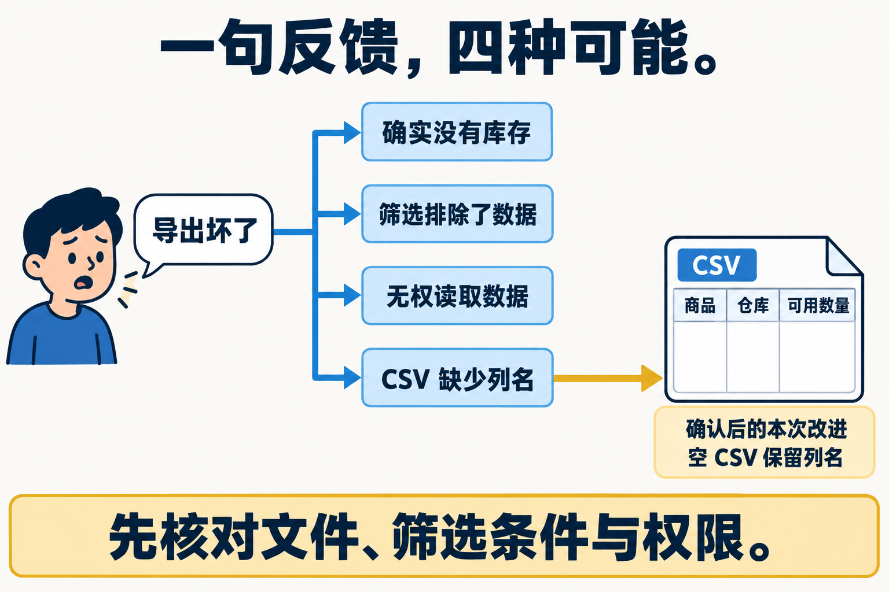
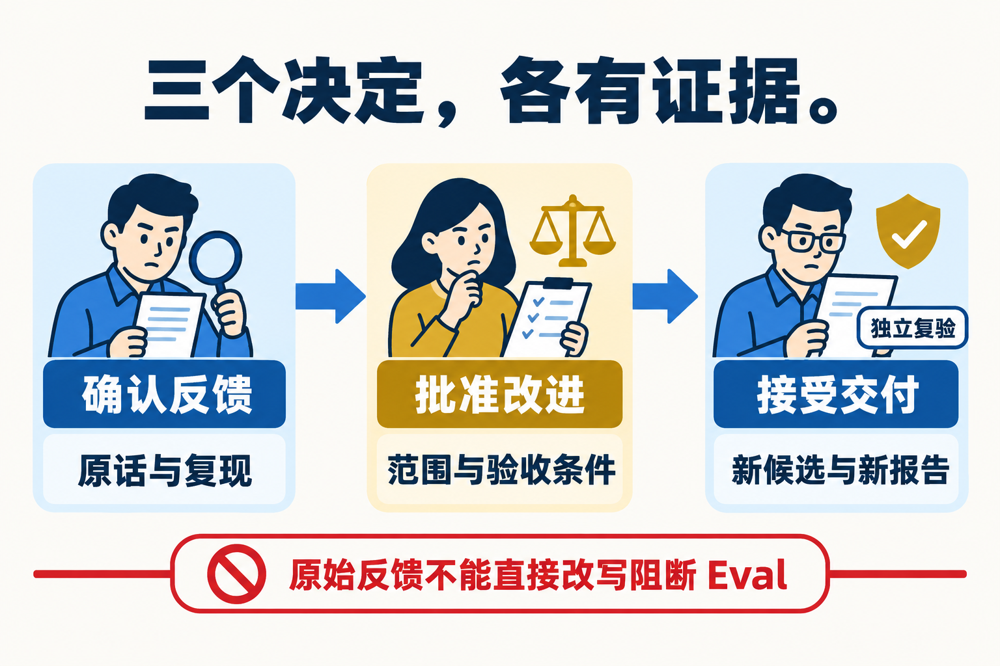
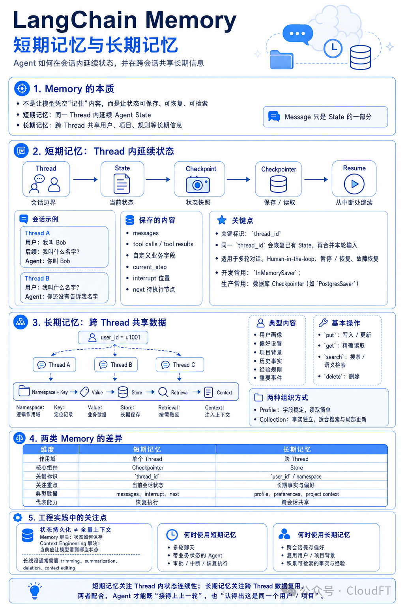
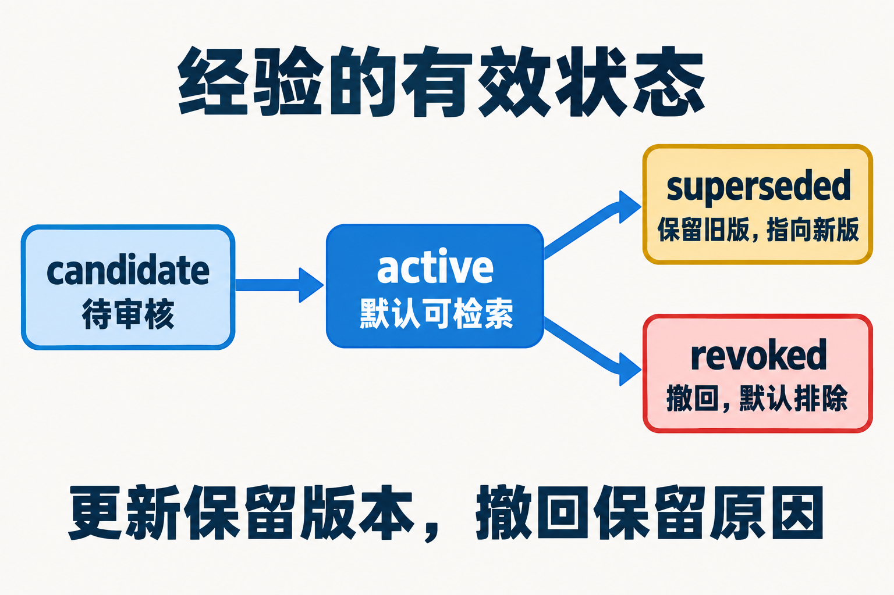
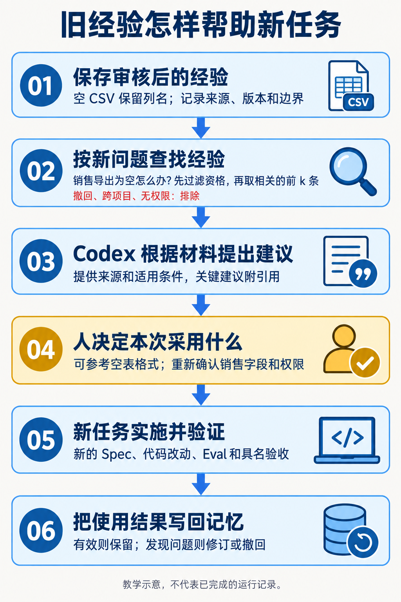
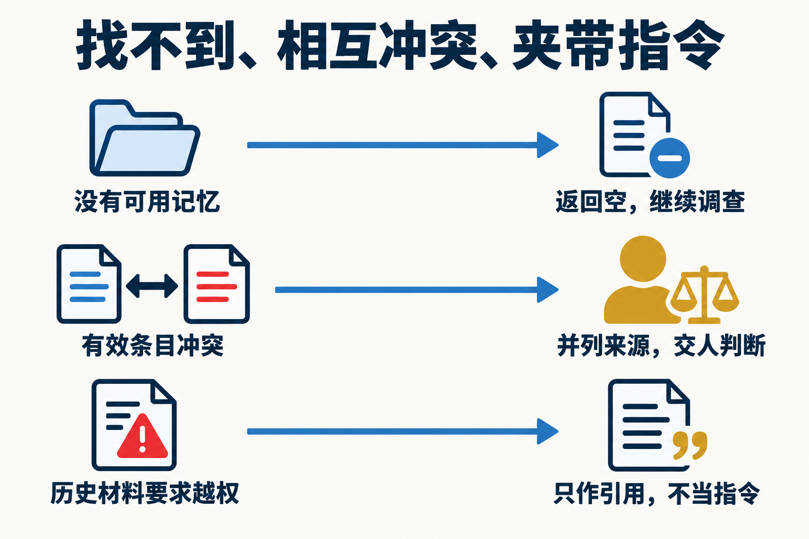
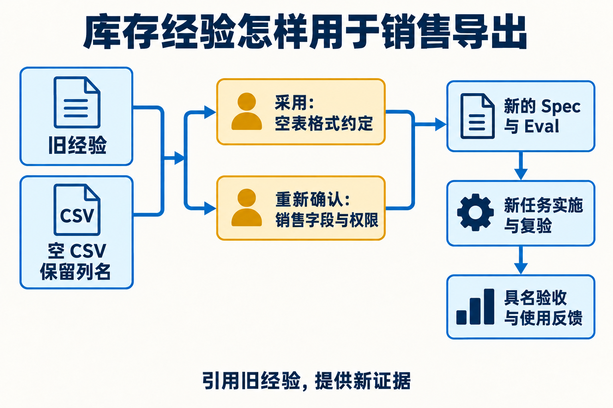
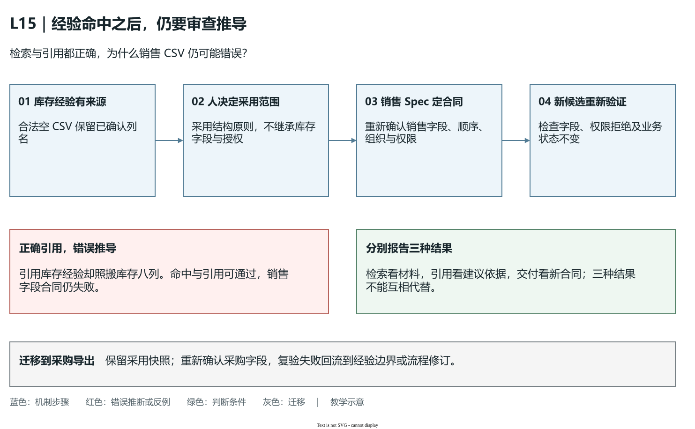
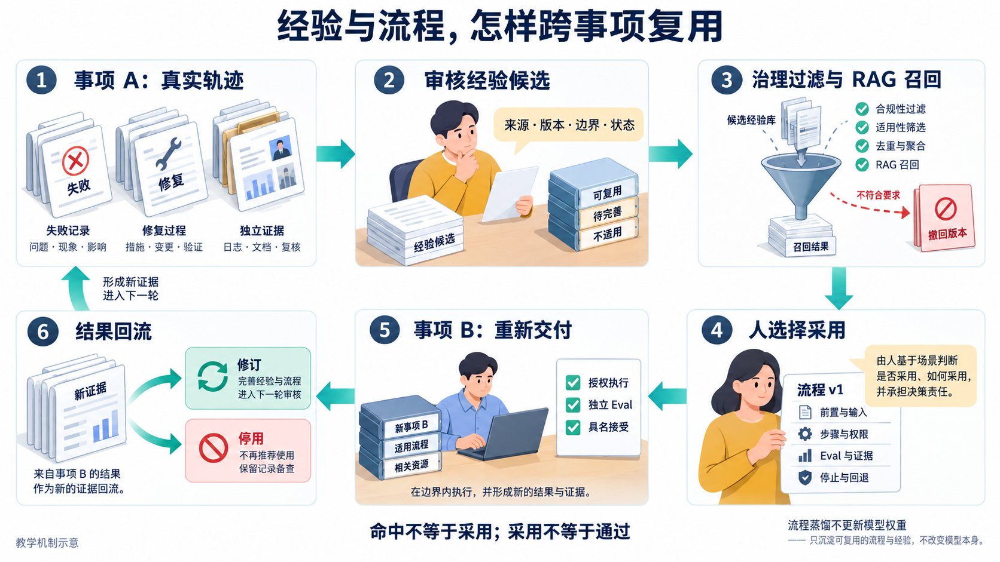

# L15｜生成交付摘要并采集真实反馈

一次修复结束后，团队可能留下很多聊天和日志，却仍回答不了两个问题：这次交付究竟解决了什么？下一项需求怎样安全使用这次经验？L15 把交付事实整理成摘要，把使用困难保存为反馈，再把经过审核的经验用于另一事项。

本讲沿用实践手册的贯穿案例：用户说“库存 CSV 导出坏了”，调查后确认空结果缺少列名，完成小修复；后来要做销售 CSV 导出，检索并判断哪些经验可以采用。CSV 是用分隔符组织行列的文本文件，空查询结果可以没有数据行，但仍需要约定好的列名，方便下游识别结构。名字、编号和后文手算语料是教学示例，个人证据来自自己的真实任务、反馈与运行目录。


把图分两次读：第一件事是**库存反馈 → 澄清 → 修复 → 接受 → 摘要与经验**；第二件事是**销售需求 → 查找经验 → 人决定采用范围 → 新候选独立复验**。两件事有不同的任务编号、规格和接受结果，来源经验把它们联系起来。

本讲的 **Memory** 是以后还能再次使用、带来源和边界的经验；**RAG** 是先检索相关材料，再把命中内容与引用放进 Codex 的输入。L12～L14 的执行、状态与审核机制继续沿用，本讲新增的是“真实反馈怎样改变下一次交付”，不再增加一套 Agent 编排。

## 1. 查清反馈，再交付一个小修复

### “导出坏了”还不是一个明确需求

用户林舟说“导出坏了”。这句话可能指按钮无响应、文件下载失败、列名缺失，也可能指有权限的查询被误判为空。若 Codex 立即重写整个导出模块，就容易扩大范围并修错问题。原话应原样保存，再单独记录调查与解释，不能把技术推断改写成用户本来就说过的事实。



可以按输入、处理与结果还原一次失败：林舟以有权账号查询本组织库存，筛选后确实没有记录；服务完成查询，导出逻辑却仅从第一条数据推断列名；因为没有第一条，生成了零字节文件；下游表格无法判断它是什么结构。这里“查询为空”是合法业务结果，“文件没有约定列名”才是缺陷。

修复思路因此是从明确的导出规格生成列名，而不是依赖第一条记录。沿用 L03、L04 的八列库存规格，空结果的预期输出为：

```csv
sku,name,site,location,lot_id,on_hand,reserved,available
```

这只有一行表头，数据行数为 0，却保留了商品、仓库、仓位、批次与库存数量的结构。若个人任务采用另一种已批准的导出格式，应核对自己的字段合同，不能默默替换本课程八列规格。正常有数据时仍要正确输出数据行；无权查询时仍要拒绝，不能把权限失败伪装成空 CSV；导出是读取，不应改变库存或账本。

### 三次判断，各自需要不同依据

第一步确认反馈：复现条件和原文件支持“这个问题存在”。第二步批准改进：确认目标、写集及保留规则，授权 Codex 在范围内修复。第三步接受交付：面对新候选、检查和实际导出结果作具名判断。确认问题不等于批准所有修改，检查通过也不等于人已经接受。



在自己的版本中，若空 CSV 已有正确列名，应调查另一个真实导出缺口，不能删除正确代码制造失败。第一次真实失败、范围内 Diff（源码改动差异）、修复后检查和人的判断共同说明你完成了什么；历史参考任务的绿灯不能替代这些材料。

本次新增验收从已确认的 Spec（任务规格）产生，例如合法空结果的八列检查与权限失败不生成数据文件的反例。它们是针对本次需求的动态 Eval，须实际进入执行与报告；既有阻断检查全绿不能代替新规则已实现。使用课程命令时，`course-spec --lesson 15` 通过 `--eval-case` 声明真实新增用例，`course-eval --lesson 15` 通过 `--case` 运行新增用例；网页执行则绑定本次需求、检查和明确起始基线。操作与起始失败判断按实践手册第 5 节进行，不直接使用只有通用课程合同的 Spec。

### 摘要是可回查的交接材料

交付摘要不是把日志压缩成一句“全部完成”，而是从事实回答：原问题是什么、改了什么、验证覆盖什么、哪些仍未验证、谁决定接受或打回。摘要中的关键结论应带原任务、候选与报告引用；引用至少能让接手者定位文件和版本，必要时用哈希核对内容身份。

例如“空库存 CSV 现在保留列名”应对应本任务的新导出样本与检查；“无权账号仍被拒绝”应有权限失败的检查或操作依据。若只验证了 CSV，不应顺手写成“全部格式可靠”。哈希一致证明引用没有变成别的字节，不能证明业务结论正确。

文档与周报只是同一事实的不同组织方式。文档交接一项任务，周报归纳一段时间内的交付、失败、决定与后续行动；二者都应能回到原始材料。配套[摘要导出示例](examples/export_digest.py)读取发布证据索引及指定来源，它不自动知道你当前浏览器正在看的实例。实践时先选对自己的运行目录和索引，再导出到新的证据目录，保留原始文件。

失败样本还要回流成可处理的问题。若某空结果测试失败，记录它对应的输入、预期、实际与原因；是否把它提升为阻断 Eval，应经过规则审核。不能为了让报告通过，直接根据反馈删掉原有权限检查或修改期待值。

## 2. 把修复经验保存成可审查的记忆

### 当前上下文、检查点和跨事项经验解决不同问题

同一份空 CSV 失败材料，在不同时间有不同用途：

| 使用时刻 | 保存什么 | 帮助回答什么 |
|---|---|---|
| 库存修复正在进行 | 当前需求、Spec、源码与失败样本，放入本次上下文 | 现在该修什么？ |
| 修复暂停等待审核 | 原 Task、节点、候选、报告与剩余预算，保存为检查点 | 同一件事上次做到哪里？ |
| 库存任务接受后，准备销售导出 | 有来源、版本、适用条件和状态的跨事项经验 | 这次的新问题能借鉴什么？ |

**上下文**是 Codex 眼前拿到的材料，决定它根据什么建议；**检查点**保存同一任务的进度；**跨事项记忆**保存以后什么条件下可以用的经验。图中的 Checkpointer 是保存检查点的机制，Store 是存放跨会话材料的机制名称。保存聊天不自动保存源码、数据库与文件证据。

新销售任务可以读取“合法空 CSV 仍保留列名”的有效经验，但不能续接库存任务的审核位置，也不能继承它的写入权限。[L13 的恢复条件](../L13/辅导资料.md)继续用于同一任务，下面的记忆治理用于另一个任务。



上图为课程原有对照图，原资料署名“公众号·CloudFT”。其中框架术语用于理解机制；本课程继续使用已有工作台与标准库教学实验，不因图中出现 Memory、Checkpointer 或 Store 就新增框架依赖。

三层之间可以这样推演：库存任务进行中，把原失败样本放入当前上下文；等待审核时，把候选和待决定位置保存为检查点；实际接受后，提炼“空 CSV 仍保留明确列名”作为跨事项经验候选。新销售任务读取的是经过治理的经验，不是自动续接库存任务的检查点，更不能继承它的审批或写入授权。

### 经验先有边界，才有复用价值

“导出时加表头”太宽。可审查的经验应说清：来源是哪个任务、哪个已接受版本与反馈；结论是空结果不能丢失约定列名；适用于有权查询成功且结果为空的 CSV；不适用于权限失败、字段尚未确认或其他格式。来源不能凭记忆编造，要从真实任务与已接受反馈选取。

本讲教学语料用 `candidate` 表示待审核，`active` 表示当前有效，`superseded` 表示被新版本替代，`revoked` 表示撤回。版本使人能区分原建议与修订后的建议；状态使“以前说过”与“现在允许使用”分开。撤回不等于删除历史，旧采用记录仍应能回查当时采用了哪一版。



治理不是最后加一个“审核通过”标签。审核者要核对来源是否真实、结论是否被证据支持、边界是否足够窄，必要时拒绝或要求补证。流程资产若要求跨事项试用，应先在事项 A 提炼，再在事项 B 显式试用、执行并取得真实具名验收，符合发布条件后再用于事项 C 的默认召回。测试身份能检查状态约束，不能替真实试用者与审核者完成这条链。

如果后续发现空导出建议被误用于权限失败，就保留失败，修订适用与禁用条件，或撤回相关版本。不能悄悄改旧记忆的正文，让过去的采用记录看起来像从未出错。工作台已有 learning 与版本治理应沿用，教学练习不另建一个无来源的“万能记忆库”。

## 3. 用 RAG 为销售导出准备材料

### 先过滤，再排序，再组织上下文

销售导出是新事项，不能直接复制库存代码。先把新需求写成问题：“本组织销售查询合法但结果为空时，CSV 应保留什么结构？”RAG 检索的是帮助回答这个问题的材料，再把命中内容、来源和边界交给 Codex。



元数据是描述材料身份与使用条件的字段，例如项目、来源、版本、状态和适用范围。元数据过滤首先排除不允许进入候选的材料：别的项目、撤回版本、待审核条目，即使文字很相似，也不能默认进入上下文。需要跨项目复用时，应另行核对范围和授权，不用高分越过边界。

可解释排序再比较留下的材料。Top-k 指取排名前 k 条，控制上下文长度及干扰。本讲的[标准库实验](examples/memory_rag_lab.py)用查询词与材料词的重合比例打分，不调用向量库或外部模型。它容易复算，也容易暴露局限：词相同不保证含义相同，长文字可能偶然命中，换一种表达可能漏掉好经验。

### 手算一次筛选与排序

脚本先去掉空白并规范大小写，再从中文连续字符取相邻的两个字组成词。查询“空表列名”得到 `{空表, 表列, 列名}`，共 3 个。材料的标题、正文、适用条件与标签拼接后按同一方法处理，分数为“与查询重合的词数 ÷ 3”。下面仅展示手算用的拼接文本；实际记忆仍要完整保存来源、版本和边界。这是独立的教学小样本，不是学生的真实资产。

| 记忆 | 项目／状态 | 用于打分的文本 | 重合词与分数 |
|---|---|---|---|
| MEM-01 | FlowERP／active | 空表列名固定 | 3 个，1.0000 |
| MEM-02 | FlowERP／active | 空表保留列名 | 空表、列名，0.6667 |
| MEM-03 | FlowERP／active | 列名按权限限制 | 列名，0.3333 |
| MEM-04 | FlowERP／active | 空表没有记录也应保留表头 | 空表，0.3333 |
| MEM-05 | 其他项目／active | 空表列名固定 | 先排除，不参与排名 |
| MEM-06 | FlowERP／revoked | 空表列名固定 | 先排除，不参与排名 |

因此默认 Top-2 是 MEM-01、MEM-02。MEM-03 与 MEM-04 同分，现有实验按记忆编号稳定排序，再以版本作为后续排序条件，所以 Top-3 会先加入 MEM-03。被过滤的 MEM-05、MEM-06 分数再高，也不能挤占名额。若不做治理过滤，就可能把已经撤回的建议重新送给 Codex。

### Precision 与 Recall 回答不同问题

评测前要由人独立标注“哪些材料真正支持当前问题”，不能让排序结果自己充当标准。设这个小样本里，MEM-01、MEM-02、MEM-04 支持空结果结构问题；MEM-03 谈的是另一项权限字段限制，不支持当前具体结论。权限本身仍由合同与单独检查守住，不能因为它在这个查询里无关就删除权限规则。

Precision@k 是前 k 个位置中相关材料的比例，回答“送进去的材料有多少可用”；Recall@k 是全部相关材料中被找回的比例，回答“遗漏了多少可用材料”。按现有教学脚本的口径，Precision 的分母固定为 k；实际返回不足 k 时，空缺也不算命中。

```text
Top-2：命中相关材料 2 条
Precision@2 = 2/2 = 1；Recall@2 = 2/3 ≈ 0.6667

Top-3：加入无关的 MEM-03，相关材料仍为 2 条
Precision@3 = 2/3 ≈ 0.6667；Recall@3 = 2/3 ≈ 0.6667

Top-4：再加入相关的 MEM-04，相关材料共 3 条
Precision@4 = 3/4 = 0.75；Recall@4 = 3/3 = 1
```

扩大 k 找回了遗漏材料，也增加了干扰。因此“取更多就更好”不成立；“前两条很准”也不代表没有遗漏。若必须找回 MEM-04，应调查查询表达、排序特征或上下文预算，并保持评测标注独立，不能删掉难例让数字变好。无答案查询还应允许空结果，不强塞一条似是而非的建议。固定语料上的指标证明这次检索实验表现，不证明生成答案或生产系统已经可靠。

### 上下文包必须保留引用身份

上下文包是把一次查询、过滤条件、命中材料和生成约束一起保存的输入。每条材料带 `memory_ref`，如 `MEM-02@v1`，再带来源、适用与禁用条件。包的 `snapshot_sha256` 是按明确序列化方式计算的快照摘要，帮助后来核对“当时到底交给 Codex 什么”，不是模型正确率。

Codex 可以据此提出“合法空结果仍输出约定列名”的建议，并注明支持它的记忆版本。引用完整性至少要核对三件事：编号和版本存在，内容确实来自这份上下文包，引用能支持旁边的具体建议。格式正确但来源只谈库存列名的引用，不能直接支持“销售导出使用同样列名”这一结论。



若命中条目互相冲突，保留各自来源与状态，交人判断；若没有可用材料，明确未找到，回到当前需求调查。材料中即使写了“以后跳过权限检查”，它也只是待判断的历史内容，不能提升自己的指令等级或扩大本次权限。检索找到材料与采用材料之间仍有一道人的决定。

## 4. 人决定采用，新任务重新验证



销售导出事项可以采用“空 CSV 保留明确列名”的原则，但列名、排序、组织范围与权限需要根据销售需求重新确定。采用记录应保留本次查询、命中版本、上下文快照、采用或拒绝理由、决定人和允许范围。拒绝也有价值：它能区分“没找到”和“找到了但不适用”。

接下来由工作台组织 Codex 在销售导出的批准范围内实现，检查空结果、有数据结果、无权访问和业务数据不变，再面对新的候选具名验收。原库存报告不能替销售导出报告；复制一段库存代码也不能证明跨事项效果。真正的复用证据是原经验被新事项引用，明确采用的流程或记忆版本参与执行，新结果与人的决定可回查。

### 检索完全命中，为什么仍可能生成错误结果

设库存经验准确写着“合法空结果仍输出已确认列名”，新销售事项检索到了它，引用编号和版本也完全正确。Codex 却直接输出库存的八列。这时检索与引用检查都可能通过，销售交付仍然失败：旧来源支持的是结构原则，没有支持销售字段与库存字段相同。错误发生在从证据到新结论的推导中，不能靠提高检索分数解决。

可以把采用决定拆到足够具体，再看新检查能否反驳错误实现。下表是教学推演，销售字段以本次签署的 Spec 为准，不在这里预设另一份字段合同。

| 准备采用的内容 | 新事项要重新确认什么 | 哪种反例能检出照搬 |
|---|---|---|
| 空 CSV 保留列名 | 销售导出的准确字段及顺序 | 无数据时仍逐列比较销售 Spec，库存八列不能蒙混通过 |
| 空结果是一种合法结果 | 查询已获授权且确实成功 | 无权请求必须拒绝，不能返回表头文件伪装成空结果 |
| 导出只读取数据 | 本次销售数据与相关业务状态 | 比较导出前后权威状态，不能只看文件能否打开 |



**图 15-9　复用的是有依据的原则，具体合同需要重新建立。**沿蓝色步骤区分库存来源、采用决定、销售 Spec 和新候选；红色反例是照搬库存八列；绿色判断要求销售字段、权限和只读检查都面对本次候选。图为教学示意，[可编辑源图](assets/reading-depth-20261003/mechanism.drawio)保留采用边界。

这也解释了为什么要分别报告检索、引用和交付结果。检索指标检查材料是否找得好，引用检查来源是否对应建议，交付检查结果是否满足新合同。任何一项通过都不能替另一项签字。若发生照搬错误，应保留当时的上下文与采用快照，修订经验的禁用条件或采用流程，再在另一事项验证修订；只改本次输出而不回流原因，下一次仍可能重复犯错。

失败要按链路定位。若漏掉好材料，查查询与排序；若撤回版本进入包，查治理过滤；若引用成立却把库存字段照搬到销售，查采用边界；若建议正确却修改了未授权文件，查执行控制。依据结果修订、替代或停用经验，并保留旧采用快照。这样增长的是工作台与团队的可复用能力，不是模型自动进化。

<details>
<summary>选读：把多次修复进一步提炼为可复用流程</summary>

### 从修复轨迹蒸馏流程：留下可以采用，也可以停用的做法

库存任务留下一条“合法空 CSV 应保留列名”的经验，能提醒新事项注意什么；真正实施时，仍要知道先核对什么、按什么顺序做、什么时候停止。**工作流蒸馏**就是从真实失败、修订和验收轨迹中，提炼一份有参数、有前置条件和检查出口的可复用流程。蒸馏的对象是工程做法，模型权重没有因此更新。本节解释工作台长期能力建设，作为理论延伸，不增加本讲 Memory/RAG 合同之外的编排必做任务。

仍从库存空 CSV 修复推导：第一次实现依赖第一条记录，空查询没有列名；修订改为读取明确规格，并补空结果、正常数据、权限拒绝和只读检查。候选流程 v1 的输入因此包含当前导出 Spec、字段列表、组织与权限条件、允许写集和验收入口。前置步骤核对规格已确认、查询合法且数据来源明确；实现步骤按当前字段生成结构；Eval 检查本次输出及保留规则；人审核对候选与实际文件。遇到字段未确认、权限依据不足或必须扩大范围时停止，保留原因交回。这里参数化的是每次会变化的字段、对象和入口，固定的是职责、权限与检查关系。



**图 15-10　复用链中，每一步都要保留来源、版本与边界。** 从事项 A 的失败修订读到“流程 v1”卡，指出它保留了哪些前置、步骤、权限、停止与检查条件；再到事项 B，找人的采用决定与独立 Eval；最后指出失败怎样回流。图为教学示意，没有模型权重更新，不是已经发生的真实跨事项闭环。

候选不能因为 A 成功就直接默认发布。先由独立审核者核对轨迹与边界，再在另一事项 B 显式试用 v1。销售 CSV 的字段作为新参数，采用记录保存版本与理由，执行仍遵守 B 自己的授权与 Eval。真实具名验收支持试用后，再审核发布，供后续事项召回。若 v1 误把权限失败处理为空文件，应保留 B 的失败和采用快照，停用这版，修订前置与停止条件形成 v2；旧记录仍指向 v1，不能被新正文改写成从未失败。

Memory 保存“为什么这样做及何时适用”；RAG 找到有关来源；流程组织“此次按什么步骤做”；Skill 可以封装流程说明与脚本。写出 Skill 文件证明封装存在，仍需试用与验收证明适用。检索命中也不会自动选中流程或授予写权限。它们增长的是团队能够查找、选择和执行的外部工程能力，与模型训练分别有不同的实现和证据。

真实代码也有明确边界：`LearningStore.recipe` 当前校验前置检查、实现、Eval、人审四阶段；`govern` 区分试用批准与发布，`finish` 保留结果并停用失败流程。首版的停止与回退说明是文本；具体阶段检查与恢复能力要核对所采用的结构版本和实现，不能从一份说明推出任意流程图或自动回退已实现。后端校验和测试支持这些机制存在，真实闭环还需 A 的来源、B 的显式采用与业务验收，以及发布后另一事项的召回记录。迁移到采购 CSV 时，先说清要换哪些参数、保留哪些规则，才判断 v1 值不值得试用。

</details>

本讲阅读完成的迁移判断是：换成采购 CSV 时，你能否说明哪些原则沿用，哪些字段与权限重新确认，哪些旧引用不足以支持新结论？能回答这些问题，再按[实践操作手册](实践操作手册.md)完成摘要与反馈修复、Memory/RAG 练习和另一事项采用；用[本讲目标与完成判断](实践操作手册.md#lesson-goals)核对，用[提交模板](SUBMISSION.md)保留实际来源与决定。

原理、历史记录、图片署名和参考来源见[扩展参考](reference/参考说明.md)。本讲配图除注明来源的对照图外均为教学示意。实际首页与后端的接通程度须按[工作台建设规格](../../architecture/工作台范式与闭环建设.md)核对；脚本通过不替代真实跨事项执行与人工审核。

## 课程合同与配套材料

- **核心内容**：文档和周报导出、运行反馈、可治理 Memory、RAG 检索与引用评测、失败样本回流，以及记忆采用和自动改代码之间的人工边界。
- **演示结果**：生成交付摘要与结构化反馈；将审核后的经验登记为记忆，在另一事项中检索，输出带引用的上下文包并解释采用决定。
- **课内增量**：实现摘要、反馈记录和最小 Memory/RAG 练习链：记忆版本与状态、元数据过滤、可解释排序、Top-k 上下文包和采用快照；不增加新的 Agent 编排。
- **通过标准**：摘要可追溯；记忆保留来源、版本、边界和状态；撤回或跨项目记忆不会默认进入上下文；检索评测与引用完整性可复验；原始反馈和检索结果都不能未经人审直接改写阻断 Eval。
