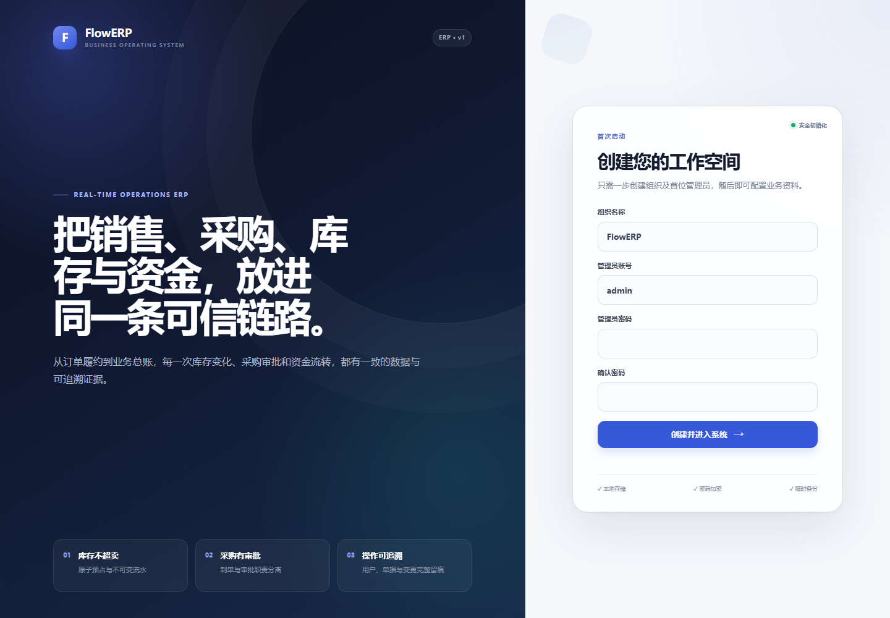
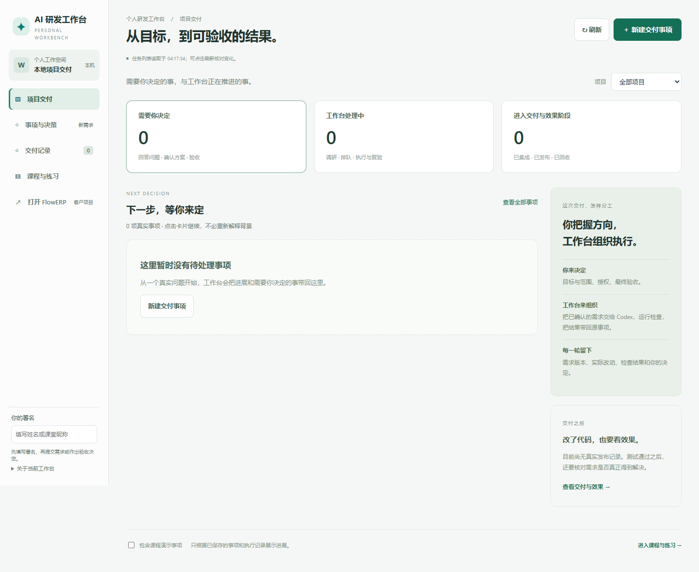

# L16 冷启动观察：客户页打开了，工作台为什么退出？

本轮使用新的源码快照、新虚拟环境与两套新运行目录，在同一台 Windows 机器上启动服务。基础 Python、操作系统与网络仍共用，因此这是本机隔离重建记录，不能称为陌生机器或容器验证。

## 先看失败，再解释条件

只复制程序文件并安装项目后，FlowERP 进程能够启动，工作台却退出，报错“目标项目必须是独立 Git 工作区”。工作台启动时需要登记默认项目，而所复制的源码目录没有 `.git`。这项隐含条件在作者的原仓库一直存在，所以普通重启没有暴露它。

该次本地接口探测还遇到代理返回的502。这个502是探测链路的观察，不能用来替代工作台自身日志中的退出原因。后续仅对本机探测禁用代理，再分别核对进程日志、接口与浏览器，避免把环境问题和应用问题混在一起。

修订是在独立源码目录初始化 Git 元数据，并重新使用全新环境运行。这里只建立仓库，不携带作者历史或课程标签。现有真实克隆无需重复初始化；要运行课程代码交付，仍须准备可用基线和版本信息。

## 修订后的实际结果

| 检查 | 本轮实际观察 | 能说明什么 |
|---|---|---|
| 新虚拟环境、本地安装 | 两项命令退出0 | 该源码快照在本机可安装 |
| FlowERP 就绪接口 | `ready`，数据库、Schema等检查通过 | 探针所检查的运行条件成立 |
| FlowERP 首页 | HTTP 200，首次初始化表单 | 页面可访问，组织和管理员尚未创建 |
| 工作台健康接口 | `ok`，客户地址指向本次FlowERP端口 | 工作台响应且配置了本次客户实例 |
| 工作台首页 | HTTP 200，事项数为0 | 首页与空事项状态可显示 |
| 数据目录 | 客户与工作台使用不同新目录 | 两套服务没有共用同一运行目录 |



原生页面截图：这一步要求接手者创建组织与管理员。没有填写密码，没有把初始化页当作已经完成业务操作。



原生工作台截图：首页没有真实事项，下一步从“事项与决策”提出需求。页面可见不证明已经授权Codex执行、完成独立复验或接受交付。

客户运行目录还产生兼容用途的数据库文件，不能只按文件名判断归属。本轮工作台健康结果指向它自己的`workbench.db`，`erp_database`为`null`；应结合启动参数、实际路径与接口返回核对，而不是要求目录只能出现一个文件。

## 学员如何复核自己的环境

先准备第 1 步冻结版本对应的两份独立源码，分别记录 CodexFDE 和 FlowERP 的绝对路径。每个项目创建自己的新 `.venv`，不从作者机器或 Windows 复制虚拟环境。运行两套服务时显式传入不同目录和端口。以下端口是教学选择，使用前确认没有被占用；已有服务不能直接结束。

**Windows（PowerShell）：**

```powershell
# 在独立源码目录中执行。真实克隆已有Git信息时跳过这一行。
git init
py -3.11 -m venv .venv
.\.venv\Scripts\python.exe -m pip install -e .
```

独立 FlowERP 也须在它自己的根目录执行上面的虚拟环境创建与安装命令。然后按[客户环境检查](../../../reference/实操手册执行与排错.md#product-environment)在每个服务终端指定它的绝对路径；检查通过再启动。

**Windows 终端一（回到新 CodexFDE 根目录）：**

```powershell
$env:FLOWERP_PROJECT_ROOT = (Read-Host '新 FlowERP 源码绝对路径').Trim().Trim('"')
.\.venv\Scripts\python.exe -X utf8 -m workbench.cli serve --host 127.0.0.1 --port 18160 --runtime-dir .runtime/erp-trial-01
```

**Windows 终端二（另开窗口，进入同一个新 CodexFDE 根目录）：**

```powershell
$env:FLOWERP_PROJECT_ROOT = (Read-Host '同一个新 FlowERP 源码绝对路径').Trim().Trim('"')
.\.venv\Scripts\python.exe -X utf8 -m workbench.cli serve-workbench --host 127.0.0.1 --port 18161 --runtime-dir .runtime/workbench-trial-01 --erp-url http://127.0.0.1:18160
```

**macOS（zsh，安装两份独立环境）：**

```zsh
prepare_l16_cold() {
  printf '新 CodexFDE 源码绝对路径（不加引号）：\n'
  read -r l16Control || return 1
  printf '新 FlowERP 源码绝对路径（不加引号）：\n'
  read -r l16Product || return 1
  [ -f "$l16Control/workbench/cli.py" ] && [ -f "$l16Product/flowerp/server.py" ] || { printf '两份源码不完整，请核对路径。\n'; return 1; }
  [ ! -e "$l16Control/.venv" ] && [ ! -e "$l16Product/.venv" ] || { printf '已有虚拟环境；请保留它，改用新的冷启动目录。\n'; return 1; }
  # 真实克隆保留 Git 历史；只有没有 Git 信息的独立源码副本才初始化。
  [ -e "$l16Control/.git" ] || git -C "$l16Control" init || return 1
  [ -e "$l16Product/.git" ] || git -C "$l16Product" init || return 1
  python3.11 -m venv "$l16Control/.venv" || return 1
  "$l16Control/.venv/bin/python" -m pip install -e "$l16Control" || return 1
  python3.11 -m venv "$l16Product/.venv" || return 1
  "$l16Product/.venv/bin/python" -m pip install -e "$l16Product" || return 1
  cd "$l16Control" || return 1
  export FLOWERP_PROJECT_ROOT="$l16Product"
  ./.venv/bin/python -X utf8 -m workbench.cli environment-check --product
}
prepare_l16_cold
```

退出码为 `0` 且环境检查 `ok: true` 后继续。安装中断时保留首次错误，先修复该次环境；修复后续做与另一次全新冷启动分别记录，不删除目录来掩盖失败。

**macOS 终端一（仍在这个新 CodexFDE 根目录）：**

```zsh
./.venv/bin/python -X utf8 -m workbench.cli serve --host 127.0.0.1 --port 18160 --runtime-dir "$PWD/.runtime/erp-trial-01"
```

保留终端一。服务持续运行不会返回提示符，第二套服务必须在另一个窗口启动。

**macOS 终端二（另开 zsh 窗口，重新指定同一对路径）：**

```zsh
start_l16_workbench() {
  printf '同一个新 CodexFDE 源码绝对路径（不加引号）：\n'
  read -r l16Control || return 1
  printf '同一个新 FlowERP 源码绝对路径（不加引号）：\n'
  read -r FLOWERP_PROJECT_ROOT || return 1
  export FLOWERP_PROJECT_ROOT
  cd "$l16Control" || return 1
  ./.venv/bin/python -X utf8 -m workbench.cli environment-check --product || return 1
  ./.venv/bin/python -X utf8 -m workbench.cli serve-workbench --host 127.0.0.1 --port 18161 --runtime-dir "$PWD/.runtime/workbench-trial-01" --erp-url http://127.0.0.1:18160
}
start_l16_workbench
```

同一进程中断后，用原源码、原目录和原端口重启属于恢复；只有新源码环境与尚未使用的运行目录才属于新一轮冷启动。

在浏览器分别打开两个本机地址。记录源码版本或快照指纹、命令、实际目录和第一次观察，再检查健康接口。发生502时同时检查代理和服务日志，不根据一个状态码猜应用根因。

接下来仍要完成初始化、业务成功与失败输入、工作台现场新需求、独立复验、结果导出和反馈。没有Docker或Podman引擎时，容器构建与空卷运行保持未验证；本轮Dockerfile已补齐仓库初始化，但尚无实际镜像构建结果。
