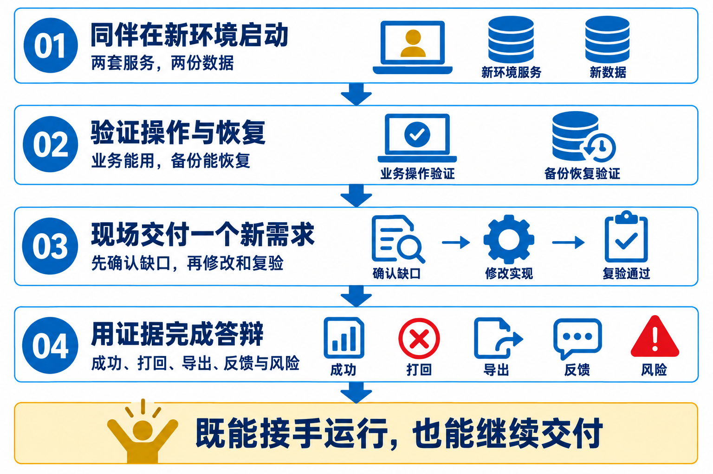
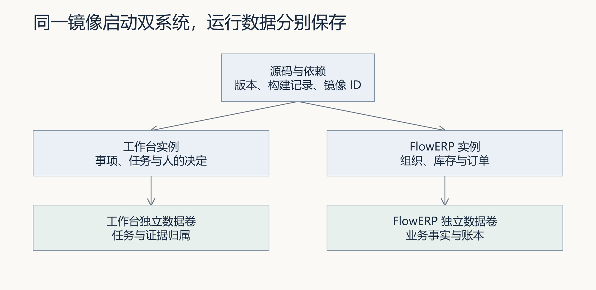
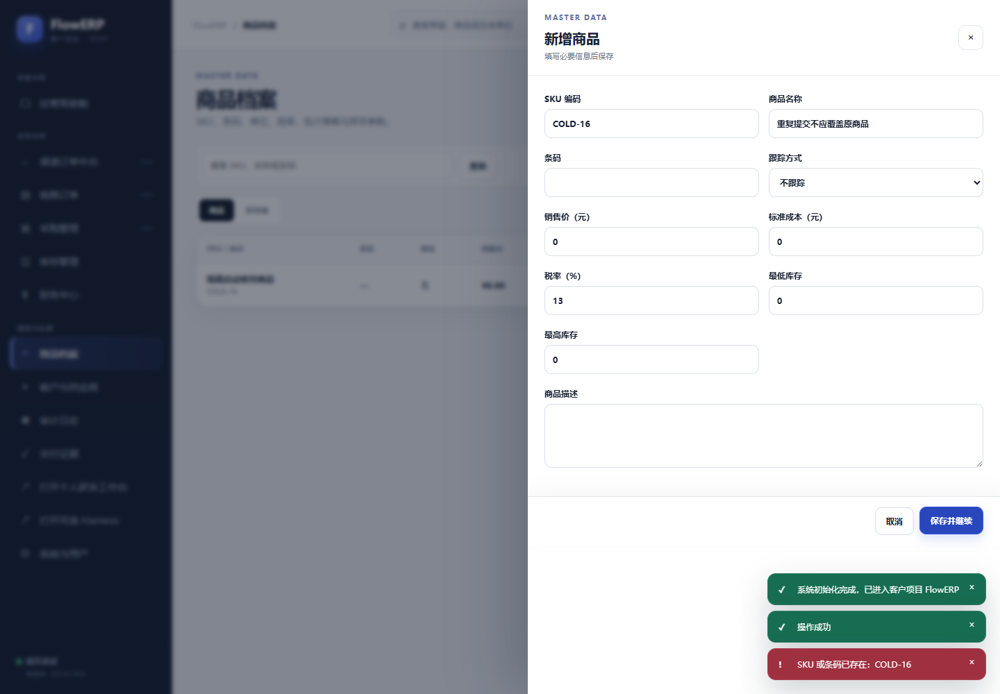
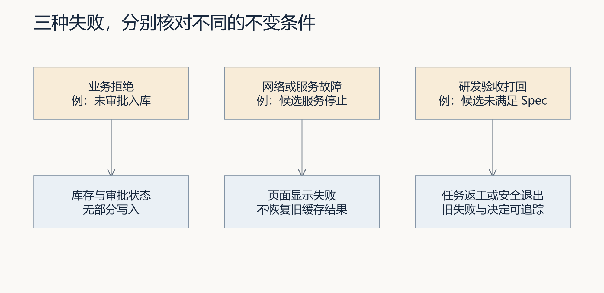
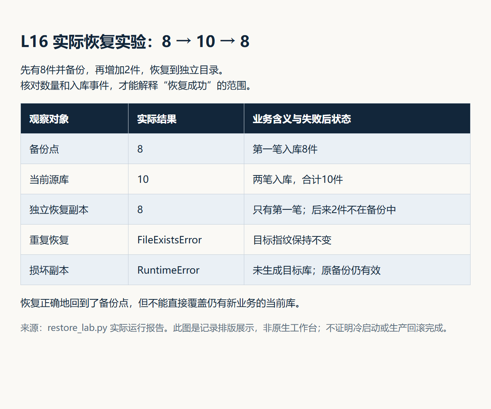

# L16｜在新环境接手，并完成现场新需求

> **终端选择：**本手册同时提供 Windows PowerShell 与 macOS 默认终端 zsh 的操作。每一步只运行自己系统对应的代码块；标为“通用”的 Python、Git 命令两端相同。开始或重开终端时，先按[macOS 环境与路径约定](../../reference/实操手册执行与排错.md#macos-zsh)恢复本讲使用的虚拟环境，再核对当前源码位置。

你的交付是能在新环境运行、还能通过工作台完成新需求的双系统。冷启动、现场交付和人的接受分别采集证据，再在同一索引中关联。先阅读[讲义](辅导资料.md)，理解健康与业务验收的区别。

结业使用此前未实现的受控小需求。先准备独立源码、项目环境、两套服务与新证据目录；容器、同伴冷启动、真实编码、业务验收分别取得结果。Loop、Graph 和演示数据各有来源，不能用例行检查全绿代替现场交付。

开始操作前，遇到解释器、路径或输出问题，按[执行与排错说明](../../reference/实操手册执行与排错.md)核对。

### 本讲交付目录地图

```text
〈冻结的 CodexFDE 源码〉/             ← 工作台源码版本，不在这里制造“空环境”
〈冻结的 FlowERP 源码〉/              ← 客户源码版本，与工作台分别记录

〈全新冷启动环境〉/
├─ 〈CodexFDE 独立克隆或复制〉/       ← 自己的 .venv、端口和运行目录
├─ 〈FlowERP 独立克隆或复制〉/        ← 自己的 .venv、端口和业务数据库
└─ 〈L16 证据目录〉/                  ← 日志、命令结果、索引；不放密钥和数据库

〈工作台为新需求返回的隔离候选〉/    ← 现场编码、Eval 与人工复验对象
〈容器项目与数据卷〉                 ← 若走容器路线，名称和归属另行记录
```

本讲至少同时存在“原源码、全新冷启动实例、新需求候选”三层。后文写“仓库根目录”时，必须在记录中注明是哪一个绝对路径；同伴冷启动不能直接复用作者原来的 `.venv`、运行数据库或已启动服务。

<a id="lesson-goals"></a>

## 本讲目标与完成判断

同伴按交付说明冷启动双系统，学生确认现场未实现的小需求，Codex 受控实施，同伴复验后以五分钟答辩解释纠偏。

| 建设对象 | 本讲目标与因果关系 |
|---|---|
| 工作台 | 在新的环境与问题中组织需求、执行、Eval、Loop/Graph、恢复、摘要与反馈，留下可接手的证据索引。 |
| FlowERP | 现场形成此前未实现、范围受控且可观察的 ERP 增量，成功、失败后状态及产品结果可回查。 |
| 学生证据 | 先保留个人判断；在真实失败、修订、复验与迁移中说明工作台改进怎样影响客户结果。 |

**交付前核对：**

- 原源码、冷启动实例与新需求候选分别标明版本和绝对路径，同伴保留首次失败与修订。
- 既有检查绿、新增目标能力缺失红后受控执行；真实 Diff、独立 Eval 和具名复验对应同一候选。
- 恢复、导出、反馈和风险分别有原始证据，Loop/Graph 如实收敛或停止；五分钟解释纠偏、技术债与迁移。

**课程四项合同：**

- **核心内容**：容器化、健康检查、回滚意识、演示叙事和技术债说明。
- **演示结果**：从干净环境启动系统，展示一次成功任务、一次失败打回、一次结果导出和一次反馈写入。
- **课内增量**：完成结业检查表与五分钟答辩稿。
- **通过标准**：需求能生成 Spec 和代码；阻断级 Eval 全部通过；Loop 收敛或如实安全退出；Graph 审核结论可追踪；摘要和反馈能够正确生成；干净环境可启动且仓库无密钥。


## 先看流程图，再开始操作



总览图展示四个教学阶段；下面七步是实际操作顺序，恢复实验在第 6 步执行，也可在发布前预演。原源码、全新冷启动环境和新需求候选是三层不同对象，每次写“仓库根目录”都要注明实际绝对路径。对象区别见[辅导资料第 1 节](辅导资料.md)。

### 按图执行的完成标志

| 步骤 | 在哪里操作 | 进入下一步前必须留下什么 |
|---|---|---|
| 1. 冻结实际起点 | 原源码 | 版本与环境 |
| 2. 由同伴冷启动 | 全新环境 | 首次失败与修订 |
| 3. 抽取未实现需求 | 工作台 + 你 | 受控 Spec |
| 4. 交付并复验 | 隔离候选 | 真实 Diff 与 Eval |
| 5. 检查治理入口 | 工作台 | 任务与审核 |
| 6. 恢复、导出与反馈 | 双系统 | 交付索引 |
| 7. 答辩与迁移 | 你 + 复验者 | 最终接受 |

## 第 1 步：冻结实际起点

<!-- step-guide-1 -->
> **一句话说明：**冻结两个仓库的版本、依赖和运行环境，形成另一位同伴可以重建的明确起点。

开始本讲 FDE 实践时，先在[提交模板](SUBMISSION.md)的首次判断与需求记录回答：未预演需求服务谁、为什么现在做，原请求怎样收敛为此前未实现且可复验的小需求？注明来源是实际观察、同伴试用还是教学设置，写下本次选择和暂缓范围，再请 Codex 协助调查。

记录源码版本、是否有未提交修改、Python 与执行器环境。未提交修改若属于本次交付，应明确打包并核对内容；不能只记一个不包含这些修改的提交号。把本次环境说明放进自己的证据目录，不上传密码、认证文件或运行数据库。

在仓库根目录查看本讲合同与工作区状态：

**Windows（PowerShell）：**

```powershell
git status --short
git rev-parse HEAD
.\.venv\Scripts\python.exe --version
.\.venv\Scripts\python.exe -X utf8 -m workbench.cli course-status
```

**macOS（zsh）：**

```zsh
git status --short
git rev-parse HEAD
./.venv/bin/python --version
./.venv/bin/python -X utf8 -m workbench.cli course-status
```

`course_ready` 只说明课程合同与线性标签条件，不证明你已冷启动或实现新需求。保留每条命令的退出码、输出与时间。失败先解释原因，不能只截最后一条成功结果。

## 2. 让另一位同伴按说明重建

<a id="prompt-environment"></a>

### 本步给 Codex 的完整提示词：环境重建

先填入本次真实路径、任务、对象和允许范围，沿用已确认的授权；输出完成后按本步预期复核。

```text
请核对本次交付版本、依赖、初始化和双服务数据归属，帮助我形成接手者可执行的冷启动说明。使用独立实验目录或全新 Compose 项目，保留旧状态。指出实际未验证项，区分启动、健康、业务操作与恢复。不要在说明中写入凭据，不执行删除数据卷。请记录首次失败、修订及再次操作结果。
```


<!-- step-guide-2 -->
> **一句话说明：**让另一位同伴只按交付说明从零重建，保留第一次失败，并据此修订说明。

按[部署与回滚说明](../../../deploy/ROLLBACK.md)准备本次独立环境。容器路线需要实际 Docker 引擎；新的 Compose 项目名、新数据卷和准确端口必须一起记录。旧项目仍在工作时使用另一个空闲端口，不结束别人的服务。修改 FlowERP 访问端口时同步核对允许来源。

该说明提供构建、启动、交互初始化、健康检查和日志命令。每次实验使用尚未用过的项目名；重启旧容器与挂载旧卷属于恢复实验，不能冒充空状态启动。没有容器引擎时，可以先在新隔离源码目录和新虚拟环境完成本机复现实验，明确标注隔离范围；容器构建一项保持未验证，不能据此声称已完成容器化。

让同伴仅看交付说明操作，作者记录对方必须追问的条件。每次追问都对应一项说明缺口。修订后由同伴重做相应步骤，保留首次失败和修订版本。不要删除原库制造空环境。

核对两套服务：工作台首页负责事项与决策；FlowERP 是客户产品。分别记录地址、卷或目录、初始化状态和一条可核对的对象。健康接口通过后，还要从工作台打开正确的客户实例并完成实际业务操作。



按图分别记录镜像、实例与数据归属。容器内路径相同不代表挂载同一卷。

### 2.1 对照实际失败，补齐启动条件

先阅读[本机隔离启动案例](examples/cold-start-observation.md)，写下“FlowERP进程启动、工作台退出”最可能缺少什么。再看工作台日志中的Git工作区错误，核对自己的源码来自真实克隆还是无Git信息的压缩包。

无Git信息的独立源码目录需要初始化仓库元数据。实际克隆保留原版本；不要为了套用示例重建它的历史。该条件已补入部署说明与Dockerfile，仍须在有引擎的环境构建验证。完成项目安装并不证明这一环境能执行课程新需求。


操作观察｜本轮修订后首页为零事项。请核对自己的首页与客户链接，记录实际目录和地址；不要把参考空首页作为自己的交付完成截图。

### 2.2 从页面继续到业务

FlowERP首次初始化页出现后，由操作者在本机设置组织与管理员密码，不将密码写入报告。随后登录正确组织，执行本次指定业务，记录成功结果与一个应被拒绝的输入，再核对失败后数据。健康接口成功但仍停在初始化页时，应记为“待初始化”，不能写成业务验收通过。

下面用商品建档走完一次观察。先预测第二次输入会发生什么，再操作并回查，不能用参考记录替代自己的执行。

1. 完成初始化，进入“商品档案”，新增SKU `COLD-16`、名称“隔离启动核对商品”，保存后核对列表中的记录。
2. 再次新增同一SKU，名称改为“重复提交不应覆盖原商品”。预期拒绝创建，原记录保持不变。
3. 看到错误后关闭表单并刷新，核对仍只有一条COLD-16且原名称未变。退出并重新登录同一组织，再回查一次。



操作观察｜本机新隔离环境中，初始化和建档各返回201，重复SKU返回409；刷新后条数和名称未变，重新登录可回查。图中绿色提示来自之前的成功操作，红色提示才对应重复提交。采集时等待提示动画结束，避免截图漏掉本次错误。

这只是既有商品建档能力的最小复验，没有产生库存变化，也不替代现场新需求。完整步骤与原始响应见[初始化与商品建档复验](examples/初始化与商品建档复验.md)。

将源码版本或快照、两套启动参数、健康响应、原生截图和业务对象放在同一证据索引中。本机新目录仍共享操作系统；容器空卷、陌生机器和同伴独立重建分别补证。

## 3. 抽取此前未实现的小需求

<a id="prompt-delivery"></a>

### 本步给 Codex 的完整提示词：现场需求与交付

先填入本次真实路径、任务、对象和允许范围，沿用已确认的授权；输出完成后按本步预期复核。

```text
请从工作台同一事项组织这次具体需求。先确认目标能力在本次基线中尚未实现，明确来源、目标、非目标、约束、验收用例和完成定义。检查既有测试通过，新增验收因真实能力缺口失败；再依据已授权范围执行。保存真实调用、Diff、独立 Eval、成功与失败后状态。遇到合同冲突或范围不足，给出具体矛盾和调整建议，不伪造红灯或人的决定。
```


<!-- step-guide-3 -->
> **一句话说明：**从真实反馈中选择一个此前未实现的小需求，把范围压缩到现场可以完成和验收。

与需求方约定角色、场景和范围，再由复验者改变一个未预演条件。可从查询范围、导出语义或失败恢复中选题，但必须先检查当前代码和页面，确认目标能力尚未实现。[库存筛选真实案例](../cases/L16-库存余额筛选真实执行案例.md)是分析材料；它已实现的内容不能直接当作自己的新题。

把具体需求写成来源、目标、非目标、约束、验收用例、完成定义六段。区分调研阶段的限制与最终交付的非目标；例如“本轮调研不改代码”不应成为开发合同的禁止修改条款。让同伴指出一处可能歧义并给出解释或修订。

先在本次冷启动工作台的首页“事项与决策”登记或打开这项需求，记录实际事项编号、确认人及工作台运行目录。下面把新增检查、起点提交和正式执行连成一条路线；不需要另找附件。实际执行器配置见[网页代码执行说明](../../reference/工作台网页代码执行.md)。

<a id="new-requirement-start"></a>

### 3.1 准备检查候选，保存本人的需求

**操作位置：本次冷启动的 CodexFDE 控制实例根目录。** 激活这个实例自己的 `.venv`，先读取当前执行合同：

```text
python -X utf8 -m workbench.cli course-contract --lesson 16
```

以 `lesson_contract(16).eval_cases` 对应的输出为既有检查依据；当前只有 `delivery_evidence_and_review_controls`，后面的旧项命令采用此名称。若本地输出不同，先核对课程版本，并保留全部旧项。在同一 Git 库准备检查 Worktree；准备编号只标识隔离目录，不是正式交付 Task ID。第 3.1～3.3 节在同一操作终端续做；重开时按原证据恢复控制解释器、控制根目录、原运行目录、本人 Spec、检查候选和实际新增名称，再核对源码位置。

**Windows（PowerShell）：**

```powershell
$l16Control = (Get-Location).Path
$l16Python = (Resolve-Path '.venv/Scripts/python.exe').Path
$l16Item = Read-Host '首页实际事项编号'
$l16Runtime = [IO.Path]::GetFullPath((Read-Host '本次冷启动工作台运行目录'))
$l16Spec = (Resolve-Path -LiteralPath (Read-Host '本人确认版六段式需求的绝对路径')).Path
& $l16Python -X utf8 -m workbench.cli spec $l16Spec
if ($LASTEXITCODE -ne 0) { throw '先修正本人 Spec，尚未开始实施' }
git rev-parse --verify 'refs/tags/course/l16-start^{commit}'
if ($LASTEXITCODE -ne 0) { throw '本实例缺课程起始标签，先恢复交付的 Git 历史' }
$l16PrepId = 'TASK-PREP-L16-' + [guid]::NewGuid().ToString('N')
& $l16Python -X utf8 -m workbench.cli course-prepare --lesson 16 --task-id $l16PrepId --runtime-dir $l16Runtime
$LASTEXITCODE
```

**macOS（zsh）：**

```zsh
prepare_l16_checks() {
  l16Control="$PWD"
  l16Python="$PWD/.venv/bin/python"
  [ -x "$l16Python" ] || return 1
  printf '首页实际事项编号：\n'; read -r l16Item || return 1
  printf '本次冷启动工作台运行目录（不加引号）：\n'; read -r l16Runtime || return 1
  l16Runtime="$("$l16Python" -c 'from pathlib import Path; import sys; print(Path(sys.argv[1]).resolve())' "$l16Runtime")" || return 1
  printf '本人确认版六段式需求的绝对路径（不加引号）：\n'; read -r l16Spec || return 1
  "$l16Python" -X utf8 -m workbench.cli spec "$l16Spec" || return 1
  git rev-parse --verify 'refs/tags/course/l16-start^{commit}' || return 1
  l16PrepId="TASK-PREP-L16-$("$l16Python" -c 'import uuid; print(uuid.uuid4().hex)')"
  "$l16Python" -X utf8 -m workbench.cli course-prepare --lesson 16 --task-id "$l16PrepId" --runtime-dir "$l16Runtime"
}
prepare_l16_checks
```

**预期结果：**准备退出 0，返回 `mode: git_worktree`、`path` 和 `baseline_commit`。保存这三项并关联首页事项；`baseline_semantics` 应为 `tagged_start`。缺标签时 CLI 会退回 HEAD 并标为 `progression_gate`，只可预习，不能进入本次真实执行。这里采用固定 `course/l16-start` 标签，不会自动组合当前独立 FlowERP 的未提交修改；按候选实际源码与标签版本核对客户能力。只有 `--source working-tree` 才创建当前双仓源码快照，但它有自己的 Git 库，不能直接作为本路线的会话提交。

**仍在操作终端，进入刚返回的 `path`，先保存准备差分，再让 Codex 新增检查：**

**Windows（PowerShell）：**

```powershell
$l16CheckCandidate = (Read-Host '刚返回的检查候选 path').Trim().Trim('"')
Set-Location -LiteralPath $l16CheckCandidate -ErrorAction Stop
```

**macOS（zsh）：**

```zsh
printf '刚返回的检查候选 path（不加引号）：\n'; read -r l16CheckCandidate
cd "$l16CheckCandidate"
```

**Windows / macOS 通用：**

```text
git status --short
git diff --stat
git diff --name-only --diff-filter=D
```

**预期与失败处理：**核对本次实际差分及删除清单。若起始版本含教师辅助门闩 `PROGRESSION.json`，候选准备器会删除它；保存这条起始差分，后续与本人检查改动分开。它不是目标功能缺失证据，不恢复、不暂存进检查提交。另有不明改动时先核对来源，不能把整个准备差分称为自己的实现。

若冷启动目录没有原 Git 历史、标签缺失、候选缺少目标业务源码，或目标能力在这份基线已存在，先修复起点或重新选题。不要把原独立客户库的通过结果补成候选通过，也不要把已实现的库存筛选案例作为新题。当前 `course-submit` 要求会话提交在控制实例同一 Git 库可解析，并位于固定起始提交之后；不能只给一个其他仓库的 SHA。

### 3.2 只新增验收，取得既有绿与目标红

把本人需求和刚返回的检查候选绝对路径交给 Codex，**本阶段只建设检查，不实现业务目标**。先人工写出正常输入、预期、应拒绝输入及失败后不变状态，再发送：

```text
在我提供的 L16 检查候选中，只新增这项现场需求的 Eval 与必要测试，不实现目标功能、不改旧检查和业务源码。
读取实际 eval.harness 的发现入口，登记一个本次新名称，等级为 blocking；报告应观察这份候选的实际服务或页面行为，并返回原始状态依据。第 3.1 节读出的全部既有合同检查保持原样。
检查通过条件来自本人确认版 Spec；缺能力时明确说明哪个正常结果或失败后状态不满足。不能用未知用例、导入异常、缺依赖或固定抛错制造红灯。给出实际名称、登记文件、断言与范围内 Diff，等待我运行。
```

当前 Harness 用 `EVALS` 的“名称、等级、可调用函数”三项登记。检查函数应执行操作、比较独立预期并返回证据；违背要求时抛出含具体差异的断言。如果采用进程委托，须确认业务子进程加载这份候选，不能自动退回已登记的原客户项目。首次缺少新 API 时，应说明预期 API 行为与实际缺失，并确保不是模块或环境打不开。

取得真实名称后，把它逐字写进本人 Spec 的“验收用例”段。下面使用一项新增 Eval；有多项时逐项运行，并在正式提交时重复 `--eval-case`，不能漏项。

**Windows（PowerShell）：**

```powershell
$l16Case = Read-Host '已经登记的本次新增 Eval 名称'
Set-Location -LiteralPath $l16CheckCandidate -ErrorAction Stop
& $l16Python -X utf8 -c "from pathlib import Path; import eval.harness,flowerp; root=Path.cwd().resolve(); print(root); print(eval.harness.__file__); print(flowerp.__file__); assert all(Path(m.__file__).resolve().is_relative_to(root) for m in (eval.harness,flowerp))"
if ($LASTEXITCODE -ne 0) { throw '先修正候选源码与环境，不把导入失败算作目标红灯' }
$l16StartReports = Join-Path $l16Runtime ('l16-start-' + [guid]::NewGuid().ToString('N'))
& $l16Python -X utf8 -m eval.harness --suite blocking --case delivery_evidence_and_review_controls --report-path (Join-Path $l16StartReports 'old.json')
$l16OldExit = $LASTEXITCODE
if ($l16OldExit -ne 0) { throw '既有合同未通过，保留报告并先排查' }
& $l16Python -X utf8 -m eval.harness --suite blocking --case $l16Case --report-path (Join-Path $l16StartReports 'new.json')
$l16NewExit = $LASTEXITCODE
Write-Output "既有合同：$l16OldExit；新增检查：$l16NewExit；报告：$l16StartReports"
```

**macOS（zsh）：**

```zsh
check_l16_start() {
  printf '已经登记的本次新增 Eval 名称：\n'; read -r l16Case || return 1
  cd "$l16CheckCandidate" || return 1
  "$l16Python" -X utf8 -c 'from pathlib import Path; import eval.harness,flowerp; root=Path.cwd().resolve(); print(root); print(eval.harness.__file__); print(flowerp.__file__); assert all(Path(m.__file__).resolve().is_relative_to(root) for m in (eval.harness,flowerp))' || return 1
  l16StartReports="$l16Runtime/l16-start-$("$l16Python" -c 'import uuid; print(uuid.uuid4().hex)')"
  "$l16Python" -X utf8 -m eval.harness --suite blocking --case delivery_evidence_and_review_controls --report-path "$l16StartReports/old.json"
  l16OldExit=$?
  [ "$l16OldExit" -eq 0 ] || return "$l16OldExit"
  "$l16Python" -X utf8 -m eval.harness --suite blocking --case "$l16Case" --report-path "$l16StartReports/new.json"
  l16NewExit=$?
  printf '既有合同：%s；新增检查：%s；报告：%s\n' "$l16OldExit" "$l16NewExit" "$l16StartReports"
}
check_l16_start
```

**完成判断：**打开两份新报告，旧项确实运行并退出 0；新项名称和等级正确，退出 1，原因指向本题真实目标能力缺失，且能回查具体输入和状态。仅看非零不够：未知用例退出 2、ImportError、环境故障、报告缺失或检查自身错误，都应先排查，不能进入实施。新项已绿时，先判断能力已存在还是断言不足。

### 3.3 保存检查提交，再由工作台执行

**位置与用途：仍在检查候选。** 只有第 3.2 节的既有绿、新项真实缺能力红成立，才冻结检查。先用通用命令核对改动与暂存区：

```text
git status --short
git diff
git diff --cached
```

把第 3.1 节已记录的教师门闩删除与本人新增检查分开，确认没有提前实现业务，也没有其他暂存内容。下面只暂存实际检查与必要测试，门闩删除继续留在准备差分中；报告、数据库、凭据和个人 Spec 留在候选之外的证据目录。

**Windows（PowerShell）：**

```powershell
$l16CheckFiles = @((Read-Host '刚审查的检查相对文件，多项用英文逗号分隔') -split ',' | ForEach-Object { $_.Trim() } | Where-Object { $_ })
if (-not $l16CheckFiles.Count) { throw '未指定检查文件，先停止' }
git add -- $l16CheckFiles
```

**macOS（zsh）：**

```zsh
printf '刚审查的检查相对文件，多项用英文逗号分隔：\n'
read -r l16CheckFilesText
[ -n "$l16CheckFilesText" ] && git add -- "${(@s:,:)l16CheckFilesText}"
```

用通用命令检查暂存内容；无空白错误、且内容与确认范围一致后，才在这个检查候选保存一次本地提交：

```text
git diff --cached --check
git diff --cached --stat
git commit -m "L16: freeze checks for live requirement"
git rev-parse HEAD
```

这条提交只冻结新增检查，不代表实现完成，也不推送。保存真实 SHA 后回冷启动控制实例，用本人 Spec、新增名称与此 SHA 发起课程任务；执行器会另建正式候选，并再次检查旧绿与新红。

**Windows（PowerShell）：**

```powershell
$l16Baseline = (git rev-parse HEAD).Trim()
Set-Location -LiteralPath $l16Control -ErrorAction Stop
git rev-parse --verify "$l16Baseline^{commit}"
if ($LASTEXITCODE -ne 0) { throw '会话检查提交不在控制实例 Git 库中，停止执行' }
git merge-base --is-ancestor course/l16-start $l16Baseline
if ($LASTEXITCODE -ne 0) { throw '检查提交不满足课程祖先条件，停止执行' }
& $l16Python -X utf8 -m workbench.cli spec $l16Spec
if ($LASTEXITCODE -ne 0) { throw '先修正本人确认版 Spec' }
$l16Actor = Read-Host '实际构建者姓名'
$l16Scopes = @((Read-Host '本人确认的实现相对文件，用英文逗号分隔；不含冻结检查') -split ',' | ForEach-Object { $_.Trim() } | Where-Object { $_ })
if (-not $l16Scopes.Count) { throw '未指定本次实现写集，停止执行' }
$l16Args = @('-X','utf8','-m','workbench.cli','course-submit','--lesson','16','--execute-code','--runtime-dir',$l16Runtime,'--actor',$l16Actor,'--requirement-spec',$l16Spec,'--eval-case',$l16Case,'--session-baseline-ref',$l16Baseline,'--execution-timeout','900')
foreach ($file in $l16Scopes) { $l16Args += @('--allowed-file',$file) }
& $l16Python @l16Args
$l16SubmitExit = $LASTEXITCODE
Write-Output "课程执行退出码：$l16SubmitExit"
```

**macOS（zsh）：**

```zsh
submit_l16_requirement() {
  l16Baseline="$(git rev-parse HEAD)" || return 1
  cd "$l16Control" || return 1
  git rev-parse --verify "${l16Baseline}^{commit}" || return 1
  git merge-base --is-ancestor course/l16-start "$l16Baseline" || return 1
  "$l16Python" -X utf8 -m workbench.cli spec "$l16Spec" || return 1
  printf '实际构建者姓名：\n'; read -r l16Actor || return 1
  printf '本人确认的实现相对文件，用英文逗号分隔；不含冻结检查：\n'; read -r l16ScopesText || return 1
  [ -n "$l16ScopesText" ] || return 1
  l16Args=(-X utf8 -m workbench.cli course-submit --lesson 16 --execute-code --runtime-dir "$l16Runtime" --actor "$l16Actor" --requirement-spec "$l16Spec" --eval-case "$l16Case" --session-baseline-ref "$l16Baseline" --execution-timeout 900)
  for file in "${(@s:,:)l16ScopesText}"; do l16Args+=(--allowed-file "$file"); done
  "$l16Python" "${l16Args[@]}"
  l16SubmitExit=$?
  printf '课程执行退出码：%s\n' "$l16SubmitExit"
}
submit_l16_requirement
```

允许文件须位于 L16 合同的 `flowerp/`、`workbench/`、`eval/`、`web/`、`tests/` 内，再收窄到必要实现文件；冻结检查不纳入本轮实现授权。新增名称必须在本人 Spec 的验收段逐字出现。CLI 会核对提交可解析性、祖先关系及新增起点，并冻结需求内容；它不能判断断言是否真正覆盖了客户要求，仍要本人和复验者检查业务事实。

**预期结果：**实际执行成功时返回正式 `task.id`、`isolation.path`、前后报告与 `implementation_evidence: true`，任务仍是 `review`。这表示真实差分符合课程检查，尚未具名接受或集成。退出非零先读原任务和报告：起点无效、执行失败、越界或后验失败都保留，不改成成功。CLI 与首页须使用同一工作台运行目录；把真实 Task ID、正式候选和需求版本记回原事项的证据记录。此命令不自动建立全部首页事项关联，关联未完成时如实说明。

## 4. 交付并复验同一候选

<!-- step-guide-4 -->
> **一句话说明：**在隔离候选中现场交付这个小需求，并保存真实 Diff、Eval 和业务结果。

使用第 3.3 节返回的正式 `isolation.path`，不要继续在准备检查的 Worktree 或原独立客户库复验。由未参与实现的人在自己的操作终端按原证据重新输入同一控制解释器的绝对路径、原工作台运行目录和实际新增名称，再进入这份候选独立运行。先确认 Harness 与业务模块来自候选，复验报告使用新目录。

**Windows（PowerShell）：**

```powershell
$l16Python = (Resolve-Path -LiteralPath (Read-Host '本次控制实例已记录的解释器绝对路径')).Path
$l16Runtime = (Resolve-Path -LiteralPath (Read-Host '原工作台运行目录绝对路径')).Path
$l16Case = Read-Host '本人 Spec 与起始报告中的实际新增 Eval 名称'
$l16Candidate = (Read-Host '正式 course-submit 返回的 isolation.path').Trim().Trim('"')
Set-Location -LiteralPath $l16Candidate -ErrorAction Stop
& $l16Python -X utf8 -c "from pathlib import Path; import eval.harness,flowerp; root=Path.cwd().resolve(); print(root); print(eval.harness.__file__); print(flowerp.__file__); assert all(Path(m.__file__).resolve().is_relative_to(root) for m in (eval.harness,flowerp))"
if ($LASTEXITCODE -ne 0) { throw '正式候选来源不符，先排查' }
$l16FinalReports = Join-Path $l16Runtime ('l16-peer-' + [guid]::NewGuid().ToString('N'))
& $l16Python -X utf8 -m eval.harness --suite blocking --case delivery_evidence_and_review_controls --case $l16Case --report-path (Join-Path $l16FinalReports 'selected.json')
$l16SelectedExit = $LASTEXITCODE
& $l16Python -X utf8 -m eval.harness --suite blocking --report-path (Join-Path $l16FinalReports 'blocking.json')
$l16BlockingExit = $LASTEXITCODE
Write-Output "指定检查：$l16SelectedExit；完整阻断：$l16BlockingExit；报告：$l16FinalReports"
```

**macOS（zsh）：**

```zsh
review_l16_candidate() {
  printf '本次控制实例已记录的解释器绝对路径（不加引号）：\n'; read -r l16Python || return 1
  [ -x "$l16Python" ] || return 1
  printf '原工作台运行目录绝对路径（不加引号）：\n'; read -r l16Runtime || return 1
  [ -d "$l16Runtime" ] || return 1
  printf '本人 Spec 与起始报告中的实际新增 Eval 名称：\n'; read -r l16Case || return 1
  printf '正式 course-submit 返回的 isolation.path（不加引号）：\n'; read -r l16Candidate || return 1
  cd "$l16Candidate" || return 1
  "$l16Python" -X utf8 -c 'from pathlib import Path; import eval.harness,flowerp; root=Path.cwd().resolve(); print(root); print(eval.harness.__file__); print(flowerp.__file__); assert all(Path(m.__file__).resolve().is_relative_to(root) for m in (eval.harness,flowerp))' || return 1
  l16FinalReports="$l16Runtime/l16-peer-$("$l16Python" -c 'import uuid; print(uuid.uuid4().hex)')"
  "$l16Python" -X utf8 -m eval.harness --suite blocking --case delivery_evidence_and_review_controls --case "$l16Case" --report-path "$l16FinalReports/selected.json"
  l16SelectedExit=$?
  "$l16Python" -X utf8 -m eval.harness --suite blocking --report-path "$l16FinalReports/blocking.json"
  l16BlockingExit=$?
  printf '指定检查：%s；完整阻断：%s；报告：%s\n' "$l16SelectedExit" "$l16BlockingExit" "$l16FinalReports"
}
review_l16_candidate
```

**完成判断：**两组退出 0，指定报告包含旧合同和本次真实新增名称，断言、等级与执行前检查一致；完整报告非空且覆盖本轮应有回归。按这份候选的 Harness 发现规则核对用例清单；当前控制侧默认 blocking 排除 `PROJECT_CASES` 的业务项，旧标签组合候选的规则可能不同。显式新增检查和合同要求的业务用例都不能省略。保留检查提交与最终候选之间的 Diff、真实执行结果、新报告和成功／失败后状态。新候选仍红时按本轮实际任务返工，复验使用新报告目录，原红报告保留。

再用同一正式候选的业务服务或页面验证实际用户路径。**当前位置仍是第 4 节的 `isolation.path`。** 当前 `course/l16-start` 保留组合源码：客户服务在 `workbench.server`，旧版 `workbench.cli serve` 直接调用它。这与控制根的当前 `serve` 转交入口不同。先核对本候选的真实入口，再用全新客户数据目录预览：

**Windows（PowerShell）：**

```powershell
& $l16Python -X utf8 -c "from pathlib import Path; import sys,flowerp,workbench.cli as c,workbench.server as s; r=Path.cwd().resolve(); print(sys.executable); print(r); print(c.__file__); print(s.__file__); print(flowerp.__file__); print(s.WEB_ROOT); assert all(Path(m.__file__).resolve().is_relative_to(r) for m in (c,s,flowerp)) and c.serve is s.serve and s.WEB_ROOT.resolve()==r/'web'"
if ($LASTEXITCODE -ne 0) { throw '当前候选不是此旧版入口，先核对实际启动实现' }
& $l16Python -X utf8 -m workbench.cli serve --help
if ($LASTEXITCODE -ne 0) { throw '本候选服务入口无法解析，保留错误' }
$l16ProductRuntime = Join-Path $l16Runtime ('l16-product-preview-' + [guid]::NewGuid().ToString('N'))
Write-Output $l16ProductRuntime
& $l16Python -X utf8 -m workbench.cli serve --host 127.0.0.1 --port 18117 --runtime-dir $l16ProductRuntime
```

**macOS（zsh）：**

```zsh
preview_l16_product() {
  "$l16Python" -X utf8 -c 'from pathlib import Path; import sys,flowerp,workbench.cli as c,workbench.server as s; r=Path.cwd().resolve(); print(sys.executable); print(r); print(c.__file__); print(s.__file__); print(flowerp.__file__); print(s.WEB_ROOT); assert all(Path(m.__file__).resolve().is_relative_to(r) for m in (c,s,flowerp)) and c.serve is s.serve and s.WEB_ROOT.resolve()==r/"web"' || return 1
  "$l16Python" -X utf8 -m workbench.cli serve --help || return 1
  l16ProductRuntime="$l16Runtime/l16-product-preview-$("$l16Python" -c 'import uuid; print(uuid.uuid4().hex)')"
  printf '客户候选预览数据目录：%s\n' "$l16ProductRuntime"
  "$l16Python" -X utf8 -m workbench.cli serve --host 127.0.0.1 --port 18117 --runtime-dir "$l16ProductRuntime"
}
preview_l16_product
```

**预期与失败处理：**来源断言退出 0，CLI、服务和业务模块来自正式候选，页面目录为候选 `web/`。在 `http://127.0.0.1:18117/` 初始化新的教学账套，按本人 Spec 验证正常、拒绝和失败后不变状态，记录真实对象、响应及该目录中的业务库；原工作台账本继续使用原运行目录。端口被占用先查归属，恢复服务沿用刚保存的客户目录。入口或来源核验失败时不改测原源库。

若本次候选已采用独立客户入口，改用 [L14 候选预览](../L14/实践操作手册.md#candidate-business-preview)第 5.2 节的环境与来源核验方法，目录直接采用本次 `isolation.path`，端口和数据目录另选本轮专用值；不执行第 5.1 节查日常交付包，课程 Task 不是该事件结构。候选没有可用入口时如实保留缺口，服务层检查不能替代页面验收。

执行前记录已确认的需求版本、写集和资源边界。执行后核对实际 Diff、执行器退出码、独立 Eval 报告与候选状态。保留一条真实成功路径，以及一条按当前规则应被拒绝的输入或失败打回路径。

业务拒绝、网络故障和研发打回不是同一证据。未审批入库应拒绝且库存不变；停止候选服务后刷新应显示失败且不恢复旧余额；研发验收失败则应留下具体原因并进入返工或安全退出。按本次题目选择并标明类型。本讲仍须展示合同规定的失败打回，不能仅用一次断网替代。

请同伴在同一候选上复验正常和失败输入，记录任务编号、版本、操作、实际结果及接受范围。先前版本的签字不能沿用到修改后的候选。待审状态如实保留；自动检查通过不授权你冒填对方姓名。



先标明失败类型，再核对该对象的状态与证据。

## 5. 检查既有执行与治理入口

<!-- step-guide-5 -->
> **一句话说明：**从工作台回查任务、执行、报告和审核入口，确认交付不是只存在于命令行。

先在本次冷启动的 CodexFDE 控制实例根目录保存已安装解释器，再输入第 4 节实际使用的候选绝对路径。Git Worktree 不会自动创建 `.venv`；下面借用该冷启动实例的解释器，在候选目录核对源码：

**Windows（PowerShell）：**

```powershell
$l16Control = (Get-Location).Path
$l16Python = (Resolve-Path '.venv/Scripts/python.exe').Path
$l16Candidate = (Read-Host '本次新需求候选绝对路径').Trim().Trim('"')
Set-Location -LiteralPath $l16Candidate -ErrorAction Stop
& $l16Python -X utf8 -c "from pathlib import Path; import agent.loop,agent.graph,eval.harness; root=Path.cwd().resolve(); files=[agent.loop.__file__,agent.graph.__file__,eval.harness.__file__]; print(root); print(*files,sep='\n'); assert all(Path(p).resolve().is_relative_to(root) for p in files)"
$LASTEXITCODE
```

**macOS（zsh）：**

```zsh
enter_l16_candidate() {
  l16Control="$PWD"
  l16Python="$PWD/.venv/bin/python"
  [ -x "$l16Python" ] || return 1
  printf '本次新需求候选绝对路径（不加引号）：\n'
  read -r l16Candidate || return 1
  cd "$l16Candidate" || return 1
  "$l16Python" -X utf8 -c 'from pathlib import Path; import agent.loop,agent.graph,eval.harness; root=Path.cwd().resolve(); files=[agent.loop.__file__,agent.graph.__file__,eval.harness.__file__]; print(root); print(*files,sep="\n"); assert all(Path(p).resolve().is_relative_to(root) for p in files)'
}
enter_l16_candidate
```

退出 0、当前目录等于实际候选且三个源码路径位于其中才继续，实际客户模块也按其准备记录核对。新终端先回冷启动控制实例重新保存解释器，再进入同一候选；不借当前客户仓库的包绕过候选缺失。在该候选中逐条运行：

**Windows（PowerShell）：**

```powershell
& $l16Python -X utf8 -m unittest discover -s tests -v
$LASTEXITCODE
& $l16Python -X utf8 -m eval.harness --suite blocking
$LASTEXITCODE
& $l16Python -X utf8 -m agent.loop --max-rounds 3
$LASTEXITCODE
& $l16Python -X utf8 -m agent.graph --max-rounds 3 --require-human-review --state-file .runtime/l16-review.json
$LASTEXITCODE
```

**macOS（zsh）：**

```zsh
"$l16Python" -X utf8 -m unittest discover -s tests -v
printf '测试退出码：%s\n' "$?"
"$l16Python" -X utf8 -m eval.harness --suite blocking
printf 'Eval 退出码：%s\n' "$?"
"$l16Python" -X utf8 -m agent.loop --max-rounds 3
printf 'Loop 退出码：%s\n' "$?"
"$l16Python" -X utf8 -m agent.graph --max-rounds 3 --require-human-review --state-file .runtime/l16-review.json
printf 'Graph 退出码：%s\n' "$?"
```

同一条命令结束后立即记录退出码和解释，再运行下一条。Loop 默认不执行 Codex 修改，不能拿它证明现场实现。Graph 的待审状态是有效观察，但不是接受；按实际流程完成独立复验并保留可追踪决定。不要在共享运行目录覆盖已有状态文件。

Graph 若返回 `awaiting_human_review`、退出码 3，表示检查后正在等人决定，不是初始化失败。保留原状态文件，按 [L12 第 5 节](../L12/实践操作手册.md)核对同一候选与报告，再由实际审核者提交决定。其他非零结果先读状态和错误；不要反复新建状态文件或直接改成 `completed`。

`workbench.cli demo` 用于观察参考业务链，会自动写入演示审核和反馈。不指定运行目录时使用并清理临时目录；需要保留时先准备全新演示目录。它与本人的交付证据分开，不能用 `demo-reviewer` 替代具名复验。`workbench.feedback summary` 默认读取当前目录的运行数据，核对目录后再使用，不能汇总错库。

### 同目录对照后再解释反馈数量

以下是控制侧参考演示与恢复实验，先回到刚保存的冷启动控制实例。Windows 执行 `Set-Location -LiteralPath $l16Control`，macOS 执行 `cd "$l16Control"`；确认该目录有本实例自己的 `.venv`，后面的 `python` 需要先激活它。候选正式检查报告保留在第 3～4 节记录的证据目录，两者分别登记。

实际新环境中，五条命令均退出0，默认反馈汇总却为0条。改为全新显式目录后，演示与回查得到1条记录。可按下面步骤复现，目录必须专用于演示且尚不存在，demo会重置演示账本，不要指向业务数据：

**Windows（PowerShell）：**

```powershell
$l16DemoRun = Join-Path (Get-Location).Path ('.runtime/l16-demo-' + [guid]::NewGuid().ToString('N'))
if (Test-Path -LiteralPath $l16DemoRun) { throw '演示目录已存在，请换新目录，避免重置旧数据' }
python -X utf8 -m workbench.cli demo --runtime-dir $l16DemoRun
$l16DemoExit = $LASTEXITCODE
if ($l16DemoExit -ne 0) { throw "演示失败，退出码 $l16DemoExit；保留现场，不继续用空反馈作结论" }
python -X utf8 -m workbench.cli feedback --runtime-dir $l16DemoRun
$LASTEXITCODE
```

**macOS（zsh）：**

```zsh
run_l16_demo() {
  l16DemoRun="$PWD/.runtime/l16-demo-$(./.venv/bin/python -c 'import uuid; print(uuid.uuid4().hex)')"
  if [ -e "$l16DemoRun" ]; then
    printf '演示目录已存在，请换新目录，避免重置旧数据。\n'
    return 1
  fi
  ./.venv/bin/python -X utf8 -m workbench.cli demo --runtime-dir "$l16DemoRun"
  l16DemoExit=$?
  printf '演示退出码：%s\n' "$l16DemoExit"
  [ "$l16DemoExit" -eq 0 ] || return "$l16DemoExit"
  ./.venv/bin/python -X utf8 -m workbench.cli feedback --runtime-dir "$l16DemoRun"
  l16FeedbackExit=$?
  printf '反馈回查退出码：%s\n' "$l16FeedbackExit"
  return "$l16FeedbackExit"
}
run_l16_demo
```

记录实际目录、反馈来源和审核来源。默认Graph的自动演示审批、Loop首轮已绿没有修复，都应照实写出。不要把演示反馈的一条记录当作本人已采集客户反馈。完整原理与结果见[五条命令与同目录反馈对照](examples/五条命令与同目录反馈对照.md)。

## 6. 恢复、导出与反馈

<!-- step-guide-6 -->
> **一句话说明：**验证恢复点、导出和反馈都能关联到实际任务，并整理成另一人可复查的交付索引。

参考[部署与回滚说明](../../../deploy/ROLLBACK.md)，写出当前候选与上一已验证版本的关系。先在独立位置验证备份恢复，再核对至少一个组织、库存数量及关联业务状态。记录恢复点、实际耗时、失败及未验证项。发现数据兼容不明时保留现场并停止进一步发布，不覆盖唯一数据。

### 6.1 先做恢复点实验，再讨论回滚

<a id="prompt-restore"></a>

### 本步给 Codex 的完整提示词：独立恢复与业务对账

先填入本次真实路径、任务、对象和允许范围，沿用已确认的授权；输出完成后按本步预期复核。

```text
先让我预测：8件时备份、随后再入库2件，恢复副本应有多少件？再按[恢复实验](examples/README.md)在全新目录实际运行。比较源库与恢复库的数量及事件键，核对重复恢复和损坏备份被拒绝后的状态。请解释哪些业务事实未被恢复、为什么不能直接替换当前库；不要把本机教学恢复写成生产回滚或容器冷启动完成。
```


**运行前确认：** `restore_lab.py` 自动使用独立 FlowERP 的解释器，在新实验目录创建源库、备份和恢复副本。先完成[客户环境检查](../../reference/实操手册执行与排错.md#product-environment)，再执行下面命令。报告应同时验证正常恢复、错误指纹拒绝及源库未改变；重复实验换新目录，已有备份保留。

先预测“8件时备份、后来变成10件”的恢复结果，按[恢复实验](examples/README.md)在尚不存在的目录运行。核对报告中的备份点、源库数量、恢复数量和两组事件键，并写下后来2件为什么没有进入恢复副本。

**Windows（PowerShell）：**

```powershell
$l16RestoreRun = Join-Path (Get-Location).Path ('.runtime/l16-restore-' + [guid]::NewGuid().ToString('N'))
.\.venv\Scripts\python.exe -X utf8 docs/courses/L16/examples/restore_lab.py --output-dir $l16RestoreRun
$l16RestoreExit = $LASTEXITCODE
Write-Output "恢复实验退出码：$l16RestoreExit"
$l16RestoreReport = Join-Path $l16RestoreRun 'report.json'
if (Test-Path -LiteralPath $l16RestoreReport) { Get-Content -LiteralPath $l16RestoreReport } else { Write-Output '未生成报告，请保留终端错误并核对实验目录' }
```

**macOS（zsh）：**

```zsh
l16RestoreRun="$PWD/.runtime/l16-restore-$(./.venv/bin/python -c 'import uuid; print(uuid.uuid4().hex)')"
./.venv/bin/python -X utf8 docs/courses/L16/examples/restore_lab.py --output-dir "$l16RestoreRun"
l16RestoreExit=$?
printf '恢复实验退出码：%s\n' "$l16RestoreExit"
l16RestoreReport="$l16RestoreRun/report.json"
if [ -f "$l16RestoreReport" ]; then
  cat "$l16RestoreReport"
else
  printf '未生成报告，请保留终端错误并核对实验目录。\n'
fi
```

每次使用全新输出目录，保留原报告和损坏副本。默认重复目录会失败，不删除目录来掩盖这个失败。先核对重复恢复时目标指纹未变，再核对损坏备份没有生成目标库；最后确认原备份有效、源库仍有10件。



实际记录排版图｜根据数量与事件解释结果，不能只截取“ok”。这是隔离教学实验，生产恢复仍需要业务损失与数据兼容判断。

### 6.2 把导出和反馈关联到实际任务

完成恢复点判断后，回到本人的交付事项整理记录。下面的索引把已有材料关联起来，不会替你补做初始化、业务复验或人的接受。

使用自己的真实任务与材料生成发布证据索引。下面先交互输入路径，避免复制示例编号误指向参考任务：

**Windows（PowerShell）：**

```powershell
$l16Task = Read-Host '本次任务编号'
$l16Runtime = Read-Host '本次工作台运行目录'
$l16Cold = Read-Host '实际冷启动记录文件路径'
$l16Product = Read-Host '实际产品对账文件路径'
$l16Risks = Read-Host '实际剩余风险文件路径'
.\.venv\Scripts\python.exe -X utf8 -m workbench.cli course-release-index $l16Task --runtime-dir $l16Runtime --cold-start-evidence $l16Cold --product-evidence $l16Product --risks-file $l16Risks
```

**macOS（zsh）：**

```zsh
printf '本次任务编号：\n'
read -r l16Task
printf '本次工作台运行目录（不加引号）：\n'
read -r l16Runtime
printf '实际冷启动记录文件路径（不加引号）：\n'
read -r l16Cold
printf '实际产品对账文件路径（不加引号）：\n'
read -r l16Product
printf '实际剩余风险文件路径（不加引号）：\n'
read -r l16Risks
./.venv/bin/python -X utf8 -m workbench.cli course-release-index "$l16Task" --runtime-dir "$l16Runtime" --cold-start-evidence "$l16Cold" --product-evidence "$l16Product" --risks-file "$l16Risks"
```

材料须已真实采集并位于本次运行目录中。命令创建新索引，不能替你创建事实、批准候选或发布。逐项读取 `evidence_gaps`，随机选一条结论回到原始报告；进一步说明报告是否观察了这项需求。[索引说明](../../reference/发布证据索引.md)解释路径、指纹和人审字段。

请实际试用者描述操作困难或判断，记录角色、版本、场景、原话、你的解释与下一步。接受或拒绝反馈的决定如实保存；原始反馈不直接变成阻断 Eval。若没有真实业务使用者，可标同伴试用，不能写成线上效果。

## 7. 五分钟答辩与迁移

<a id="prompt-defense"></a>

### 本步给 Codex 的完整提示词：答辩证据复核

先填入本次真实路径、任务、对象和允许范围，沿用已确认的授权；输出完成后按本步预期复核。

```text
请使用[结业证据审查 Skill](examples/skills/release-evidence-review/SKILL.md)，逐项核对冷启动、现场新需求、成功任务、失败打回、导出、反馈、Loop、Graph 和具名复验。只依据可读取原始证据下结论。把缺项转成具体下一步，并帮助我用五分钟解释一次纠偏、一个技术债和一次迁移判断，不把参考演示写成本人完成。

补充核对每条命令的实际运行目录和审核策略：默认demo与默认反馈汇总可能不是同一库；Graph自动演示审批、Loop起点已绿都不能作为本人交付。需要对照时先确认全新演示目录，避免重置实际数据。参考[实测目录对照](examples/五条命令与同目录反馈对照.md)，分别给出观察、解释和仍缺证据。
```


<!-- step-guide-7 -->
> **一句话说明：**用五分钟沿证据链答辩，由复验者决定最终接受，并说明如何迁移到下一项需求。

按讲义的时间安排准备答辩稿，在[提交模板](SUBMISSION.md)填写本人记录。最后随机改变一个条件，例如从完整列表变为分页数据：说明哪些既有工作流可以继续用，哪些业务规则必须重写，以及用什么新检查确认。

使用[结业证据审查 Skill](examples/skills/release-evidence-review/SKILL.md)让 Codex 指出结论超出证据的地方。保留实际响应和你的判断。Skill 是辅助审查；最终接受须由实际复验者依据同一候选作出。

**交接时回到使用现场**：需求确认者核对用途和范围，同伴在同一候选验证新需求、拒绝路径与失败后状态；保留原判断、纠偏、具名结论和剩余风险。答辩引用一条实际采用的旧经验，解释来源、版本、改变条件后的修订和复验；未完成的复用环节如实保留。沿用本讲已有证据位置，不另交重复表格。
