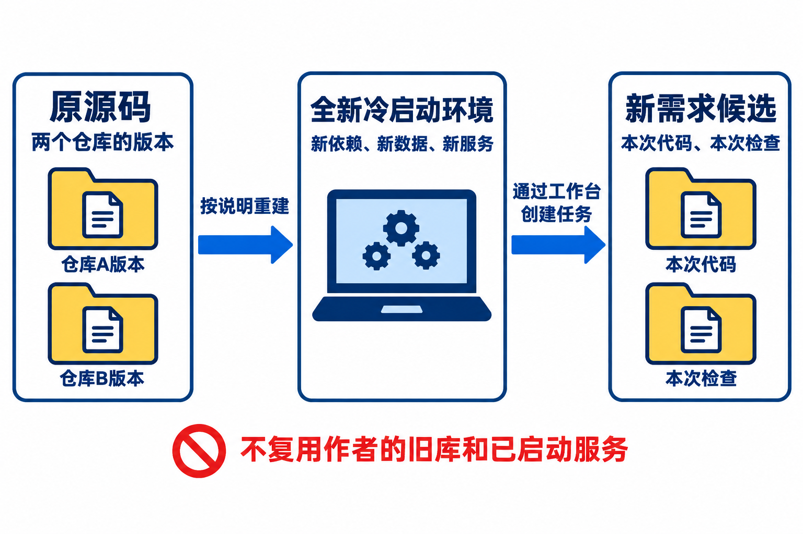
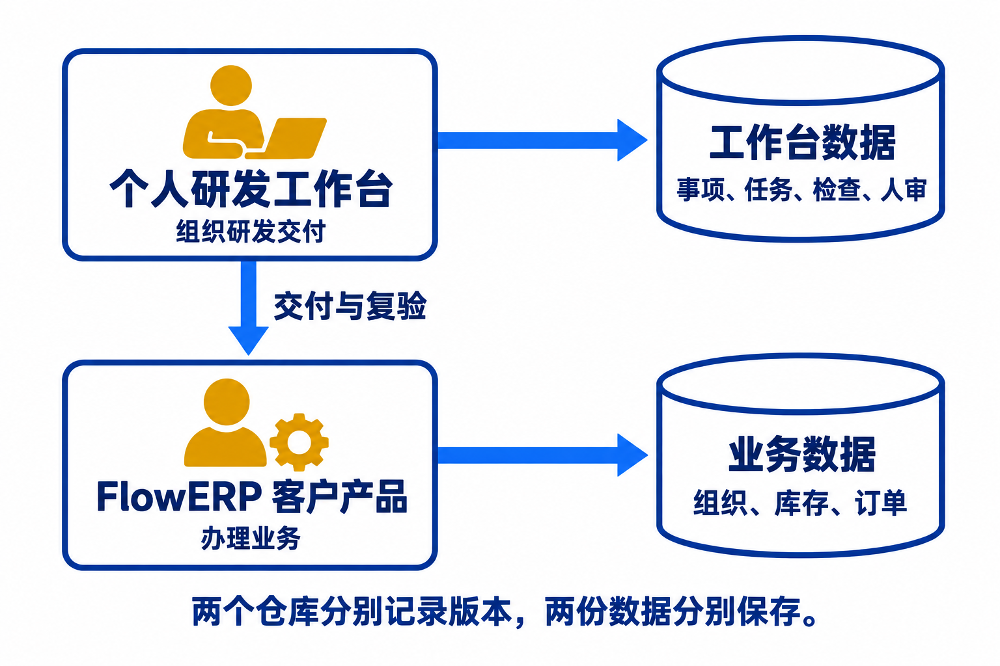
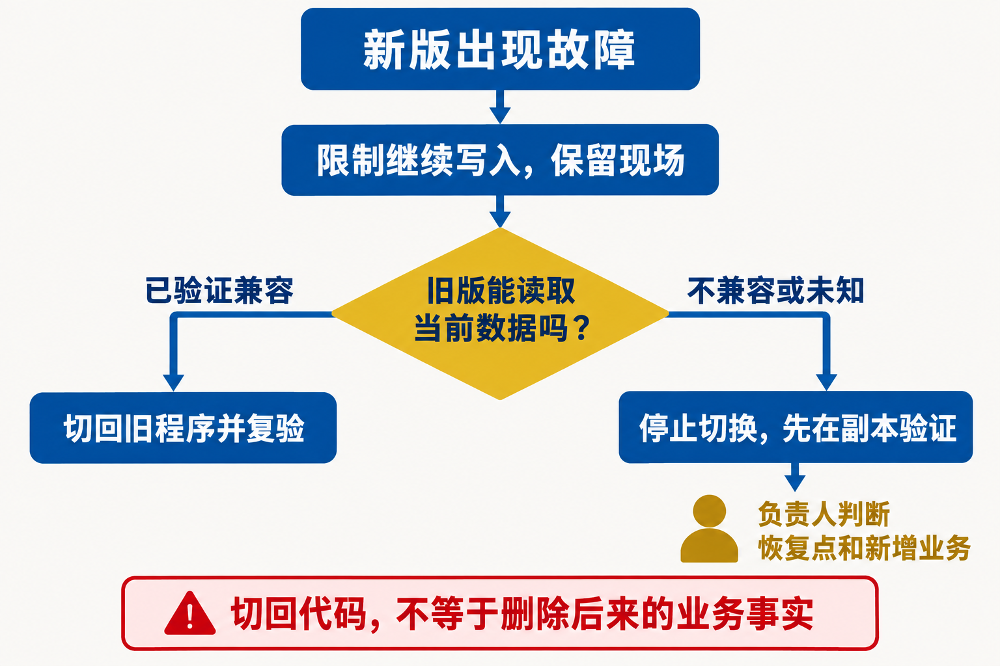
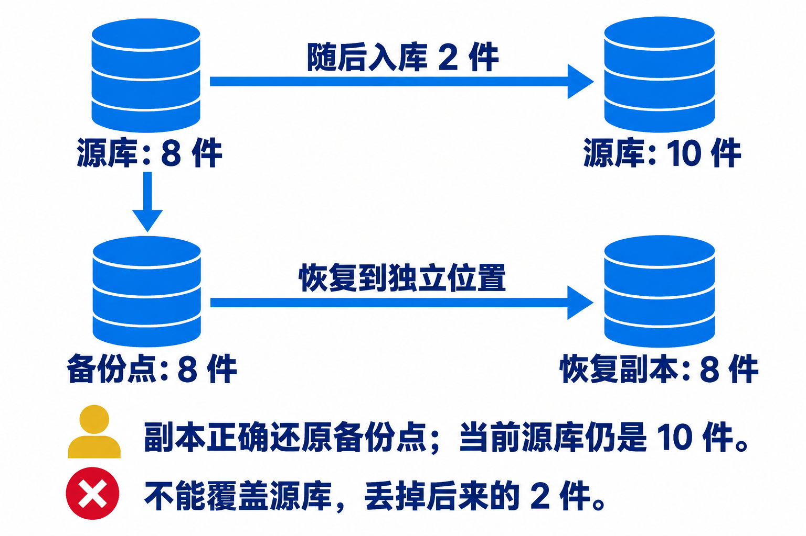
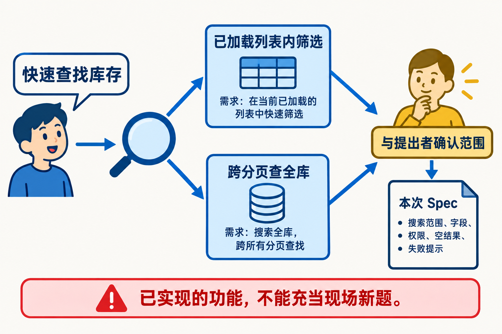
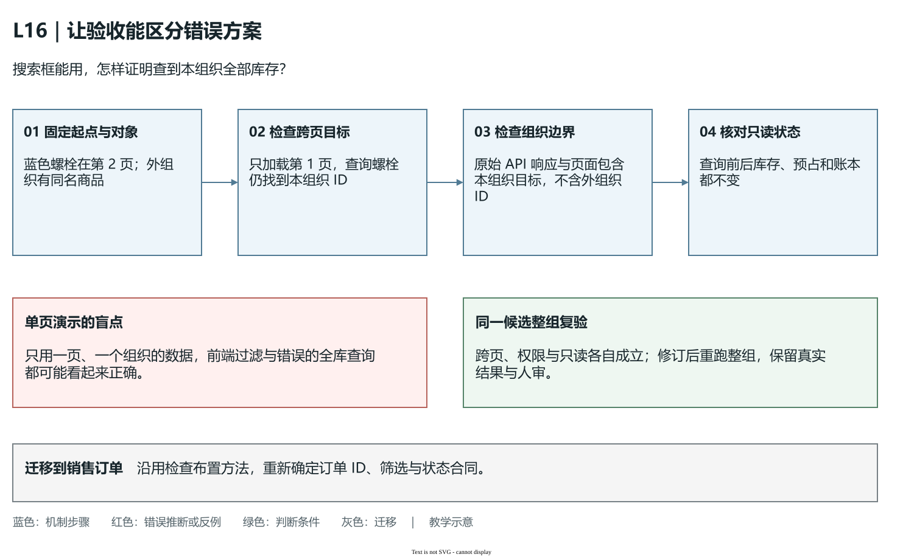
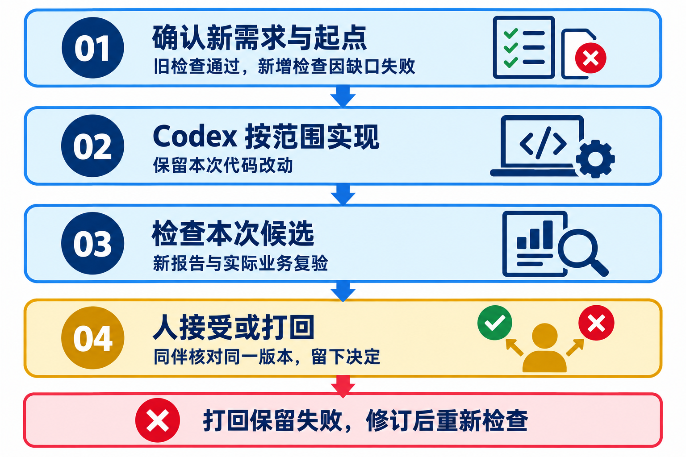
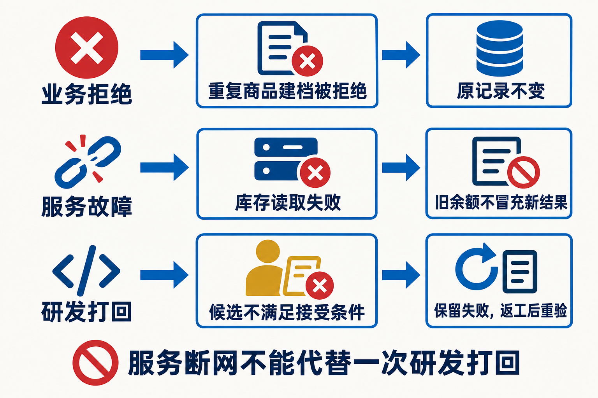
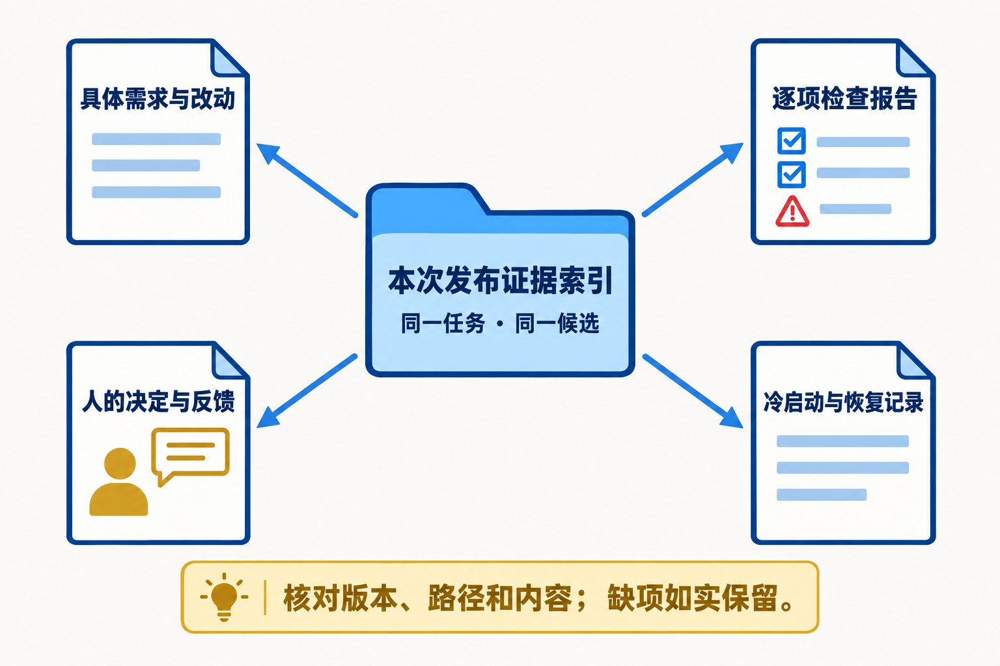

# L16｜在新环境接手，并完成现场新需求

林舟把已有工作台和 FlowERP 交给陈珂接手。陈珂必须在新环境启动，凭交付材料找回原证据；接着，业务用户周宁提出一个此前没有实现的小需求：“接单前，能按商品名找到本组织所有符合条件的库存吗？”这一次不能依赖作者电脑里已经运行的服务，也不能只重演旧任务。

本讲用“库存查找”串起接手、恢复、新需求和答辩。人物、商品和数量是教学推演，实践以自己的实际来源为准。若当前版本已经满足该需求，应先调查并选择另一个真实缺口；不能删除现有能力制造起始失败。

抓住本讲两个难点：**陈珂只按材料，能否启动原交付？周宁改变要求后，陈珂能否判断并交付新能力？** 前者需要来源、环境和真实冷启动记录；后者需要此前未实现的需求、新检查、范围内改动和具名结果。工作台组织需求、Codex 执行、复验和审核，FlowERP 保存客户业务事实。旧记录可回查，是新交付的起点。

## 一、接手：先让已有系统运行起来

### 把版本、环境与数据的身份分开

陈珂接手前，先看交付摘要：两个仓库的版本是什么，是否有未提交修改，原任务停在哪里，接受的是哪一候选，已知缺口是什么。一个提交号不包含作者未提交的文件，也不包含运行数据库、执行器认证或机器上的虚拟环境。只有这些条件说明清楚，接手者才能判断哪些材料需要重建，哪些证据需要保留。

本讲有三层对象：冻结的原源码用于说明起点；全新冷启动环境用于检验重建；工作台返回的新需求隔离候选用于编码和复验。原环境应保留，不通过删库制造“干净”。新环境使用独立源码、自己的依赖安装、端口和运行目录；新候选则必须能回指这次需求和批准写集。

双仓库仍要分开安装与运行。工作台的数据库保存事项、任务、报告引用和决定；FlowERP 数据库保存组织、商品、订单、采购及账本。二者可以在同一台机器上，但不能混用目录或解释器，更不能把 FlowERP 业务包复制回本仓库来“解决启动问题”。

### 容器固定运行条件，数据卷保留运行事实

容器镜像可以理解为按构建说明打包的运行环境和程序；容器是按镜像启动的实例；数据卷是容器之外持续保存数据的地方。重新创建实例可以复用旧卷，所以“新容器”不一定是空数据环境。“换了一个项目名”也要核对它确实没有旧卷与旧端口占用，才能证明本次从空状态初始化。

本项目的[部署说明](../../../deploy/ROLLBACK.md)使用 Compose 管理两套服务。Compose 是把服务、端口、卷和环境设置一起写成配置的工具。FlowERP 与工作台分别构建镜像，分别挂载数据卷；容器内都出现 `/app/.runtime`，并不代表它们共享数据。只读镜像和独立可写卷有助于区分程序与运行数据，但业务初始化仍需按产品流程执行。

容器化的取舍是把环境条件说得更明确，同时增加镜像、卷、网络和构建工具这些需要核对的对象。它不自动携带作者的 Codex 登录、课程 Git 历史或本机数据库。当前只读部署用于运行产品与工作台的组织、复验、人审入口；现场源码交付仍需带正确基线和执行授权的工作区，通过审核的候选再进入发布构建。

如果没有实际可用的容器引擎，可以先在独立源码和新虚拟环境验证本机重建，并记录隔离范围；容器构建与空卷启动仍保持未验证。能读懂 Dockerfile 或 Compose 配置，不能替代实际构建和启动记录。

### 健康检查为什么还不是业务验收

健康检查是周期性请求一个约定入口，判断服务及它声明的检查项是否正常。本项目工作台检查 `/api/health`，FlowERP 检查 `/api/v1/health/ready`。返回成功，支持“此入口能响应且检查项满足条件”，不支持“所有业务都正确”。

沿用库存案例，完整推演至少包括：新环境先初始化组织与账号；周宁登录本组织，查询一个已知商品；接口返回正确组织内的库存，页面显示对应数据，数据库与账本能核对同一对象；再从工作台打开正确的客户实例，找回本次事项与原任务。若页面连到了作者的旧实例，截图再漂亮，也没有验证新环境。

健康与业务操作分层检查能缩小故障范围。健康入口都不通，先查进程、端口和启动日志；健康正常但商品查不到，查初始化、账号、组织和数据；业务查询正确但工作台找不到任务，查工作台运行目录与原编号。按对象查原因，比一见错误就重装所有环境更有效。

## 二、出错恢复：先保护现场，再决定回退什么

### 失败后的第一步不是覆盖数据

陈珂启动工作台时，FlowERP 正常，工作台却退出。现有[本机隔离启动案例](examples/cold-start-observation.md)记录过源码缺少 Git 工作区信息的情况。它说明“产品进程启动”和“工作台具备项目登记条件”是不同事实，不意味着你本次一定遇到同一原因。先读自己的退出码和日志，再比较源码来源。

无 Git 信息的解压源码，只有在独立目录核对后才按说明初始化仓库元数据；已有真实克隆保留其历史。补上元数据可以满足登记条件，却不会恢复丢失的课程基线或作者提交历史。修订交接说明后，请接手者重新执行相关步骤，保留第一次失败，才能解释说明改善了什么。

### 代码回退与数据恢复解决不同问题

代码回退是切换到以前验证过的程序版本；数据恢复是把数据库与文件证据恢复到一个确定的备份点。两者不能混为“恢复上一版”。旧代码可能不兼容新版数据库，旧备份也可能不包含后来合法发生的业务。

假设新版库存查询出现错误，但业务数据未变。先保存新版日志、任务和当前数据证据，再核对上一版代码或镜像是否能读取当前数据库；若兼容，可按受控流程回到已验证的版本，复查健康和业务。若涉及表结构迁移，不能仅切换镜像就宣布恢复，应先验证兼容与恢复方案。`local` 等可被覆盖的标签也不足以定位旧版，要保留确切镜像 ID 和源码身份。

再看数据恢复的推演：备份时库存为 8 件，随后合法入库 2 件，当前源库为 10 件；把备份恢复到独立副本后，副本仍应是 8 件。恢复到 10 件反而可能说明没有真正使用那个备份点。

这个实验验证的是备份点可恢复，不决定现行业务是否应回到 8 件。后来那 2 件是否需要对账、补录或继续保留，应由有权业务人员根据原账本处理。直接覆盖当前库会丢失合法事实，不能为了演示顺利而这样做。

备份要有一致性：数据库与其引用的报告、合同和文件证据应来自相互匹配的状态。运行中随手复制 SQLite 文件，不自动满足这一条件。上面的 8 件恢复为 8 件，是独立 FlowERP 数据库的课堂副本实验；工作台恢复则使用自己的备份包与命令，首版只支持本机原路径。

工作台备份包先放到原运行目录之外，再停服并保留现有运行目录。验证包后，用 `restore-workbench-backup` 恢复到包内记载的原绝对路径，目标必须为空，不能改到任意新路径。恢复首启禁止自动重放旧任务，之后仍需人工核对。数据库可读、文件证据完整、外部源码与 Git 工作区等执行环境就绪，也要分别报告；找回旧 Task 不等于重新授权执行。

失败后的完成判断应是“现场已保护、原因已定位、恢复对象与结果已核对、继续操作有明确授权”。若暂时无法满足，就如实停住并说明阻塞，不通过清空历史来制造一个看似健康的新系统。

## 三、现场新需求：通过工作台交付此前未实现的能力

### 从“搜索框”收窄到可检查的行为

周宁真正要解决的是接单前找库存。她说“能按商品名找吗”，陈珂需要继续问：只在当前加载页查，还是跨分页查本组织所有库存？按商品名完全匹配还是关键词匹配？查询为空怎样提示？其他组织同名商品可否看到？它是否只读？这些答案决定实现位置与检查方式。

假设本次确认的需求是“关键词查询本组织所有库存，保持只读及原权限，空结果明确提示”。第 1 页没有目标商品，第 2 页有一项“蓝色螺栓”；另一个组织也有同名商品。输入“螺栓”后，结果应包含本组织第 2 页目标，排除其他组织商品；查询前后库存和账本不变。

这个输入到结果推演会揭示一个常见错误：只对浏览器已经加载的第 1 页数组筛选，界面有搜索框，目标却找不到。跨分页查询需要服务端在完整且受权限约束的数据集上检索，再分页返回；单靠前端筛选当前页无法满足合同。为了快速演示而一次取回所有组织数据，又会破坏原权限边界。

### 怎样设计一组能区分不同错误方案的现场检查

如果演示数据只有一页、一个组织，前端过滤和正确的服务端查询会得到相同画面。这样的成功只能证明这一份小数据能查到，无法支持“查到本组织所有结果”。验收数据要让错误方案产生不同结果，检查才有辨识力。

仍使用“蓝色螺栓”与关键词“螺栓”。先记录稳定的商品 ID、组织和分页位置，不只记录名称；名称相同的两个对象必须能区分。固定账号、筛选条件、起始数据和页大小，再依次检查下列三个命题。表中结果均为设计预期，实际数值和 ID 来自自己的账套。

| 检查布置 | 必须观察的结果 | 能反驳哪种错误实现 |
|---|---|---|
| 本组织目标在第 2 页，当前只加载第 1 页 | 查询“螺栓”能找到目标 ID | 只过滤已加载数组 |
| 其他组织有同名目标 | 同一查询的服务端原始响应与页面都包含本组织目标，不含外组织 ID | 先读全库再交给前端隐藏，或丢失组织过滤 |
| 两次查询前后核对库存与账本 | 原对象数量、预占和账本保持不变 | 查询误调用写入服务，或以重建数据掩盖结果 |

**图 16-6a　一个搜索框，需要三个独立命题支持。**蓝色步骤先固定对象与起点，再比较跨页结果、组织边界和查询前后状态；红色反例说明单页同组织演示为何容易假绿。绿色判断把三项结果与同一候选关联。图为教学示意，[可编辑源图](assets/reading-depth-20261003/mechanism.drawio)用于解释检查布置。

组织检查要从浏览器网络面板或直接 API 查询保留原始响应，再与页面比较；仅在界面隐藏外组织商品，数据仍已送到浏览器，不能算权限通过。若一次修订只让跨页查询通过，却泄漏了外组织商品，就有新进展，也有未解决的合同失败，不能直接验收。保持三项检查继续运行，返工只改允许范围。源码候选改变后，针对新候选重新取得整组结果，不能拼接“旧版权限通过”和“新版跨页通过”当作同一版本全绿。服务端查询结果、页面呈现和权威状态都要能回指原对象；这组检查也可迁移到分页销售订单，只需重新确定订单身份、筛选与状态合同。

### 把规格、真实起始失败和写集交给工作台

先在当前版本验证原需求确实未实现，并保留它对应的真实失败。缺解释器、端口冲突或测试无法加载，只说明环境有问题，不能作为“搜索能力缺失”的红灯。若已有跨分页查询，则改选另一个真正缺少的受控需求，而不是重演参考修复。

你将需求与通过条件写成 Spec（任务规格），在工作台首页建立事项，确认写集（批准修改的文件集合）、执行授权与不能改变的规则。Codex 在工作台返回的隔离候选代码版本中实现；工作台保存任务、报告和事件。准备发布时核对范围内 Diff（源码改动差异），确认新检查通过且原有阻断级 Eval 仍通过，避免新增能力破坏库存、权限或账本。

这里的新检查就是**动态 Eval**：针对本次 Spec 生成并确认的验收用例，而不是改掉原有阻断规则。库存查找至少要观察“第 2 页目标能找到、跨组织同名商品不泄漏、查询后库存不变”。这些检查要先在起始候选运行，区分真实能力缺失与环境错误，再在修改后的同一候选上复验。使用课程命令时，`course-spec --lesson 16` 必须通过 `--eval-case` 声明真实新增用例，`course-eval --lesson 16` 通过 `--case` 把它们与既有合同检查一同运行；网页执行按[代码执行说明](../../reference/工作台网页代码执行.md)绑定本次需求、新增检查和明确起始基线。动态 Eval 的名称、起始失败及修复后报告都要进入本次执行记录与交付证据索引。只有旧的 blocking 检查全绿，不能证明这个此前未实现的新需求已经完成。

假设第一次候选只做当前页过滤，跨页检查失败，报告应保留，候选进入返工。Codex 根据已批准合同修订为受权限约束的服务端查询，再对空结果、跨页结果、跨组织拒绝与只读性产生新证据。新结果通过后仍需**具名人审**：实际复验者核对本次候选、报告及业务操作，写出接受或打回的理由；旧报告和测试身份不能代签。

### 失败打回与安全退出也是有价值的交付事实

Loop 是有预算的修复循环，把明确失败送回修复与复验；Graph 是按显式节点和状态组织执行与审核的流程。它们限制过程，并不保证任何需求都能自动完成。预算耗尽、权限不足或候选证据不完整时，应保存最后状态并安全退出，交人决定。

要区分环境失败、自动检查失败和人的打回。环境失败先修环境，再重新取得有效业务检查；检查失败针对原合同修复，不能降低阻断条件；人的打回可能指出测试没有覆盖的使用问题，应确认新条件与范围，再形成新候选。打回后不能只重新运行旧绿灯来覆盖理由。

在库存查询中，若周宁发现窄屏无法输入关键词，即使后台查询正确，交付仍可能不满足实际使用条件。你应记录来源与具体现象，判断它是否属于本次主路径，补相应修复和复验；不能把所有真实问题笼统列为“后续优化”以绕过验收。

### 旧交付可复现，与新问题可迁移分别怎样证明

陈珂按说明在新环境运行原版，是**可复现**；周宁提出跨分页查找以后，陈珂重新确认缺口、建立验收并交付新候选，是**可迁移**。两者分别取证，才能看出新能力从哪个可靠起点增长。

| 判断 | 本例要观察什么 | 主要证据 |
|---|---|---|
| 旧交付可复现 | 独立环境运行正确版本，初始化与原业务对象可核对 | 两仓库来源、环境与数据身份、真实启动及业务复验 |
| 新问题可迁移 | 原版找不到第 2 页目标，新版能找且组织边界与只读规则保持 | 新 Spec、真实起始失败、范围内 Diff、同版新增 Eval 与具名决定 |

新难度发生在编码前：把“按商品名找”分清为当前页筛选还是跨分页查询，再确认组织范围、空结果与只读性。原版已满足时，记录调查并换另一项真实缺口。冷启动只打开旧页不能证明会设计新验收；新搜索框仍连作者旧服务，也不能证明别人能重建。`course_workspace` 的前后报告与范围检查帮助保留过程，现场判断仍由学生解释。

L15 的“空结果与权限失败分开”可以提供反例线索，当前库存查询的字段、权限和批准范围仍重新确定。实际反馈若发现窄屏不能输入，就确认它是否影响本次主路径，再决定修订或暂缓。答辩时指出一份冷启动记录、一组新能力证据、一次改变后续决定的反馈；迁移到销售订单查询，则重新确认订单身份、状态和权限。

## 四、证据答辩：让接手者看懂结果，也看懂边界

### 用一个索引关联同一交付，而不是汇集截图

交付证据索引是指向原材料的目录：需求与 Spec、起始版本、候选与 Diff、首次失败与修复后报告、具名决定、运行环境、导出和反馈。每项都应属于本次明确任务或说明来源，必要时保留路径与摘要。工作台摘要解释事实，索引让陈珂继续回查事实。

导出结果后，让实际使用者在同样业务条件下操作，再保存反馈：哪一步仍困难、是否影响接单、复现条件是什么。真实业务反馈、同伴试用和教学设置都可以帮助分析，但来源应分别标注。没有实际人审时写明待审核，不填一个示例人名把链路补齐。

### 五分钟讲的是一条有证据的因果链

五分钟答辩不是快速浏览所有页面。可以沿库存查找这件事组织一段完整叙事：

1. **0:00～0:45**：周宁为何需要跨分页查库存，本次范围是什么，两套系统在哪个新环境运行。
2. **0:45～1:30**：当前版本缺少什么，真实起始失败怎样证明缺口，Spec 与写集如何收窄。
3. **1:30～2:30**：工作台怎样组织 Codex 实现，范围内 Diff 改了哪些关键位置，新检查怎样验证结果。
4. **2:30～3:30**：第一次候选为何失败或被打回，修订后结果是什么，Loop 或 Graph 如何保留过程与决定。
5. **3:30～5:00**：接手者查到哪个候选与具名结论，导出和反馈在哪，若发布出错如何回退，还有哪些技术债。

时间是组织示例，不需要造一段恰好满足节奏的失败。实际没有人的接受，就解释它仍待审核；未完成容器构建，就明确展示本机隔离启动的证据与容器项缺口。叙事的可信度来自每个结论都能回指实际材料。

### 技术债说明下一步的代价，不能掩盖本次缺陷

技术债是为当前约束作出的设计取舍，将来需要支付的维护或扩展成本。有效说明要写出触发条件、已有证据、可能影响和处理计划。例如本次只验证了约定规模的数据集，更大规模尚未验证，可安排大样本查询和分页性能检查；不能据此断言已经测出了性能瓶颈。

而跨组织数据泄漏、跨分页目标找不到或库存被查询修改，是当前合同失败，不能降格为技术债延期处理。计划与已完成能力也要分开：提出缓存方案不等于实现缓存，生成结业检查表不等于每项已有实际结果。

### 下一项需求能复用什么

库存查找的经验可提炼为“分页界面的查询要验证当前页之外的目标”，保留真实来源、适用边界和审核状态。下次做销售订单查询时，可以检索并显式采用这个原则，再重新验证订单字段、状态与权限；不能直接继承库存任务的授权和报告。L15 的跨事项记忆治理在这里有了可检验的用途。

回看课程，快速探索帮助你澄清想法，Spec Coding 用规格确定通过条件，Harness 用受控执行、Eval 和人审让合同在交付中生效。FDE 在本课程中指 Forward-Deployed Engineering：围绕真实现场问题持续交付，并把失败、反馈与可复用经验带回能力建设。现场循环确认周宁的工作，交付循环完成并审查候选，能力循环检验经验是否帮助下一事项；这是工程能力的增长，不是模型自动升级。

## 配套材料与课程合同

实际操作按[实践操作手册](实践操作手册.md)的七步进行，恢复实验在指定步骤执行，也可提前预演；四章讲解用于理解每一步为什么这样做。用[本讲目标与完成判断](实践操作手册.md#lesson-goals)核对，用[提交模板](SUBMISSION.md)保存首次判断、失败、修订和真实决定。详细历史机制与参考来源见[扩展参考](reference/参考说明.md)。本讲对应 CLO-6，配图均为教学示意，不替代自己的冷启动、现场执行或人审证据。

- **核心内容**：容器化、健康检查、回滚意识、演示叙事和技术债说明。
- **演示结果**：从干净环境启动系统，展示一次成功任务、一次失败打回、一次结果导出和一次反馈写入。
- **课内增量**：完成结业检查表与五分钟答辩稿。
- **通过标准**：需求能生成 Spec 和代码；阻断级 Eval 全部通过；Loop 收敛或如实安全退出；Graph 审核结论可追踪；摘要和反馈能够正确生成；干净环境可启动且仓库无密钥。
