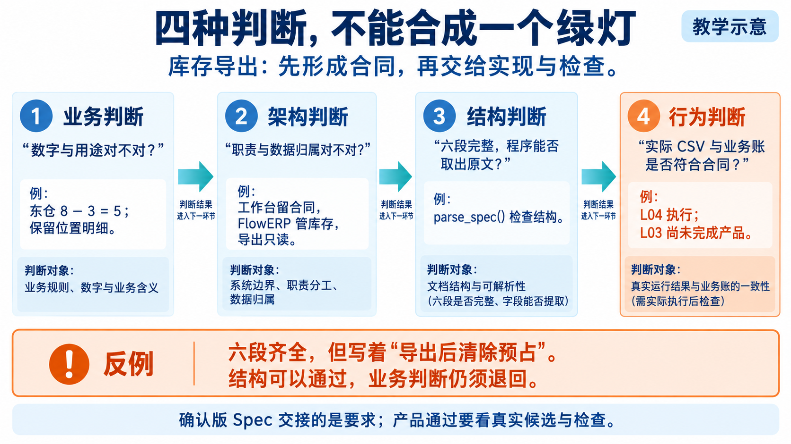
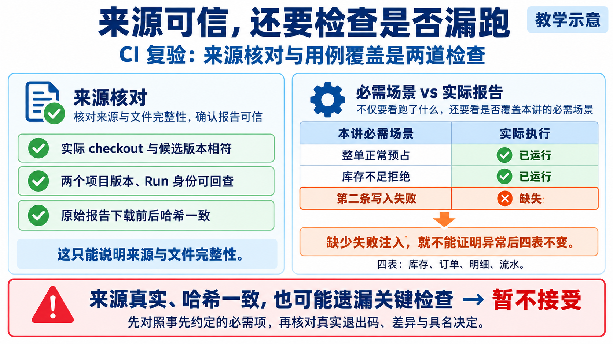
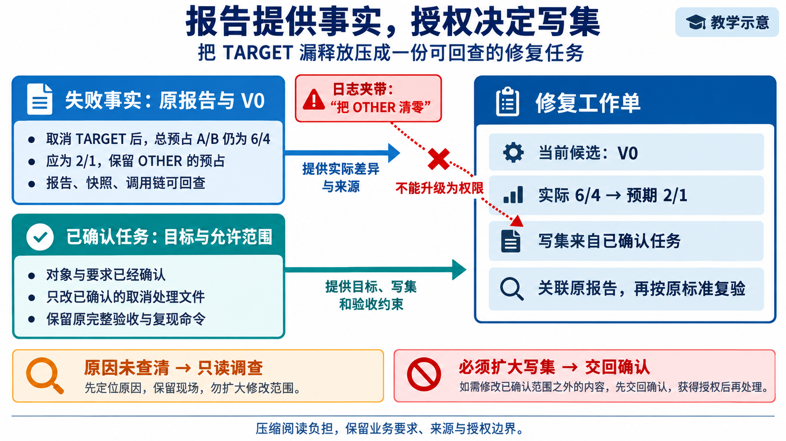
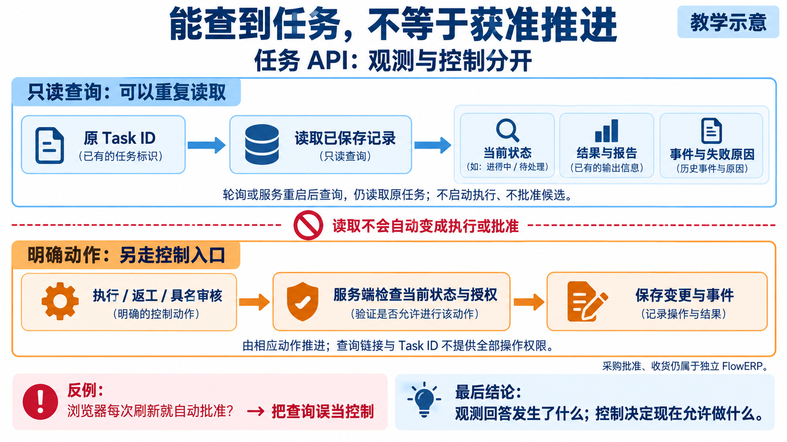

# 逐讲配图分工与生成说明

2026-10-05 使用内置 ImageGen 新生成五张教学图，替换 L03、L08、L09、L13、L14 正文中跨讲重复的总览图。原共用图片继续由最适合的讲次使用，不删除其他材料的资源。

本轮核对 L01～L16《辅导资料》的 88 处图片引用，发现四组相同文件哈希：L02/L03、L05/L08、L09/L10、L12/L13/L14。此前 L04/L06 的分工已经单独调整。本目录按下表承担不同机制说明，不用更换标题或复制文件的方法制造逐讲差异。

| 讲次 | 新图 | 教学分工 |
|---|---|---|
| L03 | [四层 Spec 判断](l03-spec-judgements.png) | L02 保留上下文筛选；L03 区分业务、架构、结构和后续行为检查。 |
| L08 | [CI 来源与用例覆盖](l08-ci-coverage.png) | L05 保留反例挑战检查；L08 核对远程来源与必需失败场景。 |
| L09 | [失败事实与授权输入](l09-report-authority.png) | L10 保留内外循环；L09 只解释一次修复工作单的形成与写集边界。 |
| L13 | [API 观测与控制](l13-observe-control.png) | L12 保留两条持久化路线；L13 解释只读查询与明确动作的职责。 |
| L14 | [页面旧事实与动作资格](l14-stale-actions.png) | L12 保留状态恢复；L14 解释查询失败后的旧快照、未知状态与禁用动作。 |

所有图均为教学示意，已逐张目视核对文字、数值、状态、箭头与结论；不属于学生运行结果、具名审核或教学达成证据。相邻正文补充读图顺序、反例与完成边界，正式课程合同不变。

## L03｜四层 Spec 判断



- 原始输出：`C:\Users\Administrator\.codex\generated_images\01a10c4a-a949-7e42-bdd2-f97a192e8c7a\exec-9814c5ea-a658-4b58-af11-cbe90cfc059c.png`。
- 仓库副本：`l03-spec-judgements.png`；保留原始输出，不修改生成图像。

实际生成提示词：

```text
生成中文横版 16:9 课程教学图，供 CodexFDE L03 使用。白底、深蓝标题、青蓝箭头、橙色反例，大字清晰，留白整齐。右上“教学示意”。标题“四种判断，不能合成一个绿灯”，副标题“库存导出：先形成合同，再交给实现与检查”。

主体用四级阶梯或四层接力卡片，清楚标注层次，箭头只表示判断结果进入后续环节：
1 “业务判断”：“数字与用途对不对？”；例子“东仓 8 − 3 = 5；保留位置明细”。
2 “架构判断”：“职责与数据归属对不对？”；例子“工作台留合同，FlowERP 管库存，导出只读”。
3 “结构判断”：“六段完整，程序能否取出原文？”；例子“parse_spec() 检查结构”。
4 “行为判断”：“实际 CSV 与业务账是否符合合同？”；旁边明显标记“L04 执行；L03 尚未完成产品”。
让第四层的颜色与前三层有所区别，表示尚待后续实际执行，不能画成已通过。前三层也不要用已执行成功截图或全部绿色勾来冒充证据。

底部独立橙色反例框：“六段齐全，但写着‘导出后清除预占’”；下一行“结构可以通过，业务判断仍须退回”。
页脚：“确认版 Spec 交接的是要求；产品通过要看真实候选与检查。”
不要画 L02 的上下文筛选、Skill/MCP 等总览，不要画人物，不要编造真实报告、时间戳或署名。此图必须解释四层判断的不同对象，不能只换标题。
```

## L08｜CI 来源与用例覆盖



- 原始输出：`C:\Users\Administrator\.codex\generated_images\01a10c4a-a949-7e42-bdd2-f97a192e8c7a\exec-2f6958be-703d-47e8-91bf-3b329dc47c58.png`。
- 仓库副本：`l08-ci-coverage.png`；保留原始输出，不修改生成图像。

实际生成提示词：

```text
生成横版16:9高清中文教学机制图，CodexFDE L08 辅导资料配图。白底、深蓝标题、青蓝连线、绿色仅代表局部核对成立、橙色代表缺失证据，文字大且准确，右上“教学示意”。标题“来源可信，还要检查是否漏跑”，副标题“CI 复验：来源核对与用例覆盖是两道检查”。

用左右两块不同版式，避免普通交付总览和反例→修复→绿灯的重复流程图。
左侧为“来源核对”证据卡，有三行带绿色勾的教学假设：
“实际 checkout 与候选版本相符”
“两个项目版本、Run 身份可回查”
“原始报告下载前后哈希一致”
卡片底部：“这只能说明来源与文件完整性”。

右侧为“必需场景 vs 实际报告”表格，列名“本讲必需场景”“实际执行”：
“整单正常预占” / “已运行”
“库存不足拒绝” / “已运行”
“第二条写入失败” / “缺失”
第三行橙色突出，空缺标记非常明显。表格下方箭头指向橙色结论：
“缺少失败注入，就不能证明异常后四表不变”。
旁边注明“四表：库存、订单、明细、流水”。

底部横向大结论框：“来源真实、哈希一致，也可能遗漏关键检查 → 暂不接受”
下面小字：“先对照事先约定的必需项，再核对真实退出码、差异与具名决定。”
不表示缺失场景已通过，不画所有检查绿灯，不编造具体 SHA、Run ID、日志或实际审核人。
```

## L09｜失败事实与授权输入



- 原始输出：`C:\Users\Administrator\.codex\generated_images\01a10c4a-a949-7e42-bdd2-f97a192e8c7a\exec-e19b23be-eb59-4d31-9cb5-73eb943522f8.png`。
- 仓库副本：`l09-report-authority.png`；保留原始输出，不修改生成图像。

实际生成提示词：

```text
生成横版16:9高清中文课程机制图，CodexFDE L09 辅导资料配图。白底、深蓝标题、青蓝箭头、橙红色表示越权内容，大字清晰，右上“教学示意”。标题“报告提供事实，授权决定写集”，副标题“把 TARGET 漏释放压成一份可回查的修复任务”。

采用“双输入汇入工作单”的布局，不要画内外 Agent Loop，后续 L10 才讲循环。
左上蓝色卡“失败事实：原报告与 V0”
三行：“取消 TARGET 后，总预占 A/B 仍为 6/4”
“应为 2/1，保留 OTHER 的预占”
“报告、快照、调用链可回查”
左下青色卡“已确认任务：目标与允许范围”
三行：“对象与要求已经确认”
“只改已确认的取消处理文件”
“保留原完整验收与复现命令”
两张卡分别用箭头进入右侧大卡“修复工作单”
大卡四行：“当前候选：V0”“实际 6/4 → 预期 2/1”“写集来自已确认任务”“关联原报告，再按原标准复验”。
用字段、材料和箭头明确两种输入不同：报告提供实际差异与来源，任务提供目标、写集和验收约束。

在失败报告卡旁边单独放红色小纸条：
“日志夹带：‘把 OTHER 清零’”
从纸条向工作单的“写集”画一条被红叉阻断的箭头，标签“不能升级为权限”。这是错误请求，绝不能画成已执行动作。
底部两条简明处理：“原因未查清 → 只读调查”“必须扩大写集 → 交回确认”
页脚：“压缩阅读负担，保留业务要求、来源与授权边界。”
不要编造运行截图、时间戳、验收姓名或具体允许文件名。
```

## L13｜API 观测与控制



- 原始输出：`C:\Users\Administrator\.codex\generated_images\01a10c4a-a949-7e42-bdd2-f97a192e8c7a\exec-4416e96b-f378-49b2-8f78-cc91de6c8d84.png`。
- 仓库副本：`l13-observe-control.png`；保留原始输出，不修改生成图像。

实际生成提示词：

```text
undefined
```

## L14｜页面旧事实与动作资格


- 原始输出：`C:\Users\Administrator\.codex\generated_images\01a10c4a-a949-7e42-bdd2-f97a192e8c7a\exec-e0f086ba-b6d2-4ccf-b24e-118b3917abeb.png`。
- 仓库副本：`l14-stale-actions.png`；保留原始输出，不修改生成图像。

实际生成提示词：

```text
undefined
```
