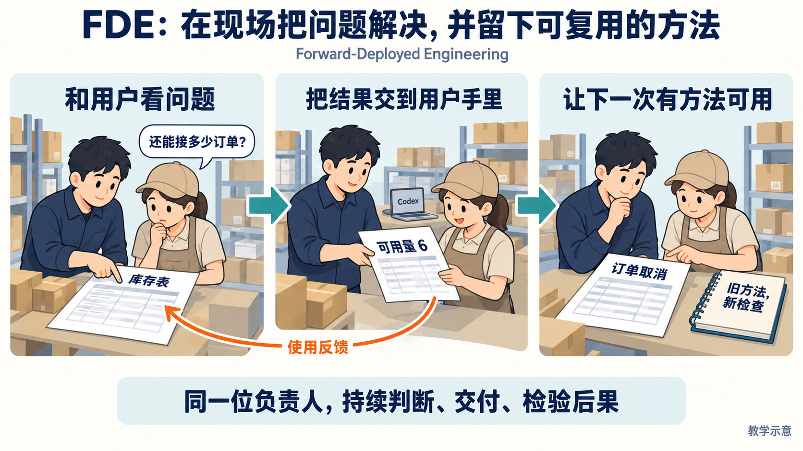
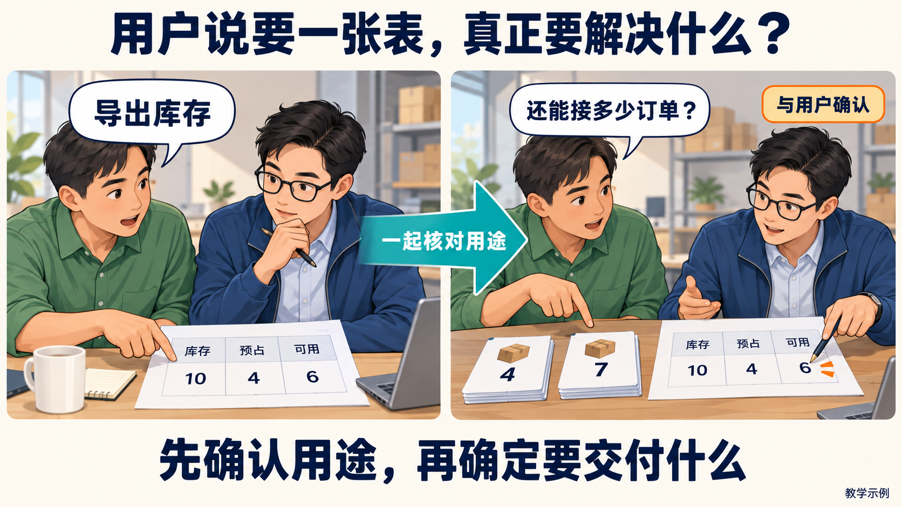
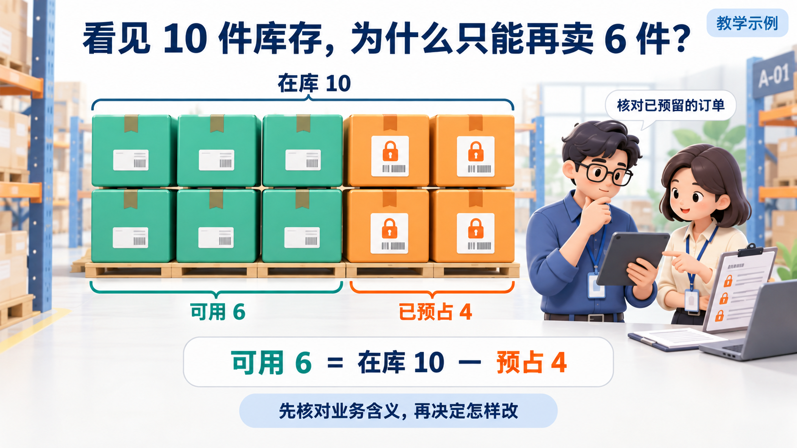
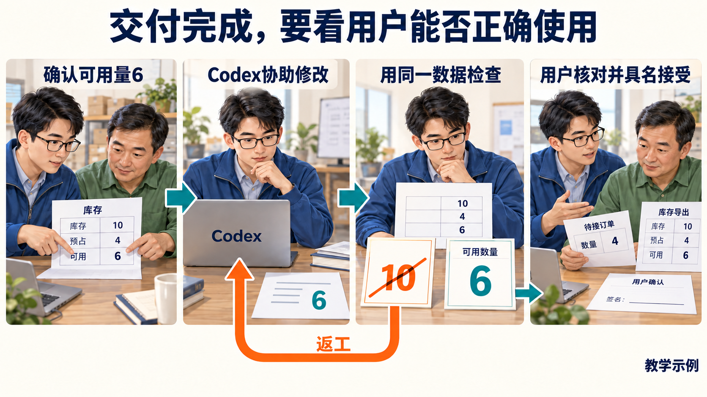
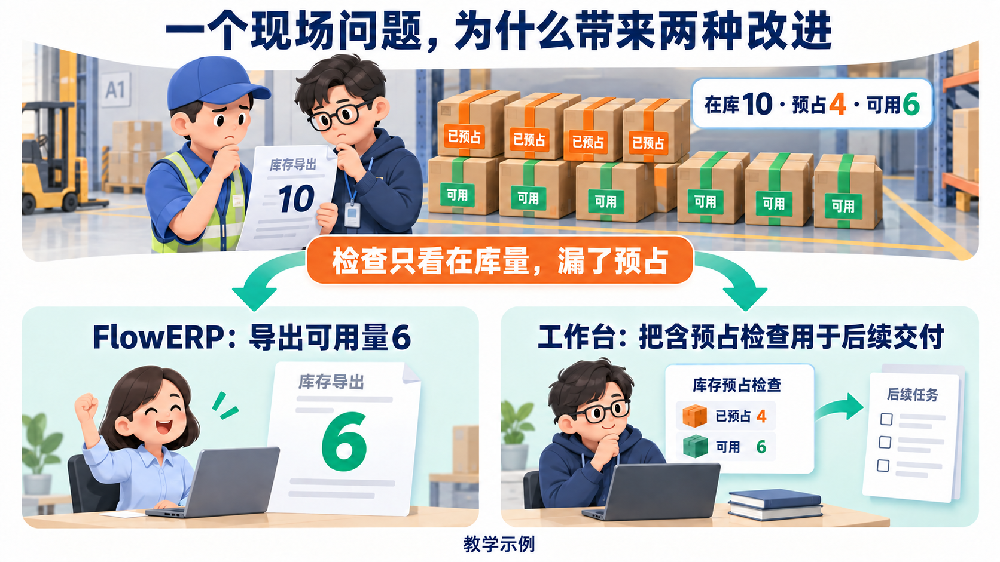
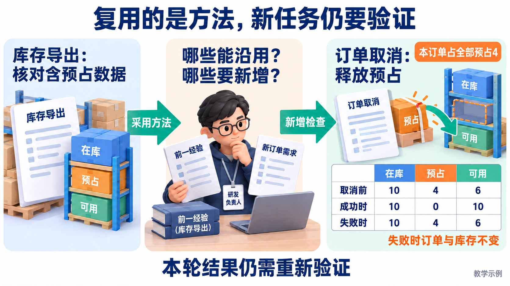
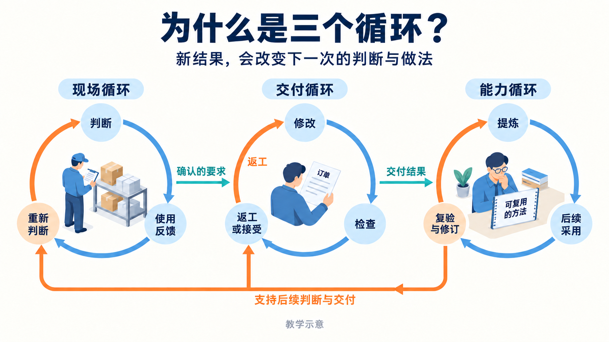
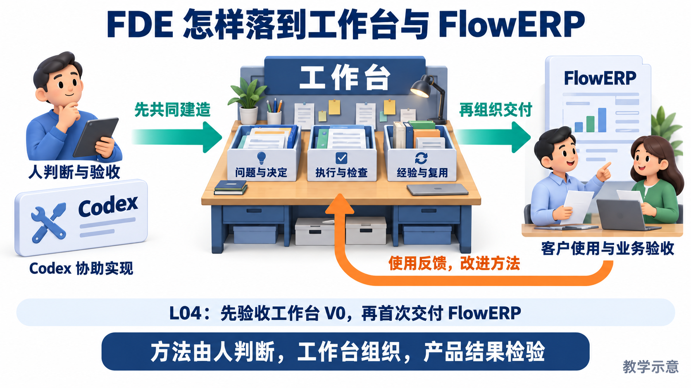

# FDE 与工作台：一个库存问题的图解

用户说：“导出库存给我。”背后的决定是：**还能接多少订单？** 研发负责人要跟到这个决定能够被正确作出，才知道交付有没有解决问题。

**本课程的 FDE（Forward-Deployed Engineering）：贴近现场作判断，把结果交给用户，再用真实反馈积累下一次可用的方法。**

以下沿同一库存案例展开，均为教学示例。

## 1. FDE 承担什么责任？

负责人持续参与问题判断、实现与使用效果核对。现场包括用户的工作流程、业务数据和运行后果；新反馈会让人重新判断需求与做法。

## 2. 先确认：这张表拿来做什么？

盘点在库量与判断可售量，要求不同。本例经用户确认，是为了接单；用途或预占记录不清时，先补证据，再确定范围和验收。

## 3. 再判断：10、4、6 各代表什么？

4 件仍在仓库，却已为其他订单预留。因此本例需要导出可用量 6。**业务数据和用途决定规则**，随后才据此设计实现与检查。

## 4. 交付：数字正确，用户也能正确使用

Codex 协助修改，同一组数据用于复验：导出 10 要返工，导出 6 满足本条条件。相应审核者还要核对用途、修改范围并具名接受；使用反馈继续回到原问题。

## 5. 同一失败，怎样推动两种改进？

产品修复解决本次导出；工作台把“检查要覆盖预占”组织进后续交付。**这次工作台改进来自交付暴露的问题**，新增规则与检查还要在本次或下一次产品交付中验证。

## 6. 下一需求：哪些方法能用，哪些检查要新增？

导出只读取数据；取消会改变订单与库存。本订单占全部预占 4，可以沿用含预占数据的核对方法，仍须验证成功释放、失败保持原状态。保留来源、采用版本与新结果，才能判断复用是否有效。

## 7. 为什么叫三个循环？

**现场循环**校准要解决什么；**交付循环**检查怎样做对；**能力循环**检验方法还能不能用。新结果会改变下一次判断与做法；复用失败应触发修订或停用，不能把一次通过带到所有新需求。

## 8. 工作台怎样承接 FDE？

人承担判断与验收，Codex 协助研发，工作台保存决定、组织执行与复用，FlowERP 用业务结果检验交付。实际工作从首页“事项与决策”开始。

课程在 L01～L03 直接监督 Codex 建基础；L04 先验收 V0 再首次交付 FlowERP；后续在交付中改进工作台，L16 用新需求与答辩检验迁移能力。

**看懂的判断：**能用这个案例说明为什么做、怎样验收、前一次哪种方法在后一次被采用并重新验证。

需要细节时再读[整体构思](个人AI研发工作台.md)、[具体设计](工作台具体设计.md)或[日常操作](daily-development.md)。[配图与生成记录](assets/fde/README.md)保留故事图和原有机制图；课程要求以[大纲](../课程大纲-Codex-FDE行动营-个人研发自动化工作台.md)为准，当前实现与待验收内容见[建设规格](../architecture/工作台范式与闭环建设.md)。
